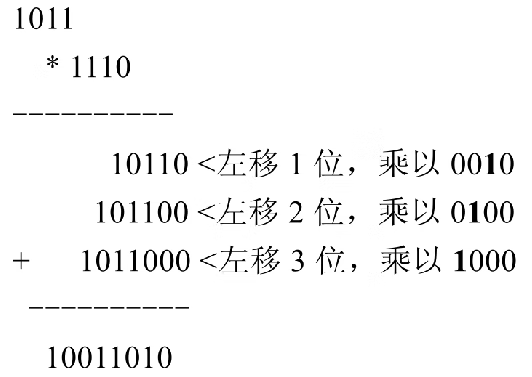

- [判断一个自然数是否是某个数的平方](#判断一个自然数是否是某个数的平方)
	- [直接计算法](#直接计算法)
	- [二分查找计算法](#二分查找计算法)
	- [减法运算法](#减法运算法)
- [判断一个数是否为 2 的 n 次方](#判断一个数是否为-2-的-n-次方)
	- [构造法](#构造法)
	- [与操作法](#与操作法)
- [不使用除法操作符实现两个正整数的除法](#不使用除法操作符实现两个正整数的除法)
	- [减法](#减法)
	- [移位法](#移位法)
- [不用加减乘除运算实现加法](#不用加减乘除运算实现加法)
- [不用加减乘除运算实现减法](#不用加减乘除运算实现减法)
- [不用加减乘除运算实现乘法](#不用加减乘除运算实现乘法)
- [不用加减乘除运算实现除法](#不用加减乘除运算实现除法)
- [只使用 ++ 操作符实现加减乘除运算](#只使用--操作符实现加减乘除运算)
- [根据已知随机数生成函数计算新的随机数](#根据已知随机数生成函数计算新的随机数)
- [判断 1024! 末尾有多少个 0](#判断-1024-末尾有多少个-0)
- [按要求比较两个数的大小](#按要求比较两个数的大小)
- [求有序数列的第 1500 个数的值](#求有序数列的第-1500-个数的值)
- [求二进制数中 1 的个数](#求二进制数中-1-的个数)
- [找最小的不重复数](#找最小的不重复数)
	- [贪心法](#贪心法)
- [计算一个数的 n 次方](#计算一个数的-n-次方)
- [在不能使用库函数的条件下计算 n 的算术平方根](#在不能使用库函数的条件下计算-n-的算术平方根)
- [不使用 ^ 操作实现异或运算](#不使用--操作实现异或运算)
- [不使用循环输出 1 到 100](#不使用循环输出-1-到-100)

## 判断一个自然数是否是某个数的平方

设计一个算法，判断给定的一个数 n 是否是某个数的平方，不能使用开方运算。例如 16 就满足条件，因为它是 4 的平方；而 15 则不满足条件，因为不存在一个数使得其平方值为 15。

### 直接计算法

由于不能使用开方运算，因此最直接的方法就是计算平方。

主要思路为：对 1 到 n 的每个数 i，计算它的平方 m，如果 `m<n`，则继续遍历下一个值（i+1），如果 `m==n`，那么说明 n 是 m 的平方，如果 `m>n`，那么说明 n 不能表示成某个数的平方。

```go
func isSquare1(n int) (int, bool) {
	for i := 1; i < n; i++ {
		m := i * i
		if m == n {
			return i, true
		} else if m > n {
			return 0, false
		}
	}
	return 0, false
}
```

由于这种方法只需要从 1 遍历到 n^0.5 就可以得出结果，因此算法的时间复杂度为 O(n^0.5)。

### 二分查找计算法

与方法一类似，这种方法的主要思路还是查找从 1 ～ n 的数字中，是否存在一个数 m，使得 m 的平方为 n。只不过在查找的过程中使用的是二分查找的方法。

具体思路为：首先判断 `mid = (1+n)/2` 的平方 power 与 m 的大小，如果 `power>m`，那么说明在 `[1, mid -1]` 区间继续查找，否则在` [mid+1, n]` 区间继续查找。

```go
func isSquare2(n int) (int, bool) {
	left, right := 0, n

	for left < right {
		mid := (left + right) / 2
		m := mid * mid
		if m < n {
			left = mid + 1
		} else if m > n {
			right = mid - 1
		} else {
			return mid, true
		}
	}
	return 0, false
}
```

由于这种方法使用了二分查找的方法，因此，时间复杂度为 O(logn)，其中，n 为数的大小。

### 减法运算法

通过对平方数进行分析发现有如下规律：

```
(n+1)^2=n^2+2n+1=(n-1)^2+( 2*(n-1)+1 )+2*n+1=…=1+(2*1+1)+(2*2+1)+…+(2*n+1)
```

通过上述公式可以发现，这些项构成了一个公差为 2 的等差数列的和。

由此可以得到如下的解决方法：对 n 依次减 1, 3, 5, 7 …，如果相减后的值大于 0，则继续减下一项；如果相减的后的值等于 0，则说明 n 是某个数的平方；如果相减的值小于 0，则说明 n 不是某个数的平方。

```go
func isSquare3(n int) bool {
	minus := 1

	for n > 0 {
		n -= minus
		if n == 0 {
			return true
		} else if n < 0 {
			return false
		} else {
			minus += 2
		}
	}

	return false
}
```

这种方法的时间复杂度仍然为 O(n^0.5)。由于方法一使用的是乘法操作，这种方法采用的是减法操作，因此，这种方法的执行效率比方法一更高。

## 判断一个数是否为 2 的 n 次方

### 构造法

2 的 n 次方可以表示为：2^0，2^1，2^2…，2^n，如果一个数是 2 的 n 次方，那么最直观的想法是对 1 执行了移位操作（每次左移一位），即通过移位得到的值必定是 2 的 n 次方（针对 n 的所有取值构造出所有可能的值）。所以，要想判断一个数是否为 2 的 n 次方，只需要判断该数移位后的值是否与给定的数相等。

```go
func isPowerOf21(n int) bool {
	for i := 1; i < n; i++ {
		m := 1 << i
		if m == n {
			return true
		} else if m > n {
			return false
		}
	}
	return false
}
```

上述算法的时间复杂度为O(logn)。

### 与操作法

那么是否存在效率更高的算法呢？通过对 2^0,2^1,2^2,…,2^n 进行分析，发现这些数字的二进制形式分别为：1，10，100，…。

从二进制的表示可以看出，如果一个数是 2 的 n 次方，那么这个数对应的二进制表示中有且只有一位是 1，其余位都为 0。因此，判断一个数是否为 2 的 n 次方可以转换为这个数对应的二进制表示中是否只有一位为 1。

如果一个数的二进制表示中只有一位是 1，例如 num = 00010000，那么 num -1 的二进制表示为 num -1 = 00001111，由于 num 与 num -1 二进制表示中每一位都不相同，因此，num & (num -1) 的运算结果为 0。可以利用这种方法来判断一个数是否为 2 的 n 次方。

```go
func isPowerOf22(n int) bool {
	if n < 1 {
		return false
	}

	return n&(n-1) == 0
}
```

这种方法的时间复杂度为 O(1)。

## 不使用除法操作符实现两个正整数的除法

### 减法

使被除数不断减去除数，直到相减的结果小于除数为止，此时，商就为相减的次数，余数为最后相减的差。例如在计算 14 除以 4 的时候，首先计算 14 -4 = 10，由于 10>4，继续做减法运算：10 -4 = 6，6 -4 = 2，此时 2<4。由于总共进行了 3 次减法操作，最终相减的结果为 2，因此，14 除以 4 的商为 3，余数为 2。如果被除数比除数都小，那么商为 0，余数为被除数。

```go
func integerDivision1(m, n int) (quotient int, remainder int) {
	for remainder = m; remainder > n; remainder -= n {
		quotient++
	}

	return
}
```

这种方法循环的次数为 m/n，因此，算法的时间复杂度为 O(m/n)。需要注意的是，这种方法也实现了不用除法操作符实现除法运算的目的。

### 移位法

方法一所采用的减法操作，还可以用等价的加法操作来实现。

例如在计算 17 除以 4 的时候，可以尝试 `4*1`，`4*2（4+4）`，`4*3（4+4+4）`依次进行计算，直到计算的结果大于 14 的时候就可以很容易求出商与余数。但是这种方法每次都递增 4，效率较低。

下面给出另外一种增加递增速度的方法：以 2 的指数进行递增（取 2 的指数的原因是，2 的指数操作可以通过移位操作来实现，有更高的效率），计算 `4*1`，`4*2`，`4*4`，`4*8`，由于` 4*8>17`，然后接着对 `17-4*4=1` 进入下一次循环用相同的方法进行计算。

```go
func integerDivision2(m, n int) (quotient int, remainder int) {
	for m >= n {
		multi := 1
		for multi*n <= m>>1 {
			multi <<= 1
		}
		quotient += multi
		m -= multi * n
	}

	return quotient, m
}
```

由于这种方法采用指数级的增长方式不断逼近 m/n，因此，算法的时间复杂度为 O(log(m/n))。

## 不用加减乘除运算实现加法

由于不能使用加减乘除运算，因此，只能使用位运算了。

首先通过分析十进制加法的规律来找出二进制加法的规律，从而把加法操作转换为二进制的操作来完成。

十进制的加法运算过程可以分为以下三个步骤：

1. 各个位相加而不考虑进位，计算相加的结果 sum ；
2. 只计算各个位相加时进位的值 carry ；
3. 将 sum 与 carry 相加就可以得到这两个数相加的结果。例如 15+29 的计算方法为：sum = 34（不考虑进位），carry = 10（只计算进位），因此，15+29 = sum+carry = 34+10 = 44。

同理，二进制加法与十进制加法有着相似的原理，唯一不同的是，在二进制加法中， sum 与 carry 的和可能还有进位，因此，在二进制加法中会不停地执行 sum+carry 操作，直到没有进位为止。

具体实现方法如下：

1. 二进制各个位相加而不考虑进位。由于在**不考虑进位的时候加法操作可以用异或操作代替**，因此，不考虑进位的加法可以用异或运算来代替。
2. 计算进位，由于只有 1+1 才会产生进位，因此，**进位的计算可以用与操作代替**。进位的计算方法为：先做与运算，再把运算结果左移一位。
3. 不断对 1 2 两步得到的结果相加，直到进位为 0 的时候为止。

```go
func Add(x, y int) int {
	sum := x ^ y          // 不考虑进位的加法可以用异或运算来代替
	carry := (x & y) << 1 // 进位的计算可以用与操作代替
	if carry != 0 {
		sum = Add(sum, carry)
	}
	return sum
}
```

## 不用加减乘除运算实现减法

由于减去一个数等于加上这个数的相反数，即 `-n=～(n-1)=～n+1`，因此，`a-b=a+(-b)=a+(～b)+1`，可以利用上面已经实现的加法操作来实现减法操作。

```go
func Subtract(x, y int) int {
	return Add(x, Add(^y, 1))
}
```

## 不用加减乘除运算实现乘法

以 11*14 为例介绍乘法运算的规律，11 的二进制可以表示为 1011，14 的二进制可以表示为 1110，二进制相乘的运算过程如下：



二进制数 10011010 的十进制表示为 `154=11*14`，从这个例子可以看出，乘法运算可以转换为加法运算。

计算 `a*b` 的主要思路为：

1. 初始化运算结果为 0，sum=0；
2. 找到 b 对应二进制中最后一个 1 的位置 i（位置编号从右到左依次为 0, 1, 2, 3 …)，并去掉这个 1 ；
3. 执行加法操作 `sum+=a<i`；
4. 循环执行 1 2 3 步，直到 b 对应的二进制数中没有更多的 1 为止。

对 n 执行 `n&(n-1)` 操作可以去掉 n 的二进制数表示中的最后一位 1，因此 `n&～(n-1)` 的结果为只保留 n 的二进制数中的最后一位 1。因此，可以通过 `n&～(n-1)` 找出 n 中最后一个 1 的位置，然后通过 `n&(n-1)` 去掉最后一个1。

在上述的第 2 步中，首先执行 `lastBit=n&～(n-1)`，得到的值 lastBit 只包含 n 对应的二进制表示中最后一位 1，要想确定 1 的位置，需要通过对 1 不断进行左移操作，直到移位的结果等于 lastBit 时移位的次数就是位置编号。在实现的时候，为了提高程序的运行效率，可以把 1 向左移动的位数 `(0, 1, 2, 3, …, 31)` 先计算好并保存起来。

```go
func Multiply(x, y int) int {
	if x == 0 || y == 0 {
		return 0
	}

	// 记录结果正负号
	negative := false

	// 将负数取相反数参与运算
	if x < 0 {
		negative = !negative
		x = Add(^x, 1)
	}

	if y < 0 {
		negative = !negative
		y = Add(^y, 1)
	}

	p, q := 0, 1
	for i := 0; i < 32; i++ {
		q = 1 << i
		if y&q == q {
			p = Add(p, x<<i)
		}
	}

	// 负数则取相反数
	if negative {
		return Add(^p, 1)
	}

	return p
}
```

## 不用加减乘除运算实现除法

除法是乘法的逆运算，利用上面的乘法实现即可。

```go
func Divide(x, y int) int {
	if y == 0 {
		panic("division by zero")
	} else if x == 0 {
		return 0
	}

	// 记录结果正负号
	negative := false

	// 将负数取相反数参与运算
	if x < 0 {
		negative = !negative
		x = Add(^x, 1)
	}

	if y < 0 {
		negative = !negative
		y = Add(^y, 1)
	}

	// 计算商
	p := 0

	for Multiply(y, p) <= x {
		p++
	}

	p = Subtract(p, 1)

	// 负数则取相反数
	if negative {
		return Add(^p, 1)
	}

	return p
}
```

## 只使用 ++ 操作符实现加减乘除运算

- 加法操作：实现 `a+b` 的基本思路为对 a 执行 b 次 `++` 操作即可。
- 减法操作：实现 `a-b(a> = b)`的基本思路为：不断对 b 执行 `++` 操作，直到等于 a 为止，在这个过程中记录执行 `++` 操作的次数。
- 乘法操作：实现 `a*b` 的基本思路为：利用已经实现的加法操作把 a 相加 b 次，就得到了 `a*b` 的值。
- 除法操作：实现 `a/b` 的基本思路为：利用乘法操作，使 b 不断乘以 `1, 2, …, n`，直到 `b*n>b` 时，就可以得到商为 `n -1`。

```go
func add(x, y int) int {
	var i, j, z int

	// 选择比较小的数进行循环

	if x > y {
		z, j = x, y
	} else {
		z, j = y, x
	}

	for i = 0; i < j; i++ {
		z++
	}

	return z
}
```

## 根据已知随机数生成函数计算新的随机数

已知随机数生成函数 rand7() 能产生的随机数是整数 1 ～ 7 的均匀分布，如何构造 rand10() 函数，使其产生的随机数是整数 1 ～ 10 的均匀分布。

要保证 rand10() 产生的随机数是整数 1 ～ 10 的均匀分布，可以构造一个 `1～10*n` 的均匀分布的随机整数区间（n 为任何正整数）。假设 x 是这个 `1～10*n` 区间上的一个随机数，那么 x%10+1 就是均匀分布在 1 ～ 10 区间上的整数。

根据题意，rand7() 函数返回 1 到 7 的随机数，那么 rand7() -1 则得到一个离散整数集合，该集合为 `{0, 1, 2, 3, 4, 5, 6}`，该集合中每个整数的出现概率都为 1/7。

那么 `(rand7() -1) * 7` 得到另一个离散整数集合 A，该集合元素为 7 的整数倍，即 `A = {0, 7, 14, 21, 28, 35, 42}`，其中，每个整数的出现概率也都为 1/7。而由于 rand7() 得到的集合 `B = {1, 2, 3, 4, 5, 6, 7}`，其中每个整数出现的概率也为 1/7。显然集合 A 与集合 B 中任何两个元素和组合可以与 1 ～ 49 之间的一个整数一一对应，即 1 ～ 49 之间的任何一个数，可以唯一地确定 A 和 B 中两个元素的一种组合方式，这个结论反过来也成立。

由于集合 A 和集合 B 中元素可以看成是独立事件，根据独立事件的概率公式 `P(AB) = P(A)P(B)`，得到每个组合的概率是 `1/7 * 1/7 = 1/49`。因此，`(rand7() -1) * 7+rand7()` 生成的整数均匀分布在 1 ～ 49 之间，而且，每个数的概率都是 1/49。

所以，`(rand7() -1) * 7+rand7()` 可以构造出均匀分布在 1 ～ 49 的随机数，为了将 49 种组合映射为 1 ～ 10 之间的 10 种随机数，就需要进行截断了，即将 41 ～ 49 这样的随机数剔除掉，得到的数 1 ～ 40 仍然是均匀分布在 1 ～ 40 的，这是因为每个数都可以看成一个独立事件。由 1 ～ 40 区间上的一个随机数 x，可以得到 `x%10+1` 就是均匀分布在 1 ～ 10 区间上的整数。

```go
func rand7() int {
	return rand.Intn(7) + 1
}

func rand49() int {
	// 1 2 3 4 5 6 7
	// 0 7 14 21 28 35 42
	// 1 ~ 49
	return rand7() + (rand7()-1)*7
}

func rand10() (n int) {
	for n == 0 || n > 40 {
		n = rand49()
	}
	return n%10 + 1
}
```

## 判断 1024! 末尾有多少个 0

5 与任何一个偶数相乘都会增加末尾 0 的个数，由于偶数的个数肯定比 5 的个数多，因此，1 ～ 1024 所有数字中有 5 的因子的数字的个数决定了 1024! 末尾 0 的个数。

因此，只需要统计因子 5 的个数即可。此外 5 与偶数相乘会使末尾增加一个 0，25（有两个因子 5）与偶数相乘会使末尾增加两个 0，125（有三个因子 5）与偶数相乘会使末尾增加 3 个 0， 625（有四个因子 5）与偶数相乘会使末尾增加四个 0。

对于本题而言：

- 是 5 的倍数的数有： `a1=1024/5=204` 个
- 是 25 的倍数的数有：`a2=1024/25=40` 个（a1 计算了 25 中的一个因子 5）
- 是 125 的倍数的数有：`a3=1024/125=8` 个（a1，a2 分别计算了 125 中的一个因子 5）
- 是 625 的倍数的数有：`a4=1024/625=1` 个（a1，a2，a3 分别计算了 625 中的一个因子 5）
- 所以，1024 ! 中总共有 `a1+a2+a3+a4=204+40+8+1=253` 个因子 5。因此，末尾总共有 253 个 0。

```go
func getFactorialZero(n int) int {
	dividend := 5
	count := 0

	for dividend < n {
		count += n / dividend
		dividend *= 5
	}

	return count
}
```

## 按要求比较两个数的大小

如何比较 a、b 两个数的大小，不能使用大于、小于以及 if 语句。

如果 a>b，那么 a-b 的二进制最高位为 0，与任何数的与操作的结果还是 0 ；如果 a-b 为负数，那么 a-b 的二进制最高位为 1，与 0x80000000（最高位为 1，其他位为 0，假设 a 与 b 都占 4 个字节）执行与操作之后为结果为 1。

```go
func compare(x, y int) bool {
	return (x-y)&(1<<31) == 0
}
```

## 求有序数列的第 1500 个数的值

一个有序数列，序列中的每一个值都能够被 2 或者 3 或者 5 所整除，1 是这个序列的第一个元素。求第 1500 个值是多少。

首先可以很容易得到 2，3 和 5 的最小公倍数为 30，此外，1 ～ 30 这个区间内满足条件的数有 22 个 {2，3，4，5，6，8，9，10，12，14，15，16，18，20，21，22，24， 25，26，27，28，30}，由于最小公倍数为 30，我们可以猜想，满足条件的数字是否具有周期性（周期为 30）呢？通过计算可以发现，31 ～ 60 这个区间内满足条件的数也恰好有 22 个 {32，33，34，35，36，38，39，40，42，44，45，46，48，50，51，52， 54，55，56，57，58，60}，从而发现这些满足条件的数具有周期性（周期为 30）。由于 1500/22 = 68 ，1500%68 = 4，从而可以得出第 1500 个数经过了 68 个周期，然后在第 69 个周期中取第四个满足条件的数 {2，3，4，5}。从而可以得出第 1500 个数为 68 * 30+5 = 2045。

## 求二进制数中 1 的个数

给定一个整数，输出这个整数的二进制表示中 1 的个数。

例如：给定整数 7，其二进制表示为 111，因此，输出结果为 3。

```go
func getOneInBinary(n int) int {
	count := 0
	for i := 0; i < 32; i++ {
		m := 1 << i
		if n&m == m {
			count++
		}
	}
	return count
}
```

## 找最小的不重复数

给定任意一个正整数，求比这个数大且最小的“不重复数”，“不重复数”的含义是**相邻两位不相同**，例如 1101 是重复数，而 1201 是不重复数。

### 贪心法

例如给定数字 11099，首先对这个数字加 1，变为 11000，接着从右向左找出第一对重复的数字 00，对这个数字加 1，变为 11001，继续从右向左找出下一对重复的数 00，将其加 1，同时把这一位往后的数字变为 0101 …串（当某个数字自增后，只有把后面的数字变成 0101 …，才是最小的不重复数字），这个数字变为 11010 ，接着采用同样的方法， 11010->12010 就可以得到满足条件的数。

```go
func FindTheSmallestUniqueNumber(n int) (m int) {
	length := 0
	array := make([]int, 32)

	for n > 0 {
		array[31-length] = n % 10
		n = n / 10
		length++
	}

	array = array[32-length:]

	for i := 1; i < length; i++ {
		if array[i-1] == array[i] {
			array[i]++

			for j := i + 1; j < length; j++ {
				array[j] = 0
				if j+1 < length {
					array[j+1] = 1
					j++
				}
			}
		}
	}

	for i := 0; i < length; i++ {
		m = m*10 + array[i]
	}

	return m
}
```

## 计算一个数的 n 次方

给定一个数 d 和 n，如何计算 d 的 n 次方？

例如：d=2，n=3，d 的 n 次方为 2^3=8。

在计算 2 的 100 次方的时候，假如已经计算出了 2 的 50 次方的值 `tmp = 2 ^ 50`，就没必要对 tmp 再乘以 50 次 2，可以直接利用 `tmp * tmp` 就得到了 `2 ^ 100` 的值。可以利用这个特点给出递归实现方法如下：

1. n = 0，那么计算结果肯定为 1。
2. n = 1，计算结果肯定为 d。
3. n>0，首先计算 2 ^ (n/2) 的值 tmp，如果 n 为奇数，那么计算结果 result = tmp * tmp * d，如果 n 为偶数，那么计算结果 result = tmp * tmp。
4. n<0，首先计算 2 ^ ( | n/2 | ) 的值 tmp，如果 n 为奇数，那么计算结果 result = 1/(tmp * tmp * d)，如果 n 为偶数，那么计算结果 result = 1/(tmp * tmp)。

```go
func getPower(d, n int) (m int) {
	if n == 0 {
		return 1
	} else if d == 0 {
		return 0
	} else if n == 1 {
		return d
	}

	m = getPower(d, Abs(n/2))

	if n > 0 {
		if n%2 == 1 {
			return m * m * d
		}
		return m * m
	}

	if n%2 == 1 {
		return 1 / (m * m * d)
	}
	return 1 / (m * m)
}
```

## 在不能使用库函数的条件下计算 n 的算术平方根

给定一个数 n，求出它的平方根，比如 16 的算术平方根为 4。要求不能使用库函数。

正数 n 的平方根可以通过计算一系列近似值来获得，每个近似值都比前一个更加接近准确值，直到找出满足精度要求的那个数位置。

具体而言，可以找出第一个近似值是 1，接下来的近似值则可以通过下面的公式来获得：`a[i+1]=(a[i]+n/a[i])/2`。

```go
func getSquareRoot(n, e float64) float64 {
	m := n
	l := 1.0

	for m-l > e {
		m = (m + l) / 2
		l = n / m
	}

	return m
}
```

## 不使用 ^ 操作实现异或运算

```
x ^ y = (x | y) & ( ～ x | ～ y)
```

其中 `x | y `表示如果在 x 或 y 中的 bit 为 1，那么结果的这一个 bit 的值也为 1，显然这个结果包括三部分：这个 bit 只有在 x 中为 1，只有在 y 中为 1，在 x 和 y 中都为 1，要在这个基础上计算出异或的结果，显然要去掉第三种情况，也就是说去掉在 x 和 y 中都为 1 的情况，而当一个 bit 在 x 和 y 中都为 1 的时候 `～ x | ～ y` 的值为 0，因此 `(x | y) & ( ～ x | ～ y)` 的值等于 `x ^ y`。

```go
func xor(x, y int) int {
	return (x | y) & (^x | ^y)
}
```

## 不使用循环输出 1 到 100

实现一个函数，要求在不使用循环的前提下输出 1 ～ 100。

很多情况下，循环都可以使用递归来给出等价的实现。

```go
func printRange(n int) {
	if n > 0 {
		printRange(n - 1)
		println(n)
	}
}
```

```go

```
