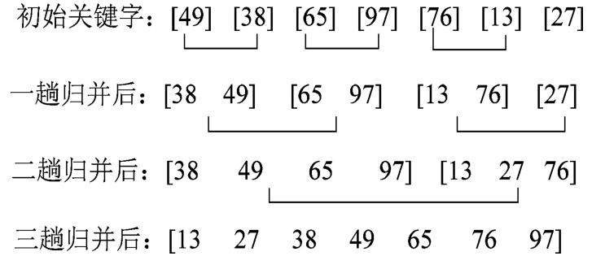
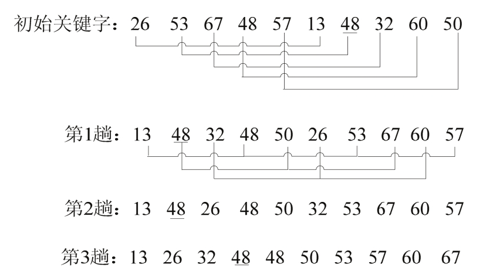
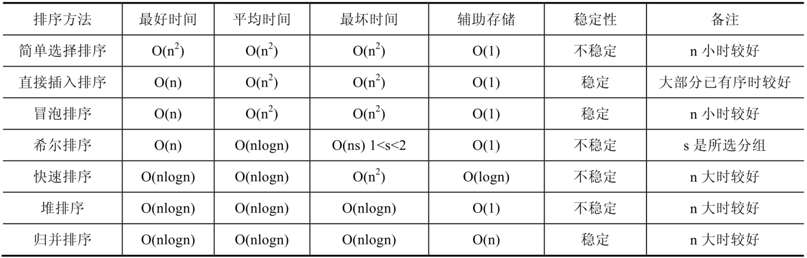

排序问题一直是计算机技术研究的重要问题，排序算法的好坏直接影响程序的执行速度和辅助存储空间的占有量。

## 选择排序

选择排序是一种简单直观的排序算法，它的基本原理如下：对于给定的一组记录，经过第一轮比较后得到最小记录，然后将该记录与第一个记录的位置进行交换；接着对不包括第一个记录以外的其他记录进行第二轮比较，得到最小记录并与第二个记录进行位置交换；重复该过程，直到进行比较的记录只有一个时为止。

以数组 {38, 65, 97, 76, 13, 27, 49} 为例，具体步骤如下：

- 第一趟排序后：13 [65 97 76 38 27 49]
- 第二趟排序后：13 27 [97 76 38 65 49]
- 第三趟排序后：13 27 38 [76 97 65 49]
- 第四趟排序后：13 27 38 49 [97 65 76]
- 第五趟排序后：13 27 38 49 65 [97 76]
- 第六趟排序后：13 27 38 49 65 76 [97]
- 最后排序结果：13 27 38 49 65 76 97

```go
// SelectionSort 选择排序
func SelectionSort(array []int) {
	length := len(array)
	for i := 0; i < length; i++ {
		// 记录最小值及其索引
		m, n := array[i], i
		for j := i + 1; j < length; j++ {
			if array[j] < m {
				m, n = array[j], j
			}
		}
		// 交换最小值
		array[i], array[n] = array[n], array[i]
	}
}
```

## 插入排序

对于给定的一组记录，初始时假设第一个记录自成一个有序序列，其余的记录为无序序列。接着从第二个记录开始，按照记录的大小依次将当前处理的记录插入到其之前的有序序列中，直至最后一个记录插入到有序序列中为止。

以数组 {38, 65, 97, 76, 13, 27, 49} 为例，直接插入排序具体步骤如下：

- 第一步插入38以后：[38] 65 97 76 13 27 49
- 第二步插入65以后：[38 65] 97 76 13 27 49
- 第三步插入97以后：[38 65 97] 76 13 27 49
- 第四步插入76以后：[38 65 76 97] 13 27 49
- 第五步插入13以后：[13 38 65 76 97] 27 49
- 第六步插入27以后：[13 27 38 65 76 97] 49
- 第七步插入49以后：[13 27 38 49 65 76 97]

```go
// InsertionSort 插入排序
func InsertionSort(array []int) {
	length := len(array)
	for i := 0; i < length-1; i++ {
		for j := i + 1; j > 0 && array[j] < array[j-1]; j-- {
			// 从后往前遍历有序序列，后移比它大的元素
			array[j], array[j-1] = array[j-1], array[j]
		}
	}
}
```

## 冒泡排序

冒泡排序顾名思义就是整个过程就像气泡一样往上升，单向冒泡排序的基本思想是（假设由小到大排序）：对于给定的 n 个记录，从第一个记录开始依次对相邻的两个记录进行比较，当前面的记录大于后面的记录时，交换其位置，进行一轮比较和换位后，n 个记录中的最大记录将位于第 n 位；然后对前 (n -1) 个记录进行第二轮比较；重复该过程直到进行比较的记录只剩下一个时为止。

以数组 {36, 25, 48, 12, 25, 65, 43, 57} 为例，具体排序过程如下：

一趟排序的过程如下：

- R[1] 36 25 25 25 25 25 25 25
- R[2] 25 36 36 36 36 36 36 36
- R[3] 48 48 48 12 12 12 12 12
- R[4] 12 12 12 48 25 25 25 25
- R[5] 25 25 25 25 48 48 48 48
- R[6] 65 65 65 65 65 65 43 43
- R[7] 43 43 43 43 43 43 65 57
- R[8] 57 57 57 57 57 57 57 65

则经过多趟排序后的结果如下：

- 初始状态：[36 25 48 12 25 65 43 57]
- 1趟排序：[25 36 12 25 48 43 57 65]
- 2趟排序：[25 12 25 36 43 48] 57 65
- 3趟排序：[12 25 25 36 43] 48 57 65
- 4趟排序：[12 25 25 36] 43 48 57 65
- 5趟排序：[12 25 25] 36 43 48 57 65
- 6趟排序：[12 25] 25 36 43 48 57 65
- 7趟排序：[12] 25 25 36 43 48 57 65

```go
// BubbleSort 冒泡排序
func BubbleSort(array []int) {
	length := len(array)
	for i := 1; i < length; i++ {
		for j := 0; j < length-i; j++ {
			if array[j] > array[j+1] {
				array[j], array[j+1] = array[j+1], array[j]
			}
		}
	}
}
```

## 归并排序

归并排序是利用递归与分治技术将数据序列划分成为越来越小的半子表，再对半子表排序，最后再用递归方法将排好序的半子表合并成为越来越大的有序序列。

归并排序中，“归”代表的是递归的意思，即递归的将数组折半的分离为单个数组，例如数组：[2, 6, 1, 0]，会先折半，分为 [2, 6] 和 [1, 0] 两个子数组，然后再折半将数组分离，分为 [2]，[6] 和 [1]，[0]。“并”就是将分开的数据按照从小到大或者从大到小的顺序再放到一个数组中。如上面的 [2]、[6] 合并到一个数组中是 [2, 6]，[1]、[0] 合并到一个数组中是 [0, 1]，然后再将 [2, 6] 和 [0, 1] 合并到一个数组中即为 [0, 1, 2, 6]。

具体而言，归并排序算法的原理如下：对于给定的一组记录（假设共有 n 个记录），首先将每两个相邻的长度为 1 的子序列进行归并，得到 n/2（向上取整）个长度为 2 或 1 的有序子序列，再将其两两归并，反复执行此过程，直到得到一个有序序列为止。

所以，归并排序的关键就是两步：第一步，**划分子表**；第二步，**合并半子表，即合并左右有序数组**。以数组 {49, 38, 65, 97, 76, 13, 27} 为例，排序过程如下：



```go
// MergeSort 归并排序
func MergeSort(array []int, begin, end int) {
	if begin < end {
		q := (begin + end) / 2
		MergeSort(array, begin, q)
		MergeSort(array, q+1, end)
		merge(array, begin, q, end)
	}
}

// 合并两个有序数组
func merge(array []int, begin, middle, end int) {
	n1 := middle - begin + 1
	n2 := end - middle

	left := make([]int, n1)
	right := make([]int, n2)

	for i, k := 0, begin; i < n1; i, k = i+1, k+1 {
		left[i] = array[k]
	}

	for i, k := 0, middle+1; i < n2; i, k = i+1, k+1 {
		right[i] = array[k]
	}

	var i, j int
	for i < n1 && j < n2 {
		if left[i] < right[j] {
			array[begin+i+j] = left[i]
			i++
		} else {
			array[begin+i+j] = right[j]
			j++
		}
	}

	for i < n1 {
		array[begin+i+j] = left[i]
		i++
	}

	for j < n2 {
		array[begin+i+j] = right[j]
		j++
	}
}
```

二路归并排序的过程需要进行 log(n) 趟。每一趟归并排序的操作，就是将两个有序子序列进行归并，而每一对有序子序列归并时，记录的比较次数均小于等于记录的移动次数，记录移动的次数均等于文件中记录的个数 n，即每一趟归并的时间复杂度为 O(n)。因此，二路归并排序的时间复杂度为 O(nlogn)。

## 快速排序

快速排序是一种非常高效的排序算法，它采用“分而治之”的思想，把大的拆分为小的，小的再拆分为更小的。其原理如下：对于一组给定的记录，通过一趟排序后，将原序列分为两部分，其中前一部分的所有记录均比后一部分的所有记录小，然后再依次对前后两部分的记录进行快速排序，递归该过程，直到序列中的所有记录均有序为止。

具体而言，算法步骤如下：

- **分解**：将输入的序列 `array[m … n]` 划分成两个非空子序列 `array[m … k`] 和 `array[k+1 … n]`，使 `array[m … k]` 中任一元素的值不大于 `array[k+1 … n]` 中任一元素的值。
- **递归求解**：通过递归调用快速排序算法分别对 `array[m … k]` 和 `array[k+1 … n]` 进行排序。
- **合并**：由于对分解出的两个子序列的排序是就地进行的，所以在 `array[m … k]` 和 `array[k+1 … n]` 都排好序后不需要执行任何计算 `array[m … n]` 就已排好序。

以数组 {38, 65, 97, 76, 13, 27, 49} 为例。

第一趟排序过程如下：

- 初始化关键字 [49 38 65 97 76 13 27 49]
- 第一次交换后：[27 38 65 97 76 13 49 49]
- 第二次交换后：[27 38 49 97 76 13 65 49]
- j向左扫描，位置不变，第三次交换后：[27 38 13 97 76 49 65 49]
- i向右扫描，位置不变，第四次交换后：[27 38 13 49 76 97 65 49]
- j向左扫描 [27 38 13 49 76 97 65 49]

整个排序过程如下：

- 初始化关键字 [49 38 65 97 76 13 27 49]
- 一趟排序之后：[27 38 13] 49 [76 97 65 49]
- 二趟排序之后：[13] 27 [38] 49 [49 65]76 [97]
- 三趟排序之后： 13 27 38 49 49 [65]76 97
- 最后的排序结果：13 27 38 49 49 65 76 97

```go
// Partition 用于快速排序中的分割
func Partition(array []int, low, high int) int {
	pos, val := low, array[low]
	low++
	for low <= high {
		if array[low] < val {
			array[low], array[pos] = array[pos], array[low]
			low++
			pos++
		} else {
			array[high], array[low] = array[low], array[high]
			high--
		}
	}
	array[pos] = val
	return pos
}

// QuickSort 快速排序
func QuickSort(array []int, low, high int) {
	if low > high {
		return
	}
	pos := Partition(array, low, high)
	QuickSort(array, low, pos-1)
	QuickSort(array, pos+1, high)
}
```

当初始的序列整体或局部有序时，快速排序的性能将会下降，此时，快速排序将退化为冒泡排序。

### 快速排序的相关特点

**最坏时间复杂度**

最坏情况是指每次区间划分的结果都是基准关键字的左边（或右边）序列为空，而另一边的区间中的记录项仅比排序前少了一项，即选择的基准关键字是待排序的所有记录中最小或者最大的。例如，如果选取第一个记录为基准关键字，当初始序列按递增顺序排列时，每次选择的基准关键字都是所有记录中的最小者，这时记录与基准关键字的比较次数会增多。因此，在这种情况下，需要进行 `(n-1)` 次区间划分。对于第 `k(0<k<n)` 次区间划分，划分前的序列长度为 `(n-k+1)`，需要进行 `(n-k)` 次记录的比较。因此，当 k 从 1 到 `(n-1)` 时，进行的比较次数总共为 `n(n-1)/2`，所以，**在最坏情况下快速排序的时间复杂度为 O(n^2)**。

**最好时间复杂度**

最好情况是指每次区间划分的结果都是基准关键字左右两边的序列长度相等或者相差为 1，即选择的基准关键字为待排序的记录中的中间值。此时，进行的比较次数总共为 nlogn，所以，在最好情况下快速排序的时间复杂度为 O(nlogn)。

**平均时间复杂度**

快速排序的平均时间复杂度为 O(nlogn)。虽然快速排序在最坏情况下的时间复杂度为 O(n2)，但是在所有平均时间复杂度为 O(nlogn) 的算法中，快速排序的平均性能是最好的。

**空间复杂度**

快速排序的过程中需要一个栈空间来实现递归。当每次对区间的划分都比较均匀时（即最好情况），递归树的最大深度为 `[logn]+1`（logn 为向上取整）；当每次区间划分都使得有一边的序列长度为 0 时（即最好情况），递归树的最大深度为 n。在每轮排序结束后比较基准关键字左右的记录个数，对记录多的一边先进行排序，此时，栈的最大深度可降为 logn。因此，快速排序的平均空间复杂度为 O(logn)。

**基准关键字的选取**

基准关键字的选择是决定快速排序算法性能的关键。常用的基准关键字的选择有以下方式：

- 三者取中。三者取中是指在当前序列中，将其首、尾和中间位置上的记录进行比较，选择三者的中值作为基准关键字，在划分开始前交换序列中的第一个记录与基准关键字的位置。
- 取随机数。取 left（左边）和 right（右边）之间的一个随机数 `m(left ≤ m ≤ right)`，用 `n[m]` 作为基准关键字。这种方法使得 `n[left]` 到 `n[right]` 之间的记录是随机分布的，采用此方法得到的快速排序一般称为随机的快速排序。

需要注意一个问题，就是快速排序与归并排序的区别与联系。快速排序与归并排序的原理都是基于分治思想，即首先把待排序的元素分成两组，然后分别对这两组排序，最后把两组结果合并起来。

而它们的不同点在于，进行的分组策略不同，后面的合并策略也不同。归并排序的分组策略是假设待排序的元素存放在数组中，那么其把数组前面一半元素作为一组，后面一半作为另外一组。而快速排序则是根据元素的值来分组，即大于某个值的元素放在一组，而小于的放在另外一组，该值称为基准。所以，对整个排序过程而言，基准值的挑选非常重要，如果选择不合适，太大或太小，那么所有的元素都分在一组了。总的来说，快速和归并排序，如果分组策略越简单，则后面的合并策略就越复杂，因为快速排序在分组时，已经根据元素大小来分组了，而合并的时候，只需把两个分组合并起来就行了，归并排序则需要对两个有序的数组根据大小合并。

## 希尔排序

希尔排序也称为“缩小增量排序”，它的基本原理如下：首先将待排序的数组元素分成多个子序列（一般采用减半法），使得每个子序列的元素个数相对较少，然后对各个子序列分别进行直接插入排序，待整个待排序序列“基本有序”后，最后再对所有元素进行一次直接插入排序。

具体步骤如下：

选择一个步长序列 `t1, t2, …, tk`，满足` ti>tj(i<j)`，`tk = 1`。

按步长序列个数 k，对待排序序列进行 k 趟排序。

每趟排序，根据对应的步长 ti，将待排序列分割成 ti 个子序列，分别对各个子序列进行直接插入排序。

注意，当步长因子为 1 时，所有元素作为一个序列来处理，其长度为 n。

以数组 {26, 53, 67, 48, 57, 13, 48, 32, 60, 50}，步长序列为 {5, 3, 1} 为例。具体步骤如下：



```go
// HillSort 希尔排序
func HillSort(array []int) {
	length := len(array)

	for h := length / 2; h > 0; h /= 2 {
		for i := h; i < length; i++ {
			for j := i - h; j >= 0 && array[j] > array[j+h]; j -= h {
				array[j], array[j+h] = array[j+h], array[j]
			}
		}

		fmt.Println(array)
	}
}

func ExampleHillSort() {
	array := []int{26, 53, 67, 48, 57, 13, 48, 32, 60, 50}
	fmt.Println(array)
	HillSort(array)

	// Output:
	// [26 53 67 48 57 13 48 32 60 50]
	// [13 48 32 48 50 26 53 67 60 57]
	// [13 26 32 48 50 48 53 57 60 67]
	// [13 26 32 48 48 50 53 57 60 67]
}
```

希尔排序的关键并不是随便地分组后各自排序，而是将相隔某个“增量”的记录组成一个子序列，实现跳跃式地移动，使得排序的效率提高。

## 堆排序

堆是一种特殊的树形数据结构，其每个结点都有一个值，通常提到的堆都是指**一棵完全二叉树**，根结点的值小于（或大于）两个子结点的值，同时，根结点的两个子树也分别是一个堆。

堆排序是一树形选择排序，在排序过程中，将 `R[1 … n]` 看成是一颗完全二叉树的**顺序存储**结构，利用完全二叉树中双亲结点和孩子结点之间的内在关系来选择最小的元素。

堆一般分为大顶堆(最大堆)和小顶堆(最小堆)两种不同的类型。

对于给定 n 个记录的序列 (r(1)，r(2)，…，r(n))，当且仅当满足条件 (r(i)> = r(2i)，i = 1，2，…，n) 时称之为大顶堆，此时，**堆顶元素比为最大值**。

对于给定 n 个记录的序列 (r(1)，r(2)，…，r(n)) ，当且仅当满足条件 (r(i)< = r(2i+1)，i = 1，2，…，n) 时称之为小顶堆，此时，**堆顶元素必为最小值**。

堆排序的思想是对于给定的 n 个记录，初始时把这些记录**看作一棵顺序存储的二叉树**，然后将其调整为一个大顶堆，将堆的最后一个元素与堆顶元素（即二叉树的根结点）进行交换后，堆的最后一个元素即为最大记录；接着将前 (n -1) 个元素（即不包括最大记录）重新调整为一个大顶堆，再将堆顶元素与当前堆的最后一个元素进行交换后得到次大的记录，重复该过程直到调整的堆中只剩一个元素时为止，该元素即为最小记录，此时可得到一个有序序列。

堆排序主要包括两个过程：一是构建堆；二是不断交换堆顶元素与最后一个元素的位置。

```go
func MaxHeapSort(array []int) {
	length := len(array)

	// 建立最大堆
	ConvertArrayToMaxHeap(array)

	for i := length - 1; i >= 0; i-- {
		// 顶部元素一定是最大的，所以每次都将其放到最后
		array[0], array[i] = array[i], array[0]
		// 交换堆顶元素和最后一个元素，然后调整剩余堆
		// 在调整时排除已经排序的元素，所以将 i 作为长度传入
		AdjustToMaxHeap(array, 0, i)
	}
}
```

最大堆排序可获得从小到大序列，最小堆排序可获得从大到小序列。

堆排序方法对记录较少的文件效果一般，但对于记录较多的文件还是很有效的，其运行时间主要耗费在创建堆和反复调整堆上。堆排序即使在最坏情况下，其时间复杂度也为 O(n * logn)。

## 排序算法性能对比



## 位图排序

```go

```

## 桶排序

```go

```

## 基数排序

```go

```
