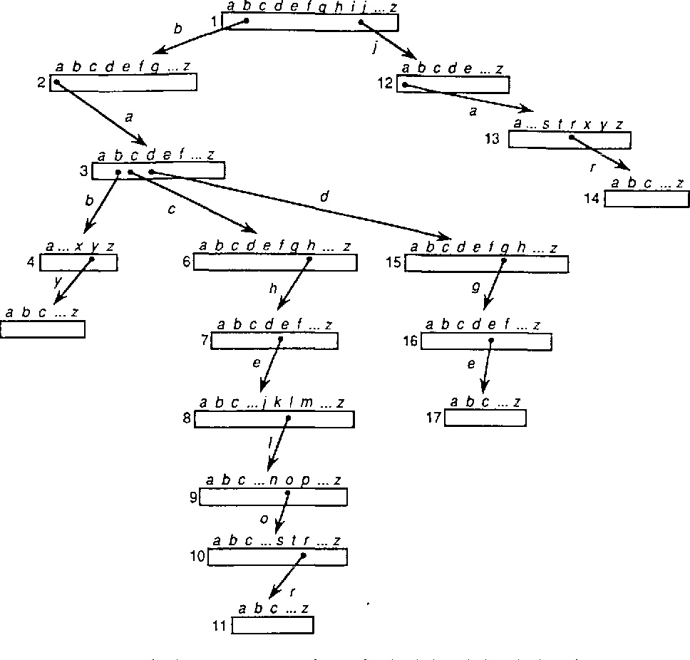
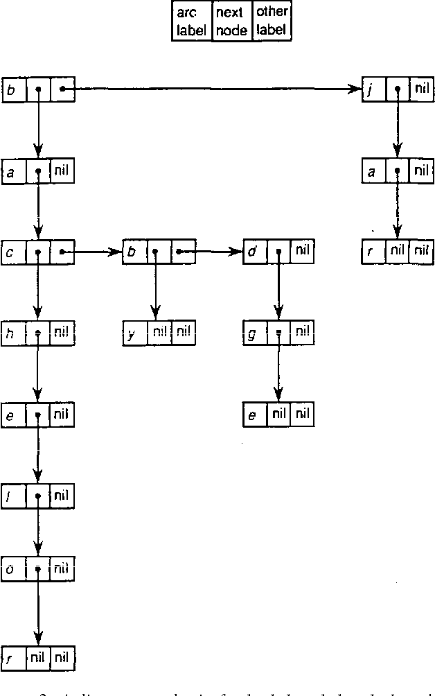

# 双数组前缀树（Double-Array Trie）

前缀树又称为字典树，在搜索提示，分词，httprouter 等领域都有广泛使用。其原理就像查字典一样，比如要从字典中查 `tea`，首先翻到以 `t` 开头的那几页，然后从那几页里找到第二个字母是 `e` 的，在此范围内找到第三个字母是 `a` 并且没有后续字母的单词。

我们可以这样实现一棵前缀树，每个节点都是完整的索引。这样实现起来非常简单，但仅索引 4 个单词就消耗了大量的空间。这还是纯英文字母的情况，如果是中文，那每个节点几万个字节，可以说是相当浪费了。

为了节省空间，我们可以用链表节点替代上面的数组节点，这样只是额外消耗了一点指针的空间，相比数组节点能省下很多空间。但这样每次进入一个节点就要从头开始一个一个地搜相匹配的字符，然后再跳到下一个节点。是一种时间换空间的操作。

