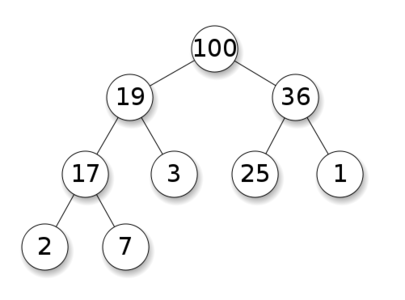
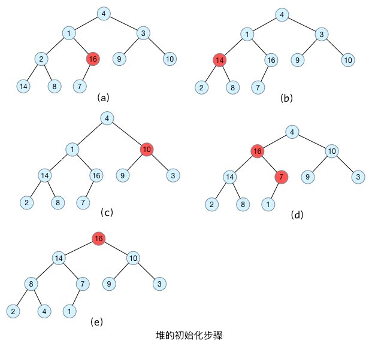

## 定义

堆是计算机科学中的一种特别的完全二叉树。若是满足以下特性，即可称为堆：“给定堆中任意节点 P 和 C，若 P 是 C 的母节点，那么 P 的值会小于等于（或大于等于）C 的值”。

若母节点的值恒小于等于子节点的值，此堆称为最小堆(min heap)；反之，若母节点的值恒大于等于子节点的值，此堆称为最大堆(max heap)。

在堆中最顶端的那一个节点，称作根节点(root node)，根节点本身没有母节点(parent node)。

- 堆树是一颗完全二叉树；
- 堆树中某个节点的值总是不大于或不小于其孩子节点的值；
- 堆树中每个节点的子树都是堆树。

对于给定 n 个记录的序列 (r(1)，r(2)，…，r(n))，当且仅当满足条件 (r(i)> = r(2i)，i = 1，2，…，n) 时称之为**大顶堆**，此时，**堆顶元素比为最大值**。



对于给定 n 个记录的序列 (r(1)，r(2)，…，r(n)) ，当且仅当满足条件 (r(i)< = r(2i+1)，i = 1，2，…，n) 时称之为**小顶堆**，此时，**堆顶元素必为最小值**。


## 数据结构

二叉堆一般用数组来表示。如果根节点在数组中的位置是 1，第 n 个位置的子节点分别在 2n 和 2n+1。因此，第 1 个位置的子节点在 2 和 3，第 2 个位置的子节点在 4 和 5。以此类推。这种基于 1 的数组存储方式便于寻找父节点和子节点。

如果存储数组的下标基于 0，那么下标为 i 的节点的子节点是 2i + 1 与 2i + 2 ；其父节点的下标是⌊ floor((i − 1) ∕ 2) ⌋。函数 floor(x) 的功能是“向下取整”，或者说“向下舍入”，即取不大于 x 的最大整数（与“四舍五入”不同，向下取整是直接取按照数轴上最接近要求值的左边值，即不大于要求值的最大的那个值）。比如 floor(1.1)、floor(1.9) 都返回 1。

如下图的两个堆：

```
          1                                 11                          
       /      \                          /      \ 
     2         3                      9         10
  /    \     /   \                   /   \     /    \ 
 4      5   6     7              5      6   7      8
/ \     / \                        / \    / \
8  9   10 11                 1   2  3   4 
```

将这两个堆保存在以1开始的数组中：

```
位置:  1  2  3  4  5  6  7  8  9 10 11
左图:  1  2  3  4  5  6  7  8  9 10 11
右图: 11  9 10  5  6  7  8  1  2  3  4
```

## 构造最大堆

原始数据为 {4, 1, 3, 2, 16, 9, 10, 14, 8, 7}，采用顺序存储方式，对应的完全二叉树如下图所示：


在构造堆的基本思想就是：首先将每个叶子节点视为一个堆，再将每个叶子节点与其父节点一起构造成一个包含更多节点的对。

所以，在构造堆的时候，首先需要找到最后一个节点的父节点，从这个节点开始构造最大堆；直到该节点前面所有分支节点都处理完毕，这样最大堆就构造完毕了。

假设树的节点个数为 n，以 1 为下标开始编号，直到 n 结束。对于节点 i，其父节点为 i/2 ；左孩子节点为 i * 2，右孩子节点为 i * 2+1。最后一个节点的下标为 n，其父节点的下标为 n/2。

如下图所示，最后一个节点为 7，其父节点为 16，从 16 这个节点开始构造最大堆；构造完毕之后，转移到下一个父节点 2，直到所有父节点都构造完毕。



```go
// AdjustToMaxHeap 将指定节点调整为最大堆
// parent 指定节点的索引
// length 指定节点的数组长度
func AdjustToMaxHeap(array []int, parent, length int) {
	for parent*2+1 < length {
		// 左子节点存在
		child := parent*2 + 1

		if child+1 < length && array[child+1] > array[child] {
			// 存在右子节点，且右子节点的值更大
			child++
		}

		if array[child] > array[parent] {
			// 子节点的值大于父节点
			array[parent], array[child] = array[child], array[parent]
			// 父子节点交换了数据，所以必须继续调整该子节点
			parent = child
		} else {
			// 说明子节点已经有序，中断循环
			break
		}
	}
}

// ConvertArrayToMaxHeap 将数组转换为最大堆
func ConvertArrayToMaxHeap(array []int) {
	length := len(array)

	// 建立最大堆
	for i := length/2 - 1; i >= 0; i-- {
		// 从最底部的父节点开始遍历
		AdjustToMaxHeap(array, i, length)
		fmt.Printf("array[%d]=%d\n", i, array[i])
		fmt.Println(array)
	}
}
```

```go

```
