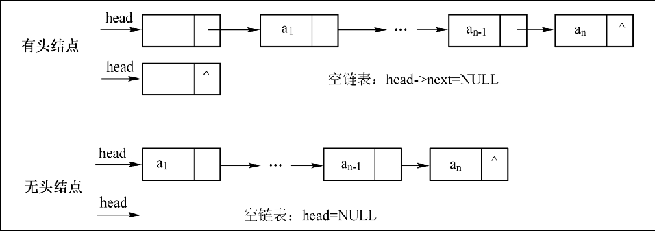
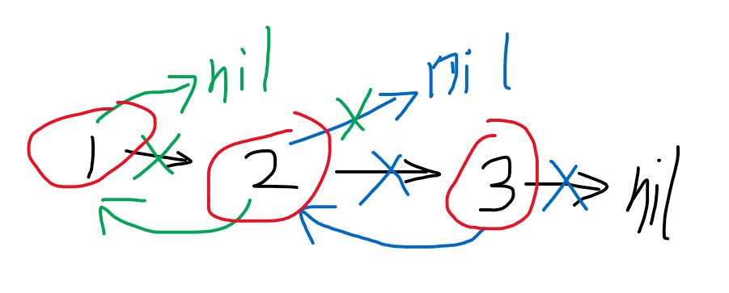
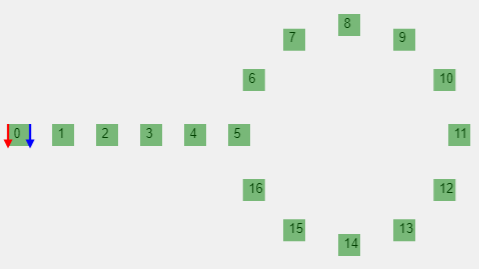
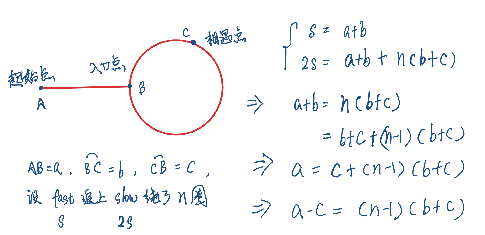
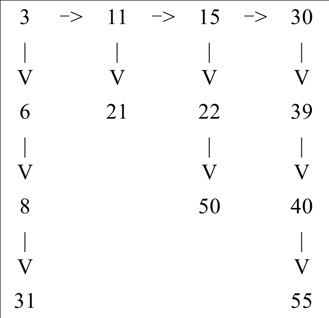

- [概述](#概述)
- [链表结点的定义](#链表结点的定义)
	- [创建空链表](#创建空链表)
	- [创建自定义链表](#创建自定义链表)
	- [创建有序链表](#创建有序链表)
	- [创建无序链表](#创建无序链表)
	- [打印链表](#打印链表)
- [实现链表的逆序](#实现链表的逆序)
	- [就地逆序](#就地逆序)
	- [递归法](#递归法)
	- [插入法](#插入法)
- [逆序输出链表](#逆序输出链表)
- [从无序链表中移除重复项](#从无序链表中移除重复项)
	- [顺序删除](#顺序删除)
	- [递归删除](#递归删除)
	- [空间换时间](#空间换时间)
- [从有序链表中移除重复项](#从有序链表中移除重复项)
- [计算两个单链表所代表的数之和](#计算两个单链表所代表的数之和)
	- [链表相加法](#链表相加法)
- [对链表进行重新排序](#对链表进行重新排序)
	- [双重循环法](#双重循环法)
	- [分割逆序组合法](#分割逆序组合法)
		- [查找链表的中间结点](#查找链表的中间结点)
		- [合并两个链表](#合并两个链表)
- [找出单链表中的倒数第 k 个元素](#找出单链表中的倒数第-k-个元素)
	- [快慢指针法](#快慢指针法)
- [将单链表向右旋转 k 个位置](#将单链表向右旋转-k-个位置)
- [检测一个较大的单链表是否有环](#检测一个较大的单链表是否有环)
	- [HashSet 法](#hashset-法)
	- [快慢指针法](#快慢指针法-1)
- [找出环的入口点](#找出环的入口点)
	- [HashSet 法](#hashset-法-1)
	- [快慢指针法](#快慢指针法-2)
- [链表相邻元素翻转](#链表相邻元素翻转)
	- [交换数据域](#交换数据域)
	- [交换指针域](#交换指针域)
- [把链表以k个结点为一组进行翻转](#把链表以k个结点为一组进行翻转)
- [合并两个有序链表](#合并两个有序链表)
	- [普通方法](#普通方法)
- [归并排序法](#归并排序法)
- [在只给定单链表中某个结点指针的情况下删除该结点](#在只给定单链表中某个结点指针的情况下删除该结点)
	- [复制数据域](#复制数据域)
	- [给出链表和被删结点](#给出链表和被删结点)
- [判断两个单链表（无环）是否交叉](#判断两个单链表无环是否交叉)
	- [HashSet](#hashset)
	- [首尾相接法](#首尾相接法)
	- [尾结点法](#尾结点法)
- [判断两个单链表（有环）是否交叉](#判断两个单链表有环是否交叉)
- [展开二维链表](#展开二维链表)

## 概述

存储特点为：可以用一组存储单元来存储单链表中的数据元素（存储单元可以是不连续的），而且，除了存储每个数据元素外，还必须存储指示其直接后继元素的信息。这两部分信息组成的数据元素的存储映像称为结点。N 个结点链在一块被称为链表，当结点**只包含其后继结点信息的链表就被称为单链表**，而链表的**第一个结点通常被称为头结点**。

对于单链表，又可以将其分为有头结点的单链表和无头结点的单链表。



在单链表的开始结点之前附设一个类型相同的结点，称为头结点，头结点的数据域可以不存储任何信息（也可以存放如线性表的长度等附加信息），头结点的指针域存储指向开始结点的指针（即第一个元素结点的存储位置）。

具体而言，头结点的作用主要有以下两点：

（1）对于带头结点的链表，当在链表的任何结点之前插入新结点或删除链表中任何结点时，所要做的都是修改前一个结点的指针域，因为任何结点都有前驱结点。若链表没有头结点，则首元素结点没有前驱结点，在其前面插入结点或删除该结点时操作会复杂些，需要进行特殊的处理。

（2）对于带头结点的链表，链表的头指针是指向头结点的非空指针，因此，对空链表与非空链表的处理是一样的。

## 链表结点的定义

```go
type LNode struct {
	Data interface{}
	Next *LNode
}
```

### 创建空链表

```go
func NewLinkedList() *LNode {
	return &LNode{}
}
```

### 创建自定义链表

```go
func NewCustomLinkedList(data []int) (head LNode) {
	cur := &head
	for d := range data {
		cur.Next = &LNode{Data: data[d]}
		cur = cur.Next
	}
	return head
}
```

### 创建有序链表

```go
func NewSeqLinkedList(max int) (head LNode){
	cur := &head
	for i := 1; i <= max; i++ {
		cur.Next = &LNode{Data: i}
		cur = cur.Next
	}
	return head
}
```

### 创建无序链表

```go
func NewNoSeqLinkedList(max int) (head LNode){
	cur := &head
	rand.Seed(time.Now().Unix())
	for range make([][]int, max) {
		cur.Next = &LNode{Data: rand.Intn(max)}
		cur = cur.Next
	}
	return head
}
```

### 打印链表

```go
func PrintLNode(head *LNode) {
	for cur := head.Next; cur != nil; cur = cur.Next {
		fmt.Print(cur.Data, " ")
	}
	fmt.Println()
}
```

## 实现链表的逆序

题目描述：

给定一个带头结点的单链表，将其逆序。即如果单链表原来为 head->1->2->3->4->5->6->7，则逆序后变为 head->7->6->5->4->3->2->1。

### 就地逆序

用三个指针保存前驱、当前和后继。

```go
// 实现链表的逆序
// 前驱 Precursor
// 后继 Successor
func Reverse(head *LNode) {
	if head == nil || head.Next == nil {
		return
	}
	var pre *LNode // 前驱结点，初始化为 nil
	var cur *LNode
	suc := head.Next // 后继结点
	for suc != nil {
		cur = suc.Next
		suc.Next = pre
		pre = suc
		suc = cur
	}
	head.Next = pre
}
```

这地方我遇到了一些问题，在这记录下来：

```go
func main() {
	var h1 *LNode
	fmt.Printf("%#v\n", h1)
	// (*def.LNode)(nil)

	var h2 LNode
	fmt.Printf("%#v\n", &h2)
	// &def.LNode{Data:interface {}(nil), Next:(*def.LNode)(nil)}

	h3 := &LNode{}
	fmt.Printf("%#v\n", h3)
	// &def.LNode{Data:interface {}(nil), Next:(*def.LNode)(nil)}

	h4 := new(LNode)
	fmt.Printf("%#v\n", h4)
	// &def.LNode{Data:interface {}(nil), Next:(*def.LNode)(nil)}
}
```

### 递归法

```go
// 不带头结点逆序
func RecursiveReverseChild(node *LNode) *LNode {
	if node == nil || node.Next == nil {
		return node
	}
	head := RecursiveReverseChild(node.Next)
	// 1 -> 2 -> 3 -> nil
	// 1 -> 2 -> 3 -> 2 -> nil
	// 1 -> 2 -> 3 -> 2 -> 1 -> nil
	// 构成环，然后断掉
	node.Next.Next = node
	node.Next = nil
	return head
}

func RecursiveReverse(head *LNode) {
	first := head.Next
	tail := RecursiveReverseChild(first)
	head.Next = tail
}
```

递归比较难理解。



### 插入法

从链表的第二个结点开始，把遍历到的结点插入到头结点的后面，直到遍历结束。

```go
func InsertReverse(head *LNode) {
	if head == nil || head.Next == nil {
		return
	}
	var suc *LNode
	cur := head.Next.Next
	head.Next.Next = nil // 十分关键
	for cur != nil {
		// 构成环，然后断掉
		suc = cur.Next
		cur.Next = head.Next
		head.Next = cur
		cur = suc
	}
}
```

与方法一相比，这种方法不需要保存前驱结点的地址，与方法二相比，这种方法不需要递归地调用，效率更高。

对不带头结点的单链表进行逆序，我的看法是自己加一个头结点。

## 逆序输出链表

**递归法**

```go
func ReversePrint(head *LNode) {
	if head == nil || head.Next == nil {
		return
	}
	ReversePrint(head.Next)
	fmt.Print(head.Next.Data, " ")
}
```

## 从无序链表中移除重复项

### 顺序删除

通过双重循环直接在链表上进行删除操作。外层循环用一个指针从第一个结点开始遍历整个链表，然后内层循环用另外一个指针遍历其余结点，将与外层循环遍历到的指针所指结点的数据域相同的结点删除。

```go
func RemoveDup(head *LNode) {
	if head == nil || head.Next == nil {
		return
	}
	outerCur := head.Next // 外层循环
	var innerCur *LNode   // 内层循环
	for outerCur != nil && outerCur.Next != nil {
		innerCur = outerCur
		// 不记录前驱而是判断后继
		for innerCur.Next != nil {
			if innerCur.Next.Data == outerCur.Data {
				innerCur.Next = innerCur.Next.Next // 将重复数据结点短路
				continue                           // 可能不止一个相同数据结点
			}
			innerCur = innerCur.Next
		}
		outerCur = outerCur.Next
	}
}
```

### 递归删除

这种方法与方法一类似，从本质上而言，由于这种方法需要对链表进行双重遍历。由于递归法会增加许多额外的函数调用，因此，从理论上讲，该方法效率比方法一低。

```go
func RecursiveRemoveDupChild(node *LNode) *LNode {
	if node == nil || node.Next == nil {
		return node
	}
	RecursiveRemoveDupChild(node.Next)
	cur := node
	for cur.Next != nil {
		if node.Data == cur.Next.Data {
			cur.Next = cur.Next.Next
			continue
		}
		cur = cur.Next
	}
	return node
}
```

### 空间换时间

通常情况下，为了降低时间复杂度，往往在条件允许的情况下，通过使用辅助空间实现。

```go
// HashSet 简易实现
type HashSet struct {
	//Data      []interface{}
	Container map[interface{}]bool
}

func NewHashSet() *HashSet {
	return &HashSet{map[interface{}]bool{}}
}

func (s *HashSet) Add(i interface{}) bool {
	// 索引不存在情况返回类型默认初始值
	isExist := s.Container[i]
	if !isExist {
		//s.Data = append(s.Data, i)
		s.Container[i] = true
	}
	// return false if it existed already
	return !isExist
}

func (s *HashSet) Get(i interface{}) bool {
	isExist := s.Container[i]
	return isExist
}

// 利用 HashSet
func SetRemoveDup(head *LNode) {
	set := NewHashSet()
	cur := head.Next
	for cur.Next != nil {
		if set.Get(cur.Next.Data) {
			cur.Next = cur.Next.Next
			continue
		}
		set.Add(cur.Data)
		cur = cur.Next
	}
}
```

## 从有序链表中移除重复项

```go
func RemoveDupSeq(head *LNode) {
	if head == nil || head.Next == nil {
		return
	}
	cur := head.Next
	for cur.Next != nil {
		if cur.Next.Data == cur.Data {
			cur.Next = cur.Next.Next // 将重复数据结点短路
			continue                 // 可能不止一个相同数据结点
		}
		cur = cur.Next
	}
}
```

## 计算两个单链表所代表的数之和

给定两个单链表，链表的每个结点代表一位数，计算两个数的和。例如：输入链表(3->1->5)和链表(5->9->2)，输出：8->0->8，即513+295=808，注意**个位数在链表头**。

### 链表相加法

对链表中的结点直接进行相加操作，把相加的和存储到新的链表中对应的结点中，同时还要记录结点相加后的进位。

```go
func Sum2LinkedList(head1, head2 *LNode) (head *LNode) {
	if head1 == nil || head1.Next == nil {
		return head2
	} else if head2 == nil || head2.Next == nil {
		return head1
	}
	head = NewLinkedList()
	cur := head
	cur1 := head1.Next
	cur2 := head2.Next
	var val, forward int
	for cur1 != nil && cur2 != nil {
		val = cur1.Data + cur2.Data + forward
		cur.Next = &LNode{Data: val % 10}
		forward = val / 10
		cur = cur.Next
		cur1 = cur1.Next
		cur2 = cur2.Next
	}
	// 链表长度不一致情况
	for cur1 != nil {
		val = cur1.Data + forward
		cur.Next = &LNode{Data: val % 10}
		forward = val / 10
		cur = cur.Next
		cur1 = cur1.Next
	}
	for cur2 != nil {
		val = cur2.Data + forward
		cur.Next = &LNode{Data: val % 10}
		forward = val / 10
		cur = cur.Next
		cur2 = cur2.Next
	}
	// 最后的进位
	if forward == 1 {
		cur.Next = &LNode{Data: 1}
	}
	return head
}
```

## 对链表进行重新排序

给定链表 L0->L1->L2…Ln-1->Ln，把链表重新排序为 L0->Ln->L1->Ln-1->L2->Ln-2…。要求：①在原来链表的基础上进行排序，即不能申请新的结点；②只能修改结点的next域，不能修改数据域。

### 双重循环法

```go
// 两层循环，每次都找最后一个结点
func LoopResort(head *LNode) {
	if head == nil || head.Next == nil {
		return
	}
	cur := head.Next
	var pre, tail *LNode // 最后一个结点及其前驱
	for cur != nil && cur.Next != nil {
		pre, tail = cur, cur.Next
		for tail.Next != nil {
			pre, tail = tail, tail.Next // 编译器会先计算再赋值
		}
		pre.Next = nil
		tail.Next = cur.Next
		cur.Next = tail
		cur = cur.Next.Next
	}
}
```

### 分割逆序组合法

①首先找到链表的中间结点；②对链表的后半部分子链表进行逆序；③把链表的前半部分子链表与逆序后的后半部分子链表进行合并，合并的思路为：分别从两个链表各取一个结点进行合并。

#### 查找链表的中间结点

用两个指针从链表的第一个结点开始同时遍历结点，一个快指针每次走 2 步，另外一个慢指针每次走 1 步；当快指针先到链表尾部时，慢指针则恰好到达链表中部。

快指针到链表尾部时，当链表长度为奇数时，慢指针指向的即是链表中间指针，当链表长度为偶数时，慢指针指向的结点和慢指针指向的结点的下一个结点都是链表的中间结点。

```go
// 2 倍速指针找中间结点，然后截断链表
// 注意返回的链表不带头结点
func Split2Parts(head *LNode) *LNode {
	if head == nil || head.Next == nil {
		return nil
	}
	// 将头结点作为相同起点
	cur := head
	fast := head
	for fast != nil && fast.Next != nil {
		fast = fast.Next.Next // 2 倍速指针
		cur = cur.Next
	}
	// 最后清除前驱指针
	defer func() {
		cur.Next = nil
	}()
	return cur.Next
}
```

#### 合并两个链表

```go
// 分割逆序组合法
func ReverseResort(head *LNode) {
	if head == nil || head.Next == nil {
		return
	}
	// 分割成两部分，对第二部分逆序
	part1 := head.Next
	part2 := ReverseChild(Split2Parts(head))
	var cur *LNode // 保存拆下来的结点
	for part2 != nil {
		cur = part2
		part2 = part2.Next
		cur.Next = part1.Next
		part1.Next = cur
		part1 = part1.Next.Next
	}
}

// from reverse.go
func ReverseChild(node *LNode) *LNode {
	if node == nil || node.Next == nil {
		return node
	}
	head := ReverseChild(node.Next)
	node.Next.Next = node
	node.Next = nil
	return head
}
```

## 找出单链表中的倒数第 k 个元素

找出单链表中的倒数第 k 个元素，例如给定单链表：1->2->3->4->5->6->7，则单链表的倒数第 k=3 个元素为 5。

### 快慢指针法

在查找过程中，设置两个指针，让其中一个指针比另一个指针先前移k步，然后两个指针同时往前移动。循环直到先行的指针值为 null 时，另一个指针所指的位置就是所要找的位置。

```go
func FindLastK(head *LNode, k int) *LNode {
	if head == nil || head.Next == nil {
		return nil
	}
	fast := head
	slow := head
	for i := 1; i <= k && fast != nil; i++ {
		fast = fast.Next
	}
	// 链表长度小于 k 情况
	if fast == nil {
		return nil
	}
	for fast != nil {
		fast = fast.Next
		slow = slow.Next
	}
	return slow
}
```

## 将单链表向右旋转 k 个位置

给定单链表 1->2->3->4->5->6->7，k=3，那么旋转后的单链表变为5->6->7->1->2->3->4。

```go
func SpinLastK(head *LNode, k int) {
	if head == nil || head.Next == nil {
		return
	}
	fast := head
	slow := head
	for i := 1; i <= k && fast != nil; i++ {
		fast = fast.Next
	}
	// 链表长度小于 k 情况
	if fast == nil {
		return
	}
	for fast.Next != nil {
		fast = fast.Next
		slow = slow.Next
	}
	defer func() {
		slow.Next = nil
	}()
	fast.Next = head.Next
	head.Next = slow.Next
}
```

## 检测一个较大的单链表是否有环

单链表有环指的是单链表中某个结点的 next 域指向的是链表中在它之前的某一个结点，这样在链表的尾部形成一个环形结构。

### HashSet 法

定义一个 HashSet 用来存放结点的引用，并将其初始化为空，从链表的头结点开始向后遍历，每遍历到一个结点就判断 HashSet 中是否引用这个结点，如果没有，说明这个结点是第一次访问，还没有形成环，那么将这个引用结点添加到指针 HashSet 中去。如果在 HashSet 中找到了同样的结点，那么说明这个结点已经被访问过了，于是就形成了环。

```go
func DetectRingHashSet(head *LNode) (node *LNode, isRing bool) {
	if head == nil || head.Next == nil {
		return nil, false
	}
	// 简易 HashSet
	set := make(map[*LNode]bool)
	cur := head.Next
	for cur != nil {
		if set[cur] {
			return cur, true
		}
		set[cur] = true
		cur = cur.Next
	}
	return nil, false
}
```

### 快慢指针法

定义两个指针 `fast`（快）与 `slow`（慢），二者的初始值都指向链表头，指针 `slow` 每次前进一步，指针 `fast` 每次前进两步，两个指针同时向前移动，快指针每移动一次都要跟慢指针比较，如果快指针等于慢指针，就证明这个链表是带环的单向链表，否则，证明这个链表是不带环的循环链表。

```go
func DetectRing2Pointer(head *LNode) (node *LNode, isRing bool) {
	if head == nil || head.Next == nil {
		return nil, false
	}
	// 相同起始点
	fast := head.Next
	slow := head.Next

	for fast != nil && fast.Next != nil {
		if slow == fast.Next || slow == fast.Next.Next {
			return slow, true
		}
		slow = slow.Next
		fast = fast.Next.Next
	}
	return nil, false
}
```

## 找出环的入口点

当链表有环的时候，如果知道环的入口点，那么在需要遍历链表或释放链表所占的空间的时候方法将会非常简单。

### HashSet 法

重复点即是，与上文同方法。

### 快慢指针法



我觉得理解起来很难，简单来说，fast 比 slow 多走了一倍的路程，这一倍路程就是 n 个环的长度。那么 n 个环的长度就就是起始点到相遇点的距离，于是相遇点向后离入口点+(n-1) 个环的长度就是起始点到入口点的距离。

数学证明：



```go
func RingEntryNode(head *LNode) *LNode {
	if head == nil || head.Next == nil {
		return nil
	}
	// 相同起始点
	fast := head.Next
	slow := head.Next
	for fast != nil && fast.Next != nil {
		if slow.Next == fast.Next.Next {
			break
		}
		slow = slow.Next
		fast = fast.Next.Next
	}

	cur := head.Next
	for cur != slow.Next {
		cur = cur.Next
		slow = slow.Next
	}
	return cur
}
```

## 链表相邻元素翻转

把链表相邻元素翻转，例如给定链表为1->2->3->4->5->6->7，则翻转后的链表变为2->1->4->3->6->5->7。

### 交换数据域

```go
func FlipAdjacentNode(head *LNode) {
	if head == nil || head.Next == nil {
		return
	}
	cur := head.Next
	for cur != nil && cur.Next != nil {
		cur.Data, cur.Next.Data = cur.Next.Data, cur.Data
		cur = cur.Next.Next
	}
}
```

### 交换指针域

```go
func FlipAdjPointer(head *LNode) {
	if head == nil || head.Next == nil {
		return
	}
	pre := head
	cur := head.Next
	var suc *LNode
	for cur != nil && cur.Next != nil {
		suc = cur.Next
		cur.Next = cur.Next.Next
		suc.Next = cur
		pre.Next = suc
		pre = cur
		cur = cur.Next
	}
}
```

## 把链表以k个结点为一组进行翻转

K链表翻转是指把每k个相邻的结点看成一组进行翻转，如果剩余结点不足k个，则保持不变。假设给定链表1->2->3->4->5->6->7和一个数k，如果k的值为2，那么翻转后的链表为 2->1->4->3->6->5->7。如果 k 的值为 3，那么翻转后的链表为：3->2->1->6->5->4->7。

```go
func FlipAdjKNode(head *LNode, k int) {
	if head == nil || head.Next == nil {
		return
	}
	pre := head // 记录前驱
	cur1 := head.Next
	var cur2, suc *LNode
	for cur1 != nil {
		cur2 = cur1 // 记录首结点
		for i := 1; i < k && cur1 != nil; i++ {
			cur1 = cur1.Next
		}
		if cur1 != nil {
			suc = cur1.Next // 记住下一段的首结点
			cur1.Next = nil // 置空便于逆序
		}
		pre.Next = RevChild(cur2)
		if cur1 != nil {
			cur2.Next = suc // 首尾已交换，连接余下部分
			cur1 = suc      // 指向下一段的首结点
		}
		pre = cur2 // 下一段的前驱
	}
}
```

## 合并两个有序链表

### 普通方法

```go
func MergeOrderLinkedList(head1, head2 *LNode) (head *LNode) {
	if head1 == nil || head1.Next == nil {
		return head2
	} else if head2 == nil || head2.Next == nil {
		return head1
	}
	head = head1 // 合并到链表 1
	cur := head
	cur1 := head1.Next
	cur2 := head2.Next
	for cur1 != nil && cur2 != nil {
		if cur1.Data < cur2.Data {
			cur.Next = cur1
			cur1 = cur1.Next
		} else {
			cur.Next = cur2
			cur2 = cur2.Next
		}
		cur.Next.Next = nil
		cur = cur.Next
	}
	// 链表长度不一致情况
	if cur1 != nil {
		cur.Next = cur1
	}
	if cur2 != nil {
		cur.Next = cur2
	}
	return head
}
```

## 归并排序法

```go
// 归并排序法，不带头结点
func MergeSort(l1, l2 *LNode) (res *LNode) {
	if l1 == nil {
		return l2
	} else if l2 == nil {
		return l2
	}
	if l1.Data < l2.Data {
		res = l1
		res.Next = MergeSort(l1.Next, l2)
	} else {
		res = l2
		res.Next = MergeSort(l2.Next, l1)
	}
	return res
}
```

## 在只给定单链表中某个结点指针的情况下删除该结点

### 复制数据域

```go
func QuickRmNode(node *LNode) {
	if node == nil || node.Next == nil {
		return // 尾结点无法删除
	}
	n := node.Next
	node.Data = n.Data
	node.Next = n.Next
	n.Next = nil // 清理被删结点
}
```

### 给出链表和被删结点

```go
func RemoveNode(head *LNode, node *LNode) {
	if head == nil || head.Next == nil {
		return
	}
	cur := head.Next
	for cur != nil && cur.Next != node {
		cur = cur.Next
	}
	if cur == nil {
		return
	}
	n := cur.Next
	cur.Next = cur.Next.Next
	n.Next = nil // 清理删掉的结点
}
```

## 判断两个单链表（无环）是否交叉

单链表相交指的是两个链表存在完全重合的部分。

### HashSet

如果两个链表相交，那么它们一定会有公共的结点，由于结点的地址或引用可以作为结点的唯一标识，因此，可以通过判断两个链表中的结点是否有相同的地址或引用来判断链表是否相交。

实现方法与之前判断有环链表类似，不再赘述。

### 首尾相接法

将这两个链表首尾相连，然后检测这个链表是否存在环，如果存在，则两个链表相交，而环入口结点即为相交的结点。

### 尾结点法

如果两个链表相交，那么两个链表从相交点到链表结束都是相同的结点，必然是 Y 字形，所以，判断两个链表的最后一个结点是不是相同即可。即先遍历一个链表，直到尾部，再遍历另外一个链表，如果也可以走到同样的结尾点，则两个链表相交，这时记下两个链表的长度n1、n2，再遍历一次，长链表结点先出发前进|n1-n2|步，之后两个链表同时前进，每次一步，相遇的第一点即为两个链表相交的第一个点。

## 判断两个单链表（有环）是否交叉

1. 如果一个单链表有环，另外一个没环，那么它们肯定不相交。

2. 如果两个单链表都有环并且相交，那么这两个链表一定共享这个环。判断两个有环的链表是否相交的方法为：首先找到链表 head1 中环的入口点 p1，然后遍历链表 head2，判断链表中是否包含结点 p1，如果包含，则这两个链表相交，否则不相交。找相交点的方法为：把结点 p1看作两个链表的尾结点，这样就可以把问题转换为求两个无环链表相交点的问题，可以采用上文求相交点的方法来解决这个问题。

## 展开二维链表

给定一个有序链表，其中每个结点也表示一个有序链表，结点包含两个类型的指针：

1. 指向主链表中下一个结点的指针。
2. 指向此结点头的链表。

所有链表都被排序。



实现一个函数 flatten()，该函数用来**将链表扁平化成单个链表**，扁平化的链表也应该被排序。例如，对于上述输入链表，输出链表应为3->6->8->11->15->21->22->30->31->39->40->45->50。

```go
func PrintL2Node(head *L2Node) {
	for cur := head; cur != nil; cur = cur.Down {
		fmt.Print(cur.Data, " ")
	}
	fmt.Println()
}

func Flatten(head *L2Node) *L2Node {
	if head == nil || head.Next == nil {
		return head
	}
	cur := head.Next
	res := head.Next
	var suc *L2Node
	for cur != nil && cur.Next != nil {
		suc = cur.Next
		res = Merge(res, cur.Next)
		cur = suc
	}
	return res
}

type L2Node struct {
	Data int
	Next *L2Node
	Down *L2Node
}

func NewLinked2List(data []int) (head L2Node) {
	cur := &head
	for d := range data {
		cur.Down = &L2Node{Data: data[d]}
		cur = cur.Down
	}
	return *head.Down
}

func NewLinked2Node() *L2Node {
	head := &L2Node{}
	cur := head
	list1 := NewLinked2List([]int{6, 8, 31})
	cur.Next = &L2Node{Data: 3, Down: &list1}
	cur = cur.Next
	list2 := NewLinked2List([]int{21})
	cur.Next = &L2Node{Data: 11, Down: &list2}
	cur = cur.Next
	list3 := NewLinked2List([]int{22, 50})
	cur.Next = &L2Node{Data: 15, Down: &list3}
	cur = cur.Next
	list4 := NewLinked2List([]int{39, 40, 55})
	cur.Next = &L2Node{Data: 30, Down: &list4}
	return head
}

func Merge(l1, l2 *L2Node) (res *L2Node) {
	if l1 == nil {
		return l2
	} else if l2 == nil {
		return l2
	}
	if l1.Data < l2.Data {
		res = l1
		res.Down = Merge(l1.Down, l2)
	} else {
		res = l2
		res.Down = Merge(l2.Down, l1)
	}
	return res
}
```
