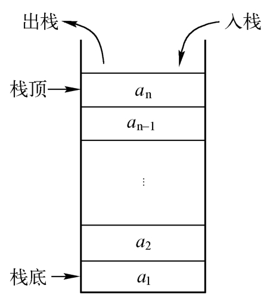

## 概述



栈先存进去的数据只能最后被取出来，属于 LIFO（Last In First Out，后进先出）结构，它遵循进出顺序逆序，即先进后出，后进先出。

## 用 Go 语言实现栈

实现一个栈的数据结构，使其具有以下方法：压栈、弹栈、取栈顶元素、判断栈是否为空以及获取栈中元素个数。

### 数组实现

```go
// 数组实现的栈（不考虑并发操作）
type ArrayStack struct {
	Data []int // 存储数据
	Size int   // 大小
}

func NewArrayStack() *ArrayStack {
	return &ArrayStack{[]int{}, 0}
}

// 判断是否为空
func (s *ArrayStack) IsEmpty() bool {
	return s.Size == 0
}

// 返回栈的长度
func (s *ArrayStack) Len() int {
	return s.Size
}

// 返回栈顶元素
func (s *ArrayStack) Top() (int, error) {
	if s.IsEmpty() {
		return 0, errors.New("empty stack")
	}
	return s.Data[s.Size-1], nil
}

// 弹出栈元素
func (s *ArrayStack) Pop() (int, error) {
	if s.IsEmpty() {
		return 0, errors.New("empty stack")
	}
	s.Size--
	return s.Data[s.Size], nil
}

// 添加元素
func (s *ArrayStack) Push(val int) {
	s.Data = append(s.Data, val)
	s.Size++
}
```

### 链表实现

```go
// 链表实现的栈（不考虑并发操作）
type LinkedStack struct {
	Head *LNode
	// 用链表头结点存储长度数值
}

func NewLinkedStack() *LinkedStack {
	return &LinkedStack{Head: &LNode{Data: 0}}
}

// 判断是否为空
func (s *LinkedStack) IsEmpty() bool {
	return s.Head.Data == 0
}

// 返回栈的长度
func (s *LinkedStack) Len() int {
	return s.Head.Data
}

// 返回栈顶元素
func (s *LinkedStack) Top() (int, error) {
	if s.IsEmpty() {
		return 0, errors.New("empty stack")
	}
	return s.Head.Next.Data, nil
}

// 弹出栈元素
func (s *LinkedStack) Pop() (int, error) {
	if s.IsEmpty() {
		return 0, errors.New("empty stack")
	}
	val := s.Head.Next
	s.Head.Next = s.Head.Next.Next
	s.Head.Data--
	val.Next = nil // 垃圾回收
	return val.Data, nil
}

// 添加元素
func (s *LinkedStack) Push(val int) {
	node := &LNode{Data: val, Next: s.Head.Next}
	s.Head.Next = node
	s.Head.Data++
}
```

两种方法的对比：

- 数组实现栈的优点是：一个元素值占用一个存储空间。它的缺点为：如果初始化申请的存储空间太大，会造成空间的浪费，如果申请的存储空间太小，后期会经常需要扩充存储空间，扩充存储空间是个费时的操作，这样会造成性能的下降。
- 链表实现栈的优点是：使用灵活方便，只有在需要的时候才会申请空间。它的缺点为：除了要存储元素外，还需要额外的存储空间存储指针信息。

### 利用 Go 切片的简单实现

```go
type Stack []int

func (s Stack) IsEmpty() bool {
	return len(s) == 0
}

func (s Stack) Size() int {
	return len(s)
}

func (s Stack) Top() (int, error) {
	if s.IsEmpty() {
		return 0, errors.New("empty stack")
	}
	return s[len(s)-1], nil
}

func (s *Stack) Push(val int) {
	*s = append(*s, val)
}

func (s *Stack) Pop() (int, error) {
	if s.IsEmpty() {
		return 0, errors.New("empty stack")
	}
	val, err := s.Top()
	if err != nil {
		return 0, err
	}
	*s = (*s)[:s.Size()-1]
	return val, nil
}
```

## 翻转栈的所有元素

翻转栈的所有元素，例如输入栈 {1， 2， 3， 4， 5}，其中，1 处在栈顶，翻转之后的栈为 {5， 4， 3， 2， 1}，其中，5 处在栈顶。

### 通过队列

申请一个额外的队列，先把栈中的元素依次出栈放到队列里，然后把队列里的元素按照出队列顺序入栈，这样就可以实现栈的翻转，这种方法的缺点是需要申请额外的空间存储队列，因此，空间复杂度较高。

### 递归法

将当前栈的最底元素移到栈顶，其他元素顺次下移一位，然后对不包含栈顶元素的子栈进行同样的操作。终止条件：递归下去，直到栈为空。

由于栈的后进先出的特点，使得只能取栈顶的元素，因此，要把栈底的元素移动到栈顶也需要递归调用才能完成，主要思路为：把不包含该栈顶元素的子栈的栈底的元素移动到子栈的栈顶，然后把栈顶的元素与子栈栈顶的元素（其实就是与栈顶相邻的元素）进行交换。

个人认为递归同样消耗空间，而且不如队列方法容易理解。

```go
func ReverseStack(s *Stack) {
	if s.IsEmpty() {
		return
	}
	MoveBottom2Top(s)
	top, err := s.Pop()
	if err != nil {
		log.Panic(err)
	}
	ReverseStack(s)
	s.Push(top)
}

func MoveBottom2Top(s *Stack) {
	if s.IsEmpty() {
		return
	}
	top1, err := s.Pop()
	if err != nil {
		log.Panic(err)
	}
	if !s.IsEmpty() {
		MoveBottom2Top(s)
		top2, err := s.Pop()
		if err != nil {
			log.Panic(err)
		}
		s.Push(top1)
		s.Push(top2)
	} else {
		s.Push(top1)
	}
}
```

## 栈排序

### 冒泡排序

```go
func SortStack(s *Stack) {
	if s.IsEmpty() {
		return
	}
	ExchangeSort(s)
	top, err := s.Pop()
	if err != nil {
		log.Panic(err)
	}
	SortStack(s)
	s.Push(top)
}

// 原理其实就是冒泡排序
func ExchangeSort(s *Stack) {
	if s.IsEmpty() {
		return
	}
	top1, err := s.Pop()
	if err != nil {
		log.Panic(err)
	}
	if !s.IsEmpty() {
		ExchangeSort(s)
		top2, err := s.Pop()
		if err != nil {
			log.Panic(err)
		}
		if top1 < top2 {
			s.Push(top1)
			s.Push(top2)
		} else {
			s.Push(top2)
			s.Push(top1)
		}
	} else {
		s.Push(top1)
	}
}
```

## 根据入栈序列判断可能的出栈序列

输入两个整数序列，其中一个序列表示栈的 Push 顺序，判断另一个序列有没有可能是对应的 Pop 顺序。

我经常隔一段时间就困惑：不就一种顺序吗？其实关键在于可以边 Push 边 Pop。

### 模拟入栈顺序

```go
func IsPopSerial(push, pop []int) bool {
	if len(push) != len(pop) {
		return false
	}
	pushIndex := 0
	popIndex := 0
	stack := Stack{}
	for pushIndex < len(push) {
		stack.Push(push[pushIndex])
		pushIndex++
		for !stack.IsEmpty() {
			val, err := stack.Top()
			if err == nil && val == pop[popIndex] {
				_, _ = stack.Pop()
				popIndex++
			} else {
				break
			}
		}
	}
	if stack.IsEmpty() && popIndex == len(pop) {
		return true
	}
	return false
}
```

**类似的方法**

```go
func IsPopOrder(pushOrder, popOrder []int) bool {
	if len(pushOrder) != len(popOrder) {
		return false
	}
	s := Stack{}
	for len(popOrder) != 0 {
		if !s.IsEmpty() {
			val, _ := s.Top()
			if val == popOrder[0] {
				popOrder = popOrder[1:]
				_, _ = s.Pop()
			} else if len(pushOrder) == 0 {
				return false
			} else {
				s.Push(pushOrder[0])
				pushOrder = pushOrder[1:]
			}
		} else if pushOrder[0] == popOrder[0] {
			popOrder = popOrder[1:]
			pushOrder = pushOrder[1:]
		} else {
			s.Push(pushOrder[0])
			pushOrder = pushOrder[1:]
		}
	}
	return true
}
```

## 求栈中最小元素

### 冒泡排序法

```go
func BubbleSort(s *Stack) {
	if s.IsEmpty() {
		return
	}
	top1, _ := s.Pop()
	if !s.IsEmpty() {
		BubbleSort(s)
		top2, _ := s.Pop()
		if top1 > top2 {
			s.Push(top1)
			s.Push(top2)
		} else {
			s.Push(top2)
			s.Push(top1)
		}
	} else {
		s.Push(top1)
	}
}
```

### 空间换时间

在实现的时候使用两个栈结构，一个栈用来存储数据，另外一个栈用来存储栈的最小元素。实现思路如下：如果当前入栈的元素比原来栈中的最小值还小，则把这个值压入保存最小元素的栈中；在出栈的时候，如果当前出栈的元素恰好为当前栈中的最小值，则保存最小值的栈顶元素也出栈，使得当前最小值变为当前最小值入栈之前的那个最小值。

```go
type ExtStack struct {
	stack *Stack
	ext   *Stack
}

func NewExtStack(val ...int) *ExtStack {
	s := ExtStack{&Stack{}, &Stack{}}
	for idx := range val {
		s.Push(val[idx])
	}
	return &s
}

func (s *ExtStack) Push(val int) {
	s.stack.Push(val)
	if s.ext.IsEmpty() {
		s.ext.Push(val)
	} else {
		if val <= s.ext.Top() {
			s.ext.Push(val)
		}
	}
}

func (s *ExtStack) Pop() int {
	top := s.stack.Pop()
	if top == s.Min() {
		s.ext.Pop()
	}
	return top
}

func (s *ExtStack) Min() int {
	return s.ext.Top()
}
```

这种方法申请了额外的一个栈空间来保存栈中最小的元素，从而达到了用O(1)的时间复杂度求栈中最小元素的目的，但是付出的代价是空间复杂度为O(n)。

## 用两个栈模拟队列操作

再假设A 和B都为空，可以认为栈 A 提供入队列的功能，栈B提供出队列的功能。要入队列，入栈 A 即可，而出队列则需要分两种情况考虑：

1. 如果栈B不为空，则直接弹出栈 B 的数据。
2. 如果栈 B 为空，则依次弹出栈A的数据，放入栈B中，再弹出栈 B 的数据。

```go
type StackQueue struct {
	en, de *Stack
}

func (q *StackQueue) IsEmpty() bool {
	return q.en.Size() == 0 && q.de.Size() == 0
}

func (q *StackQueue) EnQueue(val int) {
	q.en.Push(val)
}

func (q *StackQueue) DeQueue() int {
	if q.IsEmpty() {
		panic("empty stack")
	}
	if q.de.IsEmpty() {
		for !q.en.IsEmpty() {
			q.de.Push(q.en.Pop())
		}
	}
	return q.de.Pop()
}
```
