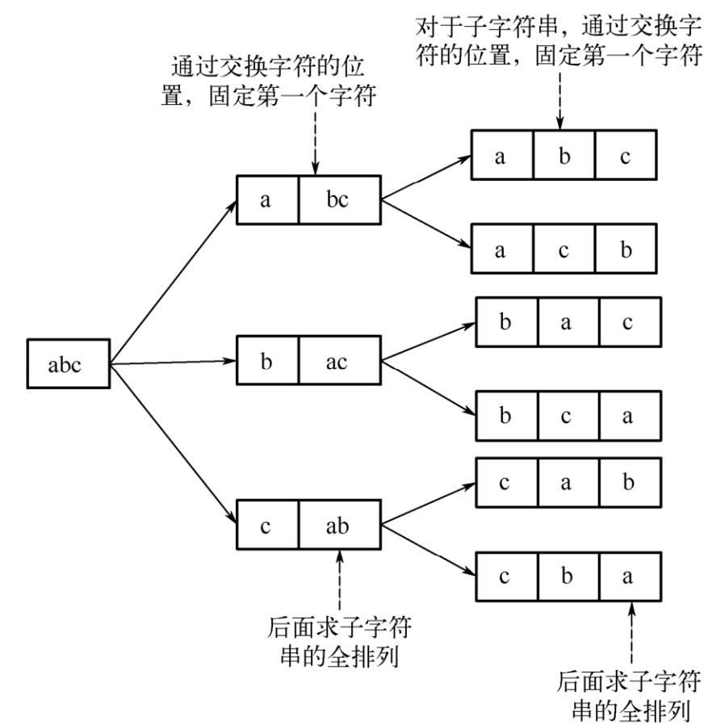
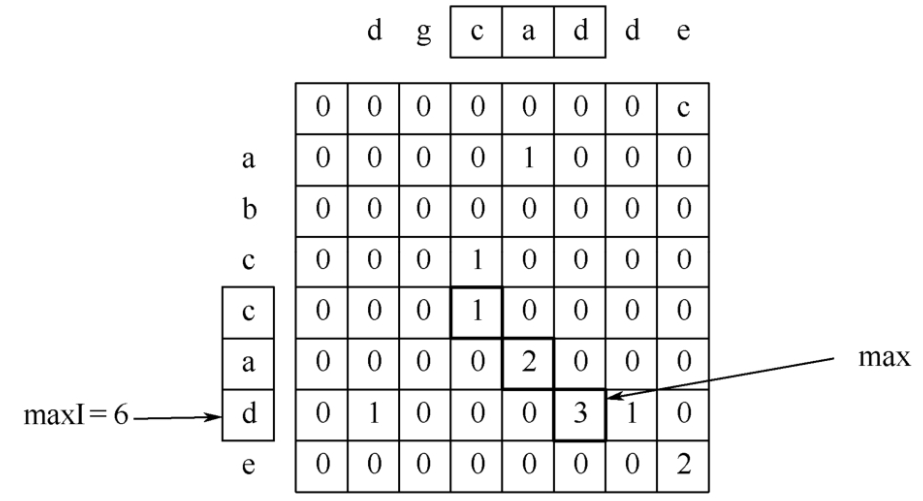
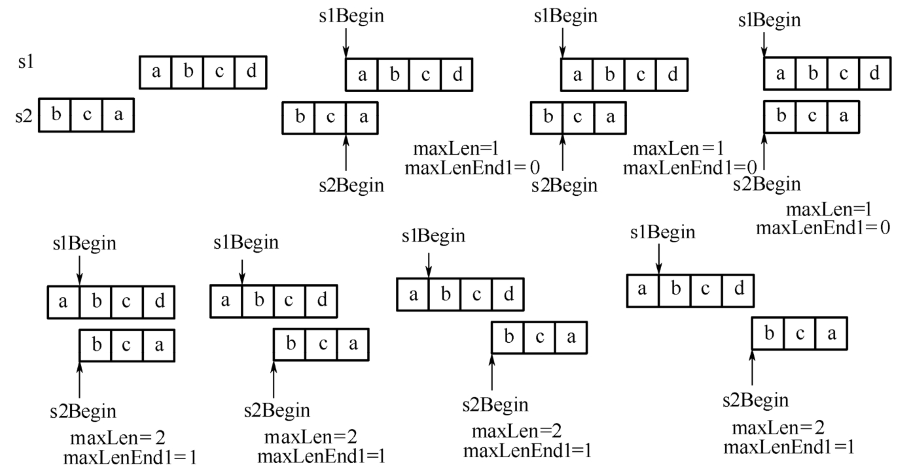
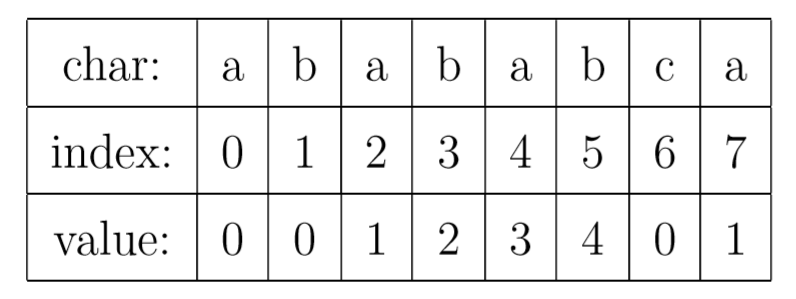
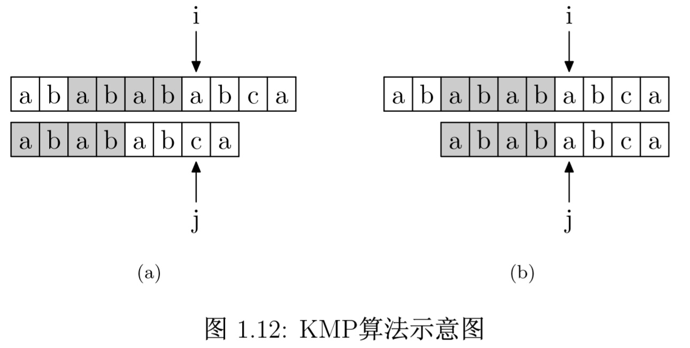

## 字符串

字符串是由数字、字母、下划线组成的一串字符。

- [字符串](#字符串)
- [求一个字符串的所有排列](#求一个字符串的所有排列)
	- [递归法全排列](#递归法全排列)
- [求两个字符串的最长公共子串](#求两个字符串的最长公共子串)
	- [动态规划法](#动态规划法)
	- [滑动比较法](#滑动比较法)
- [对字符串进行反转](#对字符串进行反转)
	- [临时变量交换](#临时变量交换)
	- [异或法](#异或法)
- [实现单词反转](#实现单词反转)
- [判断两个字符串是否为换位字符串](#判断两个字符串是否为换位字符串)
- [判断两个字符串的包含关系](#判断两个字符串的包含关系)
- [对由大小写字母组成的字符数组排序](#对由大小写字母组成的字符数组排序)
- [消除字符串的内嵌括号](#消除字符串的内嵌括号)
- [判断字符串是否是整数](#判断字符串是否是整数)
- [实现字符串的匹配](#实现字符串的匹配)
	- [循环遍历法](#循环遍历法)
	- [KMP 算法](#kmp-算法)
		- [实现计算 PMT 数组：](#实现计算-pmt-数组)
		- [实现计算 NEXT 数组：](#实现计算-next-数组)
- [求字符串里的最长回文子串](#求字符串里的最长回文子串)
	- [动态规划法](#动态规划法-1)
	- [转换为求最长公共子串](#转换为求最长公共子串)
	- [中心扩展法](#中心扩展法)
	- [Manacher 算法](#manacher-算法)
- [按照给定的字母序列对字符数组排序](#按照给定的字母序列对字符数组排序)
- [判断一个字符串是否包含重复字符](#判断一个字符串是否包含重复字符)
- [找到由其他单词组成的最长单词](#找到由其他单词组成的最长单词)
- [统计字符串中连续重复字符的个数](#统计字符串中连续重复字符的个数)
- [求最长递增子序列的长度](#求最长递增子序列的长度)
- [求一个串中出现的第一个最长重复子串](#求一个串中出现的第一个最长重复子串)
- [求解字符串中字典序最大的子序列](#求解字符串中字典序最大的子序列)
- [求字符串的编辑距离](#求字符串的编辑距离)
- [在二维数组中寻找最短路线](#在二维数组中寻找最短路线)
- [截取包含中文的字符串](#截取包含中文的字符串)
- [求相对路径](#求相对路径)
- [查找到达目标词的最短链长度](#查找到达目标词的最短链长度)
- [查找到达目标词的最短链长度](#查找到达目标词的最短链长度-1)
- [查找到达目标词的最短链长度](#查找到达目标词的最短链长度-2)

## 求一个字符串的所有排列

实现一个方法，当输入一个字符串时，要求输出这个字符串的所有排列组合。例如输入字符串 abc，要求输出由字符 a、b、c 所能排列出来的所有字符串：abc， acb， bac， bca， cab， cba。

### 递归法全排列

1. 首先固定第一个字符 a，然后对后面的两个字符 b 与 c 进行全排列。
2. 交换第一个字符与其后面的字符，即交换 a 与 b，然后固定第一个字符 b，接着对后面的两个字符 a 与 c 进行全排列。
3. 由于第 2 步交换了 a 和 b 破坏了字符串原来的顺序，因此，需要再次交换 a 和 b 使其恢复到原来的顺序，然后交换第一个字符与第三个字符（交换 a 和 c），接着固定第一个字符 c，对后面的两个字符 a 与 b 进行全排列。



> 源码位置 *src/algorithm/structures/string/find_permutation.go*

```go
// 保存结果列表
var result []string

func Permutation(s []rune, start int) {
	if s == nil {
		return
	}

	if start == len(s)-1 {
		result = append(result, string(s))
	} else {
		for i := start; i < len(s); i++ {
			s[start], s[i] = s[i], s[start]
			Permutation(s, start+1)
			s[start], s[i] = s[i], s[start]
		}
	}
}
```

## 求两个字符串的最长公共子串

找出两个字符串的最长公共子串，例如字符串 “abccade” 与字符串 “dgcadde” 的最长公共子串为 “cad”。

> 源码位置 *src/algorithm/structures/string/find_longest_common_substring.go*

### 动态规划法



```go
func FindLongestCommonSubstring(s1, s2 []rune) []rune {
	l1, l2 := len(s1), len(s2)
	var end, length int // 记录公共字符串结束位置和长度

	// 申请新的空间来记录公共字串长度信息
	matrix := array.InitMatrix(l1+1, l2+1)

	for i := 0; i < len(s1); i++ {
		for j := 0; j < len(s2); j++ {
			if s1[i] == s2[j] {
				matrix[i+1][j+1] = matrix[i][j] + 1
				if matrix[i+1][j+1] > length {
					length = matrix[i+1][j+1]
					end = i + 1 // 因为是开区间
				}
			}
		}
	}

	array.PrintMatrix(matrix)
	return s1[end-length : end]
}

func ExampleFindLongestCommonSubstring() {
	substring := FindLongestCommonSubstring([]rune("abccade"), []rune("dgcadde"))
	fmt.Println(string(substring))

	// Output:
	// 0, 0, 0, 0, 0, 0, 0, 0
	// 0, 0, 0, 0, 1, 0, 0, 0
	// 0, 0, 0, 0, 0, 0, 0, 0
	// 0, 0, 0, 1, 0, 0, 0, 0
	// 0, 0, 0, 1, 0, 0, 0, 0
	// 0, 0, 0, 0, 2, 0, 0, 0
	// 0, 1, 0, 0, 0, 3, 1, 0
	// 0, 0, 0, 0, 0, 0, 0, 2
	//
	// cad
}
```

由于这种方法使用了二重循环分别遍历两个字符数组，因此，时间复杂度为 `O(m*n)` （其中，m 和 n 分别为两个字符串的长度），此外，由于这种方法申请了一个 `m*n` 的二维数组，因此，算法的空间复杂度也为 `O(m*n)`。

### 滑动比较法



保持 s1 的位置不变，然后移动 s2，接着比较它们重叠的字符串的公共子串（记录最大的公共子串的长度 maxLen，以及最长公共子串在 s1 中结束的位置 maxLenEnd1 ），在移动的过程中，如果当前重叠子串的长度大于 maxLen，则更新 maxLen 为当前重叠子串的长度。最后通过 maxLen 和 maxLenEnd1 就可以找出它们最长的公共子串。

```go
func LongestSubString(s1, s2 []rune) (sub []rune) {
	p, q := 0, 0 // 记录最长子序列的开始和结束
	for k := 0; k < len(s2); k++ {
		i, j, x, y := 0, 0, 0, k         // 记录子序列的开始和结束
		for x < len(s1) && y < len(s2) { // 字符序列当前下标
			if s1[x] != s2[y] {
				if i != j { // 说明之前有过相同元素
					y = k // 必须重置起始位置
				} else {
					x++
				}
				i, j = x, x
			} else {
				j, x, y = j+1, x+1, y+1
			}
			// 判断当前子序列是否更长
			if j-i > q-p {
				q, p = j, i
			}
		}
	}
	return s1[p:q]
}
```

## 对字符串进行反转

> 源码位置 *src/algorithm/structures/string/reverse_string.go*

### 临时变量交换

```go
func ReverseString(s string) string {
	rs := []rune(s)

	for i, j := 0, len(rs)-1; i < j; i, j = i+1, j-1 {
		rs[i], rs[j] = rs[j], rs[i]
	}

	return string(rs)
}
```

### 异或法

```go
func ReverseStringXOR(s string) string {
	rs := []rune(s)

	for i, j := 0, len(rs)-1; i < j; i, j = i+1, j-1 {
		rs[i] ^= rs[j] // i ^ j
		rs[j] ^= rs[i] // i ^ j ^ j = i
		rs[i] ^= rs[j] // i ^ j ^ i = j
	}

	return string(rs)
}
```

这种方法主要基于如下的特性：a^a=0、a^0=a 以及异或操作满足交换律与结合律。

这种方法只需要对字符数组遍历一次，因此，时间复杂度为O(n)（n为字符串的长度），与方法一相比，这种方法在实现字符交换的时候不需要额外的变量。

## 实现单词反转

对字符串进行两次反转操作，第一次对整个字符串中的字符进行反转，通过这一次的反转已经实现了单词顺序的反转，只不过每个单词中字符的顺序反了，接下来只需要对每个单词进行字符反转即可得到想要的结果。

> 源码位置 *src/algorithm/structures/string/reverse_words.go*

```go
// ReverseStringXORInPlace 字符串原地逆序
func ReverseStringXORInPlace(rs []rune) {
	for i, j := 0, len(rs)-1; i < j; i, j = i+1, j-1 {
		rs[i] ^= rs[j] // i ^ j
		rs[j] ^= rs[i] // i ^ j ^ j = i
		rs[i] ^= rs[j] // i ^ j ^ i = j
	}
}

func ReverseWords(words string) string {
	rs := []rune(words)

	ReverseStringXORInPlace(rs)

	begin := 0
	for i := range rs {
		if rs[i] == ' ' {
			ReverseStringXORInPlace(rs[begin:i])
			begin = i + 1
		}
	}

	ReverseStringXORInPlace(rs[begin:])

	return string(rs)
}
```

## 判断两个字符串是否为换位字符串

换位字符串是指组成字符串的字符相同，但位置不同。

例如，字符串“aaaabbc”与字符串“abcbaaa”就是由相同的字符所组成的，因此，它们是换位字符。

> 源码位置 *src/algorithm/structures/string/compare_string.go*

```go
// Compare 判断组成字符串的字符是否相同
func Compare(s1, s2 string) bool {
	if len(s1) != len(s2) {
		return false
	}
	dict := make(map[uint8]int)
	for i := range s1 {
		dict[s1[i]] += 1
		dict[s2[i]] -= 1
	}
	for i := range dict {
		if dict[i] != 0 {
			return false
		}
	}
	return true
}
```

## 判断两个字符串的包含关系

给定由字母组成的字符串 s1 和 s2，其中，s2 中字母的个数少于 s1，如何判断 s1 是否包含 s2 ？即出现在 s2 中的字符在 s1 中都存在。

方法与上一题相同，简单修改即可。

```go
// Contain 判断两个字符串的包含关系
func Contain(s1, s2 string) bool {
	if len(s1) < len(s2) {
		return false
	}
	dict := make(map[uint8]int)
	for i := range s1 {
		dict[s1[i]] += 1
		dict[s2[i]] -= 1
	}
	for i := range dict {
		if dict[i] < 0 {
			return false
		}
	}
	return true
}
```

## 对由大小写字母组成的字符数组排序

有一个由大小写字母组成的字符串，请对它进行重新组合，使得其中的所有小写字母排在大写字母的前面（大写或小写字母之间不要求保持原来次序）。

类似快速排序的分割方法。可以用两个索引分别指向字符串的首和尾，首索引正向遍历字符串，找到第一个大写字母，尾索引逆向遍历字符串，找到第一个小写字母，交换两个索引位置的字符，然后两个索引沿着相应的方向继续向前移动，重复上述步骤，直到首索引大于或等于尾索引为止。

```go
func sortLetters(s []byte) []byte {
	front, rear := 0, len(s)-1
	for front < rear {
		for s[front] >= 'a' { // A 65 / a 97
			front++
		}
		for s[rear] < 'a' {
			rear--
		}
		if front < rear {
			s[front], s[rear] = s[rear], s[front]
		}
	}
	return s
}
```

## 消除字符串的内嵌括号

给定一个如下格式的字符串：`(1, (2, 3), (4, (5, 6), 7))`，括号内的元素可以是数字，也可以是另一个括号，实现一个算法消除嵌套的括号，例如把上面的表达式变成 (1, 2, 3, 4, 5, 6, 7)，如果表达式有误，则报错。

从问题描述可以看出，这道题要求实现两个功能：一是判断表达式是否正确，二是消除表达式中嵌套的括号。

对于判定表达式是否正确这个问题，可以从如下几个方面来入手：首先，表达式中只有数字、逗号和括号这几种字符，如果有其他的字符出现，则是非法表达式。其次，判断括号是否匹配，如果碰到‘(’，则把括号的计数器的值加上1；如果碰到‘)’，那么判断此时计数器的值，如果计数器的值大于1，则把计数器的值减去1，否则为非法表达式，当遍历完表达式后，括号计数器的值为0，则说明括号是配对出现的，否则括号不配对，表达式为非法表达式。

对于消除括号这个问题，可以通过申请一个额外的存储空间，在遍历原字符串的时候把除了括号以外的字符保存到新申请的额外的存储空间中，这样就可以去掉嵌套的括号了。需要特别注意的是，字符串首尾的括号还需要保存。

```go
func RemoveNestedParentheses(s string) string {
	rs := []rune(s)

	if rs[0] != '(' || rs[len(rs)-1] != ')' {
		panic("invalid format")
	}

	var buf bytes.Buffer
	brackets := 0
	for i := range rs {
		if rs[i] == '(' {
			brackets++
		} else if rs[i] == ')' {
			brackets--
		} else {
			buf.WriteRune(rs[i])
		}
	}

	if brackets != 0 {
		panic("invalid format")
	}

	buf.WriteRune(')')

	return buf.String()
}
```

这种方法对字符串进行了一次遍历，因此，时间复杂度为 O(n)（其中，n 为字符串的长度），此外，这种方法申请了额外的 n+1 个存储空间，因此，空间复杂度也为 O(n)。

## 判断字符串是否是整数

写一个方法，检查字符串是否是整数，如果是，返回其整数值。

整数分为负数与非负数，负数只有一种表示方法，而整数可以有两种表示方法。例如：-123，123，+123。因此，在判断字符串是否为整数的时候，需要把这几种问题都考虑到。

首先通过第一个字符的值确定整数的正负性，然后去掉符号位，把后面的字符串当作正数来处理，处理完成后再根据正负性返回正确的结果。实现方法为从左到右遍历字符串计算整数的值，以“123”为例，遍历到‘1’的时候结果为 1，遍历到‘2’的时候结果为`1*10+2=12`，遍历到‘3’的时候结果为 `12*10+3=123`。

```go
func ConvertToInteger(s string) (int, bool) {
	if s == "" {
		return 0, false
	}

	// 正负符号
	neg := 1
	pos := 0
	rs := []rune(s)

	switch rs[pos] {
	case '+':
		pos++
	case '-':
		pos++
		neg = -1
	}

	n := 0
	for ; pos < len(rs); pos++ {
		if rs[pos] < '0' || rs[pos] > '9' {
			return 0, false
		}
		n = n*10 + int(rs[pos]-'0')
	}

	return neg * n, true
}

func ExampleConvertToInteger() {
	fmt.Println(ConvertToInteger("-345"))
	fmt.Println(ConvertToInteger("345"))
	fmt.Println(ConvertToInteger("+345"))
	fmt.Println(ConvertToInteger("++345"))

	// Output:
	// -345 true
	// 345 true
	// 345 true
	// 0 false
}
```

由于这种方法只对字符串进行了一次遍历，因此，算法的时间复杂度为 O(n)（其中，n 是指字符串的长度）。

## 实现字符串的匹配

给定主字符串 s 与模式字符串 p，判断 p 是否是 s 的子串，如果是，则找出 p 在 s 中第一次出现的下标。

对于字符串的匹配，最直接的方法就是挨个比较字符串中的字符，这种方法比较容易实现，但是效率也比较低下。对于这种字符串匹配的问题，除了最常见的直接比较法外，经典的 KMP 算法也是不二选择，它能够显著提高运行效率，下面分别介绍这两种方法。

### 循环遍历法

```go
func IsSubString(s, sub string) (start int, ret bool) {
	if len(s) < len(sub) {
		return -1, false
	}
	i, j := 0, 0
	for i < len(s) && j < len(sub) {
		for i < len(s) && s[i] != sub[j] {
			i++
		}
		if i == len(s) {
			return -1, false
		}
		start = i
		for i < len(s) && j < len(sub) && s[i] == sub[j] {
			i, j = i+1, j+1
		}
		if j == len(sub) {
			break
		}
		if i == len(s) {
			return -1, false
		}
		i, j = start+1, 0
	}
	return start, true
}
```

这种方法在最差的情况下需要对模式串 p 遍历 m-n 次（m，n 分别为主串和模式串的长度），因此，算法的时间复杂度为 O(n(m-n))。

### KMP 算法

前一种方法一旦字符串不匹配，模式串需要回退到 0，主串需要回退到 i-j+1 的位置重新开始下一次比较。

而在 KMP 算法中，如果不匹配，不需要回退，即 i 保持不动，j 也不用清零，而是向右滑动模式串，继续匹配。

KMP 算法的核心，是一个被称为部分匹配表 Partial Match Table 的数组。

对于字符串“abababca”，它的 PMT 如下表所示：



如果字符串 A 和 B，存在 A=BS，其中 S 是任意的**非空**字符串，那就称 B 为 A 的前缀。例如，”Harry”的前缀包括 {”H”, ”Ha”, ”Har”, ”Harr”}，我们把所有前缀组成的集合，称为字符串的前缀集合。同样可以定义后缀 A=SB， 其中 S 是任意的**非空**字符串，那就称 B 为 A 的后缀，例如，”Potter”的后缀包括{”otter”, ”tter”, ”ter”, ”er”, ”r”}，然后把所有后缀组成的集合，称为字符串的后缀集合。

PMT 中的值是字符串的**前缀集合与后缀集合的交集**中最长元素的长度。



将 PMT 数组向后偏移一位，新得到的这个数组称为 next 数组。


#### 实现计算 PMT 数组：

```go
func Pmt(s string) []int {
	pmt := make([]int, len(s))
	pmt[0] = 0
	for i, j := 1, 0; i < len(s); {
		if s[i] == s[j] {
			pmt[i] = pmt[i-1] + 1
			i, j = i+1, j+1
		} else if j == 0 {
			i++
		} else {
			// 从两边扫描对称值
			x, y := 0, i
			for s[x] == s[y] {
				x, y = x+1, y-1
			}
			pmt[i] = x
			i, j = i+1, x
		}
	}
	return pmt
}
```

#### 实现计算 NEXT 数组：

```go
func Next(s string) []int {
	next := make([]int, len(s)+1)
	next[0]=-1
	for i, j := 0, -1; i < len(s); {
		if j == -1 || s[i] == s[j] {
			i, j = i+1, j+1
			next[i] = j
		} else {
			j = next[j]
		}
	}
	return next
}
```

PMT 和 NEXT 都是求的都是子字符串的。

```go
func IsSubStringKMP(s, sub string) (start int, ret bool) {
	if len(s) < len(sub) {
		return -1, false
	}
	next := Next(sub)
	i, j := 0, 0
	for i < len(s) && j < len(sub) {
		if j == -1 || s[i] == sub[j] {
			j++
		} else {
			j = next[j]
		}
		i++
	}
	if j == len(sub) {
		return i - len(sub), true
	}
	return -1, false
}
```

这种方法在求 next 数组的时候循环执行的次数为 n(n 为模式串的长度 )，在模式串与主串匹配的过程中循环执行的次数为 m（m 为主串的长度）。因此，算法的时间复杂度为 O(m+n)。但是由于算法申请了额外的 n 个存储空间来存储 next 数组，因此，算法的空间复杂度为 O(n)。

## 求字符串里的最长回文子串

回文字符串是指一个字符串从左到右与从右到左遍历得到的序列是相同的。例如“abcba”就是回文字符串，而“abcab”则不是回文字符串。

最容易想到的方法为遍历字符串所有可能的子串（蛮力法），判断其是否为回文字符串，然后找出最长的回文子串。但是当字符串很长的时候，这种方法的效率是非常低下的，因此，这种方法不可取。

### 动态规划法

在采用蛮力法找回文子串的时候其实有很多字符的比较是重复的，因此，可以把前面比较的中间结果记录下来供后面使用。

```go
type Palindrome struct {
	begin, length int
}

func (p *Palindrome) getLongestPalindrome(s string) string {
	if s == "" {
		return ""
	}

	ll := len(s)
	p.begin = 0
	p.length = 1

	// 申请额外的存储空间记录查找的历史信息
	history := array.InitMatrix(ll, ll)

	// 初始化长度为1的回文字符串信息
	for i := 0; i < ll; i++ {
		history[i][i] = 1
	}

	// 初始化长度为2的回文字符串信息
	for i := 0; i < ll-1; i++ {
		if s[i] == s[i+1] {
			history[i][i+1] = 1
			p.begin = i
			p.length = 2
		}
	}

	// 查找从长度为3开始的回文字符串
	for pl := 3; pl <= ll; pl++ {
		for i := 0; i < ll-pl; i++ {
			j := i + pl - 1
			if s[i] == s[j] && history[i+1][j-1] == 1 {
				history[i][j] = 1
				p.begin = i
				p.length = pl
			}
		}
	}

	// array.PrintMatrix(history)

	return s[p.begin : p.begin+p.length]
}

func ExampleGetLongestPalindrome() {
	p := Palindrome{}
	fmt.Println(p.getLongestPalindrome("abcdefgfedxyz"))

	// Output:
	// defgfed
}
```

这种方法的时间复杂度为 O(n^2)，空间复杂度也为 O(n^2)。

### 转换为求最长公共子串

此外，还有另外一种动态规划的方法来实现最长回文字符串的查找。主要思路为：对于给定的字符串 str1，求出对其进行逆序的字符串 str2，然后 str1 与 str2 的最长公共子串就是 str1 的最长回文子串。

如果能理解求最长公共子串，那么这种方法比较容易理解。

### 中心扩展法

从字符串最中间的字符开始向两边扩展，通过比较左右两边字符是否相等就可以确定这个字符串是否为回文字符串。这种方法对于字符串长度为奇数和偶数的情况需要分别对待。

例如：对于字符串“aba”，就可以从最中间的位置 b 开始向两边扩展；但是对于字符串“baab”，就需要从中间的两个字母开始分别向左右两边扩展。

```go
// 对字符串str，以c1和c2为中心向两侧扩展寻找回文子串
func (p *Palindrome) expandBothSide(s string, c1, c2 int) {
	ll := len(s)

	for c1 >= 0 && c2 < ll && s[c1] == s[c2] {
		c1--
		c2++
	}

	beginTemp := c1 + 1
	lengthTemp := c2 - beginTemp
	if lengthTemp > p.length {
		p.length = lengthTemp
		p.begin = beginTemp
	}
}

// 找出字符串最长的回文子串
func (p *Palindrome) getLongestPalindromeExpand(s string) string {
	if s == "" {
		return ""
	}

	for i := range s {
		// 找回文字符串长度为奇数的情况（从第i个字符向两边扩展）
		p.expandBothSide(s, i, i)
		// 找回文字符串长度为偶数的情况（从第ⅰ和计1两个字符字符向两边扩展）
		p.expandBothSide(s, i, i+1)
	}

	return s[p.begin : p.begin+p.length]
}
```

这种方法的时间复杂度为O(n^2)，空间复杂度为O(1)。

### Manacher 算法

方法二需要根据字符串的长度分偶数与奇数两种不同情况单独处理，Manacher 算法可以通过向相邻字符中插入一个分隔符，把回文字符串的长度都变为奇数，从而可以对这两种情况统一处理。

例如：对字符串“aba”插入分隔符后变为`*a*b*a*`，回文字符串的长度还是奇数。对字符串 `aa` 插入分隔符后变为`*a*a*`，回文字符串长度也是奇数。

因此，采用这种方法后可以对这两种情况统一进行处理。

Manacher 算法的主要思路为：首先在字符串中相邻的字符中插入分割字符，字符串的首尾也插入分割字符（字符串中不存在的字符，本例以字符`*`为例作为分割字符）。接着用另外的一个辅助数组 P 来记录以每个字符为中心对应的回文字符串的信息。`P[i]` 记录了以字符串第 i 个字符为中心的回文字符串的半径（包含这个字符），以 `P[i] `为中心的回文字符串的长度为 `2*P[i]-1`。`P[i]-1` 就是这个回文字符串在原来字符串中的长度。

例如：`*a*b*a*` 对应的辅助数组 P 为：`{1, 2, 1, 4, 1, 2, 1}`，最大值为 `P[3]=4`，那么原回文字符串的长度则为 `4-1=3`。

## 按照给定的字母序列对字符数组排序

已知字母序列 `[d, g, e, c, f, b, o, a]`，请实现一个方法，要求对输入的一组字符串 `input[]={"bed", "dog", "dear", "eye"}`，按照字母顺序排序并打印。本例的输出顺序为：`dear, dog, eye, bed`。

这道题本质上还是考查对字符串排序的理解，唯一不同的是，改变了比较字符串大小的规则，因此，这道题的关键是如何利用给定的规则比较两个字符串的大小，只要实现了两个字符串的比较，那么利用任何一种排序方法都可以。

```go
type AlphabetComparer struct {
	m map[byte]int
}

func NewAlphabetComparer(sequence []byte) *AlphabetComparer {
	m := make(map[byte]int, len(sequence))
	for i, j := range sequence {
		m[j] = i
	}
	return &AlphabetComparer{m: m}
}

// MoreThan 字符串比较算法
func (c *AlphabetComparer) MoreThan(left, right string) bool {
	leftLength := len(left)
	rightLength := len(right)

	for i := 0; i < leftLength && i < rightLength; i++ {
		difference := c.m[left[i]] - c.m[right[i]]
		if difference != 0 {
			return difference > 0
		}
	}

	return false
}

// SortStringSequences 用插入排序方式
func (c *AlphabetComparer) SortStringSequences(sequence []string) []string {
	var i, j int
	var ll = len(sequence)

	for i = 1; i < ll; i++ {
		v := sequence[i]
		for j = i - 1; j >= 0; j-- {
			if c.MoreThan(sequence[j], v) {
				sequence[j+1] = sequence[j]
			} else {
				break
			}
		}
		sequence[j+1] = v
	}

	return sequence
}
```

```go
func ExampleAlphabetComparer() {
	var alphabetSequence = []byte{'d', 'g', 'e', 'c', 'f', 'b', 'o', 'a'}
	c := NewAlphabetComparer(alphabetSequence)
	fmt.Println(c.MoreThan("dog", "eye"))

	// Output:
	// false
}

func ExampleSortStringSequences() {
	var alphabetSequence = []byte{'d', 'g', 'e', 'c', 'f', 'b', 'o', 'a'}
	c := NewAlphabetComparer(alphabetSequence)
	fmt.Println(c.SortStringSequences([]string{"bed", "dog", "dear", "eye"}))

	// Output:
	// [dear dog eye bed]
}
```

这种方法的时间复杂度为 O(n^3)（其中n为字符串的长度）。因为排序函数中使用了双重遍历，而这个函数中调用了比较函数，这个函数内部也有一层循环。

## 判断一个字符串是否包含重复字符

与数组是否包含重复元素类似。

特别的，由于常见的字符只有 256 个，可以假设这道题涉及的字符串中不同的字符个数最多为 256 个，那么可以申请一个大小为 256 的 int 类型数组来记录每个字符出现的次数，初始化都为 0，把这个字符的编码作为数组的下标，在遍历字符数组的时候，如果这个字符出现的次数为 0，那么把它置为 1，如果为 1，那么说明这个字符在前面已经出现过了，因此，字符串包含重复的字符。

采用这种方法只需要对字符数组进行一次遍历即可，因此，时间复杂度为 O(n)，但是需要额外申请 256 个单位的空间。

由于申请的数组用来记录一个字符是否出现，只需要 1bit 也能实现这个功能，因此，作为更好的一种方案，可以只申请大小为 8 的 int 类型的数组，由于每个 int 类型占 32bit，所以，大小为 8 的数组总共为 256bit，用 1bit 来表示一个字符是否已经出现过可以达到同样的目的。

由于这种方法对字符串进行了一次遍历，因此，算法的时间复杂度为 O(n)（其中，n 是指字符串的长度），此外，这种方法申请了 8 个额外的存储空间。

## 找到由其他单词组成的最长单词

给定一个字符串数组，找出数组中最长的字符串，使其能由数组中其他的字符串组成。

例如给定字符串数组 {"test", "tester", "testertest", "testing", "apple", "seattle", "banana", "batting", "ngcat", "batti", "bat", "testingtester", "testbattingcat"}。满足题目要求的字符串为 “testbattingcat”，因为这个字符串可以由数组中的字符串 “test", "batti” 和 “ngcat” 组成。

既然题目要求找最长的字符串，那么可以采用贪心的方法，首先对字符串按长度由大到小进行排序，从最长的字符串开始查找，如果能由其他字符串组成，就是满足题目要求的字符串。

接下来就需要考虑如何判断一个字符串能否由数组中其他的字符串组成，主要的思路为：找出字符串的所有可能的前缀，判断这个前缀是否在字符数组中，如果在，那么用相同的方法递归地判断除去前缀后的子串是否能由数组中其他的子串组成。

```go

```

```go

```

## 统计字符串中连续重复字符的个数

```go

```

## 求最长递增子序列的长度

```go

```

## 求一个串中出现的第一个最长重复子串

```go

```

## 求解字符串中字典序最大的子序列

```go

```

## 求字符串的编辑距离

```go

```

## 在二维数组中寻找最短路线

```go

```

## 截取包含中文的字符串

```go

```

## 求相对路径

```go

```

## 查找到达目标词的最短链长度

```go

```

## 查找到达目标词的最短链长度

```go

```

## 查找到达目标词的最短链长度

```go

```

```go

```

```go

```

