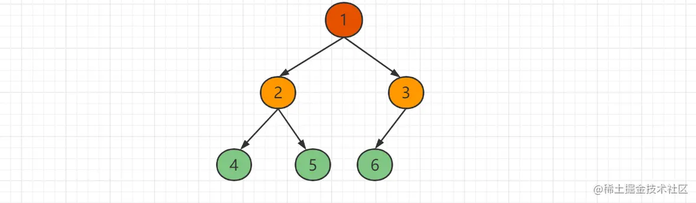

- [概述](#概述)
	- [基本概念](#基本概念)
		- [结点的度](#结点的度)
		- [叶子结点](#叶子结点)
		- [分支结点](#分支结点)
		- [左孩子、右孩子、双亲](#左孩子右孩子双亲)
		- [路径、路径长度](#路径路径长度)
		- [祖先、子孙](#祖先子孙)
		- [结点的层数](#结点的层数)
		- [树的深度](#树的深度)
		- [树的度](#树的度)
		- [满二叉树](#满二叉树)
		- [完全二叉树](#完全二叉树)
	- [基本性质](#基本性质)
- [数据结构](#数据结构)
- [节点遍历](#节点遍历)
	- [前序遍历](#前序遍历)
	- [中序遍历](#中序遍历)
	- [后序遍历](#后序遍历)
	- [层序遍历](#层序遍历)
		- [队列法](#队列法)
		- [递归法](#递归法)
- [把一个有序整数数组放到二叉树中](#把一个有序整数数组放到二叉树中)
- [求一棵二叉树的最大子树和](#求一棵二叉树的最大子树和)
	- [后序遍历法](#后序遍历法)
- [在二叉树中找出路径最大的和](#在二叉树中找出路径最大的和)
	- [后序遍历法](#后序遍历法-1)
- [判断两棵二叉树是否相等](#判断两棵二叉树是否相等)
- [把二叉树转换为双向链表](#把二叉树转换为双向链表)
- [判断一个数组是否是二元查找树后序遍历的序列](#判断一个数组是否是二元查找树后序遍历的序列)
	- [未指定是某棵二元查找树](#未指定是某棵二元查找树)
	- [指定是某棵二元查找树](#指定是某棵二元查找树)
- [找出排序二叉树上任意两个结点的最近共同父结点](#找出排序二叉树上任意两个结点的最近共同父结点)
	- [路径对比法](#路径对比法)
	- [结点编号法](#结点编号法)
	- [后序遍历法](#后序遍历法-2)
- [复制二叉树](#复制二叉树)
- [在二叉树中找出与输入整数相等的所有路径](#在二叉树中找出与输入整数相等的所有路径)
- [对二叉树进行镜像反转](#对二叉树进行镜像反转)
- [在二叉排序树中找出第一个大于中间值的结点](#在二叉排序树中找出第一个大于中间值的结点)
- [实现反向 DNS 查找缓存](#实现反向-dns-查找缓存)
	- [哈希表](#哈希表)
	- [Trie 树](#trie-树)
		- [简介](#简介)
		- [基本性质](#基本性质-1)
		- [适用场景](#适用场景)
		- [与哈希查询比较](#与哈希查询比较)
		- [定义数据结构](#定义数据结构)
		- [实现插入与查找](#实现插入与查找)
- [对有大量重复的数字的数组排序](#对有大量重复的数字的数组排序)
	- [AVL 树简介](#avl-树简介)
	- [结构定义](#结构定义)
	- [旋转](#旋转)
		- [右旋](#右旋)
		- [左旋](#左旋)
	- [需要平衡的四种情况](#需要平衡的四种情况)
		- [LL 型](#ll-型)
		- [RR 型](#rr-型)
		- [LR 型](#lr-型)
		- [RL 型](#rl-型)

## 概述

二叉树（Binary Tree）也称为二分树、二元树、对分树等，它是 n(n≥0) 个有限元素的集合，该集合或者为空或者由一个称为**根 (root) 的元素**及**两个不相交的、被分别称为左子树和右子树的二叉树**组成。**当集合为空时，称该二叉树为空二叉树**。在二叉树中，**一个元素也称为一个结点**。


二叉树的**递归定义**为：二叉树或者是一棵空树，或者是一棵由一个根结点和两棵互不相交的分别称为根结点的左子树和右子树所组成的非空树，左子树和右子树又同样都是一棵二叉树。

### 基本概念

#### 结点的度

结点所拥有的**子树的个数**称为该结点的度。二叉树节点的度为 0~2。

#### 叶子结点

**度为 0 的结点**称为叶子结点，或者称为终端结点。

#### 分支结点

**度不为 0 的结点**称为分支结点，或者称为非终端结点。

一棵树的结点除叶子结点外，其余的都是分支结点。

#### 左孩子、右孩子、双亲

树中**一个结点的子树的根结点**称为这个结点的孩子。这个结点称为它孩子结点的双亲。具有同一个双亲的孩子结点互称为兄弟。


#### 路径、路径长度

如果一棵树的一串结点 `n1，n2，…，nk` 有如下关系：结点 `ni` 是 `n(i+1)` 的父结点（`1≤i<k`），就把 `n1，n2，…，nk` 称为一条由 `n1～nk` 的路径。这条路径的长度是 `k-1`。

路径一定是从上到下的。

#### 祖先、子孙

在树中，如果有一条路径从结点 M 到结点 N，那么 M 就称为 N 的祖先，而 N 称为 M 的子孙。

#### 结点的层数

规定树的根结点的层数为 1，其余结点的层数等于它的双亲结点的层数加 1。

#### 树的深度

树中**所有结点的最大层数**称为树的深度。

#### 树的度

**树中各结点度的最大值**称为该树的度，叶子结点的度为 0。

#### 满二叉树

在一棵二叉树中，如果所有分支结点都存在左子树和右子树，并且所有叶子结点都在同一层上，这样的一棵二叉树称为满二叉树。


#### 完全二叉树

一棵深度为 k 的有 n 个结点的二叉树，对树中的结点按从上至下、从左到右的顺序进行编号，如果编号为 `i（1≤i≤n）`的结点与满二叉树中编号为 `i` 的结点在二叉树中的位置相同，则这棵二叉树称为完全二叉树。完全二叉树的特点是：叶子结点只能出现在最下层和次下层，且最下层的叶子结点集中在树的左部，**度为 1 的结点只有 1 个或 0 个**。**满二叉树肯定是完全二叉树**，而**完全二叉树不一定是满二叉树**。



### 基本性质

1. 一棵非空二叉树的第 i 层上最多有 `2^(i-1)` 个结点（i≥1）。
2. 一棵深度为 k 的二叉树中，最多具有 `2^k-1` 个结点，最少有 k 个结点。
3. 对于一棵非空的二叉树，**度为 0 的结点（即叶子结点）总是比度为 2 的结点多一个**，即如果叶子结点数为 n0，度数为 2 的结点数为 n2，则有 `n0=n2+1`。
4. 具有 n 个结点的完全二叉树的深度为`「log2 n」+1`。
5. 对于具有 n 个结点的完全二叉树，如果按照从上至下和从左到右的顺序对二叉树中的所有结点从 1 开始顺序编号，则对于任意的序号为 i 的结点，有：
   - 如果 `i>1`，则序号为 i 的结点的双亲结点的序号为 `i/2`（其中“/”表示整除）；如果 `i=1`，则序号为 i 的结点是根结点，无双亲结点。
   - 如果 `2i≤n`，则序号为 i 的结点的左孩子结点的序号为 `2i`；如果 `2i>n`，则序号为i的结点无左孩子。
   - 如果 `2i+1≤n`，则序号为i的结点的右孩子结点的序号为 `2i+1`；如果 `2i+1>n`，则序号为 i 的结点无右孩子。

此外，若对二叉树的根结点从 0 开始编号，则相应的 i 号结点的双亲结点的编号为 `(i-1)/2`，左孩子的编号为 `2i+1`，右孩子的编号为 `2i+2`。

**二叉树有顺序存储和链式存储两种存储结构**，以下都以链式存储结构作为示例。

## 数据结构


```go
// BNode 二叉树定义
type BNode struct {
	Data       int
	LeftChild  *BNode
	RightChild *BNode
}
```

## 节点遍历


### 前序遍历

到一个节点后，输出该节点的值，并继续遍历其左右子树。

```go
// PrintFrontOrder 前序遍历二叉树
func PrintFrontOrder(root *BNode) {
	if root == nil {
		return
	}
	// 打印当前值
	fmt.Print(root.Data, " ")
	// 遍历左子树
	PrintFrontOrder(root.LeftChild)
	// 遍历右子树
	PrintFrontOrder(root.RightChild)
}
```

### 中序遍历

到一个节点后，将其暂存，遍历完左子树后，再输出该节点的值，然后遍历右子树。

```go
// PrintMidOrder 中序遍历二叉树
func PrintMidOrder(root *BNode) {
	if root == nil {
		return
	}
	// 遍历左子树
	PrintMidOrder(root.LeftChild)
	// 打印当前值
	fmt.Print(root.Data, " ")
	// 遍历右子树
	PrintMidOrder(root.RightChild)
}
```

### 后序遍历

到一个节点后，将其暂存，遍历完左右子树后，再输出该节点的值。

```go
// PrintRearOrder 后序遍历二叉树
func PrintRearOrder(root *BNode) {
	if root == nil {
		return
	}
	// 遍历左子树
	PrintRearOrder(root.LeftChild)
	// 遍历右子树
	PrintRearOrder(root.RightChild)
	// 打印当前值
	fmt.Print(root.Data, " ")
}
```

### 层序遍历

从上到下、从左到右一层一层遍历输出。

#### 队列法

```go
// PrintLayerOrder 层序遍历 队列法
func PrintLayerOrder(root *BNode) {
	if root == nil {
		return
	}
	q := &Queue{}
	// 将根节点入队
	q.EnQueue(root)
	var cur *BNode
	// 队列不为空
	for !q.IsEmpty() {
		// 出队
		cur = q.DeQueue().(*BNode)
		// 打印当前值
		fmt.Print(cur.Data, " ")
		// 左子树入队
		if cur.LeftChild != nil {
			q.EnQueue(cur.LeftChild)
		}
		// 右子树入队
		if cur.RightChild != nil {
			q.EnQueue(cur.RightChild)
		}
	}
}
```

#### 递归法

不使用队列来存储每一层遍历到的结点，而是每次都会从根结点开始遍历。首先求解出二叉树的高度，然后每打印一层，遍历一遍二叉树。

```go
// Depth 层序遍历 递归法求二叉树高度
func (root *BNode) Depth() int {
	if root == nil {
		return 0
	}
	lDepth := root.LeftChild.Depth()
	rDepth := root.RightChild.Depth()
	if rDepth > lDepth {
		return rDepth + 1
	} else {
		return lDepth + 1
	}
}

// PrintAtLevel 遍历指定层
func PrintAtLevel(root *BNode, level int) int {
	if root == nil || level < 0 {
		return 0
	} else if level == 0 {
		fmt.Print(root.Data, " ")
		return 1
	} else {
		return PrintAtLevel(root.LeftChild, level-1) +
			PrintAtLevel(root.RightChild, level-1)
	}
}

// PrintLevel 先求高度，再遍历指定层
func PrintLevel(root *BNode) {
	depth := root.Depth()
	for level := 0; level < depth; level++ {
		PrintAtLevel(root, level)
	}
}
```

## 把一个有序整数数组放到二叉树中

取数组的中间元素作为根结点，将数组分成左右两部分，对数组的两部分用递归的方法分别构建左右子树。


```go
func ConvertArrayToTree(array []int, start, end int) *BNode {
	// 必须是大于而不能是等于
	// mid:=(2+3)/2=2
	// 这种情况就会让 mid-1 小于 start
	if start > end {
		return nil
	}
	mid := (start + end + 1) / 2
	// mid := (start + end) / 2  // 这两种实际没区别
	root := &BNode{Data: array[mid]}
	root.LeftChild = ConvertArrayToTree(array, start, mid-1)
	root.RightChild = ConvertArrayToTree(array, mid+1, end)
	return root
}
```

## 求一棵二叉树的最大子树和

给定一棵二叉树，它的每个结点都是正整数或负整数。

子树和即节点的值加上其左右节点的子树和的结果。


### 后序遍历法

```go
// 最小的 64 位整数
var max = -1 << 63

// RearOrder 后序遍历法
// 求一棵二叉树的最大子树和
func RearOrder(root *BNode) int {
	if root == nil {
		return 0
	}
	// 遍历左子树
	left := RearOrder(root.LeftChild)
	// 遍历右子树
	right := RearOrder(root.RightChild)
	sum := left + right + root.Data
	if sum > max {
		max = sum
	}
	return sum
}
```

```go
func ExampleSumRearOrder() {
	root := &BNode{
		Data: 1,
		LeftChild: &BNode{
			Data:       2,
			LeftChild:  &BNode{Data: 4},
			RightChild: &BNode{Data: 5},
		},
		RightChild: &BNode{
			Data:       -3,
			LeftChild:  &BNode{Data: -1},
			RightChild: &BNode{Data: -1},
		},
	}

	fmt.Println(SumRearOrder(root))
	fmt.Println(max)

	// Output:
	// 7
	// 11
}
```

## 在二叉树中找出路径最大的和

给定一棵二叉树，求各个路径的最大和，即路径上所有节点的值的和，这里的路径不是上面定义的路径，而是任意可以连通两个节点的，路径可以**以任意结点作为起点和终点**。


### 后序遍历法

```go
var max = -1 << 63

// MaxRoad 在二叉树中找出路径最大的和
func MaxRoad(root *BNode) (val int) {
	if root == nil {
		return 0
	}

	// 遍历左子树找出路径最大的和
	left := MaxRoad(root.LeftChild)
	// 遍历右子树找出路径最大的和
	right := MaxRoad(root.RightChild)

	var sum int

	if left <= 0 && right <= 0 {
		// 左右子树的和都小于0则放弃这段路径
		val = root.Data
		sum = val
	} else {
		if right < 0 {
			// 右子树的和小于0则放弃这段路径
			right = 0
			val = left + root.Data
		} else if left < 0 {
			// 左子树的和小于0则放弃这段路径
			left = 0
			val = right + root.Data
		}

		// 加上左右子树和
		sum = left + root.Data + right
	}

	if sum > max {
		max = sum
	}

	return val
}
```

## 判断两棵二叉树是否相等

两棵二叉树相等是指这两棵二叉树有着相同的结构，并且在相同位置上的结点有相同的值。


```go
func IsEqual(root1, root2 *BNode) bool {
	if root1 == nil && root2 == nil {
		return true
	} else if root1 == nil || root2 == nil {
		return false
	}
	return root1.Data == root2.Data && IsEqual(root1.LeftChild,
		root2.LeftChild) && IsEqual(root1.RightChild, root1.RightChild)
}
```

## 把二叉树转换为双向链表

输入一棵二元查找树，将该二元查找树转换成一个排序的双向链表。要求不能创建任何新的结点，只能调整结点的指向。


链表的链接顺序与中序遍历相同，关键在于定义函数外的全部变量。

```go
var pHead, pEnd *BNode

func ConvertToLinkedListByFrontOrder(root *BNode) {
	if root == nil {
		return
	}

	ConvertToLinkedListByFrontOrder(root.LeftChild)

	root.LeftChild = pEnd
	if pEnd != nil {
		pEnd.RightChild = root
	} else {
		pHead = root
	}
	pEnd = root

	ConvertToLinkedListByFrontOrder(root.RightChild)
}
```

## 判断一个数组是否是二元查找树后序遍历的序列

**二元查找树**的特点是：对于任意一个结点，它的左子树上所有结点的值都小于这个结点的值，它的右子树上所有结点的值都大于这个结点的值。


根据它的这个特点以及二元查找树后序遍历的特点，可以看出，**这个序列的最后一个元素一定是树的根结点**，然后在数组中找到第一个大于根结点的值，那么该结点之前的序列对应的结点一定位于根结点的左子树上，该结点后面的序列一定位于根结点的右子树上，然后递归判断左右子树。


### 未指定是某棵二元查找树

只给出了数组。

```go
// VerifySequenceOfBST
// 未指定是某棵二元查找树的后序遍历序列
// 只是判断是否是二元查找树的后序遍历序列
func VerifySequenceOfBST(sequence []int) bool {
	if len(sequence) == 0 {
		return false
	}
	return verifySequenceOfBST(sequence, 0, len(sequence)-1)
}

func verifySequenceOfBST(sequence []int, start, end int) bool {
	if start >= end {
		return true
	}
	root := sequence[end]
	i := start
	for ; i < end; i++ {
		if sequence[i] > root {
			break
		}
	}
	for j := i; j < end; j++ {
		if sequence[j] < root {
			return false
		}
	}
	return verifySequenceOfBST(sequence, start, i-1) && verifySequenceOfBST(sequence, i, end-1)
}
```

### 指定是某棵二元查找树

给出数组和二元查找树。

与上面的思路一致，但同时判断是否与给定二叉树的值相同。

```go
func VerifyArrayOfBST(root *BNode, array []int) bool {
	if root == nil {
		return false
	}

	if root.Data != array[len(array)-1] {
		return false
	}

	for i := 0; i < len(array); i++ {
		if array[i] > array[len(array)-1] {
			return VerifyArrayOfBST(root.LeftChild, array[0:i]) &&
				VerifyArrayOfBST(root.RightChild, array[i:len(array)-1])
		}
	}

	return true
}
```

## 找出排序二叉树上任意两个结点的最近共同父结点


### 路径对比法

对于一棵二叉树的两个结点，如果知道了从根结点到这两个结点的路径，就可以很容易地找出它们最近的公共父结点。

因此，可以首先**分别找出从根结点到这两个结点的路径**。然后遍历这两条路径，只要是相等的结点都是它们的父结点，找到最后一个相等的结点即为离它们最近的共同父结点。

通过两个栈保存从父节点到节点的路径，然后依次比较栈的节点，最后一个相同的节点就是最近共同父结点。

```go
// GetPathFromRoot 根结点到指定结点的路径
func GetPathFromRoot(root *BNode, node *BNode, s *Stack) bool {
	if root == nil {
		return false
	}

	if root.Data == node.Data {
		s.Push(root)
		return true
	}

	if GetPathFromRoot(root.LeftChild, node, s) ||
		GetPathFromRoot(root.RightChild, node, s) {
		s.Push(root)
		return true
	}

	return false
}

// FindCommonParentNode 找到最近的公共父节点
func FindCommonParentNode(root, n1, n2 *BNode) (parent *BNode) {
	s1 := &Stack{}
	s2 := &Stack{}

	GetPathFromRoot(root, n1, s1)
	GetPathFromRoot(root, n2, s2)

	// 最远父节点在栈顶
	for s1.Top().(*BNode).Data == s2.Pop().(*BNode).Data {
		// 最后一个相同的父节点
		parent = s1.Pop().(*BNode)
	}

	return parent
}
```

### 结点编号法

可以把二叉树看成是一棵完全二叉树（不管实际的二叉树是否为完全二叉树，二叉树中的结点都可以按照完全二叉树中对结点编号的方式进行编号）。


```go
// GetNodeNumber 按照完全二叉树中对结点编号的方式进行编号
func GetNodeNumber(root, node *BNode, number int) (bool, int) {
	if root == nil {
		return false, number
	} else if root == node {
		return true, number
	} else if ok, num := GetNodeNumber(root.LeftChild, node, number<<1); ok {
		return true, num
	}
	return GetNodeNumber(root.RightChild, node, number<<1+1)
}

// GetNodeFromNumber 根据编号获取二叉树的结点
func GetNodeFromNumber(root *BNode, num int) *BNode {
	if root == nil || num < 0 {
		return nil
	} else if num == 0 {
		return root
	}
	// 二进制数长度 - 1 后的结果
	lg := (uint)(math.Log2(float64(num)))
	// 减去根结点
	num -= 1 << lg
	for lg > 0 {
		if ((1 << (lg - 1)) & num) == 1 {
			root = root.RightChild
		} else {
			root = root.LeftChild
		}
		lg--
	}
	return root
}

func FindParent(root, n1, n2 *BNode) *BNode {
	_, nm1 := GetNodeNumber(root, n1, 1)
	_, nm2 := GetNodeNumber(root, n2, 1)
	for nm1 != nm2 {
		if nm1 > nm2 {
			nm1 /= 2
		} else {
			nm2 /= 2
		}
	}
	return GetNodeFromNumber(root, nm1)
}
```

### 后序遍历法

查找最近共同父结点可以转换为找到一个结点，使得两个结点分别位于左子树或右子树中。

```go
func FindParentNodeByRearOrder(root, node1, node2 *BNode) *BNode {
	if root == nil || root.Data == node1.Data || root.Data == node2.Data {
		return root
	}

	lChild := FindParentNodeByRearOrder(root.LeftChild, node1, node2)
	rChild := FindParentNodeByRearOrder(root.RightChild, node1, node2)

	if lChild == nil {
		return rChild
	}
	if rChild == nil {
		return lChild
	}
	return root
}
```

## 复制二叉树

给定一个二叉树根结点，复制该树，返回新建树的根结点。


```go
// Copy1 复制二叉树
func Copy1(root *BNode) *BNode {
	if root == nil {
		return nil
	}
	cp := &BNode{Data: root.Data}
	cp.LeftChild = Copy1(root.LeftChild)
	cp.RightChild = Copy1(root.RightChild)
	return cp
}

// Copy2 复制二叉树
func Copy2(root, cp *BNode) {
	if root == nil {
		return
	}
	cp.Data = root.Data
	if root.LeftChild != nil {
		cp.LeftChild = &BNode{}
		Copy2(root.LeftChild, cp.LeftChild)
	}
	if root.RightChild != nil {
		cp.RightChild = &BNode{}
		Copy2(root.RightChild, cp.RightChild)
	}
}
```

## 在二叉树中找出与输入整数相等的所有路径

从树的**根结点**开始往下访问一直**到叶子结点**经过的所有结点形成一条路径。

找出所有的这些路径，使其满足**这条路径上所有结点数据的和等于给定的整数**。


```go
func FindPath1(root *BNode, sum int) bool {
	if root == nil && sum == 0 {
		return true
	} else if root == nil {
		return false
	}

	sum -= root.Data

	if FindPath1(root.LeftChild, sum) {
		fmt.Println(root.Data)
		return true
	}

	if FindPath1(root.RightChild, sum) {
		fmt.Println(root.Data)
		return true
	}

	return false
}

func FindPath2(root *BNode, num, sum int, v []int) {
	sum += root.Data
	v = append(v, root.Data)

	if root.LeftChild == nil && root.RightChild == nil && sum == num {
		fmt.Println(v)
		return
	}

	if root.LeftChild != nil {
		FindPath2(root.LeftChild, num, sum, v)
	}

	if root.RightChild != nil {
		FindPath2(root.RightChild, num, sum, v)
	}
}
```

## 对二叉树进行镜像反转

二叉树的镜像就是二叉树对称的二叉树，就是交换每一个非叶子结点的左子树指针和右子树指针。


```go
func Mirror(root *BNode) {
	if root == nil {
		return
	}
	root.LeftChild, root.RightChild = root.RightChild, root.LeftChild
	Mirror(root.LeftChild)
	Mirror(root.RightChild)
}
```

## 在二叉排序树中找出第一个大于中间值的结点

对于一棵二叉排序树，令 f = (最大值+最小值)/2，设计一个算法，找出距离 f 值最近且大于 f 值的结点。

找到最大值和最小值，然后比较即可。


```go
// 找到最小值
func getMinNode(node *BNode) *BNode {
	if node == nil {
		return node
	}
	cur := node
	for cur.LeftChild != nil {
		cur = cur.LeftChild
	}
	return cur
}

// 找到最大值
func getMaxNode(node *BNode) *BNode {
	if node == nil {
		return node
	}
	cur := node
	for cur.RightChild != nil {
		cur = cur.RightChild
	}
	return cur
}

func FindMiddleNode(root *BNode) (result *BNode) {
	minNode := getMinNode(root)
	maxNode := getMaxNode(root)

	mid := (minNode.Data + maxNode.Data) / 2

	cur := root
	for cur.LeftChild != nil || root.RightChild != nil {
		for cur.LeftChild != nil {
			if cur.Data > mid {
				if cur.LeftChild.Data < mid {
					return cur
				}
				cur = cur.LeftChild
			} else {
				cur = cur.RightChild
			}
		}
		if cur.Data > mid {
			return cur
		}
		if root.RightChild != nil {
			cur = cur.RightChild
		}
	}
	return cur
}
```

## 实现反向 DNS 查找缓存

反向 DNS 查找指的是使用 IP 地址查找域名。例如，如果你在浏览器中输入 74.125.200.106，它会自动重定向到对应网址。即实现如下功能：

1. 将 IP 地址添加到缓存中的 URL 映射；
2. 根据给定 IP 地址查找对应的 URL。

### 哈希表

一对一映射即可。

### Trie 树

#### 简介

Trie 树，即字典树，又称单词查找树或键树，是一种树形结构，是一种哈希树的变种。

典型应用是用于统计和排序大量的字符串（但不仅限于字符串），所以经常被搜索引擎系统用于文本词频统计。

它的优点是：利用字符串的公共前缀来减少查询时间，最大限度地减少无谓的字符串比较。

Trie 的核心思想是空间换时间。利用字符串的公共前缀来降低查询时间的开销以达到提高效率的目的。


#### 基本性质

- 根节点不包含字符，除根节点外每一个节点都只包含一个字符。
- 从根节点到某一节点，路径上经过的字符连接起来，为该节点对应的字符串。
- 每个节点的所有子节点包含的字符都不相同。

#### 适用场景

- 词频统计。公共前缀可以减少内存。
- 前缀匹配。


#### 与哈希查询比较

通常字典树的查询时间复杂度是 O(L)，L 是字符串的长度。所以效率还是比较高的。

hash 表，通过 hash 函数把所有的单词分别 hash 成 key 值，查询的时候直接通过 hash 函数即可，都知道 hash 表的效率是非常高的为 O(1)。

当然对于单词查询，如果我们 hash 函数选取的好，计算量少，且冲突少，那单词查询速度肯定是非常快的。那如果 hash 函数的计算量相对大呢，且冲突律高呢？

这些都是要考虑的因素。且 hash 表不支持动态查询，什么叫动态查询，当我们要查询单词 apple 时，hash 表必须等待用户把单词 apple 输入完毕才能 hash 查询。

对于单词查询这种，还是用字典树比较好，但也是有前提的，空间大小允许，字典树的空间相比较 hash 还是比较浪费的，毕竟 hash 可以用 bit 数组。

那么在空间要求不那么严格的情况下，字典树的效率不一定比 hash 若，它支持动态查询，比如 apple，当用户输入到 appl 时，字典树此刻的查询位置可以就到达 l 这个位置，那么我在输入 e 时光查询 e 就可以了。字典树它并不用等待你完全输入完毕后才查询。

#### 定义数据结构

- Trie 树在最坏的情况下的时间复杂度为 O(1)，该复杂度常量即查找字符串的长度 ，而哈希方法在平均情况下的时间复杂度为 O(1)；
- Trie 树可以实现前缀搜索，对于有相同前缀的 IP 地址，可以寻找所有的 URL；
- 最大的缺点是耗费更多的内存。


```go
type Node struct {
	children map[rune]*Node // map of child nodes
	isWord   bool           // true if this node is the end of a word
	Value    string         // optional value
}

func New() *Node {
	return &Node{children: make(map[rune]*Node)}
}
```

#### 实现插入与查找

```go
type DNSCache struct {
	root *Node
}

func NewDNSCache() *DNSCache {
	return &DNSCache{root: New()}
}

func (c *DNSCache) Add(ip, domain string) {
	n := c.root

	for _, r := range ip {
		if _, ok := n.children[r]; !ok {
			n.children[r] = New()
		}
		n = n.children[r]
	}

	n.isWord = true
	n.Value = domain
}

func (c *DNSCache) Get(ip string) string {
	n := c.root

	for _, r := range ip {
		if _, ok := n.children[r]; !ok {
			return ""
		}
		n = n.children[r]
	}

	if n.isWord {
		return n.Value
	}

	return ""
}
```

## 对有大量重复的数字的数组排序

给定一个数组，已知这个数组中有大量的重复的数字，对这个数组进行高效地排序。

### AVL 树简介

平衡二叉树递归定义如下：

左右子树的高度差小于等于 1。其每一个子树均为平衡二叉树。

为了保证二叉树的平衡， AVL 树引入了所谓监督机制，就是在树的某一部分的不平衡度超过一个阈值后触发相应的平衡操作。保证树的平衡度在可以接受的范围内。

根据数组中的数构建一个 AVL 树，这里需要对 AVL 树做适当的扩展，在结点中增加一个额外的数据域来记录这个数字出现的次数，在 AVL 树构建完成后，可以对 AVL 树进行中序遍历，根据每个结点对应数字出现的次数，把遍历结果放回到数组中就完成了排序。

这种方法的时间复杂度为 O(nLogm)，其中，n 为数组的大小，m 为数组中不同数字的个数，空间复杂度为 O(n)。


```
BalanceFactor = height(left-sutree) − height(right-sutree)
```

### 结构定义

```go
type Node struct {
	Value   int
	Height  int   // Height of the node
	Balance int   // Balance factor of the node
	Left    *Node // Left child of the node
	Right   *Node // Right child of the node
}

// NewNode creates a new node with the given value
func NewNode(value int) *Node {
	return &Node{Value: value, Height: 1}
}
```

### 旋转

二叉树的平衡化有两大基础操作： 左旋和右旋。左旋，即是逆时针旋转；右旋，即是顺时针旋转。

这种旋转在整个平衡化过程中可能进行一次或多次，这两种操作都是从失去平衡的最小子树根结点开始的(即离插入结点最近且平衡因子超过 1 的祖结点)。

#### 右旋


所谓右旋操作，就是把上图中的 B 节点和 C 节点进行所谓“父子交换”。在仅有这三个节点时候，是十分简单的。但是当 B 节点处存在右孩子时，事情就变得有点复杂了。我们通常的操作是：抛弃右孩子，将之和旋转后的节点 C 相连，成为节点 C 的左孩子。

#### 左旋


左旋操作和右旋操作十分类似，唯一不同的就是需要将左右互换下。我们可以认为这两种操作是对称的。

### 需要平衡的四种情况

#### LL 型


所谓 LL 型就是上图左边那种情况，即因为在根节点的左孩子的左子树添加了新节点，导致根节点的平衡因子变为 +2，二叉树失去平衡。对于这种情况，对节点 n 右旋一次即可。

#### RR 型

RR 型的情况和 LL 型完全对称。只需要对节点 n 进行一次左旋即可修正。

#### LR 型


LR 就是将新的节点插入到了 n 的左孩子的右子树上导致的不平衡的情况。这时我们需要的是先对 i 进行一次左旋再对 n 进行一次右旋。

#### RL 型


RL 就是将新的节点插入到了 n 的右孩子的左子树上导致的不平衡的情况。这时我们需要的是先对 i 进行一次右旋再对 n 进行一次左旋。

