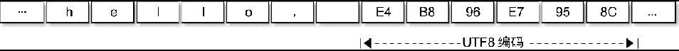

# Go 语言字符串

一个字符串是一个**不可改变的字节序列**，字符串的**元素不可修改**，是一个**只读的字节数组**。每个字符串的长度虽然也是固定的，但是**字符串的长度并不是字符串类型的一部分**。

Go 源代码中出现的字符串面值常量一般是 UTF-8 编码的的（对于转义字符，则没有这个限制）。源代码中的文本字符串通常被解释为采用 UTF-8 编码的 Unicode 码点（rune）序列。

因为字节序列对应的是只读的字节序列，所以字符串可以包含任意的数据，包括字节值 0。

我们也可以用字符串表示 GBK 等非 UTF-8 编码的数据，不过这时候将字符串看作是**一个只读的二进制数组**更准确，因为 `for range` 等语法并不支持非 UTF-8 编码的字符串的遍历。

Go 语言字符串的底层结构在 `reflect.StringHeader` 中定义：

`src\reflect\value.go`

```go
// StringHeader is the runtime representation of a string.
// It cannot be used safely or portably and its representation may
// change in a later release.
// Moreover, the Data field is not sufficient to guarantee the data
// it references will not be garbage collected, so programs must keep
// a separate, correctly typed pointer to the underlying data.
type StringHeader struct {
	Data uintptr  // 字符串指向的底层字节数组
	Len  int  // 字符串的字节的长度
}
```

字符串结构由两个信息组成：第一个是字符串指向的底层字节数组，**这个字节数组不是 []byte**，而是内存上一块连续的区域；第二个是字符串的字节的长度。字符串其实是一个结构体，因此字符串的赋值操作也就是 `reflect.StringHeader` 结构体的复制过程，并**不会涉及底层字节数组的复制**。可以将字符串数组看作一个结构体数组。

字符串 `hello, world` 对应的内存结构：


分析可以发现，`hello, world` 字符串底层数据和以下数组是完全一致的：

```go
var data = [...]byte{
    'h', 'e', 'l', 'l', 'o', ',', ' ', 'w', 'o', 'r', 'l', 'd',
}
```

字符串虽然不是切片，但是**支持切片操作**，不同位置的切片底层**访问的是同一块内存数据**（因为字符串是只读的，所以**相同的字符串面值常量通常对应同一个字符串常量**）：

```go
s := "hello, world"
hello := s[:5]
world := s[7:]

s1 := "hello, world"[:5]
s2 := "hello, world"[7:]
```

字符串和数组类似，内置的 `len()` 函数返回字符串的长度。也可以通过 `reflect.StringHeader` 结构访问字符串的长度（这里只是为了演示字符串的结构，并不是推荐的做法）：

```go
func main() {
	s := "hello, world"
	s1 := "hello, world"[:5]
	s2 := "hello, world"[7:]

	fmt.Println("len(s):", (*reflect.StringHeader)(unsafe.Pointer(&s)).Len)   // 12
	fmt.Println("len(s1):", (*reflect.StringHeader)(unsafe.Pointer(&s1)).Len) // 5
	fmt.Println("len(s2):", (*reflect.StringHeader)(unsafe.Pointer(&s2)).Len) // 5
}
```

假设字符串对应的是一个合法的 `UTF-8` 编码的字符序列。可以用内置的 `print` 调试函数或 `fmt.Print()` 函数直接打印，也可以用 `for range` 循环直接遍历 `UTF-8` 解码后的 Unicode 码点值。

下面的 "hello,世界" 字符串中包含了中文字符，可以通过打印转型为字节类型来查看字符底层对应的数据：

```go
fmt.Printf("%#v\n", []byte("hello, 世界"))
```

```go
[]byte{0x68, 0x65, 0x6c, 0x6c, 0x6f, 0x2c, 0x20, 0xe4, 0xb8, 0x96, 0xe7, 0x95, 0x8c}
```

分析可以发现，`0xe4, 0xb8, 0x96` 对应中文“世”，`0xe7, 0x95, 0x8c` 对应中文“界”。

```go
fmt.Println("\xe4\xb8\x96") // 打印“世”
fmt.Println("\xe7\x95\x8c") // 打印“界”
```

“hello, 世界” 字符串的内存结构布局：



一个中文字符占了 3 个字节。

```go
func main() {
	s := "hello, 世界"
	for idx, v := range s {  // idx 是字符的字节位置，v 是字符的拷贝
		fmt.Printf("%02d %c\t", idx, v)
	}
}
```

```
00 h    01 e    02 l    03 l    04 o    05 ,    06      07 世   10 界
```

Go 语言的字符串中可以存放任意的二进制字节序列，而且即使是 UTF-8 字符序列也可能会遇到错误的编码。如果遇到一个错误的 UTF-8 编码输入，将生成一个特别的 Unicode 字符 '\uFFFD'，这个字符在不同的软件中的显示效果可能不太一样，在印刷中这个符号通常是一个黑色六角形或钻石形状，里面包含一个白色的问号“�”。

下面的字符串中，我们故意损坏了第一字符的第二和第三字节，因此第一字符将会打印为“�”，第二和第三字节则被忽略，后面的 “abc” 依然可以正常解码打印（错误编码不会向后扩散是 UTF-8 编码的优秀特性之一）。

```go
fmt.Println("\xe4\x00\x00\xe7\x95\x8cabc") // �界a
```

不过在 `for range` 迭代这个含有损坏的 UTF-8 字符串时，第一字符的第二和第三字节依然会被单独迭代到，不过此时迭代的值是损坏后的 0：

```go
func main() {
	for i, c := range "\xe4\x00\x00\xe7\x95\x8cabc" {
		fmt.Println(i, c)
	}
}

// 0 65533  // \uFFF，对应�
// 1 0      // 空字符
// 2 0      // 空字符
// 3 30028  // 界
// 6 97     // a
// 7 98     // b
// 8 99     // c
```

如果不想解码 UTF-8 字符串，想直接遍历原始的字节码，可以将字符串强制转为 []byte 字节序列后再进行遍历（这里的转换一般不会产生运行时开销），或者是采用传统的下标方式遍历字符串的字节数组：

```go
func main() {
	s := "世界abc"
	for i, c := range []byte(s) {
		fmt.Print(i, c, '\t')
	}
	fmt.Println()
	for i := 0; i < len(s); i++ {
		fmt.Print(i, s[i], '\t')
	}
}
```

Go 语言除了 `for range` 语法对 UTF-8 字符串提供了特殊支持外，还对字符串和 `[]rune` 类型的相互转换提供了特殊的支持。

```go
func main() {
	fmt.Printf("%#v\n", []rune("世界"))             // []int32{19990, 30028}
	fmt.Printf("%#v\n", string([]rune{'世', '界'})) // 世界
}
```

从上面代码的输出结果可以发现 `[]rune` 其实是 `[]int32` 类型，这里的 `rune` 只是 `int32` 类型的别名，并不是重新定义的类型。`rune` 用于表示每个 Unicode 码点，目前只使用了 21 个位。

字符串相关的强制类型转换主要涉及 `[]byte` 和 `[]rune` 两种类型。每个转换都可能隐含重新分配内存的代价，最坏的情况下它们运算的时间复杂度都是 `O(n)`。不过字符串和 `[]rune` 的转换要更为特殊一些，因为一般这种强制类型转换要求两个类型的底层内存结构要尽量一致，显然它们底层对应的 `[]byte` 和 `[]int32` 类型是完全不同的内存结构，因此这种转换可能隐含重新分配内存的操作。

简单模拟 Go 语言对字符串内置的一些操作，这样对每个操作的处理的时间复杂度和空间复杂度都会有较明确的认识。

`for range` 对字符串的迭代模拟实现如下：

```go
func forRangeString(s string, forBody func(i int, r rune)) {
	for i := 0; len(s) > 0; {
		r, size := utf8.DecodeRuneInString(s)
		forBody(i, r)
		s = s[size:]
		i += size
	}
}

func main() {
	s := "hello, 世界"
	forRangeString(s, func(i int, r rune) {
		fmt.Printf("%d %c\t", i, r)
	})
}
```

`for range` 迭代字符串时，每次解码一个 Unicode 字符，然后进入 `for` 循环体，遇到崩溃的编码并不会导致迭代停止。

`[]byte(s)` 转换模拟实现如下：

```go
func str2bytes(s string) []byte {
	p := make([]byte, len(s))
	for i := 0; i < len(s); i++ {
		p[i] = s[i]
	}
	return p
}
```

模拟实现中新创建了一个切片，然后**将字符串的数组逐一复制到切片中**，这是为了**保证字符串只读的语义**。当然，在将字符串转换为 `[]byte` 时，如果转换后的变量没有被修改，编译器可能会直接返回原始的字符串对应的底层数据。

`string(bytes)` 转换模拟实现如下：

```go
func bytes2str(b []byte) (s string) {
    // 为了性能，有时候会省略复制
	data := make([]byte, len(b))
	for i, c := range b {
		data[i] = c
	}
	hdr := (*reflect.StringHeader)(unsafe.Pointer(&s))
	hdr.Data = uintptr(unsafe.Pointer(&data[0]))
	hdr.Len = len(b)
	return s
}
```

因为 Go 语言的字符串是只读的，无法以直接构造底层字节数组的方式生成字符串。在模拟实现中通过 `unsafe` 包获取字符串的底层数据结构，然后将切片的数据逐一复制到字符串中，这同样是为了保证字符串只读的语义不受切片的影响。如果转换后的字符串在生命周期中原始的 `[]byte` 的变量不发生变化，编译器可能会直接基于 `[]byte` 底层的数据构建字符串，而不进行复制。

`[]rune(s)` 转换模拟实现如下：

```go
func str2runes(s string) []rune {
	// 将字符串转换为字节数组
	b := []byte(s)
	var p []int32
	for len(b) > 0 {
		r, size := utf8.DecodeRune(b)
		p = append(p, r)
		s = s[size:]
	}
	return p
}
```

因为底层内存结构的差异，所以字符串到 []rune 的转换必然会导致重新分配 []rune 内存空间，然后依次解码并复制对应的 Unicode 码点值。这种强制转换并不存在前面提到的字符串和字节切片转换时的优化情况。

`string(runes)` 转换模拟实现如下：

```go
func runes2string(rs []int32) string {
	var p []byte
	buf := make([]byte, 3)
	for _, r := range rs {
		n := utf8.EncodeRune(buf, r)
		p = append(p, buf[:n]...)
	}
	return string(p)
}
```

同样因为底层内存结构的差异，[]rune 到字符串的转换也必然会导致重新构造字符串。这种强制转换并不存在前面提到的优化情况。
