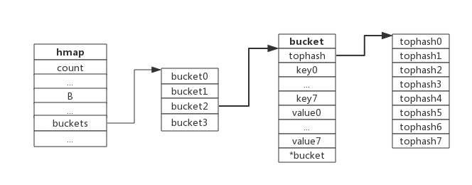
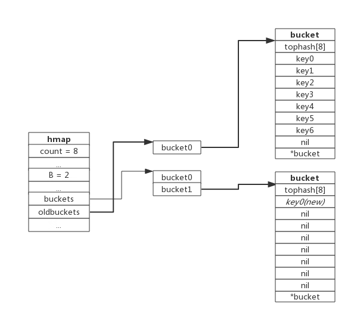
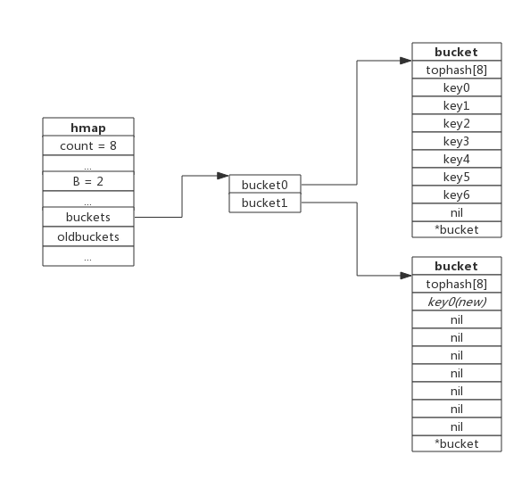
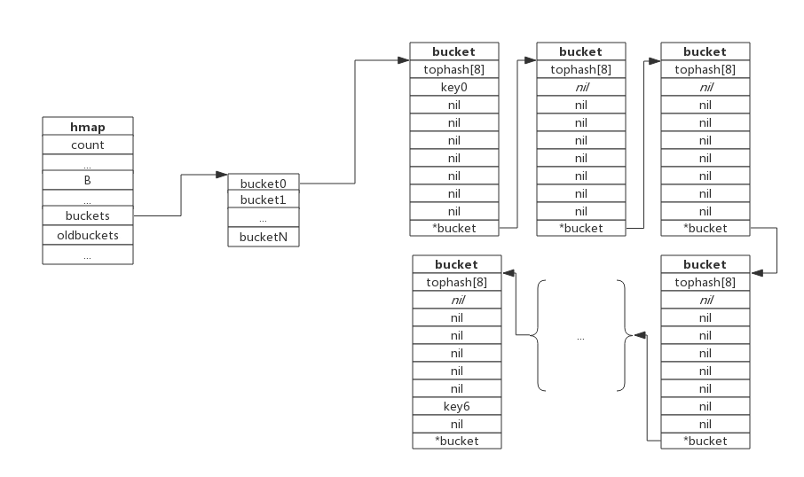

## 数据结构

map 以哈希表作为底层实现，一个哈希表里可以有多个哈希表节点，也即 bucket，而每个 bucket 就保存了 map 中的一个或一组键值对。

map 数据结构由 `runtime/map.go:bmap` 定义：

```go
type hmap struct {
	count     int // 当前保存的元素个数
	...
	B         uint8
	...
	buckets    unsafe.Pointer // bucket 数组指针，数组的大小为 2^B
	...
}
```

下图展示一个拥有 4 个 bucket 的 map：


本例中, `hmap.B = 2`，而 hmap.buckets 长度是 2 ^ B 为 4。元素经过哈希运算后会落到某个 bucket 中进行存储。查找过程类似。

`bucket` 很多时候被翻译为桶，所谓的 ` 哈希桶 ` 实际上就是 bucket。

## bucket 数据结构

bucket 数据结构由 `runtime/map.go:bmap` 定义：

```go
type bmap struct {
	tophash [8]uint8 // 存储哈希值的高 8 位
	data    byte[1]  // key value 数据: key/key/key/.../value/value/value...
	overflow *bmap   // 溢出 bucket 的地址
}
```

每个 bucket 可以存储 8 个键值对。

- tophash 是个长度为 8 的数组，哈希值相同的键（准确的说是哈希值低位相同的键）存入当前 bucket 时会将哈希值的高位存储在该数组中，以方便后续匹配。
- data 区存放的是 key-value 数据，存放顺序是 key/key/key/...value/value/value，如此存放是为了节省字节对齐带来的空间浪费。
- overflow 指针指向的是下一个 bucket，据此将所有冲突的键连接起来。

上述中 data 和 overflow 并不是在结构体中显示定义的，而是直接通过指针运算进行访问的。

下图展示 bucket 存放 8 个 key-value 对：



## 哈希冲突

当有两个或以上数量的键被哈希到了同一个 bucket 时，我们称这些键发生了冲突。Go 使用链地址法来解决键冲突。

由于每个 bucket 可以存放 8 个键值对，所以同一个 bucket 存放超过 8 个键值对时就会再创建一个键值对，用类似链表的方式将 bucket 连接起来。

下图展示产生冲突后的 map：


bucket 数据结构指示下一个 bucket 的指针称为 overflow bucket，意为当前 bucket 盛不下而溢出的部分。事实上哈希冲突并不是好事情，它降低了存取效率，好的哈希算法可以保证哈希值的随机性，但冲突过多也是要控制的。

## 负载因子

负载因子用于衡量一个哈希表冲突情况，公式为：

```
负载因子 = 键数量 / bucket 数量
```

例如，对于一个 bucket 数量为 4，包含 4 个键值对的哈希表来说，这个哈希表的负载因子为 1。

哈希表需要将负载因子控制在合适的大小，超过其阀值需要进行 rehash，也即键值对重新组织：

- 哈希因子过小，说明空间利用率低
- 哈希因子过大，说明冲突严重，存取效率低

每个哈希表的实现对负载因子容忍程度不同，比如 Redis 实现中负载因子大于 1 时就会触发 rehash，而 Go 则在在负载因子达到 6.5 时才会触发 rehash，因为 Redis 的每个 bucket 只能存 1 个键值对，而 Go 的 bucket 可能存 8 个键值对，所以 Go 可以容忍更高的负载因子。

## 渐进式扩容

### 扩容的前提条件

为了保证访问效率，当新元素将要添加进 map 时，都会检查是否需要扩容，扩容实际上是以空间换时间的手段。

触发扩容的条件有二个：

1. 负载因子 > 6.5 时，也即平均每个 bucket 存储的键值对达到 6.5 个。
2. overflow 数量 > 2 ^ 15 时，也即 overflow 数量超过 32768 时。

### 增量扩容

当负载因子过大时，就新建一个 bucket，新的 bucket 长度是原来的 2 倍，然后旧 bucket 数据搬迁到新的 bucket。

考虑到如果 map 存储了数以亿计的 key-value，一次性搬迁将会造成比较大的延时，Go 采用逐步搬迁策略，即每次访问 map 时都会触发一次搬迁，每次搬迁 2 个键值对。

下图展示了包含一个 bucket 满载的 map：


当前 map 存储了 7 个键值对，只有 1 个 bucket，负载因子为 7。再次插入数据时将会触发扩容操作，扩容之后再将新插入键写入新的 bucket。

当第 8 个键值对插入时，将会触发扩容，扩容后示意图如下：



hmap 数据结构中 oldbuckets 成员指身原 bucket，而 buckets 指向了新申请的 bucket。新的键值对被插入新的 bucket 中。

后续对 map 的访问操作会触发迁移，将 oldbuckets 中的键值对逐步的搬迁过来。当 oldbuckets 中的键值对全部搬迁完毕后，删除 oldbuckets。

搬迁完成后的示意图如下：



数据搬迁过程中原 bucket 中的键值对将存在于新 bucket 的前面，新插入的键值对将存在于新 bucket 的后面。

### 等量扩容

所谓等量扩容，实际上并不是扩大容量，buckets 数量不变，重新做一遍类似增量扩容的搬迁动作，把松散的键值对重新排列一次，以使 bucket 的使用率更高，进而保证更快的存取。

在极端场景下，比如不断地增删，而键值对正好集中在一小部分的 bucket，这样会造成 overflow 的 bucket 数量增多，但负载因子又不高，从而无法执行增量搬迁的情况，如下图所示：



上图可见，overflow 的 bucket 中大部分是空的，访问效率会很差。此时进行一次等量扩容，即 buckets 数量不变，经过重新组织后 overflow 的 bucket 数量会减少，即节省了空间又会提高访问效率。

## 分配内存

显示指定大小，如果往 map 放入大量数据，最好在新建 map 的时候显示指定 map 大小，否则会导致 map 频繁扩容，影响性能。

## 示例

```go
package main

import "fmt"

func main() {
	d := make(map[string]int)
	d["cnt"] = 32

	d["cnt"] ++
	d["x"]++

	fmt.Println(d["cnt"])
	fmt.Println(d["x"])
}
```

## 查找过程

1. 根据 key 值算出哈希值
2. 取哈希值低位与 hmap.B 取模确定 bucket 位置
3. 取哈希值高位在 tophash 数组中查询
4. 如果 tophash[i] 中存储值也哈希值相等，则去找到该 bucket 中的 key 值进行比较
5. 当前 bucket 没有找到，则继续从下个 overflow 的 bucket 中查找。
6. 如果当前处于搬迁过程，则优先从 oldbuckets 查找

**如果查找不到，也不会返回空值，而是返回相应类型的 0 值。**

## 插入过程

1. 根据 key 值算出哈希值
2. 取哈希值低位与 hmap.B 取模确定 bucket 位置
3. 查找该 key 是否已经存在，如果存在则直接更新值
4. 如果没找到将 key，将 key 插入

```go

```
