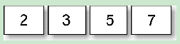

几乎所有主流语言都支持数组，它是一片连续的内存区域。

Go 语言中的数组与其他语言中的数组有显著不同的特性，例如，其不能进行扩容、在复制和传递时为值复制。

- [内部结构](#内部结构)
- [声明方式](#声明方式)
- [数组基本操作](#数组基本操作)
- [数组底层原理](#数组底层原理)
- [类型数组](#类型数组)
- [打印数组详细信息](#打印数组详细信息)
- [数组转切片](#数组转切片)
- [二维数组](#二维数组)

## 内部结构

```go
type array struct {
	// 元素类型
	elemtype *_type
	// 数组长度
	len int
	// 数组第一个元素的地址
	data unsafe.Pointer
}
```

数组的内存结构比较简单。`[4]int{2,3,5,7}` 数组值对应的内存结构如下：



Go 语言中数组是值语义。**一个数组变量即表示整个数组**，它并不是隐式地指向第一个元素的指针，而是一个完整的值。**当一个数组变量被赋值或者被传递的时候，实际上会复制整个数组**。如果数组较大的话，数组的赋值也会有较大的开销。为了避免复制数组带来的开销，可以传递一个指向数组的指针，但是数组指针并不是数组。

```go
func main() {
	var a = [...]int{1, 2, 3} // a 是一个数组
	var b = &a                // b 是指向数组的指针

	fmt.Println(a[0], a[1]) // 打印数组的前两个元素
	fmt.Println(b[0], b[1]) // 通过数组指针访问数组元素的方式和通过数组类似

	for i, v := range b { // 通过数组指针迭代数组的元素
		fmt.Println(i, v)
	}
}
```

其中 b 是指向数组 a 的指针，但是通过 b 访问数组中元素的写法和 a 是类似的。还可以通过 `for range` 来迭代数组指针指向的数组元素。其实数组指针类型除类型和数组不同之外，通过数组指针操作数组的方式和通过数组本身的操作类似，而且**数组指针赋值时只会复制一个指针**。但是数组指针类型依然不够灵活，因为数组的长度是数组类型的组成部分，**指向不同长度数组的数组指针类型也是完全不同的**。

可以将数组看作一个特殊的结构体，结构的字段名对应数组的索引，同时结构体成员的数目是固定的。内置函数 `len()` 可以用于计算数组的长度，`cap()` 函数可以用于计算数组的容量。不过对数组类型来说，`len()` 和 `cap()` 函数返回的结果始终是一样的，都是对应数组类型的长度。

## 声明方式

```go
// 1
var a [3]int                    // 定义长度为3的int型数组，元素为 [0 0 0]
var b = [3]int{1, 2, 3}       // 定义长度为3的int型数组，元素为 [1, 2, 3]

// 2
var c = [...]int{1, 2, 3}       // 定义长度为3的int型数组，元素为 [1, 2, 3]

// 3
var d = [...]int{2: 3, 1: 2}    // 定义长度为3的int型数组，元素为 [0, 2, 3]

// 4
var e = [...]int{1, 2, 4: 5, 6} // 定义长度为6的int型数组，元素为 [1, 2, 0, 0, 5, 6]
```

- 第一种方式是定义一个数组变量的最基本的方式，数组的长度明确指定，数组中的每个元素都以零值初始化，或者在定义时顺序指定每个元素的初始值。
- 第二种方式是定义数组，可以在定义的时候顺序指定全部元素的初始化值，数组的长度根据初始化元素的数目自动计算。这种声明方式在编译时自动推断长度。
- 第三种方式是以索引的方式来初始化数组的元素，因此元素的初始化值出现顺序比较随意。这种初始化方式和 `map[int]Type` 类型的初始化语法类似。**数组的长度以出现的最大的索引为准**，没有明确初始化的元素依然用零值初始化。
- 第四种方式是混合了第二种和第三种的初始化方式，前面两个元素采用顺序初始化，第三个和第四个元素采用零值初始化，第五个元素通过索引初始化，最后一个元素跟在前面的第五个元素之后采用顺序初始化。

数组是一个由固定长度的特定类型元素组成的序列，一个数组可以由零个或多个元素组成。**数组的长度是数组类型的组成部分**。因为数组的长度是数组类型的一部分（与字符串不同，字符串的长度不是类型的一部分），**不同长度或不同类型的数据组成的数组都是不同的类型**，所以**在 Go 语言中很少直接使用数组**，不同长度的数组因为类型不同无法直接赋值。

和数组对应的类型是切片，切片是可以动态增长和收缩的序列，切片的功能也更加灵活，但是要理解切片的工作原理还是要先理解数组。

数组长度可以通过内置的 len 函数获取，数组中的元素可以通过下标获取。只能访问数组中已有的元素，如果数组访问越界，则在编译时会报错。

## 数组基本操作

[数组的基本操作](operation.md)

## 数组底层原理

[数组底层原理](underlying_principle.md)

## 类型数组

数组不仅可以定义数值数组，还可以定义字符串数组、结构体数组、函数数组、接口数组、通道数组等：

```go
func main() {
	// 字符串数组
	var s1 = [2]string{"hello", "world"}
	var s2 = [...]string{"你好", "世界"}
	var s3 = [...]string{1: "世界", 0: "你好"}

	// 结构体数组
	var line1 [2]image.Point
	var line2 = [...]image.Point{image.Point{X: 0, Y: 0}, image.Point{X: 1, Y: 1}}
	var line3 = [...]image.Point{{0, 0}, {1, 1}}

	// 函数数组
	var decoder1 [2]func(io.Reader) (image.Image, error)
	var decoder2 = [...]func(io.Reader) (image.Image, error){
		png.Decode,
		jpeg.Decode,
	}

	// 接口数组
	var unknown1 [2]interface{}
	var unknown2 = [...]interface{}{123, "你好"}

	// 通道数组
	var chanList = [2]chan int{}
}
```

我们还可以定义一个空的数组：

```go
var d [0]int       // 定义一个长度为0的数组
var e = [0]int{}   // 定义一个长度为0的数组
var f = [...]int{} // 定义一个长度为0的数组
```

长度为 0 的数组（空数组）在内存中并不占用空间。空数组虽然很少直接使用，但是可以用于**强调某种特有类型的操作时避免分配额外的内存空间**，例如用于通道的同步操作：

```go
func main() {
	c1 := make(chan [0]int)
	go func() {
		fmt.Println("c1")
		c1 <- [0]int{}
	}()
	<-c1
}
```

在这里，我们并不关心通道中传输数据的真实类型，其中通道接收和发送操作只是用于消息的同步。对于这种场景，我们用空数组作为通道类型可以减少通道元素赋值时的开销。当然，**一般更倾向于用无类型的匿名结构体代替空数组**：

```go
func main() {
	c2 := make(chan struct{})
	go func() {
		fmt.Println("c2")
		c2 <- struct{}{} // struct{} 部分是类型，{} 表示对应的结构体值
	}()
	<-c2
}
```

## 打印数组详细信息

我们可以用 `fmt.Printf()` 函数提供的` %T` 或 `%#v` 谓词语法来打印数组的类型和详细信息：

```go
func main() {
	var a = [...]int{1, 2, 3}
	// `%T` 输出一个值的数据类型
	fmt.Printf("%T\n", a) // [3]int
	// `%#v` 格式化输出将输出一个值的 Go 语法表示方式
	fmt.Printf("%#v\n", a) // [3]int{1, 2, 3}
}
```

## 数组转切片

```go
array = [3]int{1,2,3}
slice = array[:]
```

```go
package main

import "fmt"

func main() {
	var array [10]int

	var slice = array[5:6]

	fmt.Println("length of slice: ", len(slice))
	fmt.Println("capacity of slice: ", cap(slice))
	fmt.Println(&slice[0] == &array[5])
}
```

main 函数中定义了一个 10 个长度的整型数组 array，然后定义了一个切片 slice，切取数组的第 6 个元素，最后打印 slice 的长度和容量，判断切片的第一个元素和数组的第 6 个元素地址是否相等。

slice 根据数组 array 创建，与数组共享存储空间，slice 起始位置是 array[5]，长度为 1，容量为 5，slice[0]和array[5]地址相同。

这种情况下，如果修改 slice 的值，array 的值也会被修改，因为 slice 和 array 共享存储空间。

## 二维数组

```go
var twoArrs [3][5]int = [...][5]int{{1, 2, 3, 4, 5}, {6, 7, 8, 9, 10}, {11, 12, 13, 14, 15}}
```

二维数组中的第二个 [] 中的数值 5 并没有省略为...，否则会出现 use of [...] array outside of array literal 错误提示。

能否把 [...]type 也去除掉呢？答案是不行！但可以把数组定义简写为：

```go
strArr := [...]string{"a", "b", "c", "d", "e", "f"}
byteArr := [...]byte{32, 23, 42, 26, 21}
floatArr := [...]float64{3.1415, 2.6728, 1.4114}
twoArrs := [...][5]int{{1, 2, 3, 4, 5}, {6, 7, 8, 9, 10}, {11, 12, 13, 14, 15}}
```

```go

```
