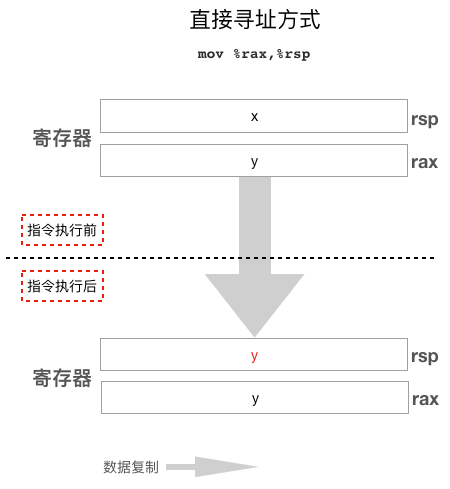
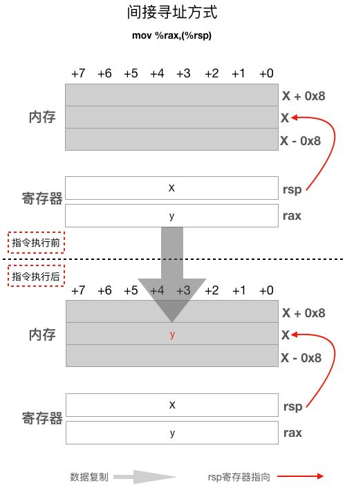
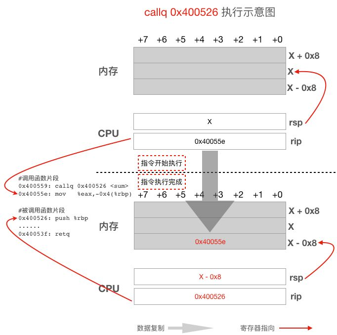
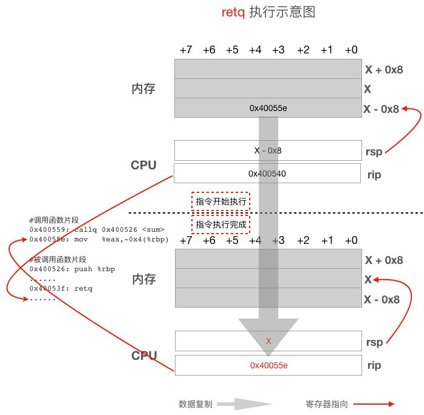
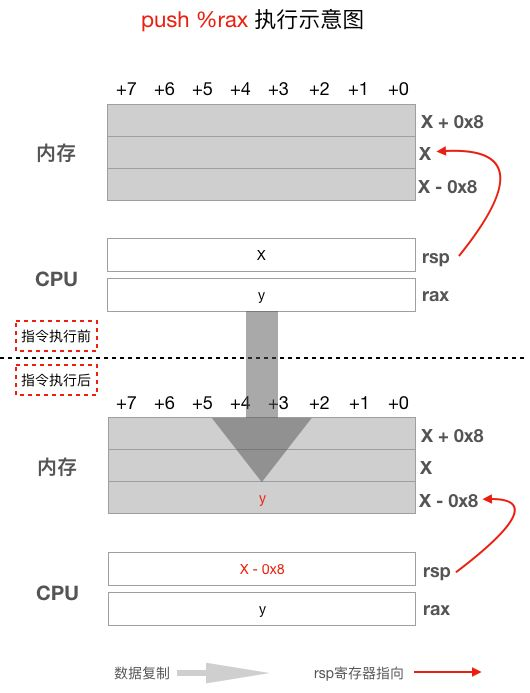
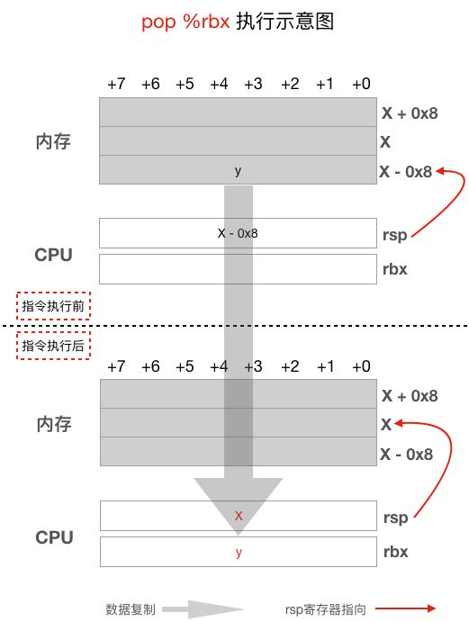

## 简介

汇编指令使用符号来表示机器指令，下面的例子非常直观的说明了这两种指令之间的差异：

```
0x40054d : add %rdx,%rax // 汇编指令

0x40054d : 0x48 0x01 0xd0 // 机器指令
```

## 汇编指令格式

因为不同的 CPU 所支持的机器指令不一样，所以其汇编指令也不同，即使是相同的 CPU，不同的汇编工具和平台所使用的汇编指令格式也有些差别。

汇编指令的基本格式为：

```
操作码  [操作数]
```

可以看到每一条汇编指令通常都由两部分组成：

- **操作码**：操作码指示 CPU 执行什么操作，比如是执行加法，减法还是读写内存。每条指令都必须要有操作码。
- **操作数**：操作数是操作的对象，比如加法操作需要两个加数，这两个加数就是这条指令的操作数。操作数的个数一般是 0 个，1 个或 2 个。

## 汇编指令示例

### 两个操作数

```
add   %rdx,%rax
```

这条指令的操作码是 add，表示执行加法操作，它有两个操作数，rdx 和 rax。如果一条指令有两个操作数，那么第一个操作数叫做源操作数，第二个操作数叫做目的操作数，顾名思义，目的操作数表示这条指令执行完后结果应该保存的地方。所以上面这条指令表示对 rax 和 rdx 寄存器里面的值求和，并把结果保存在 rax 寄存器中。其实这条指令的第二个操作数 rax 寄存器既是源操作数也是目的操作数，因为 rax 既是加法操作的两个加数之一，又得存放加法操作的结果。这条指令执行完后 rax 寄存器的值发生了改变，指令执行前的值被覆盖而丢失了，如果 rax 寄存器之前的值还有用，那么就得先用指令把它保存到其它寄存器或内存之中。

### 一个操作数

```
callq  0x400526
```

这条指令的操作码是 callq，表示调用函数，操作数是 0x400526，它是被调用函数的地址。

### 没有操作数

```
retq
```

这条指令只有操作码 retq，表示从被调用函数返回到调用函数继续执行。

## AT&T 格式的汇编指令

1. AT&T 格式的汇编指令中，寄存器名需要加 % 作为前缀；

2. 有 2 个操作数的指令中，第一个操作数是源操作数，第二个是目的操作数，刚才也讨论过，不过那条指令中的源和目的不是那么清晰，来看一个直白的，`mov   %eax,%esi`，这条指令表示把 eax 寄存器中的值拷贝给 esi，这条指令中源和目的就很清楚了；

3. 立即操作数需要加上 $ 符号做前缀，如  "mov $0x1 %rdi" 这条指令中第一个操作数不是寄存器，也不是内存地址，而是直接写在指令中的一个常数，这种操作数叫做**立即操作数**。这条指令表示把数值 0x1 放入 rdi 寄存器中。

4. **寄存器间接寻址的格式为  offset(%register)**，如果 offset 为 0，则可以略去偏移不写直接写成 (%register)。何为间接寻址呢？其实就是指指令中的寄存器并不是真正的源操作数或目的操作数，寄存器的值是一个内存地址，这个地址对应的内存才是真正的源或目的操作数，比如 `mov   %rax, (%rsp)` 这条指令，第二个操作数 `(%rsp)` 中的寄存器的名字用括号括起来了，表示间接寻址，rsp 的值是一个内存地址，这条指令的真实意图是把 rax 寄存器中的值赋值给 rsp 寄存器的值（内存地址）对应的内存，rsp 寄存器本身的值不会被修改，作为比较，我们看一下 `mov   %rax, %rsp` 这条指令 ，这里第二个操作数仅仅少了个括号，变成了直接寻址，意思完全不一样了，这条指令的意思是把 rax 的值赋给 rsp，这样 rsp 寄存器的值被修改为跟 rax 寄存器一样的值了。下面的 2 张图展示了这两种寻址方式的不同：



执行 `mov %rax, %rsp` 这条指令之前，rsp 寄存器的值是 x，rax 寄存器的值是 y，执行指令之后，rax 寄存器的值被复制给了 rsp 寄存器，所以 rsp 寄存器的值变成了 y，可以看出，采用直接寻址方式时，目的操作数 rsp 寄存器的值在指令执行之前和指令执行之后发生了变化，源操作数没有变化。再看看间接寻址方式的示意图：



执行 `mov %rax,(%rsp)` 这条指令之前，rax 寄存器的值是 y，rsp 寄存器的值是 X，它是一个内存地址，如上图所示，我们用了一个红色箭头从 rsp 寄存器指向了地址为 X 的内存；执行指令之后，rsp 寄存器的值并没有发生变化，而 rsp 所指的内存中的值却发生了改变，因为这条指令的目的操作数采用了间接寻址方式(%rsp)，指令执行的结果是 rax 寄存器中的值被复制到了 rsp 寄存器存放的地址所对应的 8 个内存单元中。另外需要注意的是指令中出现的内存地址仅仅是起始地址，具体要操作以这个地址为起始地址的连续几个内存单元要根据具体的指令而定，比如上图中的 `mov %rax,(%rsp)`，因为源操作数是一个 64 位的寄存器，所以这条指令会复制 rax 存放的 8 个字节到地址为 X, X+1, X+2, X+3, X+4, X+5, X+6, X+7 这 8 个内存单元中去。

间接寻址格式 `offset(%register)` 中前面的offset表示偏移，如 `-0x8(%rbp)`，-0x8 就是偏移量，整个表示 rbp 寄存器里面保存的地址值先减去 8（因为偏移是负 8）得到的地址对应的内存。

5. 与内存相关的一些指令的操作码会加上 b, w, l 和 q 字母分别表示操作的内存是 1，2，4 还是 8 个字节，比如指令 `movl  $0x0,-0x8(%rbp)` ，这条指令操作码 movl 的后缀字母 l 说明我们要把从 `-0x8(%rbp)` 这个地址开始的 4 个内存单元赋值为 0。如果要操作 3 个或 5 个内存单元，只能通过多条指令组合起来达到目的。

## 常用指令详解

### mov

```
mov 源操作数 目的操作数
```

该指令复制源操作数到目的操作数。例：

```nasm
mov %rsp,%rbp       # 直接寻址，把rsp的值拷贝给rbp，相当于 rbp = rsp
mov -0x8(%rbp),%edx # 源操作数间接寻址，目的操作数直接寻址。从内存中读取4个字节到edx寄存器
mov %rsi,-0x8(%rbp) # 源操作数直接寻址，目的操作数间接寻址。把rsi寄存器中的8字节值写入内存
```

### add/sub

```nasm
add 源操作数 目的操作数
sub 源操作数 目的操作数
```

加减运算指令。例：

```
sub $0x350,%rsp  # 源操作数是立即操作数，目的操作数直接寻址。rsp = rsp - 0x350
add %rdx,%rax    # 直接寻址。rax = rax + rdx
addl $0x1,-0x8(%rbp) # 源操作数是立即操作数，目的操作数间接寻址。内存中的值加1（addl后缀字母l表示操作内存中的4个字节）
```

### call/ret

```
call 目标地址
ret
```

call 指令执行函数调用。CPU 执行 call 指令时首先会把 rip 寄存器中的值入栈，然后设置 rip 值为目标地址，又因为 **rip 寄存器决定了下一条需要执行的指令**，所以当 CPU 执行完当前 call 指令后就会跳转到目标地址去执行。

ret 指令从被调用函数返回调用函数，它的实现原理是把 call 指令入栈的返回地址弹出给 rip 寄存器。

下面用例子对这两条指令的原理加以说明。

```
# 调用函数片段
0x0000000000400559 : callq 0x400526 <sum>
0x000000000040055e : mov   %eax,-0x4(%rbp)

# 被调用函数片段
0x0000000000400526 : push   %rbp
......
0x000000000040053f : retq
```

上面代码片段中，调用函数使用 `callq 0x400526` 指令调用 0x400526 处的函数，0x400526 是被调用函数的第一条指令所在的地址。被调用函数在 0x40053f 处执行 retq 指令返回调用函数继续执行 0x40055e 地址处的指令。注意这两条指令会涉及入栈和出栈操作，所以会影响 rsp 寄存器的值。



从上图可以看到 call 指令执行之初 rip 寄存器的值是紧跟 call 后面那一条指令的地址，即 0x40055e，但当 call 指令完成后但还未开始执行下一条指令之前，rip 寄存器的值变成了 call 指令的操作数，即被调用函数的地址 0x400526，这样 CPU 就会跳转到被调用函数去执行了。

同时还需要注意的是这里的call指令执行时把call指令后面那一条指令的地址 0x40055e PUSH 到了栈上，所以一条 call 指令修改了 3 个地方的值：**rip 寄存器、rsp 和栈**。

下面我们再看看从被调用函数返回调用函数时执行的ret指令，其示意图如下：



可以看到 ret 指令执行的操作跟 call 指令执行的操作完全相反，ret 指令开始执行时 rip 寄存器的值是紧跟 ret 指令后面的那个地址，也就是 0x400540，但 ret 指令执行过程中会把之前 call 指令 PUSH 到栈上的返回地址 0x40055e POP 给 rip 寄存器，这样，当 ret 执行完成后就会从被调用函数返回到调用函数的 call 指令的下一条指令继续执行。这里同样要注意的是 retq 指令也会修改 rsp 寄存器的值。

### jmp/je/jle/jg/jge

这些都属于跳转指令，操作码后面直接跟要跳转到的地址或存有地址的寄存器，这些指令与高级编程语言中的 goto 和 if 等语句对应。用法示例：

```
jmp    0x4005f2
jle    0x4005ee
jl     0x4005b8
```

### push/pop

```
push 源操作数
pop 目的操作数
```

专用于函数调用栈的入栈出栈指令，**这两个指令都会自动修改 rsp 寄存器**。

push 入栈时 rsp 寄存器的值先减去 8 把栈位置留出来，然后把操作数复制到 rsp 所指位置。push 指令相当于：

```
sub $8,%rsp
mov 源操作数,(%rsp)
```



push 指令需要重点注意 rsp 寄存器的变化。

pop 出栈时先把 rsp 寄存器所指位置的数据复制到目的操作数中，然后 rsp 寄存器的值加 8。pop 指令相当于：

```
mov (%rsp),目的操作数
add $8,%rsp
```




同样，pop 指令也需要重点注意 rsp 寄存器的变化。

### leave

leave 指令没有操作数，它一般放在函数的尾部 ret 指令之前，用于调整 rsp 和 rbp，这条指令相当于如下两条指令：

```
mov %rbp,%rsp
pop %rbp
```

```go

```
