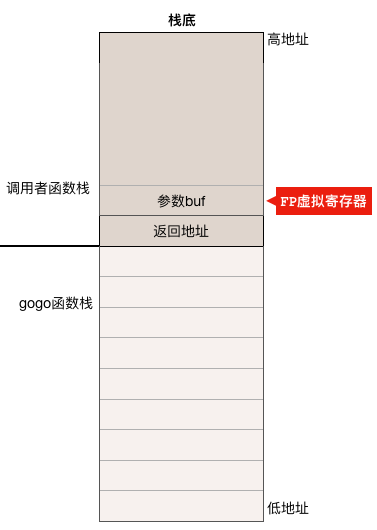

## 简介

Go 源代码中有部分代码是用汇编语言编写的，不过这些汇编代码并非针对特定体系结构的汇编代码，而是引入的一种伪汇编 Plan9，同样需要经过汇编器转换成机器指令才能被 CPU 执行。

用 Plan9 汇编语言编写的代码一旦经过汇编器转换成机器指令之后，再用调试工具反汇编出来的代码已经是跟平台相关的汇编代码了。

## 寄存器


除了这些跟硬件寄存器一一对应的寄存器外，还引入了几个没有任何硬件寄存器与之对应的虚拟寄存器，这些寄存器一般用来存放内存地址，引入的目的是为了方便定位内存中的代码和数据。

## 虚拟寄存器

### FP

用来引用函数参数

Go 语言规定函数调用时参数都必须放在栈上，比如被调用函数使用 `first_arg+0(FP)` 来引用调用者传递进来的第一个参数，用 `second_arg+8(FP)` 来引用第二个参数，以此类推，这里的 `first_arg` 和 `second_arg` 仅仅是一个帮助阅读源代码的符号，对编译器来说无实际意义，+0 和 +8 表示相对于 FP 寄存器的偏移量。

我们用一个 runtime 中的函数片段作为例子来看看 FP 的使用。runtime 中有一个叫 gogo 的函数，它接受一个 gobuf 类型的指针

```go
// func gogo(buf *gobuf)
// restore state from Gobuf; longjmp
TEXT runtime·gogo(SB), NOSPLIT, $16-8
MOVQbuf+0(FP), BX// gobuf -->bx
```

`MOVQ	buf+0(FP), BX` 这一条指令把调用者传递进来的指针 buf 放入 BX 寄存器中，可以看到，在 gogo 函数是通过 buf+0(FP) 这种方式获取到参数的。从被调用函数（此处为 gogo 函数）的角度来看，FP 与函数栈帧之间的关系如下图，可以看出 FP 寄存器指向调用者的栈帧，而不是被调用函数的栈帧。



### SB

保存程序地址空间的起始地址。用来定位全局符号。函数定义、函数调用、全局变量定义以及对其引用会用到这个 SB 虚拟寄存器。

## 操作码

AT&T 格式的寄存器操作码一般使用小写且寄存器的名字前面有个 % 符号，而 Go 汇编使用大写而且寄存器名字前没有 % 符号，比如:

```
# AT&T 格式
mov %rbp,%rsp

# Go 汇编格式
MOVQ BP,SP
```

## 操作数宽度

AT&T 格式的汇编指令中如果有寄存器操作数，则根据寄存器的名字（比如 rax, eax, ax, al 分别代表 64，32，16 和 8 位寄存器）就可以确定操作数到底是多少位（8，16，32 还是 64 位），所以不需要操作码后缀，如果没有寄存器操作数又是访存指令的话，则操作码需要加上后缀 b、w、l 或 q 来指定到底存取内存中的多少个字节。

而 Go 汇编中，寄存器的名字没有位数之分，比如 AX 寄存器没有什么 RAX, EAX 之类的名字，指令中一律只能使用 AX。所以如果指令中有操作数寄存器或是指令需要访问内存，则操作码都需要带上后缀 B(8位)、W(16位)、D(32位)或Q(64位)。

### 函数定义

还是以 runtime 中的 gogo 函数为例：

```go
// func gogo(buf *gobuf)
// restore state from Gobuf; longjmp
TEXT runtime·gogo(SB), NOSPLIT, $16-8
......
```

下面对这个函数定义的第一行的各部分做个说明：

- `TEXT runtime·gogo(SB)`：指明在代码区定义了一个名字叫 gogo 的全局函数（符号），该函数属于 runtime 包。
- `NOSPLIT`：指示编译器不要在这个函数中插入检查栈是否溢出的代码。
- `$16-8`：数字 16 说明此函数的栈帧大小为 16 字节，8 说明此函数的参数和返回值一共需要占用 8 字节内存。因为这里的 gogo 函数没有返回值，只有一个指针参数，对于 AMD64 平台来说指针就是 8 字节。go 语言中函数调用的参数和函数返回值都是放在栈上的，而且这部分栈内存是由调用者而非被调用函数负责预留，所以在函数定义时需要说明到底需要在调用者的栈帧中预留多少空间。
