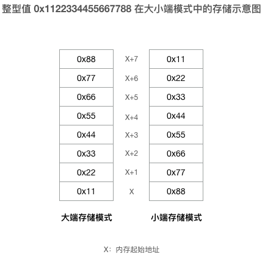

## 简介

内存是计算机系统的存储设备，其主要作用是协助 CPU 在执行程序时存储数据和指令。

内存由大量内存单元组成，**内存单元大小为 1 个字节**（**1 字节包含 8 个二进制位**），每个内存单元都有一个编号，更专业的说法是**每一个内存单元都有一个地址**，我们在编写汇编代码或编译器把用高级语言所写的程序编译成汇编指令时，如果要读写内存，就必须在指令中指定内存地址，这样 CPU 才知道它要存取哪个或哪些内存单元。

高级语言中有变量的概念，变量又有全局变量和函数局部变量之分，而不管是哪种变量（除了 C 语言中申明为 register 的变量），都需要保存在内存之中，同时，绝大多数类型的变量都不会只占一个字节大小的内存，但是每个内存单元却只有一个字节大小，那么像这种大于一个字节的变量是如何保存在内存中的呢？**任何大于一个字节的变量都存储在相邻的几个内存单元中**，事实也确实如此，比如 go 语言中的 int64 类型的变量在内存中就被存放在**连续的 8 个内存单元**之中，要读写该变量，只需在汇编指令中指定这些内存单元的起始地址以及读写的字节数即可。

## 存储模式

既然一个 int64 类型的变量在内存中占 8 个字节，那么如何安排这 8 个字节来存储 64 位的整型数据呢？比如如何在内存中存储 0x1122334455667788 这个 16 进制表示的整型值，是把高位的 0x11 放在这 8 个内存单元中的第一个字节还是把低位的 0x88 放在第一个字节呢？其实两种方案都是可以的，不同的 CPU 采用的方案也可能不，这就是所谓的**大小端存储模式**：

- **大端存储模式**：数据的高字节保存在内存的低地址中，低字节保存在内存的高地址中。
- **小端存储模式**：数据的高字节保存在内存的高地址中，低字节保存在内存的低地址中。

需要注意的是大小端存储模式与 CPU 相关，而与内存无关，内存只管保存数据而不关心数据是什么以及怎么解释这些数据。下图是大小端存储模式的示意图：



```go

```
