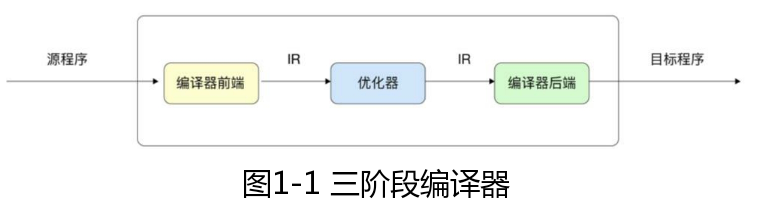
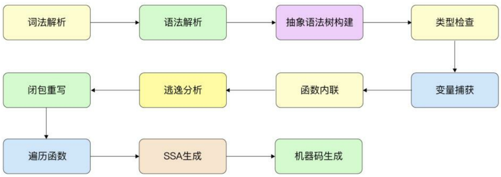

以 .go 为后缀的 UTF-8 格式的 Go 文本文件最终能被编译成特定机器上的可执行文件，离不开 Go 语言编译器的复杂工作。

Go 语言编译器不仅能准确地翻译高级语言，也能进行代码优化。

## 为什么要了解 Go 语言编译器

编译器是一个大型且复杂的系统，一个好的编译器会很好地结合形式语言理论、算法、人工智能、系统设计、计算机体系结构及编程语言理论。

Go 语言的编译器遵循了主流编译器采用的经典策略及相似的处理流程和优化规则（例如经典的递归下降的语法解析、抽象语法树的构建）。

另外，Go 语言编译器有一些特殊的设计，例如内存的逃逸等。

通过了解Go语言编辑器，不仅可以了解大部分高级语言编译器的一般性流程与规则，也能指导我们写出更加优秀的程序。可以通过禁用编译器的优化以及内联函数等特性调试和查看代码的执行流程。后面还会看到，很多 Go 语言的语法特性都离不开编译时与运行时的共同作用。

另外，如果读者希望开发 go import、go fmt、go lint 等扫描源代码的工具，那么同样离不开编译器的知识和 Go 语言提供的 API。

## Go 语言编译器的阶段



如图 1 -1 所示，在经典的编译原理中，一般将编译器分为编译器前端、优化器和编译器后端。这种编译器被称为三阶段编译器（three-phase compiler）。

- 编译器前端主要专注于理解源程序、扫描解析源程序并进行精准的语义表达。
- 编译器的中间阶段（Intermediate Representation，IR）可能有多个，编译器会使用多个 IR 阶段、多种数据结构表示代码，并在中间阶段对代码进行多次优化。例如，识别冗余代码、识别内存逃逸等。编译器的中间阶段离不开编译器前端记录的细节。
- 编译器后端专注于生成特定目标机器上的程序，这种程序可能是可执行文件，也可能是需要进一步处理的中间形态 obj 文件、汇编语言等。

编译器优化并不是一个非常明确的概念。优化的主要目的一般是降低程序资源的消耗，比较常见的是降低内存与 CPU 的使用率。但在很多时候，这些目标可能是相互冲突的，对一个目标的优化可能降低另一个目标的效率。同时，理论已经表明有一些代码优化存在着 NP 难题，这意味着随着代码的增加，优化的难度将越来越大，需要花费的时间呈指数增长。因为这些原因，编译器无法进行最佳的优化，所以通常采用一种折中的方案。

Go 语言编译器一般缩写为小写的 gc（go compiler），需要和大写的 GC（垃圾回收）进行区分。Go 语言编译器的执行流程可细化为多个阶段，包括词法解析、语法解析、抽象语法树构建、类型检查、变量捕获、函数内联、逃逸分析、闭包重写、遍历函数、SSA 生成、机器码生成，如图 1 -2 所示。



官方文档 `cmd/compile/README.md` 将编译过程分为 7 个阶段：

- Parsing：词法解析和语法解析。
- Type checking：类型检查。
- IR construction：构建中间表示。
- Middle end：中间阶段，包括变量捕获、函数内联、逃逸分析、闭包重写。
- Walk：遍历函数。
- Generic SSA：生成 SSA。
- Generating machine code：生成机器码。

```go

```
