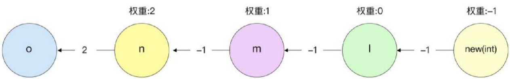

## IR 构建中间表示

* `cmd/compile/internal/types` (compiler types)
* `cmd/compile/internal/ir` (compiler AST)
* `cmd/compile/internal/typecheck` (AST transformations)
* `cmd/compile/internal/noder` (create compiler AST)

编译器中间端必须用它自己的 AST 定义和从用 C 编写时继承的 Go 类型表示。它的所有代码都是根据这些编写的，所以类型检查之后的下一步是将语法和 types2 表示转换到 ir 和 types。这个过程被称为 "noding"。

类型检查阶段完成后，Go 语言编译器将对抽象语法树进行分析及重构，从而完成一系列优化。

* `cmd/compile/internal/deadcode` (dead code elimination)
* `cmd/compile/internal/inline` (function call inlining)
* `cmd/compile/internal/devirtualize` (devirtualization of known interface method calls)
* `cmd/compile/internal/escape` (escape analysis)

中间端对 **IR 表示**执行了几个优化过程：死代码消除、（早期）去虚拟化、函数调用内联和逃逸分析。

## 变量捕获

变量捕获主要是针对闭包场景而言的，由于闭包函数中可能引用闭包外的变量，因此变量捕获需要明确在闭包中通过值引用或地址引用的方式来捕获变量。

下面的例子中有一个闭包函数，在闭包内引入了闭包外的 a、b 变量，由于变量 a 在闭包之后进行了其他赋值操作，因此在闭包中，a、b 变量的引用方式会有所不同。在闭包中，必须采取地址引用的方式对变量 a 进行操作，而对变量 b 的引用将通过直接值传递的方式进行。

```go
package main

import "fmt"

func main() {
	a := 1
	b := 2

	go func() {
		fmt.Println(a, b)
	}()

	a = 3
}
```

在 Go 语言编译的过程中，可以通过如下方式查看当前程序闭包变量捕获的情况。从输出中可以看出，a 采取 ref 引用传递的方式，而 b 采取了值传递的方式。assign=true 代表变量 a 在闭包完成后又进行了赋值操作。

```
go tool compile -m=2 main.go | grep capturing
```

```
main.go:6:2: main capturing by ref: a (addr=false assign=true width=8)
main.go:7:2: main capturing by value: b (addr=false assign=false width=8)
```

## 函数内联

函数内联指将较小的函数直接组合进调用者的函数。这是现代编译器优化的一种核心技术。函数内联的优势在于，可以减少函数调用带来的开销。

对于 Go 语言来说，函数调用的成本在于参数与返回值栈复制、较小的栈寄存器开销以及函数序言部分的检查栈扩容（Go 语言中的栈是可以动态扩容的）。

同时，函数内联是其他编译器优化（例如无效代码消除）的基础。我们可以通过一段简单的程序衡量函数内联带来的效率提升，如下所示，使用 bench 对 max 函数调用进行测试。当我们在函数的注释前方加上 `//go:noinline` 时，代表当前函数是禁止进行函数内联优化的。取消该注释后，max 函数将会对其进行内联优化。

```go
package main

import "testing"

//go:noinline
func MaxNoinline(a, b int) int {
	if a > b {
		return a
	}
	return b
}

func MaxInline(a, b int) int {
	if a > b {
		return a
	}
	return b
}

var result int

func BenchmarkMaxNoinline(b *testing.B) {
	var r int
	for i := 0; i < b.N; i++ {
		result = MaxNoinline(-1, i)
	}
	result = r
}

func BenchmarkMaxInline(b *testing.B) {
	var r int
	for i := 0; i < b.N; i++ {
		r = MaxInline(-1, i)
	}
	result = r
}
```

通过下面的 bench 对比结果可以看出，在内联后，max 函数的执行时间显著少于非内联函数调用花费的时间，这里的消耗主要来自函数调用增加的执行指令。

```
go test -bench=".*"
```

```go
BenchmarkMaxNoinline-12         787131966                1.580 ns/op
BenchmarkMaxInline-12           1000000000               0.3520 ns/op
```

Go 语言编译器会计算函数内联花费的成本，只有执行相对简单的函数时才会内联。

函数内联的核心逻辑位于 inline/inl.go 中。

当函数内部有 for、range、go、select 等语句时，该函数不会被内联，当函数执行过于复杂（例如太多的语句或者函数为递归函数）时，也不会执行内联。

另外，如果函数前的注释中有 `go:noinline` 标识，则该函数不会执行内联。如果希望程序中所有的函数都不执行内联操作，那么可以添加编译器选项“-l”。

```
go build -gcflags="-l" main.go
```

```
go tool compile -l main.go
```

在调试时，可以获取当前函数是否可以内联，以及不可以内联的原因。

```go
package main

func small() string {
	return "small"
}

func fib(index int) int {
	if index < 2 {
		return index
	}
	return fib(index-1) + fib(index-2)
}

func main() {
	small()
	fib(10)
}
```

在上面的代码中，当在编译时加入 -m=2 标志时，可以打印出函数的内联调试信息。可以看出，small 函数可以被内联，而 fib（斐波那契）函数为递归函数，不能被内联。

```
go tool compile -m=2 main.go | grep inline   
```

```
main.go:3:6: can inline small with cost 2 as: func() string { return "small" }
main.go:7:6: cannot inline fib: recursive
main.go:14:6: can inline main with cost 64 as: func() { small(); fib(10) }
```

当函数可以被内联时，该函数将被纳入调用函数。

如下所示，a:=b+f(1），其中，f 函数可以被内联。

```go
func f(n int) int {
	return n + 1
}

func main() {
	b := 1
	a := b + f(1)
}
```

函数参数与返回值在编译器内联阶段都将转换为声明语句，并通过 goto 语义跳转到调用者函数语句中，上述代码的转换形式如下，在后续编译器阶段还将对该内联结构做进一步优化。

```
n := 1
~r1 := n + 1
goto end
end:
  a := b + ~r1
```

## 逃逸分析

逃逸分析是 Go 语言中重要的优化阶段，用于标识变量内存应该被分配在栈区还是堆区。

在传统的 C 或 C++ 语言中，开发者经常会犯的错误是函数返回了一个栈上的对象指针，在函数执行完成，栈被销毁后，继续访问被销毁栈上的对象指针，导致出现问题。

Go 语言能够通过编译时的逃逸分析识别这种问题，自动将该变量放置到堆区，并借助 Go 运行时的垃圾回收机制自动释放内存。编译器会尽可能地将变量放置到栈中，因为栈中的对象随着函数调用结束会被自动销毁，减轻运行时分配和垃圾回收的负担。

在 Go 语言中，开发者模糊了栈区与堆区的差别，不管是字符串、数组字面量，还是通过 new、make 标识符创建的对象，都既可能被分配到栈中，也可能被分配到堆中。

分配时，遵循以下两个原则：

- 原则 1：指向栈上对象的指针不能被存储到堆中
- 原则 2：指向栈上对象的指针不能超过该栈对象的生命周期

Go 语言通过对抽象语法树的静态数据流分析（static data-flow analysis）来实现逃逸分析，这种方式构建了带权重的有向图。

简单的逃逸现象举例如下：

```go
var z *int

func escape() {
    a := 1
    z = &a
}
```

在上例中，变量 z 为全局变量，是一个指针。在函数中，变量 z 引用了变量 a 的地址。如果变量 a 被分配到栈中，那么最终程序将违背原则 2，即变量 z 超过了变量 a 的生命周期，因此变量 a 最终将被分配到堆中。

可以通过在编译时加入 -m=2 标志打印出编译时的逃逸分析信息。

如下所示，表明变量 a 将被放置到堆中。

```
go tool compile -m=2 main.go
```

```
main.go:5:6: can inline escape with cost 9 as: func() { a := 1; z = &a }
main.go:10:6: can inline main with cost 0 as: func() {  }
main.go:6:2: a escapes to heap:
main.go:6:2:   flow: {heap} = &a:
main.go:6:2:     from &a (address-of) at main.go:7:6
main.go:6:2:     from z = &a (assign) at main.go:7:4
main.go:6:2: moved to heap: a
```

Go 语言在编译时构建了带权重的有向图，其中权重可以表明当前变量引用与解引用的数量。

下例为 p 引用 q 时的权重，当权重大于 0 时，代表存在 * 解引用操作。当权重为 -1 时，代表存在 & 引用操作。

```go
p = &q // -1
p = q // 0
p = *q // 1
p = **q // 2
p = **&**&q // 2
```

并不是权重为 -1 就一定要逃逸，例如在下例中，虽然 z 引用了变量 a 的地址，但是由于变量 z 并没有超过变量 a 的声明周期，因此变量 a 与变量 z 都不需要逃逸。

```go
func f() int {
	a := 1
	z := &a
	return *z
}
```

为了理解编译器带权重的有向图，再来看一个更加复杂的例子。在该案例中有多次的引用与解引用过程。

```go
package main

var o *int

func main() {
	l := new(int)
	*l = 42
	m := &l
	n := &m // &&l
	o = **n // l
}
```

最终编译器在逃逸分析中的数据流分析，会被解析成如图 1-7 所示的带权重的有向图。



其中，节点代表变量，边代表变量之间的赋值，箭头代表赋值的方向，边上的数字代表当前赋值的引用或解引用的个数。节点的权重=前一个节点的权重 + 箭头上的数字，例如节点 m 的权重为 2-1 = 1，而节点 l 的权重为 1-1 = 0。

遍历和计算有向权重图的目的是找到权重为 -1 的节点，例如图 1-7 中的 new(int) 节点，它的节点变量地址会被传递到根节点 o 中，这时还需要考虑逃逸分析的分配原则，o 节点为全局变量，不能被分配在栈中，因此，new(int) 节点创建的变量会被分配到堆中。

```
go tool compile -m=2 main.go
```

```
main.go:5:6: can inline main with cost 27 as: func() { l := new(int); *l = 42; m := &l; n := &m; o = *(*n) }
main.go:6:10: new(int) escapes to heap:
main.go:6:10:   flow: l = &{storage for new(int)}:
main.go:6:10:     from new(int) (spill) at main.go:6:10
main.go:6:10:     from l := new(int) (assign) at main.go:6:4
main.go:6:10:   flow: m = &l:
main.go:6:10:     from &l (address-of) at main.go:8:7
main.go:6:10:     from m := &l (assign) at main.go:8:4
main.go:6:10:   flow: n = &m:
main.go:6:10:     from &m (address-of) at main.go:9:7
main.go:6:10:     from n := &m (assign) at main.go:9:4
main.go:6:10:   flow: {heap} = **n:
main.go:6:10:     from *n (indirection) at main.go:10:7
main.go:6:10:     from *(*n) (indirection) at main.go:10:6
main.go:6:10:     from o = *(*n) (assign) at main.go:10:4
main.go:6:10: new(int) escapes to heap
```

实际的情况更加复杂，因为一个节点可能拥有多条边（例如结构体），而节点之间可能出现环。Go 语言采用 Bellman Ford 算法遍历查找有向图中权重小于 0 的节点，核心逻辑位于 escape/escape.go 中。

## 闭包重写

在前面的阶段，编译器完成了闭包变量的捕获用于决定是通过指针引用还是值引用的方式传递外部变量。在完成逃逸分析后，下一个优化的阶段为闭包重写。

闭包重写分为闭包定义后被立即调用和闭包定义后不被立即调用两种情况。在闭包被立即调用的情况下，闭包只能被调用一次，这时可以将闭包转换为普通函数的调用形式。

```go
func do() {
	a := 1
	func() {
		fmt.Println(a)
		a = 2
	}()
}
```

上面的闭包最终会被转换为类似正常函数调用的形式，如下所示，由于变量 a 为引用传递，因此构造的新的函数参数应该为 int 指针类型。如果变量是值引用的，那么构造的新的函数参数应该为 int 类型。

```go
func do() {
	a := 1
	func1(&a)
}

func func1(a *int) {
	fmt.Println(*a)
	*a = 2
}
```

如果闭包定义后不被立即调用，而是后续调用，那么同一个闭包可能被调用多次，这时需要创建闭包对象。

如果变量是按值引用的，并且该变量占用的存储空间小于 2×sizeof(int)，那么通过在函数体内创建局部变量的形式来产生该变量。如果变量通过指针或值引用，但是占用存储空间较大，那么捕获的变量(var)转换成指针类型的“&var”。这两种方式都需要在函数序言阶段将变量初始化为捕获变量的值。

## 遍历函数

* `cmd/compile/internal/walk` (order of evaluation, desugaring)

The final pass over the IR representation is "walk," which serves two purposes:

1. It decomposes complex statements into individual, simpler statements,
   introducing temporary variables and respecting order of evaluation. This step
   is also referred to as "order."

2. It desugars higher-level Go constructs into more primitive ones. For example,
   `switch` statements are turned into binary search or jump tables, and
   operations on maps and channels are replaced with runtime calls.

闭包重写后，需要遍历函数。在该阶段会识别出声明但是并未被使用的变量，遍历函数中的声明和表达式，将某些代表操作的节点转换为运行时的具体函数执行。例如，获取 map 中的值会被转换为运行时 mapaccess2_fast64 函数。

```go
val, ok := m["key"]
// 转化为
autotmp_1, ok := runtime.mapaccess2_fast64(typeOf(m), m, "key")
val := *autotmp_1
```

字符串变量的拼接会被转换为调用运行时 concatstrings 函数。对于 new 操作，如果变量发生了逃逸，那么最终会调用运行时 newobject 函数将变量分配到堆区。for...range 语句会重写为更简单的 for 语句形式。

在执行 walk 函数遍历之前，编译器还需要对某些表达式和语句进行重新排序，例如将 x/= y 替换为 x = x/y。根据需要引入临时变量，以确保形式简单，例如 x = m[k] 或 m[k] = x，而 k 可以寻址。

```go

```
