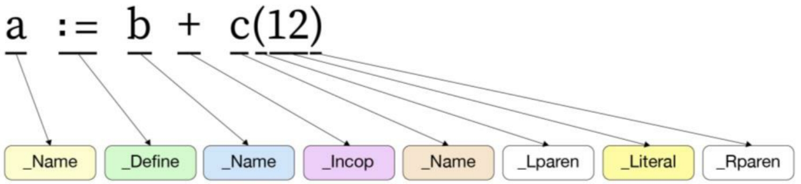
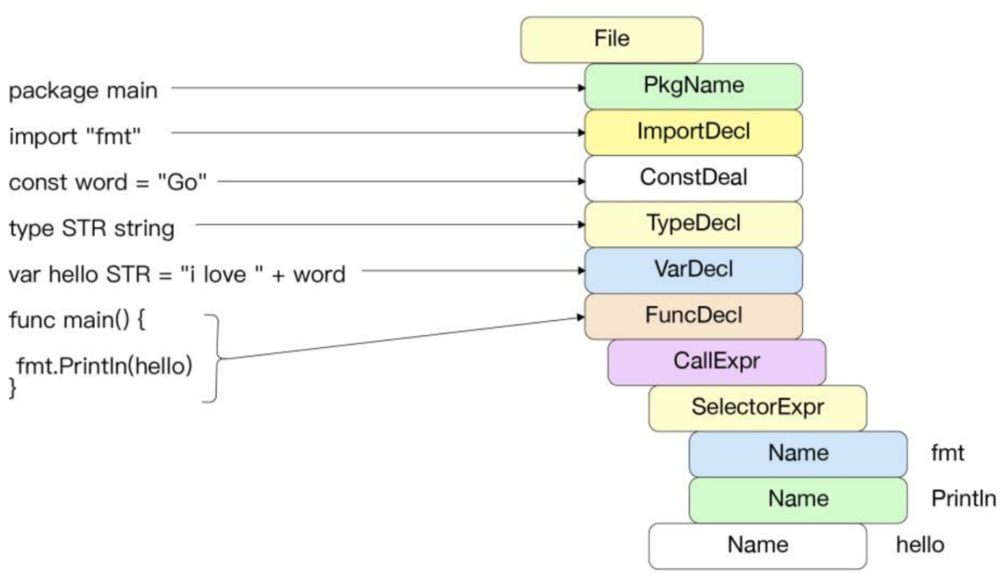

在编译的第一阶段，对源代码进行标记化（词法分析）、解析（语法分析），并为每个源文件构建语法树。

每个语法树都是相应源文件的精确表示，其节点对应于源文件的各种元素，例如表达式、声明和语句。语法树还包括位置信息，用于错误报告和调试信息的创建。

## 词法解析

和 Go 语言编译器有关的代码主要位于 src/cmd/compile/internal目录下，在后面分析中给出的文件路径均默认位于该目录中。

在词法解析阶段，Go 语言编译器会扫描输入的 Go 源文件，并将其符号（token）化。例如“+”和“-”操作符会被转换为 _IncOp，赋值符号“:=”会被转换为 _Define。这些 token 实质上是用 iota 声明的整数，定义在 syntax/tokens.go 中。

符号化保留了 Go 语言中定义的符号，可以识别出错误的拼写。同时，字符串被转换为整数后，在后续的阶段中能够被更加高效地处理。



图 1-3 为一个示例，展现了将表达式 a:=b+c(12）符号化之后的情形。代码中声明的标识符、关键字、运算符和分隔符等字符串都可以转化为对应的符号。

Go 语言标准库 go/scanner、go/token 也提供了许多接口用于扫描源代码。

在下例中，我们将使用这些接口模拟对 Go 文本文件的扫描。

```go
package main

import (
	"fmt"
	"go/scanner"
	"go/token"
)

func main() {
	src := []byte("cos(x) + 2i*sin(x) // Euler")

	var s scanner.Scanner
	fileSet := token.NewFileSet()
	file := fileSet.AddFile("", fileSet.Base(), len(src))
	s.Init(file, src, nil, scanner.ScanComments)

	for {
		pos, tok, lit := s.Scan()
		if tok == token.EOF {
			break
		}
		fmt.Printf("%s\t%s\t%q\n", file.Position(pos), tok, lit)
	}
}
```

```
1:1     IDENT   "cos"
1:4     (       ""
1:5     IDENT   "x"
1:6     )       ""
1:8     +       ""
1:10    IMAG    "2i"
1:12    *       ""
1:13    IDENT   "sin"
1:16    (       ""
1:17    IDENT   "x"
1:18    )       ""
1:20    ;       "\n"
1:20    COMMENT "// Euler"
```

在上例中，src 为进行词法扫描的表达式，可以将其模拟为一个文件并调用 scanner.Scanner 词法，扫描后分别打印出 token 的位置、符号及其字符串字面量。每个标识符与运算符都被特定的 token 代替，例如 2i 被识别为复数 IMAG，注释被识别为 COMMENT。

## 语法解析

词法解析阶段结束后，需要根据 Go 语言中指定的语法对符号化后的 Go 文件进行解析。

Go 语言采用了标准的自上而下的递归下降（Top-Down Recursive-Descent）算法，以简单高效的方式完成无须回溯的语法扫描，核心算法位于 syntax/nodes.go 及 syntax/parser.go 中。



图 1-4 为 Go 语言编译器对文件进行语法解析的示意图。在一个 Go 源文件中主要有包导入声明（import）、静态常量（const）、类型声明（type）、变量声明（var）及函数声明。

源文件中的每一种声明都有对应的语法，递归下降通过识别初始的标识符，例如 _const，采用对应的语法进行解析。这种方式能够较快地解析并识别可能出现的语法错误。

每一种声明语法在 Go 语言规范中都有定义。

```go
//包导入声明
ImportSpec = [ "." | PackageName ] ImportPath .
ImportPath = string_lit .
//静态常量
ConstSpec = IdentifierList [ [ Type ] "=" ExpressionList ] .
//类型声明
TypeSpec = identifier [ "=" ] Type .
//变量声明
VarSpec = IdentifierList ( Type [ "=" ExpressionList ] | "=" ExpressionList ) .
```

函数声明是文件中最复杂的一类语法，因为在函数体的内部可能有多种声明、赋值（例如 :=）、表达式及函数调用等。例如 defer 语法为 defer Expression，其后必须跟一个函数或方法。每一种声明语法或者表达式都有对应的结构体，例如 a:=b+f(89) 对应的结构体为赋值声明 AssignStmt。Op 代表当前的操作符，即“:=”，Lhs 与 Rhs 分别代表左右两个表达式。

```go
AssignStmt = ExpressionList AssignOp ExpressionList .
AssignStmt struct {
	Op Operator
	Lhs, Rhs Expr
	simpleStmt
}
```

语法解析丢弃了一些不重要的标识符，例如括号“(”，并将语义存储到了对应的结构体中。语法声明的结构体拥有对应的层次结构，这是构建抽象语法树的基础。

图 1-5 为 a:= b+c(12) 语句被语法解析后转换为对应的 syntax.AssignStmt 结构体之后的情形。最顶层的 Op 操作符为 token.Def(:=)。Lhs 表达式类型为标识符 syntax.Name，值为标识符“a”。Rhs 表达式为 syntax.Operator 加法运算。加法运算左边为标识符“b”，右边为函数调用表达式，类型为 CallExpr。其中，函数名 c 的类型为 syntax.Name，参数为常量类型 syntax.BasicLit，代表数字 12。


## 抽象语法树构建

编译器前端必须构建程序的中间表示形式，以便在编译器中间阶段及后端使用。抽象语法树（Abstract Syntax Tree，AST）是一种常见的树状结构的中间态。

在 Go 语言源文件中的任何一种 import、type、const、func 声明都是一个根节点，在根节点下包含当前声明的子节点。如下 decls 函数将源文件中的所有声明语句转换为节点（Node）数组。核心逻辑位于 noder/decl.go 中。

```go
func (g *irgen) decls(res *ir.Nodes, decls []syntax.Decl) {
	for _, decl := range decls {
		switch decl := decl.(type) {
		case *syntax.ConstDecl:
			g.constDecl(res, decl)
		case *syntax.FuncDecl:
			g.funcDecl(res, decl)
		case *syntax.TypeDecl:
			if ir.CurFunc == nil {
				continue // already handled in irgen.generate
			}
			g.typeDecl(res, decl)
		case *syntax.VarDecl:
			g.varDecl(res, decl)
		default:
			g.unhandled("declaration", decl)
		}
	}
}
```

每个节点都包含了当前节点属性的Op字段，定义在 ir/node.go 中，以 O 开头。与词法解析阶段中的 token 相同的是，Op 字段也是一个整数。不同的是，每个 Op 字段都包含了语义信息。例如，当一个节点的 Op 操作为 OAS 时，该节点代表的语义为 Left:=Right，而当节点的操作为 OAS2 时，代表的语义为 x, y, z=a, b, c。

```go
// X = Y or (if Def=true) X := Y
// If Def, then Init includes a DCL node for X.
OAS

// Lhs = Rhs (x, y, z = a, b, c) or (if Def=true) Lhs := Rhs
// If Def, then Init includes DCL nodes for Lhs
OAS2
```

以 a:= b+c(12) 为例，该赋值语句最终会变为如图 1-6 所示的抽象语法树。节点之间具有从上到下的层次结构和依赖关系。


```go

```
