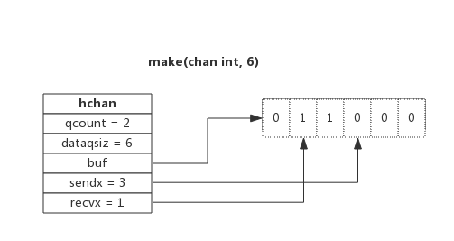
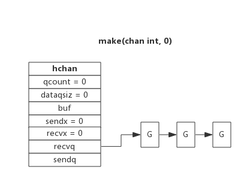
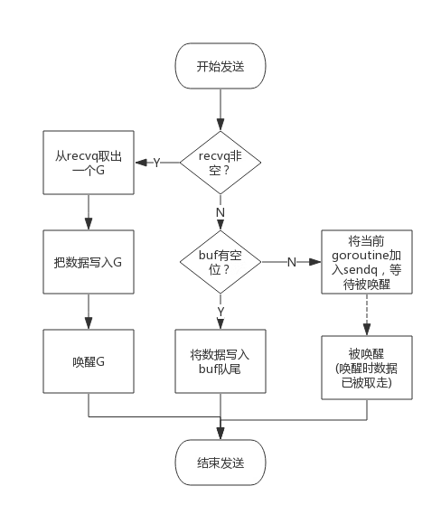
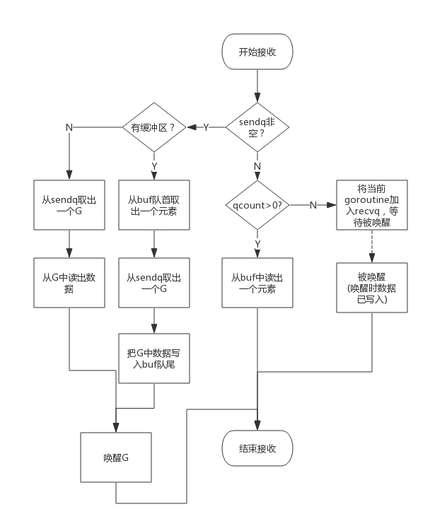

- [数据结构](#数据结构)
  - [环形队列](#环形队列)
  - [等待队列](#等待队列)
  - [类型信息](#类型信息)
  - [锁](#锁)
- [读写](#读写)
  - [创建](#创建)
  - [写数据](#写数据)
  - [读数据](#读数据)
  - [关闭](#关闭)
- [常见用法](#常见用法)
  - [单向](#单向)
  - [select](#select)
  - [range](#range)

## 数据结构

`src/runtime/chan.go:hchan` 定义了 channel 的数据结构：

```go
type hchan struct {
	qcount   uint           // 当前队列中剩余元素个数
	dataqsiz uint           // 环形队列长度，即可以存放的元素个数
	buf      unsafe.Pointer // 环形队列指针
	elemsize uint16         // 每个元素的大小
	closed   uint32	        // 标识关闭状态
	elemtype *_type         // 元素类型
	sendx    uint           // 队列下标，指示元素写入时存放到队列中的位置
	recvx    uint           // 队列下标，指示元素从队列的该位置读出
	recvq    waitq          // 等待读消息的 goroutine 队列
	sendq    waitq          // 等待写消息的 goroutine 队列
	lock mutex              // 互斥锁，chan 不允许并发读写
}
```

从数据结构可以看出 channel 由队列、类型信息、goroutine 等待队列组成，下面分别说明其原理。

###  环形队列

chan 内部实现了一个**环形队列**作为其缓冲区，**队列的长度是创建 chan 时指定的**。

下图展示了一个可缓存 6 个元素的 channel 示意图：



- dataqsiz 指示了队列长度为 6，即可缓存 6 个元素；
- buf 环形队列指针，指向队列的内存；
- qcount 表示队列中还有两个元素；
- sendx 指示后续写入的数据存储的位置，取值[ 0, 6) ；
- recvx 指示从该位置读取数据, 取值[ 0, 6) ；

### 等待队列

从 channel 读数据，如果 channel 缓冲区为空或者没有缓冲区，当前 goroutine 会被阻塞。

向 channel 写数据，如果 channel 缓冲区已满或者没有缓冲区，当前 goroutine 会被阻塞。

被阻塞的 goroutine 将会挂在 channel 的等待队列中：

- 因读阻塞的 goroutine 会被向 channel 写入数据的 goroutine 唤醒；
- 因写阻塞的 goroutine 会被从 channel 读数据的 goroutine 唤醒；

下图展示了一个没有缓冲区的 channel，有几个 goroutine 阻塞等待读数据：



注意，一般情况下 recvq 和 sendq 至少有一个为空。只有一个例外，那就是同一个 goroutine 使用 select 语句向 channel 一边写数据，一边读数据。

### 类型信息

一个 channel 只能传递一种类型的值，类型信息存储在 hchan 数据结构中。

- elemtype 代表类型，用于数据传递过程中的赋值；
- elemsize 代表类型大小，用于在 buf 中定位元素位置。

### 锁

一个 channel 同时仅允许被一个 goroutine 读写。

## 读写

### 创建

创建 channel 的过程实际上是初始化 hchan 结构。

其中类型信息和缓冲区长度由 make 语句传入，buf 的大小则与元素大小和缓冲区长度共同决定。

创建 channel 的伪代码如下所示：

```go
func makechan(t *chantype, size int) *hchan {
	var c *hchan
	c = new(hchan)
	c.buf = malloc(元素类型大小*size)
	c.elemsize = 元素类型大小
	c.elemtype = 元素类型
	c.dataqsiz = size

	return c
}
```

### 写数据

向一个 channel 中写数据简单过程如下：

1. 如果等待接收队列 recvq 不为空，说明缓冲区中没有数据或者没有缓冲区，此时直接从 recvq 取出 G, 并把数据写入，最后把该 G 唤醒，结束发送过程；
2. 如果缓冲区中有空余位置，将数据写入缓冲区，结束发送过程；
3. 如果缓冲区中没有空余位置，将待发送数据写入 G，将当前 G 加入 sendq，进入睡眠，等待被读 goroutine 唤醒；

简单流程图如下：



### 读数据

从一个 channel 读数据简单过程如下：

1. 如果等待发送队列 sendq 不为空，且没有缓冲区，直接从 sendq 中取出 G，把 G 中数据读出，最后把 G 唤醒，结束读取过程；
2. 如果等待发送队列 sendq 不为空，此时说明缓冲区已满，从缓冲区中首部读出数据，把 G 中数据写入缓冲区尾部，把 G 唤醒，结束读取过程；
3. 如果缓冲区中有数据，则从缓冲区取出数据，结束读取过程；
4. 将当前 goroutine 加入 recvq，进入睡眠，等待被写 goroutine 唤醒；

简单流程图如下：



### 关闭

关闭 channel 时会把 recvq 中的 G 全部唤醒，本该写入 G 的数据位置为 nil。把 sendq 中的 G 全部唤醒，但这些 G 会 panic。

除此之外，panic 出现的常见场景还有：

1. 关闭值为 nil 的 channel
2. 关闭已经被关闭的 channel
3. 向已经关闭的 channel 写数据

[对已经关闭的的 chan 进行读写](../.../../../../interview/answers/q018.md)

##  常见用法

### 单向

顾名思义，单向 channel 指只能用于发送或接收数据，实际上也没有单向 channel。

我们知道 channel 可以通过参数传递，所谓单向 channel 只是对 channel 的一种使用限制，这跟 C 语言使用 const 修饰函数参数为只读是一个道理。

- func readChan(chanName <-chan int)：通过形参限定函数内部只能从 channel 中读取数据
- func writeChan(chanName chan<- int)：通过形参限定函数内部只能向 channel 中写入数据

一个简单的示例程序如下：

```go
func readChan(chanName <-chan int) {
    <- chanName
}

func writeChan(chanName chan<- int) {
    chanName <- 1
}

func main() {
    var mychan = make(chan int, 10)

    writeChan(mychan)
    readChan(mychan)
}
```

mychan 是个正常的 channel，而 readChan() 参数限制了传入的 channel 只能用来读，writeChan() 参数限制了传入的 channel 只能用来写。

### select

使用 select 可以监控多 channel，比如监控多个 channel，当其中某一个 channel 有数据时，就从其读出数据。

一个简单的示例程序如下：

```go
package main

import (
    "fmt"
    "time"
)

func addNumberToChan(chanName chan int) {
    for {
        chanName <- 1
        time.Sleep(1 * time.Second)
    }
}

func main() {
    var chan1 = make(chan int, 10)
    var chan2 = make(chan int, 10)

    go addNumberToChan(chan1)
    go addNumberToChan(chan2)

    for {
        select {
        case e := <- chan1 :
            fmt.Printf("Get element from chan1: %d\n", e)
        case e := <- chan2 :
            fmt.Printf("Get element from chan2: %d\n", e)
        default:
            fmt.Printf("No element in chan1 and chan2.\n")
            time.Sleep(1 * time.Second)
        }
    }
}
```

程序中创建两个 channel：chan1 和 chan2。函数 addNumberToChan() 函数会向两个 channel 中周期性写入数据。通过 select 可以监控两个 channel，任意一个可读时就从其中读出数据。

程序输出如下：

```
Get element from chan1: 1
Get element from chan2: 1
No element in chan1 and chan2.
Get element from chan2: 1
Get element from chan1: 1
No element in chan1 and chan2.
Get element from chan2: 1
Get element from chan1: 1
No element in chan1 and chan2.
```

从输出可见，从 channel 中读出数据的顺序是随机的，事实上 select 语句的多个 case 执行顺序是随机的。

select 的 case 语句读 channel 不会阻塞，尽管 channel 中没有数据。这是由于 case 语句编译后调用读 channel 时会明确传入不阻塞的参数，此时读不到数据时不会将当前 goroutine 加入到等待队列，而是直接返回。

### range

通过 range 可以持续从 channel 中读出数据，好像在遍历一个数组一样，当 channel 中没有数据时会阻塞当前 goroutine，与读 channel 时阻塞处理机制一样。

```go
func chanRange(chanName chan int) {
    for e := range chanName {
        fmt.Printf("Get element from chan: %d\n", e)
    }
}
```

注意：如果向此 channel 写数据的 goroutine 退出时，系统检测到这种情况后会 panic，否则 range 将会永久阻塞。

```go

```
