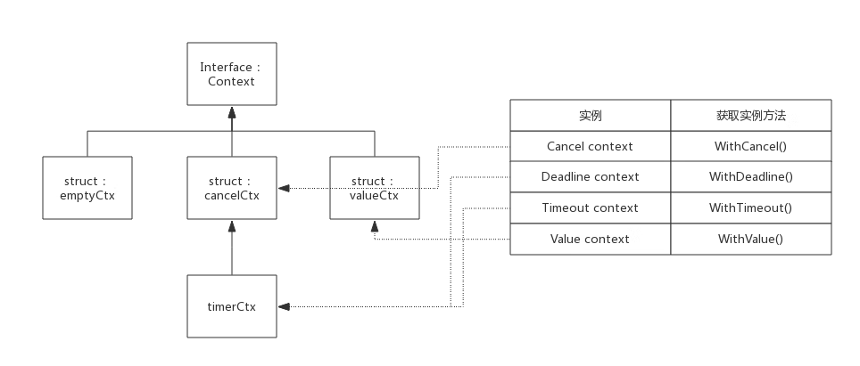

- [前言](#前言)
- [Context 实现原理](#context-实现原理)
- [接口定义](#接口定义)
  - [Deadline()](#deadline)
  - [Done()](#done)
  - [Err()](#err)
  - [Value()](#value)
- [空 context](#空-context)
- [cancelCtx](#cancelctx)
  - [Done() 接口实现](#done-接口实现)
  - [Err() 接口实现](#err-接口实现)
  - [cancel() 接口实现](#cancel-接口实现)
  - [WithCancel() 方法实现](#withcancel-方法实现)
  - [典型案例](#典型案例)
- [timerCtx](#timerctx)
  - [Deadline() 接口实现](#deadline-接口实现)
  - [cancel() 接口实现](#cancel-接口实现-1)
  - [WithDeadline() 方法实现](#withdeadline-方法实现)
  - [WithTimeout() 方法实现](#withtimeout-方法实现)
  - [典型案例](#典型案例-1)
- [valueCtx](#valuectx)
  - [Value() 接口实现](#value-接口实现)
  - [WithValue() 方法实现](#withvalue-方法实现)
  - [典型案例](#典型案例-2)
- [小结](#小结)

## 前言

context 是 Golang 应用开发常用的并发控制技术，它与 WaitGroup 最大的不同点是 context 对于派生 goroutine 有更强的控制力，它可以控制多级的 goroutine。

context 翻译成中文是 "上下文"，即它可以控制一组呈树状结构的 goroutine，每个 goroutine 拥有相同的上下文。


上图中由于 goroutine 派生出子 goroutine，而子 goroutine 又继续派生新的 goroutine，这种情况下使用 WaitGroup 就不太容易，因为子 goroutine 个数不容易确定。而使用 context 就可以很容易实现。

## Context 实现原理

context 实际上只定义了接口，凡是实现该接口的类都可称为是一种 context，官方包中实现了几个常用的 context，分别可用于不同的场景。

## 接口定义

源码包中 `src/context/context.go:Context` 定义了该接口：

```go
type Context interface {
    Deadline() (deadline time.Time, ok bool)
    Done() <-chan struct{}
    Err() error
    Value(key interface{}) interface{}
}
```

基础的 context 接口只定义了 4 个方法，下面分别简要说明一下：

### Deadline()

该方法返回一个 deadline 和标识是否已设置 deadline 的 bool 值，如果没有设置 deadline，则 ok == false，此时 deadline 为一个初始值的 time.Time 值。

### Done()

该方法返回一个 channel，需要在 select-case 语句中使用，如 "case <-context.Done() :"。当 context 关闭后，Done() 返回一个被关闭的管道，关闭的管道仍然是可读的，据此 goroutine 可以收到关闭请求；当 context 还未关闭时，Done() 返回 nil。

### Err()

该方法描述 context 关闭的原因。关闭原因由 context 实现控制，不需要用户设置。比如 Deadline context，关闭原因可能是因为 deadline，也可能提前被主动关闭，那么关闭原因就会不同：

- 因 deadline 关闭：“context deadline exceeded”

- 因主动关闭："context canceled"

- 当 context 关闭后，Err() 返回 context 的关闭原因

- 当 context 还未关闭时，Err() 返回 nil

### Value()

有一种 context，它不是用于控制呈树状分布的 goroutine，而是用于在树状分布的 goroutine 间传递信息。Value() 方法就是用于此种类型的 context，该方法根据 key 值查询 map 中的 value。

## 空 context

context 包中定义了一个空的 context，名为 emptyCtx，用于 context 的根节点，空的 context 只是简单的实现了 Context，本身不包含任何值，仅用于其他 context 的父节点。

emptyCtx 类型定义如下代码所示：

```go
type emptyCtx int

func (*emptyCtx) Deadline() (deadline time.Time, ok bool) {
	return
}

func (*emptyCtx) Done() <-chan struct{} {
	return nil
}

func (*emptyCtx) Err() error {
	return nil
}

func (*emptyCtx) Value(key interface{}) interface{} {
	return nil
}
```

context 包中定义了一个公用的 emptCtx 全局变量，名为 background，可以使用 context.Background() 获取它，实现代码如下所示：

```go
var background = new(emptyCtx)

func Background() Context {
	return background
}
```

context 包提供了 4 个方法创建不同类型的 context，使用这四个方法时如果没有父 context，都需要传入 backgroud，即 backgroud 作为其父节点：

- WithCancel()
- WithDeadline()
- WithTimeout()
- WithValue()

context 包中实现 Context 接口的 struct，除了 emptyCtx 外，还有 cancelCtx、timerCtx 和 valueCtx 三种，正是基于这三种 context 实例，实现了上述 4 种类型的 context。

context 包中各 context 类型之间的关系，如下图所示：



struct cancelCtx、timerCtx、valueCtx 都继承于 Context，下面分别介绍这三个 struct。

## cancelCtx

源码包中 `src/context/context.go:cancelCtx` 定义了该类型context：

```go
type cancelCtx struct {
	Context

	mu       sync.Mutex            // protects following fields
	done     chan struct{}         // created lazily, closed by first cancel call
	children map[canceler]struct{} // set to nil by the first cancel call
	err      error                 // set to non-nil by the first cancel call
}
```

children 中记录了由此 context 派生的所有 child，此 context 被 cancel 时会把其中的所有 child 都 cancel 掉。

cancelCtx 与 deadline 和 value 无关，所以只需要实现 Done() 和 Err() 外露接口即可。

### Done() 接口实现

按照 Context 定义，Done() 接口只需要返回一个 channel 即可，对于 cancelCtx 来说只需要返回成员变量 done 即可。

这里直接看下源码，非常简单
：
```go
func (c *cancelCtx) Done() <-chan struct{} {
	c.mu.Lock()
	if c.done == nil {
		c.done = make(chan struct{})
	}
	d := c.done
	c.mu.Unlock()
	return d
}
```

由于 cancelCtx 没有指定初始化函数，所以 cancelCtx.done 可能还未分配，所以需要考虑初始化。cancelCtx.done 会在 context 被 cancel 时关闭，所以 cancelCtx.done 的值一般经历如下三个阶段：

```
nil --> chan struct{} --> closed chan
```

### Err() 接口实现

按照 Context 定义，Err() 只需要返回一个 error 告知 context 被关闭的原因。对于 cancelCtx 来说只需要返回成员变量 err 即可。

还是直接看下源码：

```go
func (c *cancelCtx) Err() error {
	c.mu.Lock()
	err := c.err
	c.mu.Unlock()
	return err
}
```

cancelCtx.err 默认是 nil，在 context 被 cancel 时指定一个 error 变量： `var Canceled = errors.New("context canceled")`。

### cancel() 接口实现

cancel() 内部方法是理解 cancelCtx 的最关键的方法，其作用是关闭自己和其后代，其后代存储在 cancelCtx.children 的 map 中，其中 key 值即后代对象，value 值并没有意义，这里使用 map 只是为了方便查询而已。

cancel 方法实现伪代码如下所示：

```go
func (c *cancelCtx) cancel(removeFromParent bool, err error) {
    c.mu.Lock()

    c.err = err	                      //设置一个error，说明关闭原因
    close(c.done)                     //将channel关闭，以此通知派生的context

    for child := range c.children {   //遍历所有children，逐个调用cancel方法
        child.cancel(false, err)
    }
    c.children = nil
    c.mu.Unlock()

    if removeFromParent {            //正常情况下，需要将自己从parent删除
        removeChild(c.Context, c)
    }
}
```

实际上，WithCancel() 返回的第二个用于 cancel context 的方法正是此 cancel()。

### WithCancel() 方法实现

WithCancel() 方法作了三件事：

- 初始化一个 cancelCtx 实例
- 将 cancelCtx 实例添加到其父节点的 children 中 ( 如果父节点也可以被 cancel 的话 )
- 返回 cancelCtx 实例和 cancel() 方法

其实现源码如下所示：

```go
func WithCancel(parent Context) (ctx Context, cancel CancelFunc) {
	c := newCancelCtx(parent)
	propagateCancel(parent, &c)   //将自身添加到父节点
	return &c, func() { c.cancel(true, Canceled) }
}
```

这里将自身添加到父节点的过程有必要简单说明一下：

1. 如果父节点也支持 cancel，也就是说其父节点肯定有 children 成员，那么把新 context 添加到 children 里即可；

2. 如果父节点不支持 cancel，就继续向上查询，直到找到一个支持 cancel 的节点，把新 context 添加到 children 里；

3. 如果所有的父节点均不支持 cancel，则启动一个协程等待父节点结束，然后再把当前 context 结束。

### 典型案例

```go
package main

import (
    "fmt"
    "time"
    "context"
)

func HandelRequest(ctx context.Context) {
    go WriteRedis(ctx)
    go WriteDatabase(ctx)
    for {
        select {
        case <-ctx.Done():
            fmt.Println("HandelRequest Done.")
            return
        default:
            fmt.Println("HandelRequest running")
            time.Sleep(2 * time.Second)
        }
    }
}

func WriteRedis(ctx context.Context) {
    for {
        select {
        case <-ctx.Done():
            fmt.Println("WriteRedis Done.")
            return
        default:
            fmt.Println("WriteRedis running")
            time.Sleep(2 * time.Second)
        }
    }
}

func WriteDatabase(ctx context.Context) {
    for {
        select {
        case <-ctx.Done():
            fmt.Println("WriteDatabase Done.")
            return
        default:
            fmt.Println("WriteDatabase running")
            time.Sleep(2 * time.Second)
        }
    }
}

func main() {
    ctx, cancel := context.WithCancel(context.Background())
    go HandelRequest(ctx)

    time.Sleep(5 * time.Second)
    fmt.Println("It's time to stop all sub goroutines!")
    cancel()

    //Just for test whether sub goroutines exit or not
    time.Sleep(5 * time.Second)
}
```

上面代码中协程 HandelRequest() 用于处理某个请求，其又会创建两个协程：WriteRedis()、WriteDatabase()，main 协程创建 context，并把 context 在各子协程间传递，main 协程在适当的时机可以 cancel 掉所有子协程。

## timerCtx

源码包中 `src/context/context.go:timerCtx` 定义了该类型 context：

```go
type timerCtx struct {
	cancelCtx
	timer *time.Timer // Under cancelCtx.mu.

	deadline time.Time
}
```

timerCtx 在 cancelCtx 基础上增加了 deadline 用于标示自动 cancel 的最终时间，而 timer 就是一个触发自动 cancel 的定时器。

由此，衍生出 WithDeadline() 和 WithTimeout()。实现上这两种类型实现原理一样，只不过使用语境不一样：

- deadline : 指定最后期限，比如 context 将 2018.10.20 00 : 00 : 00 之时自动结束
- timeout : 指定最长存活时间，比如 context 将在 30s 后结束。

对于接口来说，timerCtx 在 cancelCtx 基础上还需要实现 Deadline() 和 cancel() 方法，其中 cancel() 方法是重写的。

### Deadline() 接口实现

Deadline() 方法仅仅是返回 timerCtx.deadline 而矣。而 timerCtx.deadline 是 WithDeadline() 或 WithTimeout() 方法设置的。

### cancel() 接口实现

cancel() 方法基本继承 cancelCtx，只需要额外把 timer 关闭。

timerCtx 被关闭后，timerCtx.cancelCtx.err 将会存储关闭原因：

- 如果 deadline 到来之前手动关闭，则关闭原因与 cancelCtx 显示一致；
- 如果 deadline 到来时自动关闭，则原因为："context deadline exceeded"

### WithDeadline() 方法实现

WithDeadline() 方法实现步骤如下：

- 初始化一个 timerCtx 实例
- 将 timerCtx 实例添加到其父节点的 children 中 ( 如果父节点也可以被 cancel 的话 )
- 启动定时器，定时器到期后会自动 cancel 本 context
- 返回 timerCtx 实例和 cancel() 方法

也就是说，timerCtx 类型的 context 不仅支持手动 cancel，也会在定时器到来后自动 cancel。

### WithTimeout() 方法实现

WithTimeout() 实际调用了 WithDeadline，二者实现原理一致。

看代码会非常清晰：

```go
func WithTimeout(parent Context, timeout time.Duration) (Context, CancelFunc) {
	return WithDeadline(parent, time.Now().Add(timeout))
}
```

### 典型案例

```go
package main

import (
    "fmt"
    "time"
    "context"
)

func HandelRequest(ctx context.Context) {
    go WriteRedis(ctx)
    go WriteDatabase(ctx)
    for {
        select {
        case <-ctx.Done():
            fmt.Println("HandelRequest Done.")
            return
        default:
            fmt.Println("HandelRequest running")
            time.Sleep(2 * time.Second)
        }
    }
}

func WriteRedis(ctx context.Context) {
    for {
        select {
        case <-ctx.Done():
            fmt.Println("WriteRedis Done.")
            return
        default:
            fmt.Println("WriteRedis running")
            time.Sleep(2 * time.Second)
        }
    }
}

func WriteDatabase(ctx context.Context) {
    for {
        select {
        case <-ctx.Done():
            fmt.Println("WriteDatabase Done.")
            return
        default:
            fmt.Println("WriteDatabase running")
            time.Sleep(2 * time.Second)
        }
    }
}

func main() {
    ctx, _ := context.WithTimeout(context.Background(), 5 * time.Second)
    go HandelRequest(ctx)

    time.Sleep(10 * time.Second)
}
```

主协程中创建一个 10s 超时的 context，并将其传递给子协程，10s 自动关闭 context。

## valueCtx

源码包中 `src/context/context.go:valueCtx` 定义了该类型 context：

```go
type valueCtx struct {
	Context
	key, val interface{}
}
```

valueCtx 只是在 Context 基础上增加了一个 key-value 对，用于在各级协程间传递一些数据。由于 valueCtx 既不需要 cancel，也不需要 deadline，那么只需要实现 Value() 接口即可。

### Value() 接口实现

由 valueCtx 数据结构定义可见，valueCtx.key 和 valueCtx.val 分别代表其 key 和 value 值。实现也很简单：

```go
func (c *valueCtx) Value(key interface{}) interface{} {
	if c.key == key {
		return c.val
	}
	return c.Context.Value(key)
}
```

这里有个细节需要关注一下，即当前 context 查找不到 key 时，会向父节点查找，如果查询不到则最终返回 interface{}。也就是说，可以通过子 context 查询到父的 value 值。

### WithValue() 方法实现

WithValue() 实现也是非常的简单, 伪代码如下：

```go
func WithValue(parent Context, key, val interface{}) Context {
	if key == nil {
		panic("nil key")
	}
	return &valueCtx{parent, key, val}
}
```

### 典型案例

下面示例程序展示 valueCtx 的用法：

```go
package main

import (
    "fmt"
    "time"
    "context"
)

func HandelRequest(ctx context.Context) {
    for {
        select {
        case <-ctx.Done():
            fmt.Println("HandelRequest Done.")
            return
        default:
            fmt.Println("HandelRequest running, parameter: ", ctx.Value("parameter"))
            time.Sleep(2 * time.Second)
        }
    }
}

func main() {
    ctx := context.WithValue(context.Background(), "parameter", "1")
    go HandelRequest(ctx)

    time.Sleep(10 * time.Second)
}
```

上例 main() 中通过 WithValue() 方法获得一个 context，需要指定一个父 context、key 和 value。然后通将该 context 传递给子协程 HandelRequest，子协程可以读取到 context 的 key-value。

本例中子协程无法自动结束，因为 context 是不支持 cancle 的，也就是说 <-ctx.Done() 永远无法返回。如果需要返回，需要在创建 context 时指定一个可以 cancel 的 context 作为父节点，使用父节点的 cancel() 在适当的时机结束整个 context。

## 小结

- Context 仅仅是一个接口定义，根据实现的不同，可以衍生出不同的 context 类型；

- cancelCtx 实现了 Context 接口，通过 WithCancel() 创建 cancelCtx 实例；

- timerCtx 实现了 Context 接口，通过 WithDeadline() 和 WithTimeout() 创建 timerCtx 实例；

- valueCtx 实现了 Context 接口，通过 WithValue() 创建 valueCtx 实例；

- 三种 context 实例可互为父节点，从而可以组合成不同的应用形式。

```go

```
