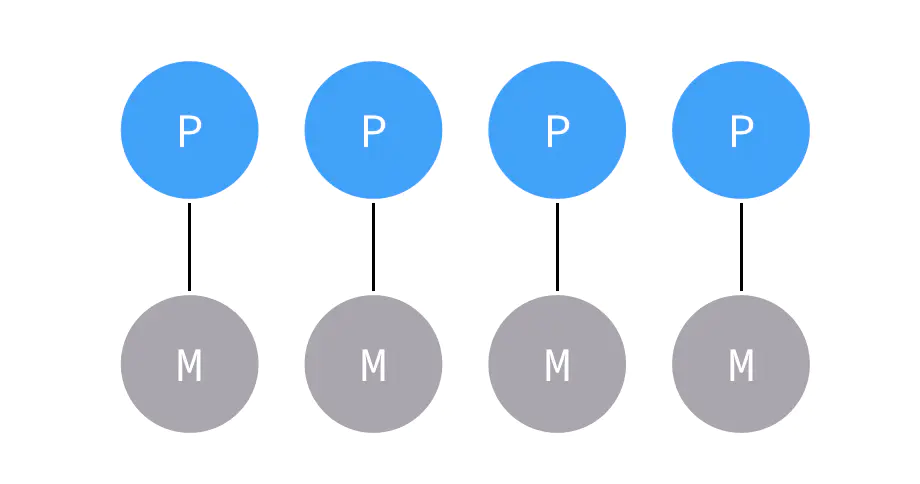
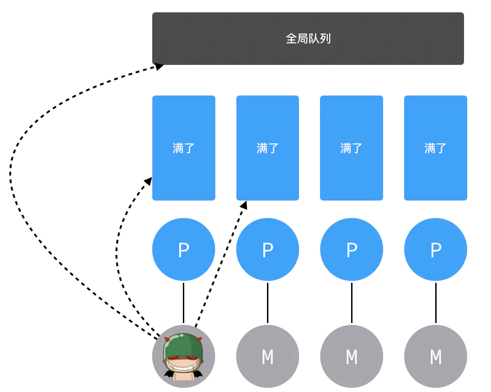
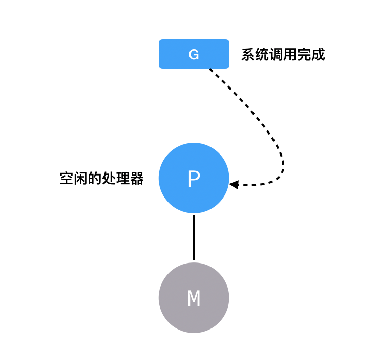

## GPM 调度器

Go 语言天然支持高并发，原因是内部有协程（goroutine）加持，可以在一个进程中启动成千上万个协程。那么，它凭什么做到如此高的并发呢？那就需要先了解什么是并发模型。

## 并发模型

著名的 C++ 专家 Herb Sutter 曾经说过“免费的午餐已经终结”。为了让代码运行的更快，单纯依靠更快的硬件已经无法得到满足，我们需要利用多核来挖掘并行的价值，而并发模型的目的就是来告诉你不同执行实体之间是如何协作的。

当然，不同的并发模型的协作方式也不尽相同，常见的并发模型有七种：

- 线程与锁
- 函数式编程
- Clojure 之道
- Actor
- **通讯顺序进程（CSP）**
- 数据级并行
- Lambda 架构

这里只讲与 Go 语言相关的并发模型 CSP，其他模型可以自行查阅书籍《七周七并发模型》。

### CSP

**CSP**，全称 `Communicating Sequential Processes`，意为**通讯顺序进程**，它是七大并发模型中的一种，它的核心观念是**将两个并发执行的实体通过通道 channel 连接起来，所有的消息都通过 channel 传输**。

Go 语言对 **CSP 并发模型的实现**就是 GPM 调度模型。

### GPM 调度模型

GPM 代表了三个角色，分别是 Goroutine、Processor、Machine。


- Goroutine：表示**用 go 关键字创建的执行体**，它对应一个结构体 g，结构体里保存了 goroutine 的堆栈信息。
- Machine：表示**操作系统的线程**。
- Processor：表示**处理器**，有了它才能建立 G、M 的联系。

### Goroutine

Goroutine 就是代码中使用 go 关键词创建的执行单元，也是大家熟知的有“轻量级线程”之称的协程，**协程是不为操作系统所知的**，它由编程语言层面实现，**上下文切换不需要经过内核态**，再加上协程占用的内存空间极小，所以有着非常大的发展潜力。

```go
go func() {}()
```

复制代码在 Go 语言中，Goroutine 由一个名为 `runtime.g` 的结构体表示，该结构体非常复杂，有 40 多个成员变量，主要存储执行栈、状态、当前占用的线程、调度相关的数据。

```go
type g struct {
	stack struct {
		lo uintptr  			// low 低地址
		hi uintptr				// high 高地址
	} 							// 栈内存：[stack.lo, stack.hi)
	stackguard0	uintptr
	stackguard1 uintptr

	_panic       *_panic
	_defer       *_defer
	m            *m				// 当前的 m
	sched        gobuf
	stktopsp     uintptr		// 期望 sp 位于栈顶，用于回溯检查
	param        unsafe.Pointer // wakeup 唤醒时候传递的参数
	atomicstatus uint32
	goid         int64
	preempt      bool       	// 抢占信号，stackguard0 = stackpreempt 的副本
	timer        *timer         // 为 time.Sleep 缓存的计时器

	...
}
```

Goroutine 调度相关的数据存储在 `sched`，在协程切换、恢复上下文的时候用到。

```go
type gobuf struct {
	sp   uintptr
	pc   uintptr
	g    guintptr
	ret  sys.Uintreg
	...
}
```

### Machine

M 就是对应操作系统的线程，最多会有 GOMAXPROCS 个活跃线程能够正常运行，默认情况下 GOMAXPROCS 被设置为**内核数**，假如有四个内核，那么默认就创建四个线程，每一个线程对应一个 `runtime.m` 结构体。**线程数等于 CPU 个数的原因是，每个线程分配到一个 CPU 上就不至于出现线程的上下文切换，可以保证系统开销降到最低。**

```go
type m struct {
	g0   *g 
	curg *g
	...
}
```

M 里面存了两个比较重要的东西，一个是 `g0`，一个是 `curg`。

- `g0`：会深度参与运行时的调度过程，比如 goroutine 的创建、内存分配等。
- `curg`：代表当前正在线程上执行的 goroutine。

刚才说 P 是负责 M 与 G 的关联，所以 M 里面还要存储与 P 相关的数据。

```go
type m struct {
  ...
	p             puintptr // 正在运行代码的处理器
	nextp         puintptr  // 暂存的处理器
	oldp          puintptr  // 系统调用之前的线程的处理器
}
```

### Proccessor

**Proccessor** 负责 **Machine** 与 **Goroutine** 的连接，它能**提供线程需要的上下文环境，也能分配 G 到它应该去的线程上执行**，有了它，每个 G 都能得到合理的调用。

同样的，处理器的数量也是默认按照 GOMAXPROCS 来设置的，与线程的数量一一对应。

```go
type p struct {
	m           muintptr

	runqhead uint32
	runqtail uint32
	runq     [256]guintptr
	runnext guintptr
	...
}
```

结构体 P 中存储了**性能追踪、垃圾回收、计时器**等相关的字段外，还存储了处理器的待运行队列，队列中存储的是待执行的 Goroutine 列表。

### 三者的关系

首先，**默认启动四个线程四个处理器，然后互相绑定**。



这个时候，一个 Goroutine 结构体被创建，在进行函数体地址、参数起始地址、参数长度等信息以及调度相关属性更新之后，它就要进到一个处理器的队列等待发车。


如果又创建了一个 G 就轮流往其他 P 里面放。


假如有很多 G，都塞满了怎么办呢？那就不把 G 塞到处理器的私有队列里了，而是把它塞到**全局队列**里。


除了往里塞之外，M 这边还要疯狂往外取，**首先去处理器的私有队列里取 G 执行**，如果取完的话就**去全局队列取**，如果全局队列里也没有的话，就**去其他处理器队列里取**。



如果哪里都没找到要执行的G，那M就会和P断开关系，然后休眠。


如果两个 Goroutine 因为 channel 而阻塞住了，M 会去找别的 G 执行。


## 系统调用

**如果 G 进行了系统调用 syscall，M 也会跟着进入系统调用状态**，那么这个 P 留在这里就浪费了，怎么办呢？这点精妙之处在于，**P 不会傻傻的等待 G 和 M 系统调用完成，而会去找其他比较闲的 M 执行其他的 G**。


当 G 完成了系统调用，因为要继续往下执行，所以必须要再找一个空闲的处理器工作。



如果没有空闲的处理器了，那就只能把 G 放回全局队列当中等待分配。


## sysmon

sysmon 是一个 M，又叫监控线程，不需要 P 就可以独立运行，每 20us ~ 10ms 会被唤醒一次出来工作，主要就是回收垃圾、回收长时间系统调度阻塞的 P、向长时间运行的 G 发出抢占调度等等。
