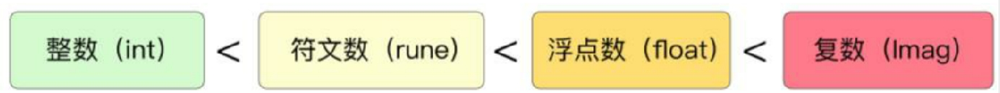

## 常量声明与生存周期

在 Go 语言中使用 const 关键字来声明常量，在声明时可以指定或省略类型。

```go
const untypedInteger = 12345
const untypedFloatingPoint = 3.141592
const typedIntegerInt = 112345
const typedFloatingPoint float64 = 3.141592
```

其中，等式左边的常量叫作命名常量，等式右边的常量叫作未命名常量，拥有未定义的类型。当有足够的内存来存储整数值时，可以始终精确地表示整数。由于 Go 语言规范中要求整数常量至少能够存储 256 位，因此在实际中 Go 语言能涵盖几乎所有的整数常量。

为了获得精确的浮点数，编译器可以采用不同的策略和选项。

Go语言规范未说明编译器必须如何执行此操作，但给出了一些强制性的要求：

- 如果浮点数以`(1+mantissa)x(2^exponent)`表示，那么 mantissa 至少能表示 256 位的小数，而 exponent 至少能够用 16 bits 表示。
- 如果由于溢出而无法表示浮点数或复数常量，则报错。
- 如果由于精度限制而无法表示浮点数，则四舍五入表示为最接近的可表示常量。

以下是不同编译器实现精确浮点数的两种策略：

- 将所有浮点数表示为分数，并对这些分数进行有理运算。这些浮点数永远不会损失任何精度。
- 使用高精度浮点数。当使用具有数百位精度的浮点数时，精确值和近似值之间的差异几乎可以忽略。

可以看到，在 Go 语言编译器中使用了大数包 math/big 来处理编译时的大整数和更高精度的浮点数。

未命名常量只会在编译期间存在，因此其不会存储在内存中，而命名常量存在于**内存静态只读区**，不能被修改。同时，Go 语言禁止了对常量取地址的操作，因此尝试对常量寻址的代码是错误的。

## 常量类型转换

常量可以进行类型推断，在转换为具体的类型之前，Go 语言编译时会使用一种高精度的结构存储常量。

### 隐式整数转换

在 Go 语言中，变量之间没有隐式类型转换，不同的类型之间只能强制转换。但是，编译器可以进行变量和常量之间的隐式类型转换。

如下所示，将整数常量 123 隐式转换为 int。由于常量不使用小数点或指数，因此采用的类型为整数。只要不需要截断，就可以将类型为整数的未命名常量隐式转换为有符号和无符号命名常量。

```go
var i int = 123
```

如果常量使用与整数兼容的类型，也可以将浮点常量隐式转换为整数变量：

```go
var i int = 123.0
```

但是下面的转换是不可行的，无法对常量进行截断。

```go
var i int = 123.5
```

### 隐式浮点数转换

如下所示，编译器可以将类型为小数的未命名常量 0.333 隐式转换为单精度或双精度类型的浮点数。

```go
var f float32 = 0.333
```

另外，编译器可以在整数常量与 float64 变量之间进行隐式转换。

```go
var f float64 = 123
```

### 常量运算中的隐式转换

常量与变量之间的运算在程序中最常见，它遵循 Go 语言规范中运算符的规则。该规则规定，除非操作涉及位运算或未定义的常量，否则操作数两边的类型必须相同。这意味着常量在进行运算时，操作数两边的类型不一定相同，如下所示。

```go
var i = 3 * 0.333
```

在Go语言规范中，对于常量表达式也制定了专门的规则。除了移位操作，如果操作数两边是不同类型的无类型常量，则结果类型的优先级为：整数(int)<符文数(rune)<浮点数(float)<复数(Imag)。根据此规则，上面两个常数之间相乘的结果将是一个浮点数，因为浮点数的优先级比整数高。下面的例子结果为浮点数。

```go
const i  = 1 / 0.3
```

下面的例子将在整数常量之间进行除法运算，结果必然是一个整数常量。由于 3 除 1 的值小于 1，因此该除法的结果为整数常量。

```go
const i = 1 / 3
```

### 常量与变量之间的转换

常量与具体类型的变量之间的运算，会使用已有的具体类型。例如下例中常量 p 为 float64，常量 2 会转换为和 b 相同的类型。

```go
const b float32 = 3
var p = b * 1
```

下面的例子会报错，因为 2.3 不能转换为 b 的类型 int。

```go
const b int = 3
var p = b * 2.3
```

### 自定义类型的转换

当常量转换涉及用户自定义的类型时，会变得更加复杂。

下例中声明了一个新类型，称为 Numbers，其基本类型为 int8。接着以 Numbers 声明常量 One，并分配整数类型的常量 1。最后声明常量 Two，常量 Two 通过未命名常量 2 和 Numbers 类型的常量 One 相乘转换为了 Numbers 类型。

```go
package main

import "fmt"

type Numbers int8

const One Numbers = 1
const Two = 2 * One

func main() {
	fmt.Printf("type: %T value: %v", Two, Two)
}
```

```
type: main.Numbers value: 2
```

## 常量与隐式类型转换原理

常量以及常量具有的一系列隐式类型转换需要借助 Go 语言编译器完成。对于涉及常量的运算，统一在编译时类型检查阶段完成，由 compile/internal/typecheck/const.defaultlit2 函数进行统一处理。

```go
// DefaultLit on both nodes simultaneously;
// if they're both ideal going in they better
// get the same type going out.
// force means must assign concrete (non-ideal) type.
// The results of defaultlit2 MUST be assigned back to l and r, e.g.
//
//	n.Left, n.Right = defaultlit2(n.Left, n.Right, force)
func defaultlit2(l ir.Node, r ir.Node, force bool) (ir.Node, ir.Node) {
	if l.Type() == nil || r.Type() == nil {
		return l, r
	}

	if !l.Type().IsInterface() && !r.Type().IsInterface() {
		// Can't mix bool with non-bool, string with non-string.
		if l.Type().IsBoolean() != r.Type().IsBoolean() {
			return l, r
		}
		if l.Type().IsString() != r.Type().IsString() {
			return l, r
		}
	}

	if !l.Type().IsUntyped() {
		r = convlit(r, l.Type())
		return l, r
	}

	if !r.Type().IsUntyped() {
		l = convlit(l, r.Type())
		return l, r
	}

	if !force {
		return l, r
	}

	// Can't mix nil with anything untyped.
	if ir.IsNil(l) || ir.IsNil(r) {
		return l, r
	}
	t := defaultType(mixUntyped(l.Type(), r.Type()))
	l = convlit(l, t)
	r = convlit(r, t)
	return l, r
}
```

在 defaultlit2 函数的参数中，l 代表操作符左边的节点，r 代表操作符右边的节点。函数首先判断操作符左节点有无类型，如果有，则将操作符右边的类型转换成左边的类型。

要注意的是，并不是所有的类型组合都能进行隐式转换。如下例中，字符串不能和非字符串进行组合，布尔类型不能和其他类型进行组合，nil 不能和其他类型进行组合。

```go
a := "hello" + 1
b := true + 1
c := nil + 1
```

如果操作符左节点无类型，右节点有类型，则将左边的类型转换为右边的类型。小数的浮点表示法优先级如图 4-1 所示。



如果操作符左、右节点都无具体类型，则根据整数(int)< 符文数(rune)< 浮点数(float)< 复数(Imag)的优先级决定类型的转换。

```go

```
