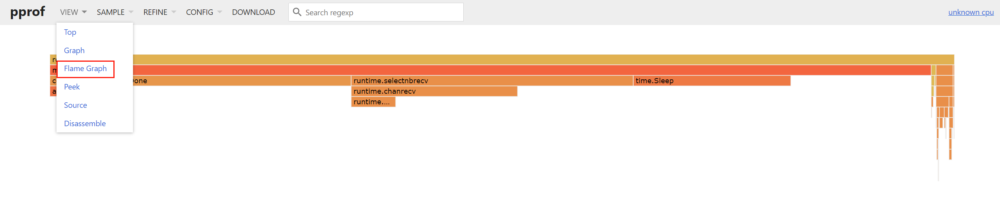

在通过 pprof 进行特征分析时，需要执行两个步骤：收集样本和分析样本。收集样本有两种方式。

## 收集样本

### 通过 HTTP 接口收集样本

一种是引用 net/http/pprof 并在程序中开启 http 服务器，net/http/pprof 会在初始化 init 函数时注册路由。

```go
package main

import (
	"context"
	"net/http"
	_ "net/http/pprof"
)

func main() {
	go http.ListenAndServe(":6060", nil)

	ctx, cancel := context.WithCancel(context.Background())

	http.HandleFunc("/", func(w http.ResponseWriter, r *http.Request) {
		w.Write([]byte("Hello, world!"))
	})

	http.HandleFunc("/exit", func(w http.ResponseWriter, r *http.Request) {
		cancel()
	})

	go http.ListenAndServe(":8080", nil)

	<-ctx.Done()
}
```

获取不同类型的特征文件需要调用不同的http接口，例如要获取程序在30s内占用CPU的情况，需要调用：

```bash
curl http://localhost:6060/debug/pprof/profile?seconds=30 > cpu.pprof
```

获取所有的协程堆栈信息需要调用：

```bash
curl http://localhost:6060/debug/pprof/goroutine > goroutine.pprof
```

获取堆内存使用情况需要调用：

```bash
curl http://localhost:6060/debug/pprof/heap > heap.pprof
```

获取内存分配情况需要调用：

```bash
curl http://localhost:6060/debug/pprof/allocs > allocs.pprof
```

通过 http 收集样本是在实践中最常见的方式，但有时可能不太适合，例如对于一个测试程序或只跑一次的定时任务。

### 通过调用函数收集样本

另一种方式是直接在代码中需要分析的位置嵌入分析函数，如下例中调用 runtime/pprof 的 StartCPUProfile 函数，这样，在程序调用 StopCPUProfile 函数停止之后，即可指定特征文件保存的位置。

```go
package main

import (
	"context"
	"log"
	"net/http"
	"os"
	"runtime/pprof"
)

func main() {
	f, err := os.Create("cpu.prof")
	if err != nil {
		log.Fatal(err)
	}

	if err = pprof.StartCPUProfile(f); err != nil {
		log.Fatal(err)
	}

	defer pprof.StopCPUProfile()

	ctx, cancel := context.WithCancel(context.Background())

	http.HandleFunc("/", func(w http.ResponseWriter, r *http.Request) {
		w.Write([]byte("Hello, world!"))
	})

	http.HandleFunc("/exit", func(w http.ResponseWriter, r *http.Request) {
		cancel()
	})

	go http.ListenAndServe(":8080", nil)

	<-ctx.Done()
}
```

## 分析样本

获取特征文件后开始具体的分析，需要使用工具 go tool pprof 将特征文件保存到 heap.out 并分析，如下所示。

```bash
curl -o heap.out http://localhost:6060/debug/pprof/heap
```

```bash
go tool pprof heap.out
```

### 堆内存特征分析

当执行 pprof 分析堆内存的特征文件时，默认的类型为 inuse_space，代表分析程序正在使用的内存，最后一行会出现等待进行交互的命令。

```
go tool pprof heap.out
```

```
Type: inuse_space
Time: Oct 11, 2022 at 1:25pm (CST)
Entering interactive mode (type "help" for commands, "o" for options)
(pprof)
```

交互命令有许多，可以通过 help 指令查看，下面介绍比较常用的几种。

top 会列出以 flat 列从大到小排序的序列。其中 flat 代表当前函数统计的值，不同的类型有不同的含义。这里是 heap inuse_space 模式，展示了当前函数分配的堆区正在使用的内存大小。cum 是一个累积的概念，指当前函数及其调用的一系列函数 flat 的和。flat 只包含当前函数的栈帧信息，不包括其调用函数的栈帧信息。cum 字段正好弥补了这一点，flat% 和 cum% 分别表示 flat 和 cum 字段占总字段的百分比。

```go
(pprof) top
```

```
Showing nodes accounting for 1024.70kB, 100% of 1024.70kB total
Showing top 10 nodes out of 13
      flat  flat%   sum%        cum   cum%
  512.50kB 50.01% 50.01%   512.50kB 50.01%  runtime.allocm
  512.20kB 49.99%   100%   512.20kB 49.99%  runtime.malg
         0     0%   100%   512.50kB 50.01%  runtime.mstart
         0     0%   100%   512.50kB 50.01%  runtime.mstart0
         0     0%   100%   512.50kB 50.01%  runtime.mstart1
         0     0%   100%   512.50kB 50.01%  runtime.newm
         0     0%   100%   512.20kB 49.99%  runtime.newproc.func1
         0     0%   100%   512.20kB 49.99%  runtime.newproc1
         0     0%   100%   512.50kB 50.01%  runtime.resetspinning
         0     0%   100%   512.50kB 50.01%  runtime.schedule
```

可以使用 list Func 可以列出函数的信息，这种方式精准地显示了具体的内存分配发生在哪一行。

还有一种比较常用的 tree 指令，用于打印函数的调用链，能够得到函数调用的堆栈信息。

之前曾提到，alloc 这 -pprof 类型很少被使用，因为可以用 heap 代替它。在 heap 中，可以显示 4 种不同的类型，分别是 alloc_objects、alloc_space、inuse_objects、inuse_space，其中 alloc_objects 与 inuse_objects 分别代表已经被分配的对象和正在使用的对象的数量，alloc_objects 没有考虑对象的释放情况。要切换展示的类型很简单，只需要输入对应的指令即可，例如输入 alloc_objects 后再次输入 top 指令会看到 flat 代表的不再是分配的内存大小，而是分配内存的次数。

proof 工具还提供了强大的可视化功能，可以生成便于查看的图片或 html 文件。

```go
choco install Graphviz
```

但实现这种功能需要首先安装 graphviz ——开源的可视化工具，安装完成后，输入 web 即可在浏览器中显示出图 21-1 所示内存分配次数的可视化结果。png、gif 等指令可以将可视化结果保存为不同的图片格式。


从图中能够直观地看出当前函数的调用链及内存分配数量和比例，从而找出程序中内存分配的关键部分。

### 可视化结果说明


- 节点颜色：红色代表累计值 cum 为正，并且很大；绿色代表累计值 cum 为负，并且很大；灰色代表累计值 cum 可以忽略不计。
- 节点字体大小：较大的字体表示较大的当前值；较小的字体表示较小的当前值。
- 边框颜色：当前值较大并且为正数时为红色；当前值较小并且为负数时为绿色；接近 0 的当前值为灰色。
- 箭头大小：箭头越粗代表当前的路径消耗了越多的资源；箭头越细代表当前的路径消耗了越少的资源。
- 箭头线型：虚线箭头表示两个节点之间的某些节点已被忽略，为间接调用；
实线箭头表示两个节点之间为直接调用。

### 协程栈分析

除了堆内存分析，协程栈使用得也比较多。分析协程栈有两方面的作用，一是查看协程的数量，查看协程是否泄漏。二是查看当前大量的协程在执行哪些函数，判断当前协程是否健康。

```go
package main

import (
	"context"
	"net/http"
	_ "net/http/pprof"
	"time"
)

func main() {
	go http.ListenAndServe(":6060", nil)

	ctx, cancel := context.WithCancel(context.Background())
	defer cancel()

	for i := 0; i < 1000; i++ {
		go func(i int) {
			for {
				select {
				case <-ctx.Done():
					return
				default:
					time.Sleep(time.Duration(i) * time.Second)
				}

				if i == 999 {
					cancel()
				}
			}
		}(i)
	}

	<-ctx.Done()
}
```

上面是一个简单的例子，使用 pprof 工具查看程序运行信息如下所示。

```shell
go tool pprof http://localhost:6060/debug/pprof/goroutine
```

```
Fetching profile over HTTP from http://localhost:6060/debug/pprof/goroutine
Saved profile in C:\Users\Admin\pprof\pprof.goroutine.001.pb.gz
Type: goroutine
Time: Oct 11, 2022 at 1:46pm (CST)
Entering interactive mode (type "help" for commands, "o" for options)
(pprof) top
Showing nodes accounting for 1003, 99.90% of 1004 total
Dropped 31 nodes (cum <= 5)
      flat  flat%   sum%        cum   cum%
      1002 99.80% 99.80%       1002 99.80%  runtime.gopark
         1   0.1% 99.90%       1000 99.60%  time.Sleep
         0     0% 99.90%       1000 99.60%  main.main.func1
```

大部分协程都在 runtime.gopark 函数中。

runtime.gopark 是协程的休眠函数，要进一步查看程序是否异常可以使用 list 指令或者 tree 指令。

### base 基准分析

除了查看协程栈帧数据，goroutine profile 还有一个用处是排查协程的泄露。通过对比协程的总数可以简单评估出程序是否陷入了泄露状态。另外，pprof 提供了更强大的工具用于对比前后特征文件的不同。

下例使用了 -base 标志，后跟基准特征文件。可以看出，后一个基准特征文件比前一个基准特征文件多了 15 个协程，其中 12 个协程都处于执行 runtime.gopark 阶段，可以根据实际的程序判断协程是否已经泄漏。

```bash
go tool pprof -base http://localhost:6060/debug/pprof/goroutine
```

### mutex 堵塞分析

和 block 类似，mutex 主要用于查看锁争用导致的休眠时间，这有助于排查由于锁争用导致 CPU 利用率不足的问题，这两种特征不经常被使用。

```bash
go tool pprof http://localhost:6060/debug/pprof/mutex
```

### CPU 占用分析

执行如下指令进行 CPU 占用分析，其中 seconds 参数指定一共要分析的时间。下例表明将花费 20s 收集特征信息。

```bash
go tool pprof http://localhost:6060/debug/pprof/profile?seconds=20
```

## 火焰图分析

火焰图可以快速准确地识别出最频繁使用的代码路径，从而得知程序的瓶颈所在。在 Go 1.11 之后，火焰图已经内置到了 pprof 分析工具中，用于分析堆内存与 CPU 的使用情况。

如下所示，可以简单地通过 pprof 工具查看火焰图。其中， -http 表示开启 pprof 内置的 http 服务器，:6061 代表监听的 IP 地址与端口。

```bash
go tool pprof -http ':6061' 'http://localhost:6060/debug/pprof/profile?seconds=20'
```

在收集程序 20s 的 CPU 信息后，对应的 web 页面会自动打开。web 页面的最上方为导航栏，可以查看之前提到的许多 pprof 分析指标，点击导航栏中的 VIEW 菜单下的 Flame Graph 选项，可以切换到火焰图，如图 21-4 所示。



以 CPU 火焰图为例说明如下：

- 最上方的 root 框代表整个程序的开始，其他的框都代表一个函数。
- 火焰图每一层中的函数都是平级的，下层函数是其对应的上层函数的子函数。
- 函数调用栈越长，火焰就越高。
- 框越长、颜色越深，代表当前函数占用 CPU 时间越久。
- 可以单击任何框，查看该函数更详细的信息。

## pprof 底层原理

[pprof 底层原理](underlying_principle.md)

```go

```
