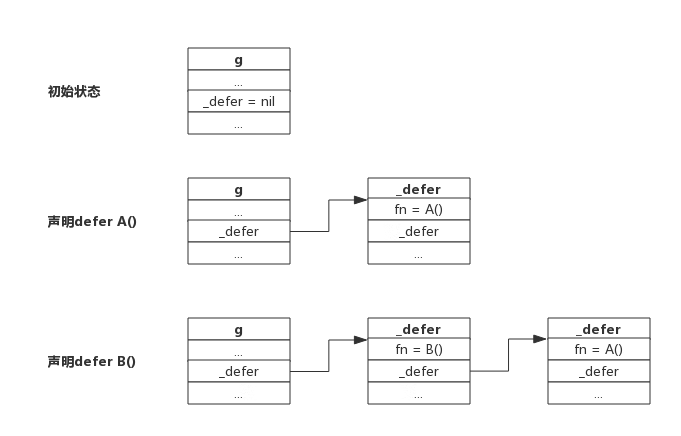

defer 的语法形式为 defer Expression，其后必须紧跟一个函数调用或者方法调用，不能用括号括起来。在很多时候，defer 后的函数以匿名函数或闭包的形式呈现，例如：

```go
defer func() {
    // ...
}()
```

defer 将其后的函数推迟到了其所在函数返回之前执行。

不管 defer 函数后的执行路径如何，最终都将被执行。在 Go 语言中，defer 一般被用于资源的释放及异常 panic 的处理。

- [优势](#优势)
  - [资源释放](#资源释放)
  - [异常处理](#异常处理)
- [特性](#特性)
  - [延迟执行](#延迟执行)
  - [参数预计算](#参数预计算)
  - [执行顺序](#执行顺序)
- [返回值陷阱](#返回值陷阱)
  - [函数返回过程](#函数返回过程)
  - [主函数拥有匿名返回值，返回字面值](#主函数拥有匿名返回值返回字面值)
  - [主函数拥有匿名返回值，返回变量](#主函数拥有匿名返回值返回变量)
  - [主函数拥有具名返回值](#主函数拥有具名返回值)
- [defer 底层原理](#defer-底层原理)

## 优势

### 资源释放

在 Go 语言中，资源的释放是通过 defer 语句来实现的。例如，当我们打开一个文件时，我们需要在使用完毕后关闭它，否则会造成资源泄露。在 Go 语言中，我们可以通过 defer 语句来实现：

```go
func main() {
    file, err := os.Open("test.txt")
    if err != nil {
        fmt.Println(err)
        return
    }
    defer file.Close()
    // ...
}
```

在上面的代码中，我们通过 defer 语句将文件关闭的操作推迟到了 main 函数返回之前执行。这样，我们就可以在 main 函数中使用 file 变量了，而不用担心文件关闭的问题。

同样的问题也存在于锁的释放中，一旦在加锁后发生了错误，就需要在每个错误的地方都加锁，否则会出现严重的死锁问题。

Go 语言中的 defer 特性能够很好地解决这一类资源释放问题，不管 defer 后面的执行路径如何，defer 中的语句都将执行。

defer 是一种优雅的关闭资源的方式，能减少大量冗余的代码并避免由于忘记释放资源而产生的错误。

### 异常处理

在 Go 语言中，异常的处理是通过 panic 和 recover 来实现的。panic 用于抛出异常，recover 用于捕获异常。在 Go 语言中，我们可以通过 defer 语句来实现异常的捕获：

```go
func main() {
    defer func() {
        if err := recover(); err != nil {
            fmt.Println(err)
        }
    }()
    panic("error")
}
```

在上面的代码中，我们通过 defer 语句将 recover 函数推迟到了 main 函数返回之前执行。这样，我们就可以在 main 函数中捕获 panic 抛出的异常了。

手动执行 panic 函数触发了异常。当异常触发后，函数仍然会调用 defer 中的函数，然后异常退出。

## 特性

### 延迟执行

defer 语句会将其后的函数推迟到函数返回之前执行。在 defer 语句中，函数的参数会立即求值，但是在外层函数返回前函数都不会被调用。

```go
func main() {
    i := 0
    defer fmt.Println(i)
    i++
    return
}
```

在上面的代码中，我们将 fmt.Println(i) 推迟到了 main 函数返回之前执行。在 defer 语句中，i 的值为 0，但是在 main 函数返回前，i 的值已经变为 1 了。因此，defer 语句中的函数会打印出 0。

### 参数预计算

```go
package main

import "fmt"

func main() {
	for i := 0; i < 100; i++ {
		defer fmt.Println(i)
		defer func() {
			fmt.Println(i)
		}()
	}
}
```

第一个 defer 语句中的 fmt.Println() 参数 i 值在 defer 出现时就已经确定下来，实际上是拷贝了一份。后面对变量 i 的修改不会影响 fmt.Println() 函数的执行，仍然打印" 0 "。

第二个 defer 语句则是闭包，遵循闭包的规则，打印的是最后一次循环的值。

参数的预计算指当函数到达 defer 语句时，**延迟调用的参数将立即求值**，传递到 defer 函数中的参数将预先被固定，而不会等到函数执行完成后再传递参数到 defer 中。

对于指针类型参数，规则仍然适用，只不过延迟函数的参数是一个地址值，这种情况下，defer 后面的语句对变量的修改可能会影响延迟函数。

### 执行顺序

defer 语句的执行顺序是后进先出，也就是说，最后一个 defer 语句的函数会最先执行，最先声明的 defer 语句的函数会最后执行。

```go
func main() {
    defer fmt.Println("1")
    defer fmt.Println("2")
    defer fmt.Println("3")
}
```

在上面的代码中，我们将 fmt.Println("1")、fmt.Println("2") 和 fmt.Println("3") 推迟到了 main 函数返回之前执行。因为 defer 语句的执行顺序是后进先出，所以最后一个 defer 语句的函数会最先执行，最先声明的 defer 语句的函数会最后执行。因此，上面的代码会依次打印出 3、2、1。

defer 后面一定要接一个函数的，所以 defer 的数据结构跟一般函数类似，也有栈地址、程序计数器、函数地址等等。

与函数不同的一点是它含有一个指针，可用于指向另一个 defer，每个 goroutine 数据结构中实际上也有一个 defer 指针，该指针指向一个 defer 的单链表，每次声明一个 defer 时就将 defer 插入到单链表表头，每次执行 defer 时就从单链表表头取出一个 defer 执行。

下图展示多个 defer 被链接的过程：



从上图可以看到，新声明的 defer 总是添加到链表头部。函数返回前执行 defer 则是从链表首部依次取出执行。

一个 goroutine 可能连续调用多个函数，defer 添加过程跟上述流程一致，进入函数时添加 defer，离开函数时取出 defer，所以即便调用多个函数，也总是能保证 defer 是按 LIFO 方式执行的。

## 返回值陷阱

延迟函数可能操作主函数的具名返回值。

### 函数返回过程

关键字 *return* 不是一个原子操作，实际上 *return* 只代理汇编指令 *ret*，即将跳转程序执行。比如语句 `return i`，实际上分两步进行，即将 i 值存入栈中作为返回值，然后执行跳转，而 defer 的执行时机正是跳转前，所以说 defer 执行时还是有机会操作返回值的。

举个实际的例子进行说明这个过程：

```go
func deferFuncReturn() (result int) {
    i := 1

    defer func() {
       result++
    }()

    return i
}
```

该函数的 return 语句可以拆分成下面两行：

```go
result = i
return
```

而延迟函数的执行正是在 return 之前，即加入 defer 后的执行过程如下：

```go
result = i
result++
return
```

所以上面函数实际返回 i++ 值。

关于主函数有不同的返回方式，但返回机制就如上机介绍所说，只要把 return 语句拆开都可以很好的理解，下面分别举例说明

### 主函数拥有匿名返回值，返回字面值

一个主函数拥有一个匿名的返回值，返回时使用字面值，比如返回"1"、"2"、"Hello"这样的值，这种情况下 defer 语句是无法操作返回值的。

一个返回字面值的函数，如下所示：

```go
func foo() int {
    var i int

    defer func() {
        i++
    }()

    return 1
}
```

上面的 return 语句，直接把 1 写入栈中作为返回值，延迟函数无法操作该返回值，所以就无法影响返回值。

### 主函数拥有匿名返回值，返回变量

一个主函数拥有一个匿名的返回值，返回使用本地或全局变量，这种情况下 defer 语句可以引用到返回值，但不会改变返回值。

一个返回本地变量的函数，如下所示：

```go
func foo() int {
    var i int

    defer func() {
        i++
    }()

    return i
}
```

上面的函数，返回一个局部变量，同时 defer 函数也会操作这个局部变量。对于匿名返回值来说，可以假定仍然有一个变量存储返回值，假定返回值变量为"anony"，上面的返回语句可以拆分成以下过程：

```go
anony = i
i++
return
```

由于 i 是整型，会将值拷贝给 anony，所以 defer 语句中修改 i 值，对函数返回值不造成影响。

### 主函数拥有具名返回值

主函声明语句中带名字的返回值，会被初始化成一个局部变量，函数内部可以像使用局部变量一样使用该返回值。如果 defer 语句操作该返回值，可能会改变返回结果。

一个影响函返回值的例子：

```go
func foo() (ret int) {
    defer func() {
        ret++
    }()

    return 0
}
```

上面的函数拆解出来，如下所示：

```go
ret = 0
ret++
return
```

函数真正返回前，在 defer 中对返回值做了 +1 操作，所以函数最终返回 1。

## defer 底层原理

[defer 底层原理](underlying_principle.md)

```go

```
