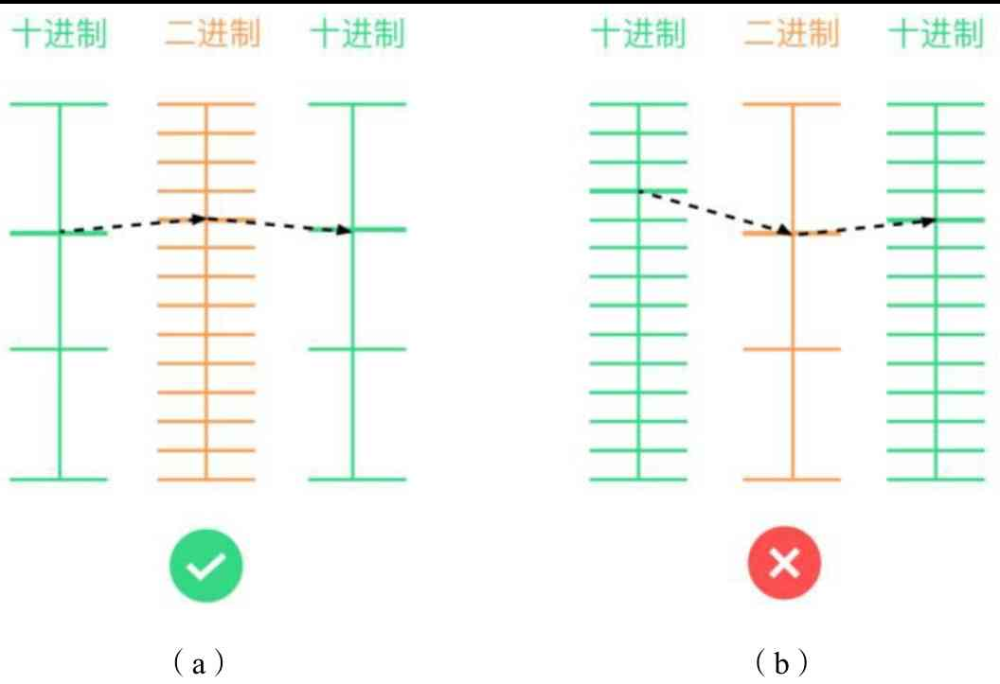
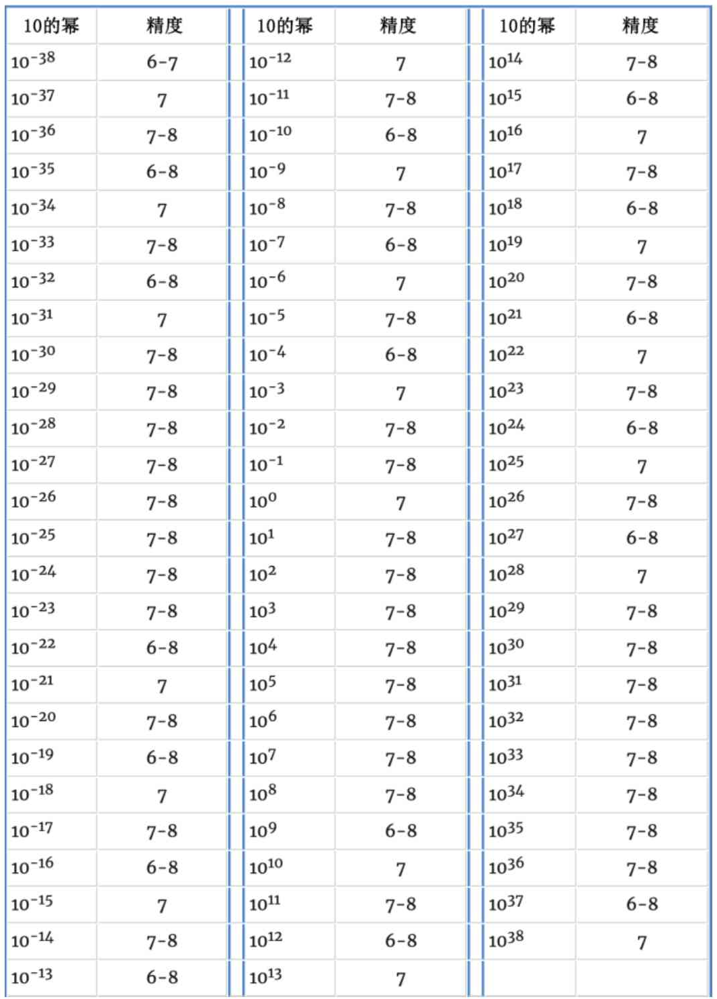

浮点数，英文全称是 `floating-point number`，是计算机科学中的一种数值类型，用于表示实数。浮点数的表示方法是将一个实数分解为一个尾数和一个指数，尾数是一个小数，指数是一个整数，尾数的取值范围是 [1, 10) 或 [0.1, 1)，指数的取值范围是整数，尾数和指数的乘积就是实数。

## 浮点数陷阱

整数数据类型（如 int32、int64）无法表示小数，而浮点数能够在程序中高效表示和计算小数，但是在表示和计算的过程中可能丢失精度。

以下面的一段简单程序为例，有人会天真地认为其输出结果是 0.9，但实际的输出结果是 0.8999999999999999。

```go
package main

import "fmt"

func main() {
	var f1 float64 = 0.3
	var f2 float64 = 0.6
	fmt.Println(f1 + f2)
}
```

结果的荒诞性告诉我们，必须深入理解浮点数在计算机中的存储方式及性质，才能正确处理数字的计算问题。

## 定点数与浮点数

计算机通过二进制的形式存储数据，然而大多数小数表示成二进制后是近似且无限的。

以 0.1 为例，它是一个简单的十进制数，转换为二进制数后却非常复杂 . 0.0001100110011001100… 是一个无限循环的数字。显然不能用数学中的计算方式存储所有的小数，因为有限的空间无法表达无限的结果，计算机必须有其他的机制来处理小数的存储与计算。

最简单的表示小数的方法是定点表示法，即用固定的大小来表示整数，剩余部分表示小数。

例如，对于一个 16 位的无符号整数 (uint)16，可以用前 8 位存储整数部分，后 8 位存储小数部分。这样整数部分的表示范围为 0 ～ 256，小数部分的表示范围为 1/256 ～ 1。这种表示方式在某些场景可能很适用，但是它不适用于所有场景。因为在一些情况下可能整数部分很大，小数部分的位数很少；而在另一些情况下可能整数部分很小，小数部分的位数很多。

为了解决这一问题，我们自然会想到采用浮点表示法存储数据。例如在图 2-1 中，对于十进制数，可以通过科学计数法表示小数，那么 5 位数字可以表示的范围为 `0.00~9.99x10^99`。这种方式既可以表示很大的整数，也可以表示很多的小数点后的位数。这就是计算机浮点数存储设计的灵感来源。


Go 语言与其他很多语言（如 C、C++、Python）一样，使用了 IEEE -754 浮点数标准存储小数。

IEEE -754 浮点数标准由电气与电子工程师学会（IEEE）在 1985 年推出并在之后不断更新。许多硬件浮点数单元（例如 intel FPU）使用 IEEE -754 标准。该标准规定了浮点数的存储、计算、四舍五入、异常处理等一系列规则。

## IEEE-754 浮点数标准

[IEEE-754 浮点数标准](IEEE_754.md)

## 浮点数精度

精度存在的原因在于，数据在进制之间相互转换时，不是精准匹配的，而是匹配到一个最接近的值。

如图 2-2（a）所示，十进制数转换为二进制数，二进制数又转换为十进制数，如果能够还原为最初的值，那么转换精度是无损的，说明在当前范围内浮点数是有 d 位精度的。反之，如图 2-2（b）所示，d 位十进制数转换为二进制数，二进制数又转换为 d 位十进制数，得到的并不是原来的值，那么说明在该范围内浮点数没有 d 位精度。2 的幂与 10 的幂不是一一对应的，导致在不同的范围内可能有不同的精度。



理论表明，单精度浮点数 float32 的精度为 6～8 位，双精度浮点数 float64 的精度为 15～17 位。图 2-3 所示为单精度浮点数在 10 进制不同范围内的精度。



当十进制数的小数部分在 6 位之内时，单精度浮点数能够精确表示其值；当十进制数的小数部分在 7～8 位时，单精度浮点数能否精准表示其值取决于其所在的范围；而当十进制数的小数部分超过 8 位时，单精度浮点数将不能精准表达其值。

## 浮点数与格式化打印

理解了精度的概念，才能明白为什么浮点数通过 fmt.Println 能够打印出精确的十进制值。这是因为 fmt.Println 内部对于浮点数进行了复杂的运算，将其转换为了最接近的十进制值。由于精度是无损的，所以能够精准表示十进制值。

理解了精度的概念，就能够明白为什么 Go 语言中默认浮点数打印出的值为 8 位了。因为 8 位以上就一定不准确了。

fmt 可以格式化打印浮点数的多种格式，其用例如下所示。

```go
package main

import "fmt"

func main() {
	var f float64 = 0.375

	fmt.Println(f)
	fmt.Printf("%b\n", f)    // 底数为2的指数表示法
	fmt.Printf("%e\n", f)    // 科学计数法
	fmt.Printf("%E\n", f)    // 科学计数法
	fmt.Printf("%f\n", f)    // 有小数点的十进制表示法
	fmt.Printf("%8.1f\n", f) // 有小数点的十进制表示法，宽度为8，小数点后保留1位
	fmt.Printf("%g\n", f)    // 根据值的大小，自动选择%f或%e
	fmt.Printf("%G\n", f)    // 根据值的大小，自动选择%f或%E
}
```

格式化输出浮点数的核心是调用标准库 strconv.FormatFloat 函数。

抛开格式化的操作，该函数的核心功能是计算出浮点数最接近的十进制值。Go 语言借助 Grisu3 算法快速并精准打印浮点数，该算法的速度是普通高精度算法的 4 倍。但 Grisu3 会有很小的失败概率，当失败时，会使用更慢但是更精准的方式计算出浮点数最接近的十进制值，从而进一步对数据进行格式化表达。

## 浮点数计算与精度损失

前面介绍了浮点数的表示可能丢失精度，其实在浮点数的计算过程中，也可能丢失精度。当对浮点数进行加减乘除运算时，可以采取一种直接的方式。例如对于算式 0.5×0.75，0.5 的浮点数表示为 0 | 01110110 | 000 0000 0000 0000 0000 0000，0.75 的浮点数表示为 0 | 01110110 | 100 0000 0000 0000 0000 0000。由于它们的指数位相同，所以可以直接对小数位相乘，相乘后的结果为 100 0000 0000 0000 0000 0000。

当前指数位的值为 126，对于指数位，采取直接相加的方式 126+126 = 252，接着减去 127 得到最终的指数值 252-127 = 125。由于符号位全部为 0，因此符号位的结果也为 0。最终得到的结果为：0 | 01111101 | 100 0000 0000 0000 0000 0000。除法运算可以采取相同的操作。

而对于加法和减法运算，需要先调整指数值的大小，再将小数部分直接相加。例如，1.23×1028+1.00×1025 需要转换为 1.23×1028+0.001×1028，再对小数部分求和，结果为 1.231×1028。可以发现，如果浮点数的小数部分只能精确地表示 1.23，那么这个加法将被抛弃。在 IEEE-754 中总是会精确地计算，但是最终转换为浮点数类型时会进行四舍五入操作。在下面说明浮点数精度损失的例子中，1000 个 0.01 相加的最终结果为 9.999999999999831。

```go
package main

import "fmt"

func main() {
	var f float64 = 0
	for i := 0; i < 1000; i++ {
		f += 0.01
	}
	fmt.Println(f)
}
```

可以看出，在浮点数的计算过程中可能产生精度的损失，并且精度的损失可能随着计算的次数而累积。同时浮点数的计算顺序也会对最终的结果产生影响。加法运算由于需要进行指数调整，有丢失精度的风险。

## 多精度浮点数与 math/big 库

在一些比较特殊的场景下，例如加密、数据库、银行、外汇等领域需要更高精度的存储和计算时，可以使用 math/big 标准库，著名区块链项目以太坊即用该库来实现货币的存储和计算。

math/big 标准库提供了处理大数的三种数据类型—— big.Int、big.Float、big.Rat，这些数据类型在 Go 语言编译时的常量计算中也被频繁用到。其中，big.Int 用于处理大整数，其结构如下所示。

```go
// An Int represents a signed multi-precision integer.
// The zero value for an Int represents the value 0.
//
// Operations always take pointer arguments (*Int) rather
// than Int values, and each unique Int value requires
// its own unique *Int pointer. To "copy" an Int value,
// an existing (or newly allocated) Int must be set to
// a new value using the Int.Set method; shallow copies
// of Ints are not supported and may lead to errors.
type Int struct {
	neg bool // sign
	abs nat  // absolute value of the integer
}
```

big.Int 的核心思想是用 uint 切片来存储大整数，可以容纳的数据超过了 int64 的大小，甚至可以认为它是可以无限扩容的。

大数运算和普通 int64 相加或相乘不同的是，大数运算需要保留并处理进位。Go 语言对大数运算进行了必要的加速，例如大整数乘法运算使用了 Karatsuba 算法。另外，执行运算时采用汇编代码。汇编代码与处理器架构有关，位于 arith_$GOARCH.s 文件中。

如下例计算出第一个大于 1099 的斐波那契序列的值。在该示例中，使用 big.NewInt 函数初始化 big.Int，使用 big.Exp 函数计算 10^99 的大小，使用 big.Cmp 函数比较大整数的值，使用 big.Add 函数计算大整数的加法。

```go
package main

import (
	"fmt"
	"math/big"
)

func main() {
	a := big.NewInt(0)
	b := big.NewInt(1)

	var limit big.Int

	limit.Exp(big.NewInt(10), big.NewInt(99), nil)

	for a.Cmp(&limit) < 0 {
		a.Add(a, b)
		a, b = b, a
	}

	fmt.Println(a)
}
```

big.Float 离不开大整数的计算，其结构如下。其中，prec 代表存储数字的位数，neg 代表符号位，mant 代表大整数，exp 代表指数。

```go
type Float struct {
	prec uint32
	mode RoundingMode
	acc  Accuracy
	form form
	neg  bool
	mant nat
	exp  int32
}
```

big.Float 的核心思想是把浮点数转换为大整数运算。举一个简单的例子，十进制数 12.34 可以表示为 1234×10^-2，56.78 可以表示为 5678×10^2，那么有，12.34×56.78 = 1234×5678×10^-4，从而将浮点数的运算转换为了整数的运算。但是一般不能用 uint64 来模拟整数运算，因为整数运算存在溢出问题，因此 big.Float 仍然依赖大整数的运算。

需要注意的是，big.Float 仍然会损失精度，因为有限的位数无法表达无限的小数。但是可以通过设置 prec 存储数字的位数来提高精度。prec 设置得越大，其精度越高，但是相应地，在计算中花费的时间也越多，因此在实际中需要权衡 prec 的大小。当 prec 设置为 53 时，其精度与 float64 相同，而在 Go 编译时常量运算中，为了保证高精度，prec 会被设置为数百位。

```go
package main

import (
	"fmt"
	"math/big"
)

func main() {
	x1, y1 := 10., 3.
	z1 := x1 / y1
	fmt.Println(x1, y1, z1)

	x2, y2 := big.NewFloat(10), big.NewFloat(3)
	z2 := new(big.Float).Quo(x2, y2)
	fmt.Println(x2, y2, z2)
}
```

在上例中，x2，y2 通过 big.NewFloat 初始化。当不设置 prec 时，其精度与 float64 相同。如上例中，x2，y2 最终打印出的结果与 x1，y1 是完全一致的。

当把 x2，y2 的 prec 位数设置为 100 时，如下所示，可以看到，打印出的浮点数精度有明显的提升。

```go
x2.SetPrec(100)
y2.SetPrec(100)
```

如果希望有理数计算不丢失精度，那么可以借助 big.Rat 实现。big.Rat 仍然依赖大整数运算，其结构如下所示，其中，a、b 分别代表分子和分母。

```go
type Rat struct {
	// To make zero values for Rat work w/o initialization,
	// a zero value of b (len(b) == 0) acts like b == 1. At
	// the earliest opportunity (when an assignment to the Rat
	// is made), such uninitialized denominators are set to 1.
	// a.neg determines the sign of the Rat, b.neg is ignored.
	a, b Int
}
```

big.Rat 的核心思想是将有理数的运算转换为分数的运算。例如 12/34×56/78=(12x78+34x56)/(34x78)，最后分子分母还需要进行约分。将有理数的运算转换为分数的运算将永远不会损失精度。

对于下面这段程序，最终打印出的结果为 z: 1/3。

```go
package main

import (
	"fmt"
	"math/big"
)

func main() {
	x, y := big.NewRat(1, 2), big.NewRat(2, 3)
	z := new(big.Rat).Mul(x, y)
	fmt.Println(z)
}
```

```go

```
