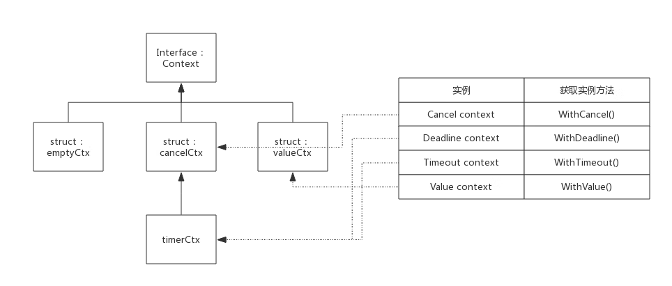

在 Go 程序中可能同时存在许多协程，这些协程被动态地创建和销毁。

例如，在典型的 http 服务器中，每个新建立的连接都可能新建一个协程。当请求完成后，协程也随之被销毁。但是，请求可能临时终止也可能超时，这个时候我们希望安全并及时地停止协程，而不必一直占用系统的资源。

因此，需要一种能够优雅控制协程退出的手段。在 Go 1.7 之后，Go 官方引入了 context 管理类似场景的协程退出。

## 诞生原因

如果你不知道如何退出一个协程，那么就不要创建这个协程。

在 context 之前，要管理协程退出需要借助通道 close 的机制，该机制会唤醒所有监听该通道的协程，并触发相应的退出逻辑。类似的写法如下：

```go
func main() {
    ch := make(chan struct{})
    go func() {
        for {
            select {
            case <-ch:
                return
            default:
                fmt.Println("hello")
            }
        }
    }()
    time.Sleep(time.Second)
    close(ch)
    time.Sleep(time.Second)
}
```

这种做法在每个项目中都需要存在，而不同的项目之间，在命名及处理方式上都会有所不同，例如有的使用了 done，有的使用了 closed，有的采取了函数包裹的形式 <- g.dnoe()。如果有一套统一的规范，那么语义将会更加清晰，例如引入了 context 之后的规范写法，<- ctx.Done() 代表将要退出协程。

```go
func main() {
    ctx, cancel := context.WithCancel(context.Background())
    go func() {
        for {
            select {
            case <-ctx.Done():
                return
            default:
                fmt.Println("hello")
            }
        }
    }()
    time.Sleep(time.Second)
    cancel()
    time.Sleep(time.Second)
}
```

使用 context 更重要的一点是协程之间时常存在着级联关系，退出需要具有传递性。


如图 17-1 所示，一个 http 请求在处理过程中可能新建一个协程 G，而协程 G 可能通过执行 RPC 远程调用了其他服务的接口，这个时候假如程序临时退出、超时或远程服务长时间没有响应，那么需要协程 A、子协程 G 以及调用链上的所有协程都退出。

为了能够优雅地管理协程的退出，特别是多个协程甚至网络服务之间的退出，Go 引入了 context 包。

## 使用方式

context 一般作为接口的第一个参数传递超时信息。在 Go 源码中，net/http 包的使用方法如下：

```go
// net/http
func (r *Request) WithContext(ctx context.Context) *Request
```

这意味着，如果我们要调用这些函数，那么从接入层开始的整个调用链中，函数的第一个参数都需要是 context。

## 实现原理

context 实际上只定义了接口，凡是实现该接口的类都可称为是一种 context，官方包中实现了几个常用的 context，分别可用于不同的场景。

## 接口定义

源码包中 `src/context/context.go:Context` 定义了该接口：

```go
type Context interface {
    Deadline() (deadline time.Time, ok bool)
    Done() <-chan struct{}
    Err() error
    Value(key interface{}) interface{}
}
```

基础的 context 接口只定义了 4 个方法，下面分别简要说明一下：

### Deadline()

Deadline 方法的第一个返回值表示还有多久到期，第二个返回值表示是否到期。

该方法返回一个 deadline 和标识是否已设置 deadline 的 bool 值，如果没有设置 deadline，则 ok == false，此时 deadline 为一个初始值的 time.Time 值。

### Done()

该方法返回一个 channel，需要在 select-case 语句中使用，如 "case <-context.Done() :"。当 context 关闭后，Done() 返回一个被关闭的管道，关闭的管道仍然是可读的，据此 goroutine 可以收到关闭请求；当 context 还未关闭时，Done() 返回 nil，引起阻塞。

### Err()

该方法描述 context 关闭的原因。关闭原因由 context 实现控制，不需要用户设置。比如 Deadline context，关闭原因可能是因为 deadline，也可能提前被主动关闭，那么关闭原因就会不同：

- 因 deadline 关闭：“context deadline exceeded”
- 因主动关闭："context canceled"
- 当 context 关闭后，Err() 返回 context 的关闭原因
- 当 context 还未关闭时，Err() 返回 nil

### Value()

有一种 context，它不是用于控制呈树状分布的 goroutine，而是用于在树状分布的 goroutine 间传递信息。Value() 方法就是用于此种类型的 context，该方法根据 key 值查询 map 中的 value。

context 中携带值在服务端框架中比较常见，并且该值的作用域在结束时终结。key 必须是访问安全的，因为可能有多个协程同时访问它。一种常见的策略是在 context 中存储授权相关的值，这些鉴权不会影响程序的核心逻辑。

Value 主要用于安全凭证、分布式跟踪 ID、操作优先级、退出信号与到期时间等场景。尽管如此，在使用 value 方法时也需要慎重，如果参数与函数核心处理逻辑有关，那么仍然建议显式地传递参数。

## 退出与传递

context 是一个接口，这意味着需要有具体的实现。用户可以按照接口中定义的方法，严格实现其语义。当然，一般用得最多的还是 Go 标准库的简单实现。调用 context.Background 函数或 context.TODO 函数会返回最简单的 context 实现。context.Background 函数一般作为根对象存在，其不可以退出，也不能携带值。要具体地使用 context 的功能，需要派生出新的 context，配套的使用函数如下，其中前三个函数用于处理退出。

```go
func WithCancel(parent Context) (ctx Context, cancel CancelFunc)
func WithDeadline(parent Context, deadline time.Time) (Context, CancelFunc)
func WithTimeout(parent Context, timeout time.Duration) (Context, CancelFunc)
func WithValue(parent Context, key, val interface{}) Context
```

WithCancel 函数返回一个子 context 并且有 cancel 退出方法。子 context 在两种情况下会退出，一种情况是调用 cancel，另一种情况是当参数中的父 context 退出时，该 context 及其关联的子 context 都将退出。

WithTimeout 函数指定超时时间，当超时发生后，子 context 将退出。因此子 context 的退出有 3 种时机，一种是父 context 退出；一种是超时退出；一种是主动调用 cancel 函数退出。

WithDeadline 和 WithTimeout 函数的处理方法相似，不过其参数指定的是最后到期的时间。

WithValue 函数返回带 key-value 的子 context。

如下所示，在协程中，childCtx 是 preCtx 的子 context，其设置的超时时间为 300ms。但是 preCtx 的超时时间为 100 ms，因此父 context 退出后，子 context 会立即退出，实际的等待时间只有 100ms。

```go
package main

import (
	"context"
	"fmt"
	"sync"
	"time"
)

func main() {
	ctx := context.Background()

	preCtx, preCancel := context.WithTimeout(ctx, 100*time.Millisecond)
	defer preCancel()

	childCtx, childCancel := context.WithTimeout(preCtx, 300*time.Millisecond)
	defer childCancel()

	wg := sync.WaitGroup{}
	wg.Add(1)

	go func() {
		defer wg.Done()
		<-childCtx.Done()
		fmt.Println("childCtx is done")
	}()

	<-preCtx.Done()
	fmt.Println("preCtx is done")

	wg.Wait()
}
```

context 退出的传播关系是父 context 的退出会导致所有子 context 的退出，而子 context 的退出不会影响父 context。

## 原理

context 在很大程度上利用了通道在 close 时会通知所有监听它的协程这一特性来实现。每个派生出的子协程都会创建一个新的退出通道，组织好 context 之间的关系即可实现继承链上退出的传递，图 17-2 所示的三个协程中，关闭通道 A 会连带关闭调用链上的通道 B、通道 C。


Context.Background 函数和 Context.TODO 函数是相似的，它们都返回一个标准库中定义好的结构体 emptyCtx。

### emptyCtx

context 包中定义了一个空的 context，名为 emptyCtx，用于 context 的根节点，空的 context 只是简单的实现了 Context，本身不包含任何值，仅用于其他 context 的父节点。

emptyCtx 类型定义如下代码所示：

```go
type emptyCtx int

func (*emptyCtx) Deadline() (deadline time.Time, ok bool) {
	return
}

func (*emptyCtx) Done() <-chan struct{} {
	return nil
}

func (*emptyCtx) Err() error {
	return nil
}

func (*emptyCtx) Value(key interface{}) interface{} {
	return nil
}
```

context 包中定义了一个公用的 emptCtx 全局变量，名为 background，可以使用 context.Background() 获取它，实现代码如下所示：

```go
var background = new(emptyCtx)

func Background() Context {
	return background
}
```

context 包提供了 4 个方法创建不同类型的 context，使用这四个方法时如果没有父 context，都需要传入 backgroud，即 backgroud 作为其父节点：

- WithCancel()
- WithDeadline()
- WithTimeout()
- WithValue()

当调用 WithCancel 或 WithTimeout 函数时，会产生一个子 context 结构 cancelCtx，并保留了父 context 的信息。children 字段保存当前 context 之后派生的子 context 的信息，每个 context 都会有一个新的 done 通道，这保证了子 context 的退出不会影响父 context。

context 包中实现 Context 接口的 struct，除了 emptyCtx 外，还有 cancelCtx、timerCtx 和 valueCtx 三种，正是基于这三种 context 实例，实现了上述 4 种类型的 context。

context 包中各 context 类型之间的关系，如下图所示：



结构体 cancelCtx、timerCtx、valueCtx 都继承于 Context，下面分别介绍这三个 struct。

### cancelCtx

源码包中 `src/context/context.go:cancelCtx` 定义了该类型context：

```go
type cancelCtx struct {
	Context

	mu       sync.Mutex            // protects following fields
	done     chan struct{}         // created lazily, closed by first cancel call
	children map[canceler]struct{} // set to nil by the first cancel call
	err      error                 // set to non-nil by the first cancel call
}
```

children 中记录了由此 context 派生的所有 child，此 context 被 cancel 时会把其中的所有 child 都 cancel 掉。

cancelCtx 与 deadline 和 value 无关，所以只需要实现 Done() 和 Err() 外露接口即可。

#### Done() 接口实现

按照 Context 定义，Done() 接口只需要返回一个 channel 即可，对于 cancelCtx 来说只需要返回成员变量 done 即可。

这里直接看下源码，非常简单：

```go
func (c *cancelCtx) Done() <-chan struct{} {
	c.mu.Lock()
	if c.done == nil {
		c.done = make(chan struct{})
	}
	d := c.done
	c.mu.Unlock()
	return d
}
```

由于 cancelCtx 没有指定初始化函数，所以 cancelCtx.done 可能还未分配，所以需要考虑初始化。cancelCtx.done 会在 context 被 cancel 时关闭，所以 cancelCtx.done 的值一般经历如下三个阶段：

```
nil --> chan struct{} --> closed chan
```

#### Err() 接口实现

按照 Context 定义，Err() 只需要返回一个 error 告知 context 被关闭的原因。对于 cancelCtx 来说只需要返回成员变量 err 即可。

还是直接看下源码：

```go
func (c *cancelCtx) Err() error {
	c.mu.Lock()
	err := c.err
	c.mu.Unlock()
	return err
}
```

cancelCtx.err 默认是 nil，在 context 被 cancel 时指定一个 error 变量： `var Canceled = errors.New("context canceled")`。

#### cancel() 接口实现

cancel() 内部方法是理解 cancelCtx 的最关键的方法，其作用是关闭自己和其后代，其后代存储在 cancelCtx.children 的 map 中，其中 key 值即后代对象，value 值并没有意义，这里使用 map 只是为了方便查询而已。

cancel 方法会关闭自身的通道，并遍历当前 children 哈希表，调用当前所有子 context 的退出函数，因此其可以产生继承链上连锁的退出反应。

cancel 方法实现伪代码如下所示：

```go
func (c *cancelCtx) cancel(removeFromParent bool, err error) {
    c.mu.Lock()

    c.err = err	                      //设置一个error，说明关闭原因
    close(c.done)                     //将channel关闭，以此通知派生的context

    for child := range c.children {   //遍历所有children，逐个调用cancel方法
        child.cancel(false, err)
    }
    c.children = nil
    c.mu.Unlock()

    if removeFromParent {            //正常情况下，需要将自己从parent删除
        removeChild(c.Context, c)
    }
}
```

实际上，WithCancel() 返回的第二个用于 cancel context 的方法正是此 cancel()。

#### WithCancel() 方法实现

WithCancel() 方法作了三件事：

- 初始化一个 cancelCtx 实例
- 将 cancelCtx 实例添加到其父节点的 children 中 ( 如果父节点也可以被 cancel 的话 )
- 返回 cancelCtx 实例和 cancel() 方法

其实现源码如下所示：

```go
func WithCancel(parent Context) (ctx Context, cancel CancelFunc) {
	c := newCancelCtx(parent)
	propagateCancel(parent, &c)   //将自身添加到父节点
	return &c, func() { c.cancel(true, Canceled) }
}
```

这里将自身添加到父节点的过程有必要简单说明一下：

1. 如果父节点也支持 cancel，也就是说其父节点肯定有 children 成员，那么把新 context 添加到 children 里即可；

2. 如果父节点不支持 cancel，就继续向上查询，直到找到一个支持 cancel 的节点，把新 context 添加到 children 里；

3. 如果所有的父节点均不支持 cancel，则启动一个协程等待父节点结束，然后再把当前 context 结束。

#### 典型案例

```go
package main

import (
    "fmt"
    "time"
    "context"
)

func HandelRequest(ctx context.Context) {
    go WriteRedis(ctx)
    go WriteDatabase(ctx)
    for {
        select {
        case <-ctx.Done():
            fmt.Println("HandelRequest Done.")
            return
        default:
            fmt.Println("HandelRequest running")
            time.Sleep(2 * time.Second)
        }
    }
}

func WriteRedis(ctx context.Context) {
    for {
        select {
        case <-ctx.Done():
            fmt.Println("WriteRedis Done.")
            return
        default:
            fmt.Println("WriteRedis running")
            time.Sleep(2 * time.Second)
        }
    }
}

func WriteDatabase(ctx context.Context) {
    for {
        select {
        case <-ctx.Done():
            fmt.Println("WriteDatabase Done.")
            return
        default:
            fmt.Println("WriteDatabase running")
            time.Sleep(2 * time.Second)
        }
    }
}

func main() {
    ctx, cancel := context.WithCancel(context.Background())
    go HandelRequest(ctx)

    time.Sleep(5 * time.Second)
    fmt.Println("It's time to stop all sub goroutines!")
    cancel()

    //Just for test whether sub goroutines exit or not
    time.Sleep(5 * time.Second)
}
```

上面代码中协程 HandelRequest() 用于处理某个请求，其又会创建两个协程：WriteRedis()、WriteDatabase()，main 协程创建 context，并把 context 在各子协程间传递，main 协程在适当的时机可以 cancel 掉所有子协程。

### timerCtx

源码包中 `src/context/context.go:timerCtx` 定义了该类型 context：

```go
type timerCtx struct {
	cancelCtx
	timer *time.Timer // Under cancelCtx.mu.

	deadline time.Time
}
```

timerCtx 在 cancelCtx 基础上增加了 deadline 用于标示自动 cancel 的最终时间，而 timer 就是一个触发自动 cancel 的定时器。

由此，衍生出 WithDeadline() 和 WithTimeout()。实现上这两种类型实现原理一样，只不过使用语境不一样：

- deadline : 指定最后期限，比如 context 将 2018.10.20 00 : 00 : 00 之时自动结束
- timeout : 指定最长存活时间，比如 context 将在 30s 后结束。

对于接口来说，timerCtx 在 cancelCtx 基础上还需要实现 Deadline() 和 cancel() 方法，其中 cancel() 方法是重写的。

#### Deadline() 接口实现

Deadline() 方法仅仅是返回 timerCtx.deadline 而矣。而 timerCtx.deadline 是 WithDeadline() 或 WithTimeout() 方法设置的。

#### cancel() 接口实现

cancel() 方法基本继承 cancelCtx，只需要额外把 timer 关闭。

timerCtx 被关闭后，timerCtx.cancelCtx.err 将会存储关闭原因：

- 如果 deadline 到来之前手动关闭，则关闭原因与 cancelCtx 显示一致；
- 如果 deadline 到来时自动关闭，则原因为："context deadline exceeded"

#### WithDeadline() 方法实现

WithDeadline() 方法实现步骤如下：

- 初始化一个 timerCtx 实例
- 将 timerCtx 实例添加到其父节点的 children 中 ( 如果父节点也可以被 cancel 的话 )
- 启动定时器，定时器到期后会自动 cancel 本 context
- 返回 timerCtx 实例和 cancel() 方法

也就是说，timerCtx 类型的 context 不仅支持手动 cancel，也会在定时器到来后自动 cancel。

### WithTimeout() 方法实现

WithTimeout() 实际调用了 WithDeadline，二者实现原理一致。

看代码会非常清晰：

```go
func WithTimeout(parent Context, timeout time.Duration) (Context, CancelFunc) {
	return WithDeadline(parent, time.Now().Add(timeout))
}
```

#### 典型案例

```go
package main

import (
    "fmt"
    "time"
    "context"
)

func HandelRequest(ctx context.Context) {
    go WriteRedis(ctx)
    go WriteDatabase(ctx)
    for {
        select {
        case <-ctx.Done():
            fmt.Println("HandelRequest Done.")
            return
        default:
            fmt.Println("HandelRequest running")
            time.Sleep(2 * time.Second)
        }
    }
}

func WriteRedis(ctx context.Context) {
    for {
        select {
        case <-ctx.Done():
            fmt.Println("WriteRedis Done.")
            return
        default:
            fmt.Println("WriteRedis running")
            time.Sleep(2 * time.Second)
        }
    }
}

func WriteDatabase(ctx context.Context) {
    for {
        select {
        case <-ctx.Done():
            fmt.Println("WriteDatabase Done.")
            return
        default:
            fmt.Println("WriteDatabase running")
            time.Sleep(2 * time.Second)
        }
    }
}

func main() {
    ctx, _ := context.WithTimeout(context.Background(), 5 * time.Second)
    go HandelRequest(ctx)

    time.Sleep(10 * time.Second)
}
```

主协程中创建一个 10s 超时的 context，并将其传递给子协程，10s 自动关闭 context。

### valueCtx

源码包中 `src/context/context.go:valueCtx` 定义了该类型 context：

```go
type valueCtx struct {
	Context
	key, val interface{}
}
```

valueCtx 只是在 Context 基础上增加了一个 key-value 对，用于在各级协程间传递一些数据。由于 valueCtx 既不需要 cancel，也不需要 deadline，那么只需要实现 Value() 接口即可。

#### Value() 接口实现

由 valueCtx 数据结构定义可见，valueCtx.key 和 valueCtx.val 分别代表其 key 和 value 值。实现也很简单：

```go
func (c *valueCtx) Value(key interface{}) interface{} {
	if c.key == key {
		return c.val
	}
	return c.Context.Value(key)
}
```

这里有个细节需要关注一下，即当前 context 查找不到 key 时，会向父节点查找，如果查询不到则最终返回 interface{}。也就是说，可以通过子 context 查询到父的 value 值。

#### WithValue() 方法实现

WithValue() 实现也是非常的简单, 伪代码如下：

```go
func WithValue(parent Context, key, val interface{}) Context {
	if key == nil {
		panic("nil key")
	}
	return &valueCtx{parent, key, val}
}
```

#### 典型案例

下面示例程序展示 valueCtx 的用法：

```go
package main

import (
    "fmt"
    "time"
    "context"
)

func HandelRequest(ctx context.Context) {
    for {
        select {
        case <-ctx.Done():
            fmt.Println("HandelRequest Done.")
            return
        default:
            fmt.Println("HandelRequest running, parameter: ", ctx.Value("parameter"))
            time.Sleep(2 * time.Second)
        }
    }
}

func main() {
    ctx := context.WithValue(context.Background(), "parameter", "1")
    go HandelRequest(ctx)

    time.Sleep(10 * time.Second)
}
```

上例 main() 中通过 WithValue() 方法获得一个 context，需要指定一个父 context、key 和 value。然后通将该 context 传递给子协程 HandelRequest，子协程可以读取到 context 的 key-value。

本例中子协程无法自动结束，因为 context 是不支持 cancle 的，也就是说 <-ctx.Done() 永远无法返回。如果需要返回，需要在创建 context 时指定一个可以 cancel 的 context 作为父节点，使用父节点的 cancel() 在适当的时机结束整个 context。

```go

```
