## 问题

- CPU 是如何从调用者跳转到被调用函数执行的？
- 参数是如何从调用者传递给被调用函数的？
- 函数局部变量所占内存是怎么在栈上分配的？
- 返回值是如何从被调用函数返回给调用者的？
- 函数执行完成之后又需要做哪些清理工作？

解决了这些问题，我们对计算机执行程序的原理就有了一个大致的了解，这对于我们理解 goroutine 的调度有非常重要的作用。

相对于 go 来说，C 语言更接近于硬件，编译后的汇编代码也更加简单直观，更容易让我们掌握函数调用的基本原理，所以我们首先来看 C 语言的函数调用在汇编指令层面是如何实现的，然后在此基础上分析 go 语言的函数调用过程。

## C 语言函数调用过程

我们用一个简单的例子程序来开始分析。

```c++
#include <stdio.h>

// 对参数 a 和 b 求和
int sum(int a, int b) {
  int s = a + b;

  return s;
}

// main函数：程序入口
int main(int argc, char *argv[]) {
  int n = sum(1, 2);// 调用sum函数对求和

  printf("n: %d\n", n);//在屏幕输出 n 的值

  return 0;
}
```

用 gcc 编译这个程序得到可执行程序 call，然后使用 gdb 调试。

```bash
gcc main.c -o call
```

在 gdb 中我们通过反汇编 main 函数找到 main 的第一条指令所在的地址为 0x0000000000400540，然后使用 b * 0x0000000000400540 在该地址下一个断点并运行程序：

```bash
gdb ./call
```

```bash
(gdb) disass main
```

```
Dump of assembler code for function main:
  0x0000000000400540 <+0>:push   %rbp
  0x0000000000400541 <+1>:mov   %rsp,%rbp
  0x0000000000400544 <+4>:sub   $0x20,%rsp
  0x0000000000400548 <+8>:mov   %edi,-0x14(%rbp)
  0x000000000040054b <+11>:mov   %rsi,-0x20(%rbp)
  0x000000000040054f <+15>:mov   $0x2,%esi
  0x0000000000400554 <+20>:mov   $0x1,%edi
  0x0000000000400559 <+25>:callq 0x400526 <sum>
  0x000000000040055e <+30>:mov   %eax,-0x4(%rbp)
  0x0000000000400561 <+33>:mov   -0x4(%rbp),%eax
  0x0000000000400564 <+36>:mov   %eax,%esi
  0x0000000000400566 <+38>:mov   $0x400604,%edi
  0x000000000040056b <+43>:mov   $0x0,%eax
  0x0000000000400570 <+48>:callq 0x400400 <printf@plt>
  0x0000000000400575 <+53>:mov   $0x0,%eax
  0x000000000040057a <+58>:leaveq
  0x000000000040057b <+59>:retq  
End of assembler dump.
```

```bash
(gdb) b *0x0000000000400540
```

```
Breakpoint 1 at 0x400540
```

```bash
(gdb) r
```

```
Starting program: /home/bobo/study/c/call
Breakpoint 1, 0x0000000000400540 in main ()
```

程序停在了我们下的断点处，也就是 main 函数的第一条指令的位置。再次反汇编一下将要执行的 main 函数，我们先来看其最前面的 3 条指令：

```bash
(gdb) disass
```

```
Dump of assembler code for function main:
=> 0x0000000000400540 <+0>:push   %rbp
  0x0000000000400541 <+1>:mov   %rsp,%rbp
  0x0000000000400544 <+4>:sub   $0x20,%rsp
  ......
```

这 3 条指令我们一般称之为函数序言，基本上每个函数都以函数序言开始，其主要作用在于保存调用者的 rbp 寄存器以及为当前函数分配栈空间，后面我们会详细介绍这 3 条指令，我们先来说明一下 gdb 输出的反汇编代码的格式，gdb 反汇编出来的代码主要分为 3 个部分：

- 指令地址
- 指令相对于当前函数起始地址以字节为单位的偏移
- 指令

比如第一行代码 `0x0000000000400540 <+0>:	push  %rbp`，表示 main 函数的第一条指令 `push  %rbp` 在内存中的地址为 0x0000000000400540，偏移为 0（因为它是 main 函数的第一条指令）。这行代码各组成部分如下图所示：

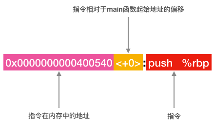

这里需要说明一点，gdb 反汇编输出的结果中的指令地址和偏移只是 gdb 为了让我们更容易阅读代码而附加上去的，保存在内存中以及被 CPU 执行的代码只有上图指令部分。

注意，上面反汇编结果中的第一行代码的最左边还有一个 => 符号，它表示这条指令是 CPU 将要执行的下一条指令，也就是 rip 寄存器目前的值为 0x0000000000400540，当前的状态是前一条指令已经执行完毕，这一条指令还未开始执行，使用 i r rbp rsp rip 察看一下 rbp、rsp 和 rip 这 3 个寄存器的值：

```bash
(gdb) i r rbp rsp rip
```

```
rbp           0x4005800x400580 <__libc_csu_init>
rsp           0x7fffffffe5180x7fffffffe518
rip           0x4005400x400540 <main>
```

根据这些寄存器的值，当前时刻函数调用栈、rbp、 rsp 和 rip 的状态以及它们之间的关系如下图所示：

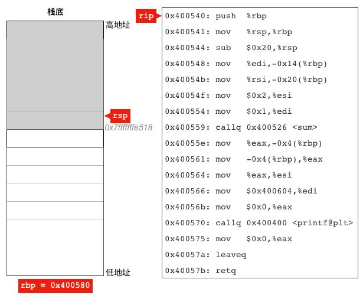

因为 rbp、rsp 和 rip 存放的都是地址，所以这几个寄存器每个都相当于一个指针，看上图，rip 指向的是 main 函数的第一条指令，rsp 指向了当前函数调用栈的栈顶，而 rbp 寄存器并未指向我们关注的栈和指令，于是并未画出它的具体指向，只是显示了它的值。

为了更加清晰的理解程序的执行流程，现在我们开始模拟 CPU 从 main 函数的第一条指令开始，一直到执行完整个 main 函数。

现在开始执行第 1 条指令，

```
0x0000000000400540 <+0>:push   %rbp # 保存调用者的rbp寄存器的值
```

这条指令把栈基地址寄存器 rbp 的值临时保存在 main 函数的栈帧里，因为 main 函数需要使用这个寄存器来存放自己的栈基地址，而调用者在调用 main 函数之前也把它的栈基地址保存在了这个寄存器里面，所以 main 函数需要把这个寄存器里面的值先保存起来，等 main 执行完后返回时再把这个寄存器恢复原样，如果不恢复原样，main 函数返回后调用者使用 rbp 寄存器时就会有问题，因为在执行调用者的代码时 rbp 本应该指向调用者的栈但现在却指向了 main 函数的栈。

在这条指令之前，代码还在使用调用者的栈帧，执行完这条指令之后，开始使用 main 函数的栈帧，目前 main 函数的栈帧里面只保存有调用者的 rbp 这一个值，在继续执行下一条指令之前，栈和寄存器的状态如下图，图中标红的指令表示刚执行完成的指令。可以看到 rsp 和 rip 寄存器的值都已经发生了改变，它们都指向了新的位置。rsp 指向了 main 函数的栈帧的起始位置，而 rip 指向了 main 函数的第 2 条指令。

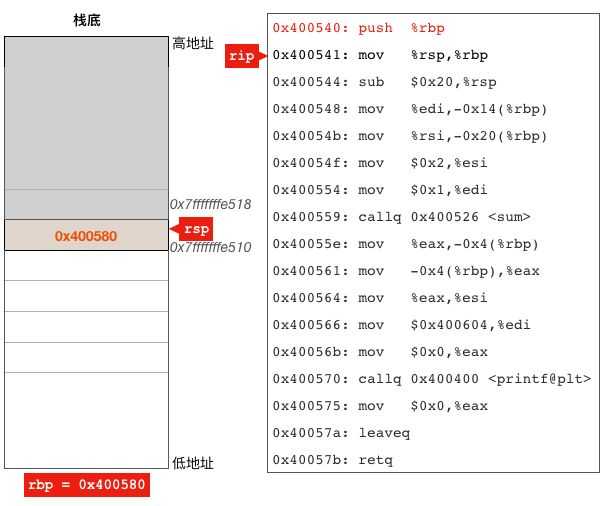

在汇编指令一节我们介绍过，执行 push 指令会修改 rsp 寄存器的值，但它并不会修改 rip 寄存器，为什么这里 rip 也变了呢？其实这是 CPU 自动完成的，CPU 自己知道它要执行的每一条指令的长度有几个字节，比如这里的 push %rbp 指令只有 1 个字节长，于是它在开始执行这条指令时就会把 rip 的值+1，因为执行这条指令之前 rip 的值为 0x400540，+1 之后就变成了 0x400541，也就是说它指向了 main 函数的第 2 条指令。

接着执行第 2 条指令，

```
0x0000000000400541 <+1>:mov   %rsp,%rbp # 调整rbp寄存器，使其指向main函数栈帧的起始位置
```

这条指令把 rsp 的值拷贝给 rbp 寄存器，让其指向 main 函数栈帧的起始位置，执行完这条指令之后 rsp 和 rbp 寄存器具有相同的值，他们都指向了 main 函数的栈帧的起始位置，如下图所示：

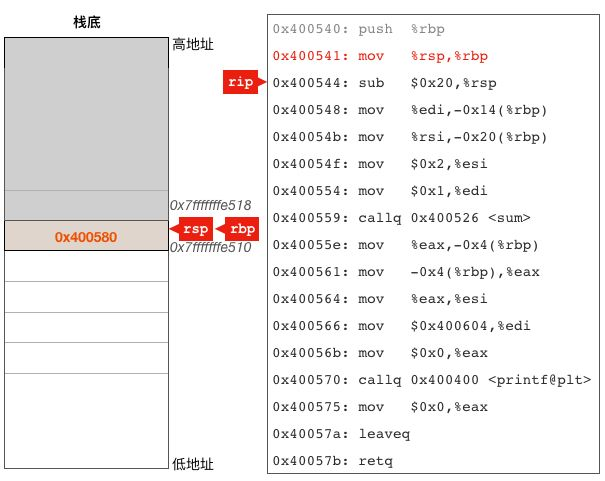

接着执行第 3 条指令，

```
0x0000000000400544 <+4>:sub   $0x20,%rsp # 调整rsp寄存器的值，为局部和临时变量预留栈空间
```

这条指令把 rsp 寄存器的值减去了 32(16进制的0x20)，使其指向了栈空间中一个更低的位置，这一步看似只是简单的修改了rsp寄存器的值，其实质却是给main函数的局部变量和临时变量预留了32（0x20）字节的栈空间，为什么说是预留而不是分配，因为栈的分配是操作系统自动完成的，程序启动时操作系统就会给我们分配一大块内存用作函数调用栈，程序到底使用了多少栈内存由rsp栈顶寄存器来确定。

该指令执行完成之后，从 rsp 所指位置到 rbp 所指的这一段栈内存就构成了 main 函数的完整栈帧，其大小为 40 字节（8 字节用于保存调用者的 rbp，另外 32 字节用于 main 函数的局部和临时变量），如下图：

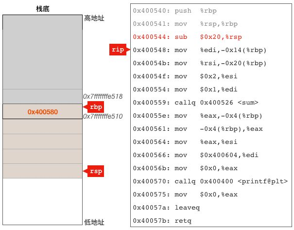

接下来的 4 条指令我们一起把它们执行了，

```
0x0000000000400548 <+8>:mov   %edi,-0x14(%rbp)
0x000000000040054b <+11>:mov   %rsi,-0x20(%rbp)
0x000000000040054f <+15>:mov   $0x2,%esi #sum函数的第2个参数放入esi寄存器
0x0000000000400554 <+20>:mov   $0x1,%edi #sum函数的第1个参数放入edi寄存器
```

前两条指令负责把 main 函数得到的两个参数保存在 main 函数的栈帧里面，可以看到，这里使用了 rbp 加偏移量的方式来访问栈内存。这里之所以要保存 main 函数的两个参数，是因为调用者在调用 main 函数时使用了 edi 和 rsi 两个寄存器来给 main 函数分别传递 argc（整数）和 argv（指针）两个参数，而 main 又需要用这两个寄存器给 sum 函数传递参数，为了不覆盖 argc 和 argv，所以这里需要先把这两个参数保存在栈里面，然后再把传递给 sum 函数的两个参数 1 和 2 放入这两个寄存器之中。

后面两条指令在给 sum 函数准备参数，我们可以看到，传递给 sum 的第一个参数放在了 edi 寄存器里面，第二个参数放在了 esi 里面。可能你会问，被调用函数怎么知道参数放在这两个寄存器里面的啊？其实这是一个约定而已，大家约定好：调用函数时调用者负责把第一个参数放在 rdi 里面，第二个参数放在 rsi 里面，而被调函数直接去这两个寄存器里面把参数拿出来。这里还有个细节，传递给 sum 的两个参数都是用的 edi 和 esi 而不是 rdi 和 rsi，原因在于 C 语言中 int 是 32 位的，而 rdi 和 rsi 都是 64 位的，edi 和 esi 可以分别当成 rdi 和 rsi 的一部分来使用。

回到正题，执行完这4条指令后栈和寄存器的状态图(注意，下图中的 argc 使用的是图中连续 8 字节内存中的高 4 字节，低 4 字节未用)：


参数准备好了之后，接着执行call指令调用sum函数，

```
0x0000000000400559 <+25>:callq 0x400526 <sum>  #调用sum函数
```

call 指令有点特殊，刚开始执行它的时候 rip 指向的是 call 指令的下一条指令，也就是说 rip 寄存器的值是 0x40055e 这个地址，但在 call 指令执行过程中，call 指令会把当前 rip 的值（0x40055e）入栈，然后把 rip 的值修改为 call 指令后面的操作数，这里是 0x400526，也就是 sum 函数第一条指令的地址，这样 cpu 就会跳转到 sum 函数去执行。

call 指令执行完成后栈及寄存器的状态如下图所示，可以看到 rip 已经指向了 sum 函数的第 1 条指令，sum 函数执行完成返回之后需要执行的指令的地址 0x40055e 也已经保存到了 main 函数的栈帧之中。

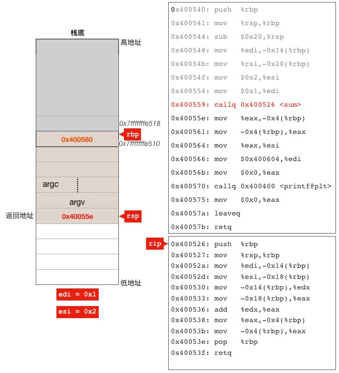

由于在 main 中执行了调用 sum 函数的 call 指令，CPU 现在跳转到 sum 函数开始执行，

```
0x0000000000400526 <+0>:push   %rbp          
0x0000000000400527 <+1>:mov   %rsp,%rbp
0x000000000040052a <+4>:mov   %edi,-0x14(%rbp)  
0x000000000040052d <+7>:mov   %esi,-0x18(%rbp)  
0x0000000000400530 <+10>:mov   -0x14(%rbp),%edx
0x0000000000400533 <+13>:mov   -0x18(%rbp),%eax
0x0000000000400536 <+16>:add   %edx,%eax
0x0000000000400538 <+18>:mov   %eax,-0x4(%rbp)
0x000000000040053b <+21>:mov   -0x4(%rbp),%eax
0x000000000040053e <+24>:pop   %rbp
0x000000000040053f <+25>:retq  
```

sum 函数的前 2 条指令跟 main 函数前两条指令一模一样，

```
0x0000000000400526 <+0>:push   %rbp            # sum函数序言，保存调用者的rbp
0x0000000000400527 <+1>:mov   %rsp,%rbp   # sum函数序言，调整rbp寄存器指向自己的栈帧起始位置
```

都是在保存调用者的 rbp 然后设置新值使其指向当前函数栈帧的起始位置，这里 sum 函数保存了 main 函数的 rbp 寄存器的值（0x7fffffffe510），并使 rbp 寄存器指向了自己的栈帧的起始位置(地址为 0x7fffffffe4e0)。

可以看到，sum 的函数序言并未像 main 函数一样通过调整 rsp 寄存器的值来给 sum 函数预留用于局部变量和临时变量的栈空间，那这是不是说明 sum 函数就没有使用栈来保存局部变量呢，其实不是，从后面的分析可以看到，sum 函数的局部变量 s 还是保存在栈上的。没有预留为什么可以使用呢，原因前面也说过，栈上的内存不需要在应用层代码中分配，操作系统已经给我们分配好了，尽管用就行了。main 函数之所以需要调整 rsp 寄存器的值是因为它需要使用 call 指令来调用 sum 函数，而 call 指令会自动把 rsp 寄存器的值减去 8 然后把函数的返回地址保存到 rsp 所指的栈内存位置，如果 main 函数不调整 rsp 的值，则 call 指令保存函数返回地址时会覆盖局部变量或临时变量的值；而 sum 函数中没有任何指令会自动使用 rsp 寄存器来保存数据到栈上，所以不需要调整 rsp 寄存器。

紧接着的 4 条指令，

```
0x000000000040052a <+4>:mov   %edi,-0x14(%rbp)  # 把第1个参数a放入临时变量
0x000000000040052d <+7>:mov   %esi,-0x18(%rbp)  # 把第2个参数b放入临时变量
0x0000000000400530 <+10>:mov   -0x14(%rbp),%edx # 从临时变量中读取第1个到edx寄存器
0x0000000000400533 <+13>:mov   -0x18(%rbp),%eax # 从临时变量中读取第2个到eax寄存器
```

通过 rbp 寄存器加偏移量的方式把 main 传递给 sum 的参数保存在当前栈帧的合适位置，然后又取出来放入寄存器，这里有点多此一举，因为我们编译的时候未给 gcc 指定优化级别，gcc 编译程序时默认不做任何优化，所以代码看起来比较啰嗦。

紧接着的几条指令

```
0x0000000000400536 <+16>:add   %edx,%eax            # 执行a + b并把结果保存到eax寄存器
0x0000000000400538 <+18>:mov   %eax,-0x4(%rbp)  # 把加法结果赋值给变量s
0x000000000040053b <+21>:mov   -0x4(%rbp),%eax  # 读取s变量的值到eax寄存器
```

第一条 add 指令负责执行加法运算并把结果 3 存入 eax 寄存器，第二条指令负责把 eax 寄存器的值保存到了 s 变量所在的内存，第三条指令又把 s 变量的值读取到 eax 寄存器，可以看到局部变量 s 被编译器安排在了 rbp - 0x4 这个地址所对应的内存之中。

到此，sum 函数的主要功能已经完成，在继续执行最后的两条指令之前我们先来看看寄存器和栈的状态：

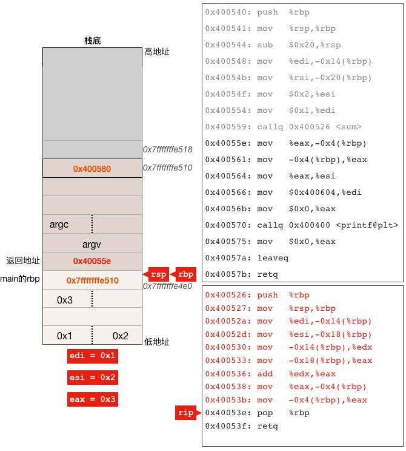

上图有 1 点需要说明一下：

- sum 函数的两个参数和返回值都是 int 型的，在内存中只占 4 个字节，而我们的示意图中每个栈内存单元占 8 个字节且按 8 字节地址边界进行了对齐，所以才是现在示意图中的这个样子。

我们来继续执行 pop %rbp 这条指令，这条指令包含两个操作：

1. 把当前 rsp 所指栈内存中的值放入 rbp 寄存器，这样 rbp 就恢复到了还未执行 sum 函数的第一条指令时的值，也就是重新指向了 main 函数的栈帧起始地址。
2. 把 rsp 寄存器中的值加 8，这样 rsp 就指向了包含 0x40055e 这个值的栈内存，而这个栈单元中的值是当初 main 函数调用 sum 函数时 call 指令放入的，放入的这个值就是紧跟在 call 指令后面的下一条指令的地址。

还是来看看示意图：


继续 retq 指令，该指令把 rsp 指向的栈单元中的 0x40055e 取出给 rip 寄存器，同时 rsp 加 8，这样 rip 寄存器中的值就变成了 main 函数中调用 sum 的 call 指令的下一条指令，于是就返回到 main 函数中继续执行。注意此时 eax 寄存器中的值是 3，也就是 sum 函数执行后的返回值。还是来看一下状态。

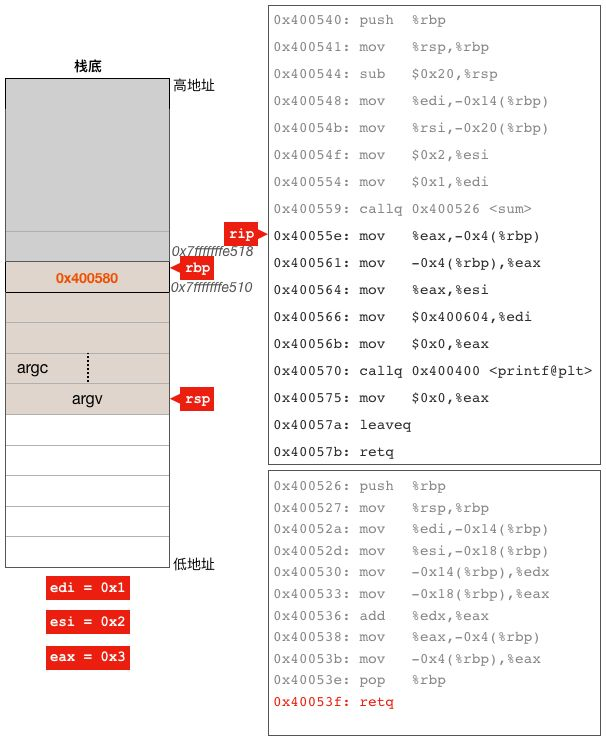

继续执行 main 函数中的

```
mov   %eax,-0x4(%rbp)  # 把sum函数的返回值赋给变量n
```

该指令把 eax 寄存器中的值（3）放入 rbp - 4 所指的内存，这里是变量 n 所在的位置，所以这条语句其实就是把 sum 函数的返回值赋值给变量 n。这时状态为：

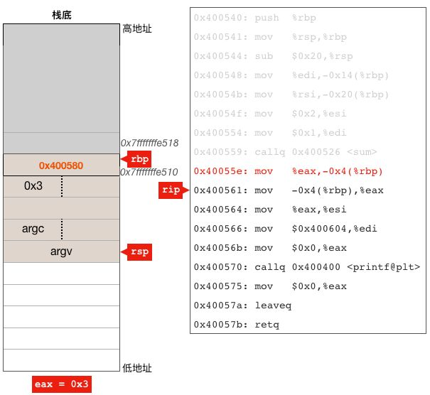

后面的几条指令

```
0x0000000000400561 <+33>:mov   -0x4(%rbp),%eax
0x0000000000400564 <+36>:mov   %eax,%esi
0x0000000000400566 <+38>:mov   $0x400604,%edi
0x000000000040056b <+43>:mov   $0x0,%eax
0x0000000000400570 <+48>:callq 0x400400 <printf@plt>
0x0000000000400575 <+53>:mov   $0x0,%eax
```

首先为 printf 函数准备参数然后调用 printf 函数，在此我们就不分析它们了，因为调用 printf 和 sum 的过程差不多，我们让 CPU 快速执行完这几条指令然后暂停在 main 函数的倒数第二条的 leaveq 指令处，这时栈和寄存器状态如下：


leaveq 指令上面的一条指令 `mov $0x0, %eax` 的作用在于把 main 函数的返回值 0 放在 eax 寄存器中，等 main 返回后调用 main 函数的函数可以拿到这个返回值。下面执行 leaveq 指令，

```
0x000000000040057a <+58>:leaveq
```

该指令相当于如下两条指令：

```
mov %rbp, %rsp
pop %rbp
```

leaveq 指令首先把 rbp 寄存器中的值复制给 rsp，这样 rsp 就指向了 rbp 所指的栈单元，然后把使该内存单元中的值 POP 给 rbp 寄存器，这样 rbp 和 rsp 的值就恢复成刚刚进入 main 函数时的状态了。看图：

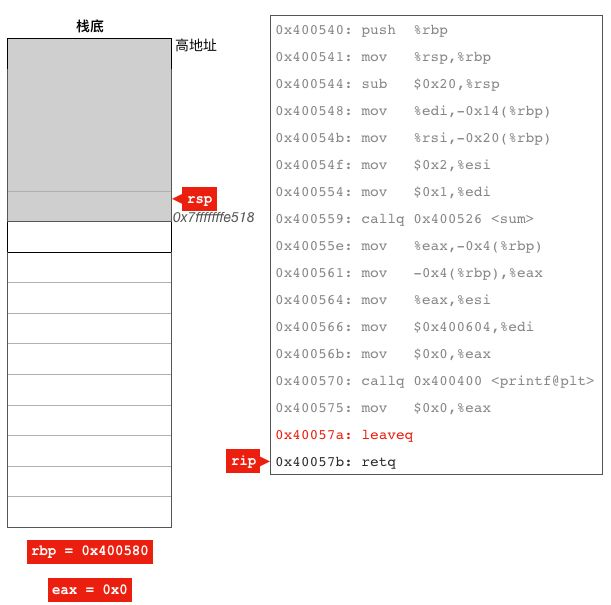

到此 main 函数就只剩下 retq 指令了，前面分析 sum 函数时已经详细分析过它了，这条指令执行完成后就会完全返回到调用 main 函数的函数中去继续执行。

## go语言中的函数调用过程

```go
package main

//计算a, b的平方和
func sum(a, b int) int {
   a2 := a * a
   b2 := b * b
   c := a2 + b2

   return c
}

func main() {
   sum(1, 2)
}
```

使用 go build 编译该程序，注意这里需要指定 -gcflags "-N -l" 关闭编译器优化，否则编译器可能把对 sum 函数的调用优化掉。

```bash
go build  -gcflags "-N -l" sum.go
```

编译后得到二进制可执行程序 sum，首先来看 main 函数的反汇编代码：

```
Dump of assembler code for function main.main:
  0x000000000044f4e0 <+0>: mov   %fs:0xfffffffffffffff8,%rcx #暂时不关注
  0x000000000044f4e9 <+9>: cmp   0x10(%rcx),%rsp #暂时不关注
  0x000000000044f4ed <+13>: jbe   0x44f51d <main.main+61> #暂时不关注
  0x000000000044f4ef <+15>: sub   $0x20,%rsp #为main函数预留32字节栈空间
  0x000000000044f4f3 <+19>: mov   %rbp,0x18(%rsp) #保存调用者的rbp寄存器
  0x000000000044f4f8 <+24>: lea   0x18(%rsp),%rbp #调整rbp使其指向main函数栈帧开始地址
  0x000000000044f4fd <+29>: movq   $0x1,(%rsp) #sum函数的第一个参数（1）入栈
  0x000000000044f505 <+37>: movq   $0x2,0x8(%rsp) #sum函数的第二个参数（2）入栈
  0x000000000044f50e <+46>: callq 0x44f480 <main.sum> #调用sum函数
  0x000000000044f513 <+51>: mov   0x18(%rsp),%rbp #恢复rbp寄存器的值为调用者的rbp
  0x000000000044f518 <+56>: add   $0x20,%rsp #调整rsp使其指向保存有调用者返回地址的栈单元
  0x000000000044f51c <+60>: retq   #返回到调用者
  0x000000000044f51d <+61>: callq 0x447390 <runtime.morestack_noctxt> #暂时不关注
  0x000000000044f522 <+66>: jmp   0x44f4e0 <main.main> #暂时不关注
End of assembler dump.
```

main 函数前面三条和最后两条指令是 go 编译器插入用于检查栈溢出的代码，我们现在不需要关注。其它部分跟 C 语言中的函数差不多，不过有点差别的是 go 语言函数调用时参数放在了栈上（第 7 和第 8 条指令把参数放在了栈上），从第 4 条指令可以看出，编译器给 main 函数预留了 32 个字节用于存放 main 的栈基址 rbp、调用 sum 函数时的两个参数，这三项各占 8 个字节所以共占 24 字节，那还有 8 个字节拿来干什么的呢？从下面的 sum 函数可以看出来，剩下的 8 个字节用于存放 sum 函数的返回值。

```
Dump of assembler code for function main.sum:
  0x000000000044f480 <+0>: sub   $0x20,%rsp #为sum函数预留32字节的栈空间
  0x000000000044f484 <+4>: mov   %rbp,0x18(%rsp) #保存main函数的rbp
  0x000000000044f489 <+9>: lea   0x18(%rsp),%rbp #设置sum函数的rbp
  0x000000000044f48e <+14>: movq   $0x0,0x38(%rsp) #返回值初始化为0
  0x000000000044f497 <+23>: mov   0x28(%rsp),%rax #从内存中读取第一个参数a(1)到rax
  0x000000000044f49c <+28>: mov   0x28(%rsp),%rcx #从内存中读取第一个参数a(1)到rcx
  0x000000000044f4a1 <+33>: imul   %rax,%rcx #计算a * a，并把结果放在rcx
  0x000000000044f4a5 <+37>: mov   %rcx,0x10(%rsp) #把rcx的值（a * a）赋值给变量a2
  0x000000000044f4aa <+42>: mov   0x30(%rsp),%rax #从内存中读取第二个参数a(2)到rax
  0x000000000044f4af <+47>: mov   0x30(%rsp),%rcx #从内存中读取第二个参数a(2)到rcx
  0x000000000044f4b4 <+52>: imul   %rax,%rcx #计算b * b，并把结果放在rcx
  0x000000000044f4b8 <+56>: mov   %rcx,0x8(%rsp) #把rcx的值（b * b）赋值给变量b2
  0x000000000044f4bd <+61>: mov   0x10(%rsp),%rax #从内存中读取a2到寄存器rax
  0x000000000044f4c2 <+66>: add   %rcx,%rax #计算a2 + b2,并把结果保存在rax
  0x000000000044f4c5 <+69>: mov   %rax,(%rsp) #把rax赋值给变量c, c = a2 + b2
  0x000000000044f4c9 <+73>: mov   %rax,0x38(%rsp) #将rax的值（a2 + b2）复制给返回值
  0x000000000044f4ce <+78>: mov   0x18(%rsp),%rbp #恢复main函数的rbp
  0x000000000044f4d3 <+83>: add   $0x20,%rsp #调整rsp使其指向保存有返回地址的栈单元
  0x000000000044f4d7 <+87>: retq   #返回main函数
End of assembler dump.
```

sum 函数的汇编代码比较直观，基本上就是对 go 语言 sum 函数的直接翻译，可以看到 sum 函数通过 rsp 寄存器从 main 函数栈中获取参数，返回值也通过 rsp 保存在了 main 函数的栈帧中。

下图是已经执行完成 sum 函数的 0x000000000044f4c9 <+73>: mov   %rax,0x38(%rsp) 这条指令但还未开始执行下一条指令时栈以及栈寄存器之间的关系图，读者可以结合上面的汇编代码和该图，加深对函数调用过程中的参数传递、返回值以及局部变量在栈上的位置和关系的理解。

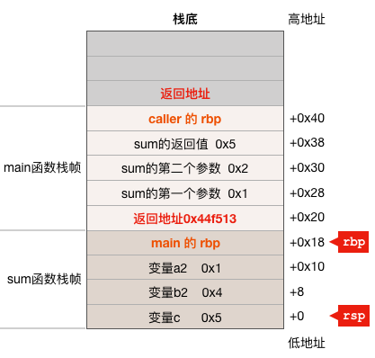

## 总结

1. 参数传递。gcc 编译的 c/c++ 代码一般通过寄存器传递参数，在 AMD64 Linux 平台，gcc 约定函数调用时前面 6 个参数分别通过 rdi, rsi, rdx, r10, r8 及 r9 传递；而 go 语言函数调用时参数是通过栈传递给被调用函数的，最后一个参数最先入栈，第一个参数最后入栈，参数在调用者的栈帧之中，被调用函数通过 rsp 加一定的偏移量来获取参数；

2. call 指令负责把执行 call 指令时的 rip 寄存器（函数返回地址）入栈；

3. gcc 通过 rbp 加偏移量的方式来访问局部和临时变量，而 go 编译器则使用 rsp 寄存器加偏移量的方式来访问它们；

4. ret 指令负责把 call 指令入栈的返回地址出栈给 rip，从而实现从被调用函数返回到调用函数继续执行；

5. gcc 使用 rax 寄存器返回函数调用的返回值，而 go 使用栈返回函数调用的返回值。
  