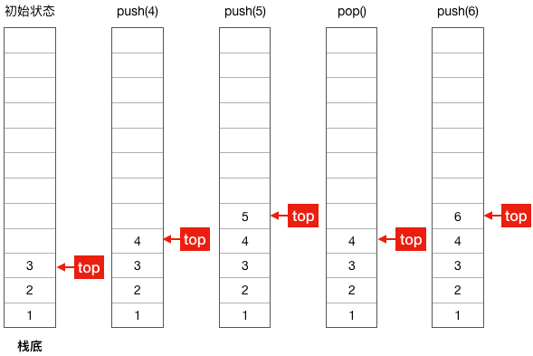
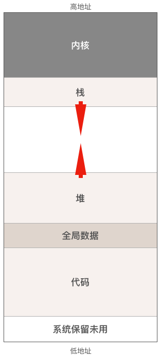
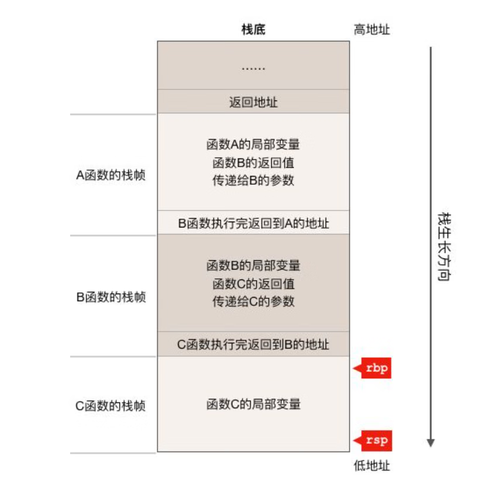
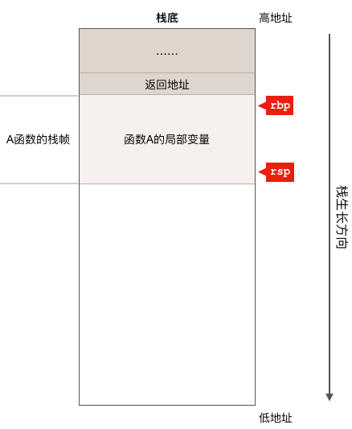
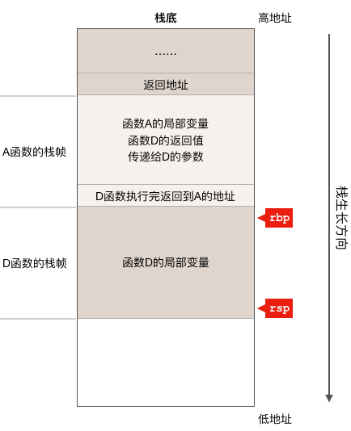
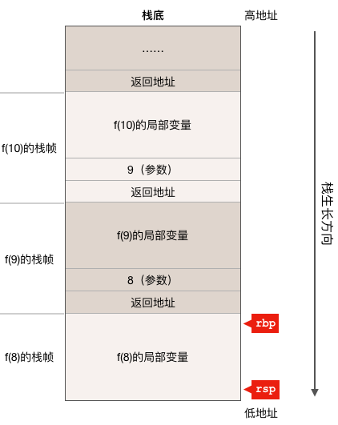

## 什么是栈

栈是一种“后进先出”的数据结构，它相当于一个容器，当需要往容器里面添加元素时只能放在最上面的一个元素之上，需要取出元素时也只能从最上面开始取，通常我们称添加元素为入栈(push)，取出元素为出栈(pop)。



## 进程在内存中的布局

严格说来这里讲的是进程在虚拟地址空间中的布局。

操作系统把磁盘上的可执行文件加载到内存运行之前，会做很多工作，其中很重要的一件事情就是把可执行文件中的代码，数据放在内存中合适的位置，并分配和初始化程序运行过程中所必须的堆栈，所有准备工作完成后操作系统才会调度程序起来运行。

程序运行时在内存中的布局图：



进程在内存中的布局主要分为 4 个区域：代码区，数据区，堆和栈。在详细讨论栈之前，先来简单介绍一下其它区域。

- **代码区**，包括能被 CPU 执行的机器代码（指令）和**只读数据**比如**字符串常量**，程序一旦加载完成代码区的大小就不会再变化了。

- **数据区**，包括程序的全局变量和静态变量（c 语言有静态变量，而 go 没有），与代码区一样，程序加载完毕后数据区的大小也不会发生改变。

- **堆**，程序运行时动态分配的内存都位于堆中，这部分内存由内存分配器负责管理。**该区域的大小会随着程序的运行而变化**，即当我们向堆请求分配内存但分配器发现堆中的内存不足时，它会向操作系统内核申请向高地址方向扩展堆的大小，而当我们释放内存把它归还给堆时如果内存分配器发现剩余空闲内存太多则又会向操作系统请求向低地址方向收缩堆的大小。从这个内存申请和释放流程可以看出，我们从堆上分配的内存用完之后必须归还给堆，否则内存分配器可能会反复向操作系统申请扩展堆的大小从而导致堆内存越用越多，最后出现内存不足，这就是所谓的内存泄漏。值的一提的是传统的 c/c++ 代码就必须小心处理内存的分配和释放，而在 go 语言中，有垃圾回收器帮助我们，所以程序员只管申请内存，而不用管内存的释放。

### 函数调用栈

函数调用栈简称栈，在程序运行过程中，不管是函数的执行还是函数调用，栈都起着非常重要的作用，它主要被用来：

- 保存函数的局部变量；
- 向被调用函数传递参数；
- 返回函数的返回值；
- 保存函数的返回地址。返回地址是指从被调用函数返回后调用者应该继续执行的指令地址，在汇编指令一节介绍 call 指令时我们将会对返回地址做更加详细的说明。

每个函数在执行过程中都需要使用一块栈内存用来保存上述这些值，我们称这块栈内存为某函数的栈帧 (stack frame)。当发生函数调用时，因为调用者还没有执行完，其栈内存中保存的数据还有用，所以被调用函数不能覆盖调用者的栈帧，只能把被调用函数的栈帧“push”到栈上，等被调函数执行完成后再把其栈帧从栈上“pop”出去，这样，栈的大小就会随函数调用层级的增加而生长，随函数的返回而缩小，也就是说函数调用层级越深，消耗的栈空间就越大。栈的生长和收缩都是自动的，由编译器插入的代码自动完成，因此位于栈内存中的函数局部变量所使用的内存随函数的调用而分配，随函数的返回而自动释放，所以程序员不管是使用有垃圾回收还是没有垃圾回收的高级编程语言都不需要自己释放局部变量所使用的内存，这一点与堆上分配的内存截然不同。

另外，AMD64 Linux 平台下，栈是从高地址向低地址方向生长的，为什么栈会采用这种看起来比较反常的生长方向呢，具体原因无从考究，不过根据前面那张进程的内存布局图可以猜测，当初这么设计的计算机科学家是希望尽量利用内存地址空间，才采用了堆和栈相向生长的方式，因为程序运行之前无法确定堆和栈谁会消耗更多的内存，如果栈也跟堆一样向高地址方向生长的话，栈底的位置不好确定，离堆太近则堆内存可能不够用，离堆太远栈又可能不够用，于是乎就采用了现在这种相向生长的方式。

AMD64 CPU 提供了 2 个与栈相关的寄存器：

- **rsp 寄存器，始终指向函数调用栈栈顶**
- **rbp 寄存器，一般用来指向函数栈帧的起始位置**

下面用两个图例来说明一下函数调用栈以及 rsp/rbp 与栈之间的关系。

假设现在有如下函数调用链且正在执行函数 C()：

```
A()->B()->C()
```

则函数ABC的栈帧以及 rsp/rbp 的状态大致如下图所示（注意，栈从高地址向低地址方向生长）：



对于上图，有几点需要说明一下：

- 调用函数时，参数和返回值都是存放在调用者的栈帧之中，而不是在被调函数之中；
- 目前正在执行 C 函数，且函数调用链为 A()->B()->C()，所以以栈帧为单位来看的话，C 函数的栈帧目前位于栈顶；
- CPU 硬件寄存器 rsp 指向整个栈的栈顶，当然它也指向 C 函数的栈帧的栈顶，而 rbp 寄存器指向的是 C 函数栈帧的起始位置；
- 虽然图中 ABC 三个函数的栈帧看起来都差不多大，但事实上在真实的程序中，每个函数的栈帧大小可能都不同，因为不同的函数局部变量的个数以及所占内存的大小都不尽相同；
- 有些编译器比如 gcc 会把参数和返回值放在寄存器中而不是栈中，go 语言中函数的参数和返回值都是放在栈上的；

随着程序的运行，如果 C、B 两个函数都执行完成并返回到了 A 函数继续执行，则栈状态如下图：



因为 C、B 两个函数都已经执行完成并返回到了 A 函数之中，所以 C、B 两个函数的栈帧就已经被 POP 出栈了，也就是说它们所消耗的栈内存被自动回收了。因为现在正在执行 A 函数，所以寄存器 rbp 和 rsp 指向的是 A 函数的栈中的相应位置。如果 A 函数又继续调用了 D 函数的话，则栈又变成下面这个样子：



可以看到，现在 D 函数的栈帧其实使用的是之前调用 B、C 两个函数所使用的栈内存，这没有问题，因为 B 和 C 函数已经执行完了，现在 D 函数重用了这块内存，这也是为什么在 C 语言中绝对不要返回函数局部变量的地址，因为同一个地址的栈内存会被重用，这就会造成意外的 bug，而 go 语言中没有这个限制，因为 go 语言的编译器比较智能，当它发现程序返回了某个局部变量的地址，编译器会把这个变量放到堆上去，而不会放在栈上。同样，这里我们还是需要注意 rbp 和 rsp 这两个寄存器现在指向了 D 函数的栈帧。从上面的分析我们可以看出，**寄存器 rbp 和 rsp 始终指向正在执行的函数的栈帧**。

最后，我们再来看一个递归函数的例子，假设有如下 go 语言代码片段：

```go
func f(n int) {
   if n <= 0 { //递归结束条件 n <= 0
       return
  }
   ......
   f(n - 1) //递归调用f函数自己
   ......
}
```

函数 f 是一个递归函数，f 函数会一直递归的调用自己直到参数 n 小于等于 0 为止，如果我们在其它某个函数里调用了 f(10)，而且现在正在执行 f(8) 的话，则其栈状态如下图所示：



从上图可以看出，即使是同一个函数，每次调用都会产生一个不同的栈帧，因此对于递归函数，每递归一次都会消耗一定的栈内存，如果递归层数太多就有导致栈溢出的风险，这也是为什么我们在实际的开发过程中应该尽量避免使用递归函数的原因之一，另外一个原因是递归函数执行效率比较低，因为它要反复调用函数，而调用函数有较大的性能开销。
