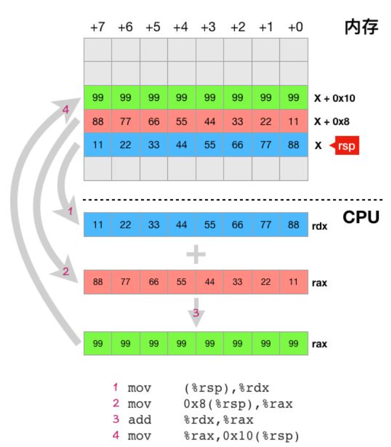

内存是计算机系统的存储设备，其主要作用是协助 CPU 在执行程序时存储数据和指令。

内存由大量内存单元组成，**内存单元大小为 1 个字节**（**1 字节包含 8 个二进制位**），每个内存单元都有一个编号，更专业的说法是**每一个内存单元都有一个地址**，我们在编写汇编代码或编译器把用高级语言所写的程序编译成汇编指令时，如果要读写内存，就必须在指令中指定内存地址，这样 CPU 才知道它要存取哪个或哪些内存单元。

大家都知道，高级语言中有变量的概念，变量又有全局变量和函数局部变量之分，而不管是哪种变量（除了 C 语言中申明为 register 的变量），都需要保存在内存之中，同时，绝大多数类型的变量都不会只占一个字节大小的内存，但是每个内存单元却只有一个字节大小，那么像这种大于一个字节的变量是如何保存在内存中的呢？聪明的你一定会想到，**任何大于一个字节的变量都存储在相邻的几个内存单元中**，事实也确实如此，比如 go 语言中的 int64 类型的变量在内存中就被存放在**连续的 8 个内存单元**之中，要读写该变量，只需在汇编指令中指定这些内存单元的起始地址以及读写的字节数即可。说到这里，问题又来了，既然一个 int64 类型的变量在内存中占 8 个字节，那么如何安排这 8 个字节来存储 64 位的整型数据呢？比如如何在内存中存储 0x1122334455667788 这个 16 进制表示的整型值，是把高位的 0x11 放在这 8 个内存单元中的第一个字节还是把低位的 0x88 放在第一个字节呢？其实两种方案都是可以的，不同的 CPU 采用的方案也可能不同，比如 X86 系列（包括 AMD64）的 CPU 就会把低位的 0x88 放在起始位置，而 PowerPC CPU 则会把高位的 0x11 放在起始的第一个字节，这就是所谓的**大小端存储模式**：

- **大端存储模式**：数据的高字节保存在内存的低地址中，低字节保存在内存的高地址中。
- **小端存储模式**：数据的高字节保存在内存的高地址中，低字节保存在内存的低地址中。

需要注意的是大小端存储模式与CPU相关，而与内存无关，内存只管保存数据而不关心数据是什么以及怎么解释这些数据。下图是大小端存储模式的示意图：


下面再用上一节讨论寄存器时使用过的例子来帮助我们加深对内存的理解：

```go
c = a + b  // go语言代码
```

```
mov   (%rsp),%rdx         #把变量a的值从内存中读取到寄存器rdx中
mov    0x8(%rsp),%rax   #把变量b的值从内存中读取到寄存器rax中
add   %rdx,%rax            #把寄存器rdx和rax中的值相加，并把结果放回rax寄存器中
mov   %rax,0x10(%rsp)  #把寄存器rax中的值写回变量c所在的内存
```

这里的 4 条指令有 3 条跟内存读写有关，指令中的 rsp 寄存器里面存放的是一个内存地址，现假设这个内存地址是 X, 则第一条指令 `mov (%rsp),%rdx` 表示把从地址为 X 开始的 8 个内存单元中的值读取到 rdx 寄存器中（因为 rdx 是一个 64 位寄存器，这就隐含了要一次读取连续的 8 个字节，指令中的地址只是起始地址，这个地址开始的 8 个字节是变量 a 所在的位置），第二条指令类似，只是起始地址为 X + 0x8（变量 b 在内存中的地址），最后一条指令表示把 rax 寄存器中的值写入从地址为 X + 0x10 开始的 8 个内存单元中。下图直观的表示了上面 4 条指令的执行过程。



对这个图做个简单的说明：

- 这里假定 rsp 寄存器的值是 X
- 图中的内存部分，每一行有 8 个内存单元，它们的地址从右向左依次加一，即如果最右边的内存单元的地址为 X 的话，则同一行最左边的内存单元的地址为 X+7。
- 灰色箭头表述数据流动方向
- 紫红色数字 n 表示上述代码片段中的第 n 条指令
