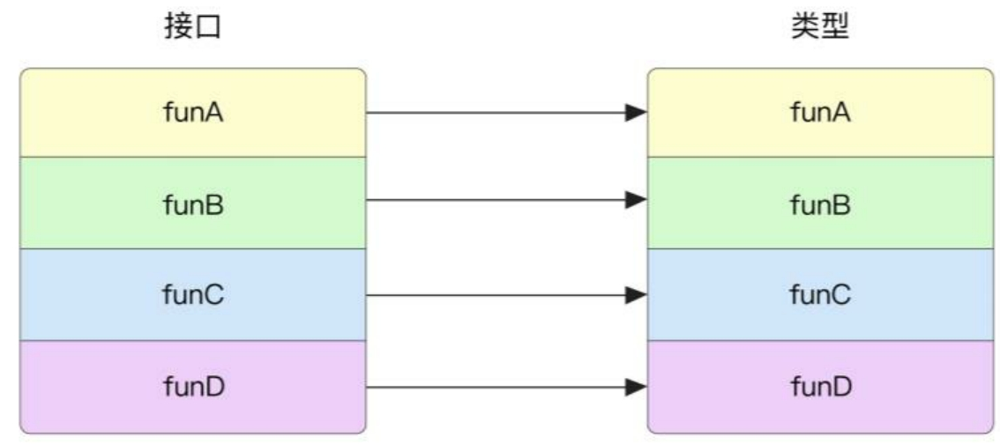
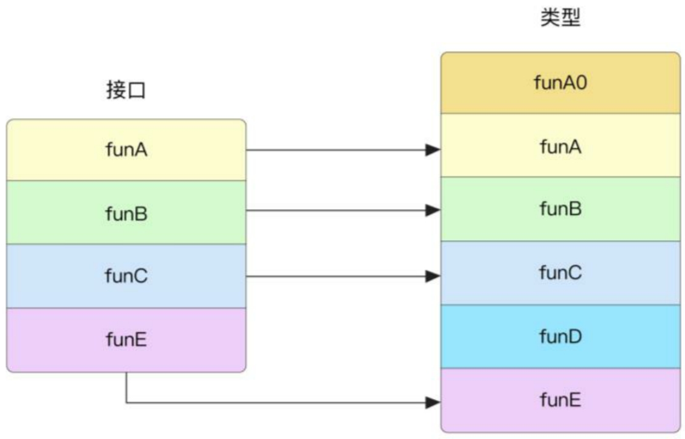
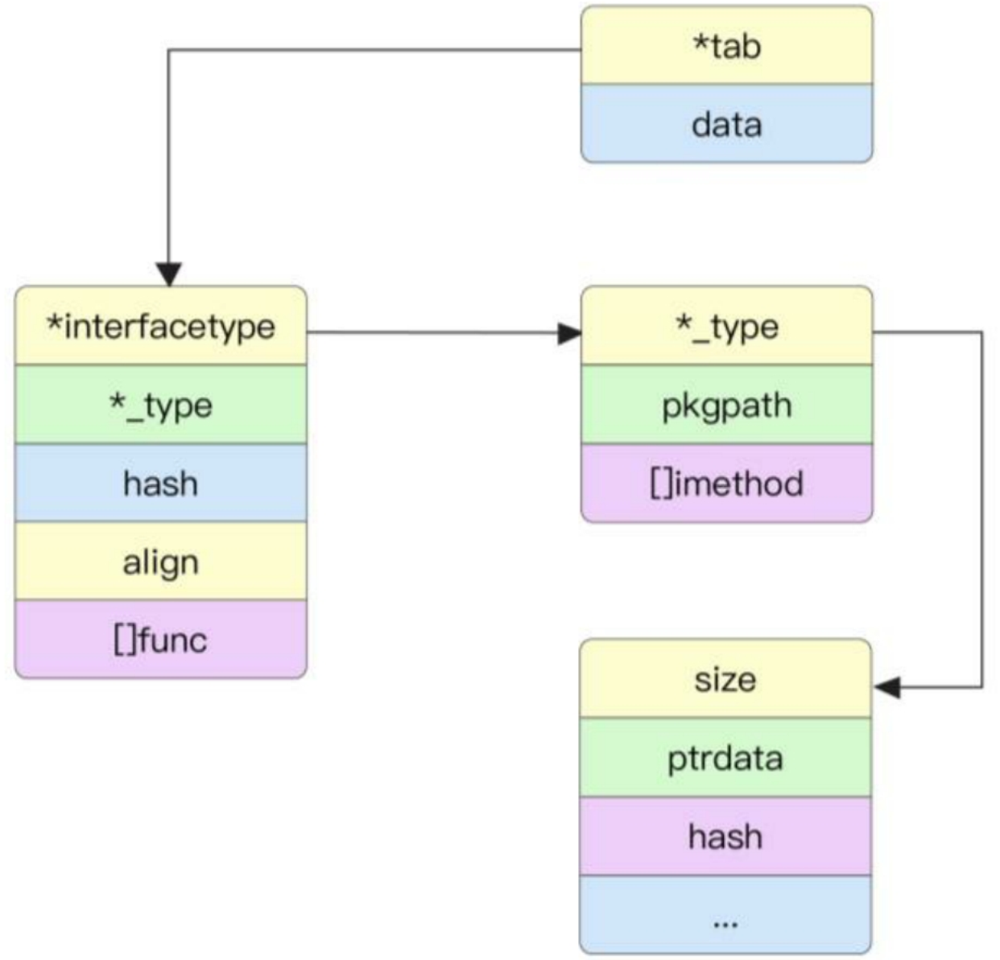
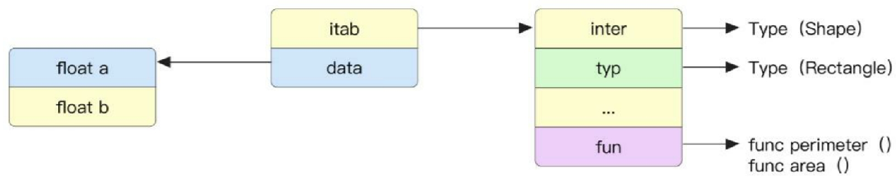
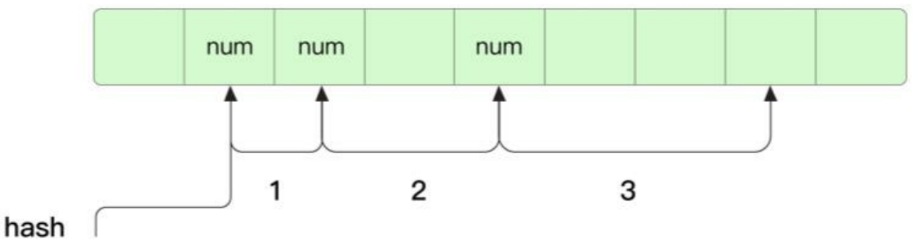
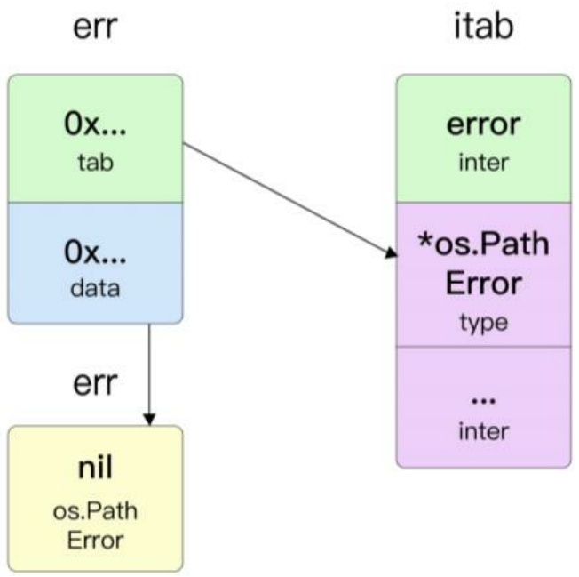

- [接口实现算法](#接口实现算法)
- [接口组成](#接口组成)
- [接口内存逃逸分析](#接口内存逃逸分析)
- [接口动态调用过程](#接口动态调用过程)
- [接口动态调用过程的效率评价](#接口动态调用过程的效率评价)
- [接口转换](#接口转换)
- [空接口组成](#空接口组成)
- [接口的陷阱](#接口的陷阱)
	- [结构体指针接收器](#结构体指针接收器)
	- [类型切片转换为接口切片](#类型切片转换为接口切片)
- [接口与 nil](#接口与-nil)

## 接口实现算法

通常来说，如果类型的方法与接口的方法是完全无序的状态，并且类型有 m 个方法，接口声明了 n 个方法，那么总的时间复杂度的最坏情况应该为 O(m*n)，即我们需要分别遍历类型与接口中的方法。

Go 语言在编译时对此做出的优化是先将类型与接口中的方法进行相同规则的排序，再将对应的方法进行比较。

经过排序后，接口与类型的方法数量相同，一一对应，如图 12-1 所示。



有时候类型的方法可能少于或多于接口的方法，如图 12-2 所示。虽然方法可能不会在相应的位置，但是有序规则保证了当 funB 在接口方法列表中的序号为 i 时，其在类型的方法列表中的序号大于或等于 i。

根据接口的有序规则，遍历接口方法列表，并在类型对应方法列表的序号 i 后查找是否存在相同的方法。如果查找不到，则说明类型对应的方法列表中并无此方法，因此在编译时会报错。由于同一个类型或接口的排序在整个编译时只会进行一次，因此排序的消耗可以忽略不计。排序后最坏的时间复杂度仅为 O(m+n)。



在编译时，查找类型是否实现了接口的逻辑位于 implements。通过遍历接口列表，并与类型方法列表中对应的位置进行比较，判断类型是否实现了接口。

`src/go/types/instantiate.go`

```go
// implements checks if V implements T. The receiver may be nil if implements
// is called through an exported API call such as AssignableTo.
//
// If the provided cause is non-nil, it may be set to an error string
// explaining why V does not implement T.
func (check *Checker) implements(V, T Type, cause *string) bool
```

在比较之前，会分别对接口与类型的方法进行排序，排序使用了 Sort 函数，其会根据元素数量选择不同的排序方法。排序的规则相对简单——根据包含了函数名和包名的 Sym 类型进行排序。因为 Go 语言根据函数名和包名可以唯一确定命名空间中的函数，所以排序后的结果是唯一的。

```go
// MethodsByName sorts methods by name.
type MethodsByName []*Field

func (x MethodsByName) Len() int           { return len(x) }
func (x MethodsByName) Swap(i, j int)      { x[i], x[j] = x[j], x[i] }
func (x MethodsByName) Less(i, j int) bool { return x[i].Sym.Less(x[j].Sym) }
```

## 接口组成

接口也是 Go 语言中的一种类型，带方法签名的接口在运行时的具体结构由 iface 构成，空接口的实现方式有所不同。

```go
type iface struct {
	tab  *itab
	data unsafe.Pointer
}
```

data 字段存储了接口中动态类型的函数指针。tab 字段存储了接口的类型、接口中的动态数据类型、动态数据类型的函数指针等。

```go
// layout of Itab known to compilers
// allocated in non-garbage-collected memory
// Needs to be in sync with
// ../cmd/compile/internal/reflectdata/reflect.go:/^func.WriteTabs.
type itab struct {
	inter *interfacetype
	_type *_type
	hash  uint32 // copy of _type.hash. Used for type switches.
	_     [4]byte
	fun   [1]uintptr // variable sized. fun[0]==0 means _type does not implement inter.
}
```

其中 _type 字段代表接口存储的动态类型。Go 语言的各种数据类型都是在 _type 字段的基础上通过增加额外字段来管理的。

_type 包含了类型的大小、哈希、标志、偏移量等元数据。

```go
type _type struct {
	size       uintptr
	ptrdata    uintptr // size of memory prefix holding all pointers
	hash       uint32
	tflag      tflag
	align      uint8
	fieldAlign uint8
	kind       uint8
	// function for comparing objects of this type
	// (ptr to object A, ptr to object B) -> ==?
	equal func(unsafe.Pointer, unsafe.Pointer) bool
	// gcdata stores the GC type data for the garbage collector.
	// If the KindGCProg bit is set in kind, gcdata is a GC program.
	// Otherwise it is a ptrmask bitmap. See mbitmap.go for details.
	gcdata    *byte
	str       nameOff
	ptrToThis typeOff
}
```

inter 字段代表接口本身的类型，类型 interfacetype 是对 _type 的简单包装。

```go
type interfacetype struct {
	typ     _type
	pkgpath name
	mhdr    []imethod
}
```

除了类型标识 _type，还包含了一些接口的元数据。pkgpath 代表接口所在的包名，mhdr []imethod 表示接口中暴露的方法在最终可执行文件中的名字和类型的偏移量。通过此偏移量在运行时能通过 resolveNameOff 和 resolveTypeOff 函数快速找到方法的名字和类型。

接口底层结构的完整图像如图 12-3 所示，hash 是接口动态类型的唯一标识，它是 _type 类型中 hash 的副本，后面会看到，在接口类型断言时，可以使用该字段快速判断接口动态类型与具体类型 _type 是否一致。一个空的 _4 字节用于内存对齐，最后的 fun 字段代表接口动态类型中的函数指针列表，用于运行时接口调用动态函数。注意，这里虽然在运行时只定义了大小为 1 的数组 `[1]uintptr`，但是其存储的是函数首地址的指针。当有多个函数时，其指针会依次在下方进行存储。在运行时，可以通过首地址 + 偏移找到任意的函数指针。



```go
package main

import "fmt"

type Shape interface {
	Area() float64
	Perimeter() float64
}

type Rectangle struct {
	width, height float64
}

func (r Rectangle) Area() float64 {
	return r.width * r.height
}

func (r Rectangle) Perimeter() float64 {
	return 2 * (r.width + r.height)
}

type Circle struct {
	radius float64
}

func (c Circle) Area() float64 {
	return 3.14 * c.radius * c.radius
}

func (c Circle) Perimeter() float64 {
	return 2 * 3.14 * c.radius
}

func main() {
	var s Shape

	s = Rectangle{width: 10, height: 5}
	fmt.Println("Area of Rectangle is", s.Area())

	s = Circle{radius: 5}
	fmt.Println("Area of Circle is", s.Area())
}
```

接口变量 s 在内存中的示意图如图 12-4 所示。从图中可以看出，接口变量中存储了接口本身的类型元数据，动态数据类型的元数据、动态数据类型的值及实现了接口的函数指针。



## 接口内存逃逸分析

data 字段存储了接口中具体值的指针，这是由于存储的数据可能很大也可能很小，难以预料。但这也表明，存储在接口中的值必须能够获取其地址，所以平时分配在栈中的值一旦赋值给接口后，会发生内存逃逸，在堆区为其开辟内存。

```go
package main

type Sumifier interface {
	Add(int, int) int
}

type Sumer struct {
	id int
}

func (s Sumer) Add(a, b int) int {
	return a + b
}
```

```go
func main() {
	s := Sumer{1}
	m := Sumifier(s)
	m.Add(1, 2)
}
```

```
go tool compile -m main.go
```

m 绑定的对象没有动态改变，所以这里编译器优化了，不会发生内存逃逸。

```
main.go:18:7: devirtualizing m.Add to Sumer
main.go:17:15: Sumifier(s) does not escape
```

```go
	ODOTMETH       // X.Sel (X is non-interface, Sel is method name)

	case ir.ODOTMETH:
		x := x.(*ir.SelectorExpr)
		if base.Flag.LowerM != 0 {
			base.WarnfAt(call.Pos(), "devirtualizing %v to %v", sel, typ)
		}
		call.SetOp(ir.OCALLMETH)
		call.X = x
```

下面的情况则会发生内存逃逸。

```go
func main() {
	s := Sumer{6754}
	m := Sumifier(s)
	m.Add(6754, 6754)

	t := Sumer{3456}
	m = Sumifier(t)
}
```

```
main.go:17:15: Sumifier(s) escapes to heap
main.go:21:14: Sumifier(t) escapes to heap
```

```go
func main() {
	var sum Sumifier // nil
	sum = Sumer{1}
	sum.Add(6754, 6754)
}
```

```go
main.go:17:2: Sumer{...} escapes to heap
```

## 接口动态调用过程

先找到接口的位置，再通过偏移量找到要调用的函数指针。

## 接口动态调用过程的效率评价

与直接调用相比，接口动态调用过程的额外消耗可能是查找函数指针的位置带来的。

对接口效率的另一个担忧涉及 CPU 分支预测。CPU 能预取、缓存指令和数据，甚至可以预先执行，将指令重新排序、并行化等。对于静态函数的调用，CPU 会预知程序中即将到来的分支，并相应地预取必要的指令，这加速了程序的执行过程。当使用动态调度时，CPU 无法预知程序的执行分支，为了解决此问题，CPU 应用了各种算法和启发式方法来猜测程序下一步将分支到何处（即分支预测），如果处理器猜对了，那么我们可以预期动态分支的效率几乎与静态分支一样，因为即将执行的指令已经被预取到了处理器的缓存中。

## 接口转换

接口转换的前提是被转换的接口能够包含转换接口中的方法，否则在编译时不通过。

在接口转换时，使用了运行时 runtime.convI2I 函数，如果两个接口不相同，那么显然 iface 中的 itab 结构也不相同。该函数的主要目的是重新构造接口的 iface 结构。

`src/runtime/iface.go`

```go
// convI2I returns the new itab to be used for the destination value
// when converting a value with itab src to the dst interface.
func convI2I(dst *interfacetype, src *itab) *itab {
	if src == nil {
		return nil
	}
	if src.inter == dst {
		return src
	}
	return getitab(dst, src._type, false)
}
```

itab 的构造比较麻烦，因此在 Go 语言中，相同的转换的 itab 会被存储到全局的 hash 表中。当全局的 hash 表中没有相同的 itab 时，会将此 itab 存储到全局的 hash 表中，第二次转换时可以直接到全局的 hash 表中查找此 itab，实现逻辑在 getitab 函数中。

getitab 函数先在不加锁的情况下访问全局 hash 表，如果查找不到则会加锁访问，如果仍然查找不到就会在内存中申请并创建新的 itab 变量。新的 itab 变量通过 itabAdd 插入全局 hash 表中，并且永远不会被释放。

这里的 hash 表为了解决冲突使用了开放式寻址（Open Addressing）中的二次方探测技术（Quadratic Probing）来解决哈希冲突的问题。二次方探测技术顾名思义是当 hash 出现冲突时，移动的总步长始终是移动次数的二次方。以图 12-6 的 hash 存储为例，当 hash 取模后为第 2 个位置时，先查找数组中的第 2 个位置是否为空。如果不为空，则以步长 1、2、3 进行查找，直到找到一个空位进行插入，在查找时也遵循相同的逻辑。由于 1+2+3...+n = n（n+1）/2，因此这种方式的总步长始终是移动次数的二次方。



如下为 hash 表中查找的 find 函数。itabHashFunc 求出 Hash 值，`itabHashFunc(inter, typ)& mask` 对数组的长度取余数，因此 h 的大小为 0 到 t.size-1。通过比对 itab 的 inter 字段和 _type 字段是否相同，最终确定是否找到了相同的 itab 值。

```go
// find finds the given interface/type pair in t.
// Returns nil if the given interface/type pair isn't present.
func (t *itabTableType) find(inter *interfacetype, typ *_type) *itab {
	// Implemented using quadratic probing.
	// Probe sequence is h(i) = h0 + i*(i+1)/2 mod 2^k.
	// We're guaranteed to hit all table entries using this probe sequence.
	mask := t.size - 1
	h := itabHashFunc(inter, typ) & mask
	for i := uintptr(1); ; i++ {
		p := (**itab)(add(unsafe.Pointer(&t.entries), h*goarch.PtrSize))
		// Use atomic read here so if we see m != nil, we also see
		// the initializations of the fields of m.
		// m := *p
		m := (*itab)(atomic.Loadp(unsafe.Pointer(p)))
		if m == nil {
			return nil
		}
		if m.inter == inter && m._type == typ {
			return m
		}
		h += i
		h &= mask
	}
}
```

## 空接口组成

空接口，其没有任何方法签名，因此可以容纳任意的数据类型。和有方法的接口（iface）相比，空接口不需要 interfacetype 表示接口的内在类型，也不需要 fun 方法列表。对于空接口，Go 语言在运行时使用了特殊的 eface 类型，其在 64 位系统中占据 16 字节。

`src/runtime/runtime2.go`

```go
type eface struct {
	_type *_type
	data  unsafe.Pointer
}
```

当类型转换为 eface 时，空接口与一般接口的处理方法是相似的，同样面临内存逃逸、寻址等问题。在内存逃逸时，对于特殊类型，仍然有和一般接口类似的优化函数，这些函数与转换为 iface 时使用的函数是相同的。

由于空接口可以容纳任何特殊类型，在实际中经常被使用（例如格式化输出），因此需要考虑任何类型转换为空接口的性能。

不难想出，空接口的笨重主要由于其内存逃逸的消耗、创建 eface 的消耗，以及为堆区的内存设置垃圾回收相关的代码。因此，如果赋值的对象一开始就已经分配在了堆中，则不会有如此夸张的差别，比如，Go 语言对单字节具有特别的优化，其已经在程序一开始全部存储在了内存中。

## 接口的陷阱

### 结构体指针接收器

```go
package main

type Binary struct {
	x int
}

type Stringer interface {
	String() string
}

func (b *Binary) String() string {
	return "Binary"
}

func main() {
	var s Stringer = Binary{45}
	s.String()
}
```

如果接口中是值，那么其必定已经对原始值进行了复制，在堆区产生了副本。而如果允许这种写法，那么即使修改了接口中的值也不会修改原始值，非常容易产生误解。

### 类型切片转换为接口切片

```go
func foo() []interface{}  {
	return []int{1, 2, 3}
}
```

Go 语言禁止了这种写法，批量转换为接口是效率非常低的操作。每个元素都需要转换为接口，并且数据需要内存逃逸。

## 接口与 nil

在下面的 foo 函数中，由于返回的 err 没有任何动态类型和动态值，因此 err==nil 为 true。

```go
package main

func foo() error {
	var err error
	return err
}

func main() {
	err := foo()
	println(err == nil)
}
```

把 foo 函数改进成如下形式，我们会发现 err == nil 为 false。原因在于，当接口为 nil 时，代表接口中的动态类型和动态类型值都为 nil。

```go
package main

import "os"

func foo() error {
	var err *os.PathError
	return err
}

func main() {
	err := foo()
	println(err == nil)
}
```

图 12-7 显示了上例的内存结构，揭示了接口为 nil 与接口值为 nil 的区别。由于接口 error 具有动态类型 `*os.PathError`，因此 err == nil 为 false。



```go

```
