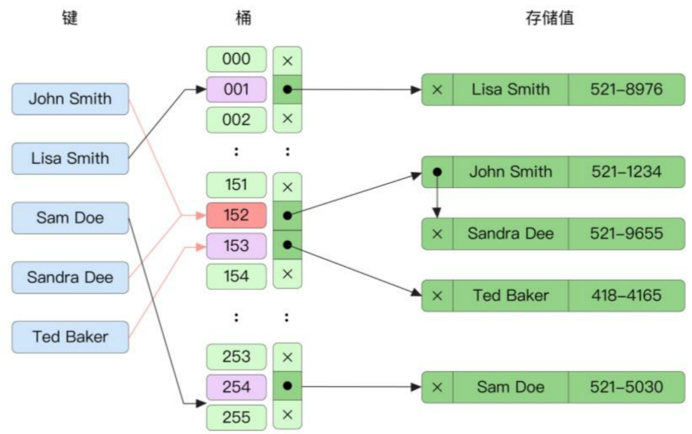
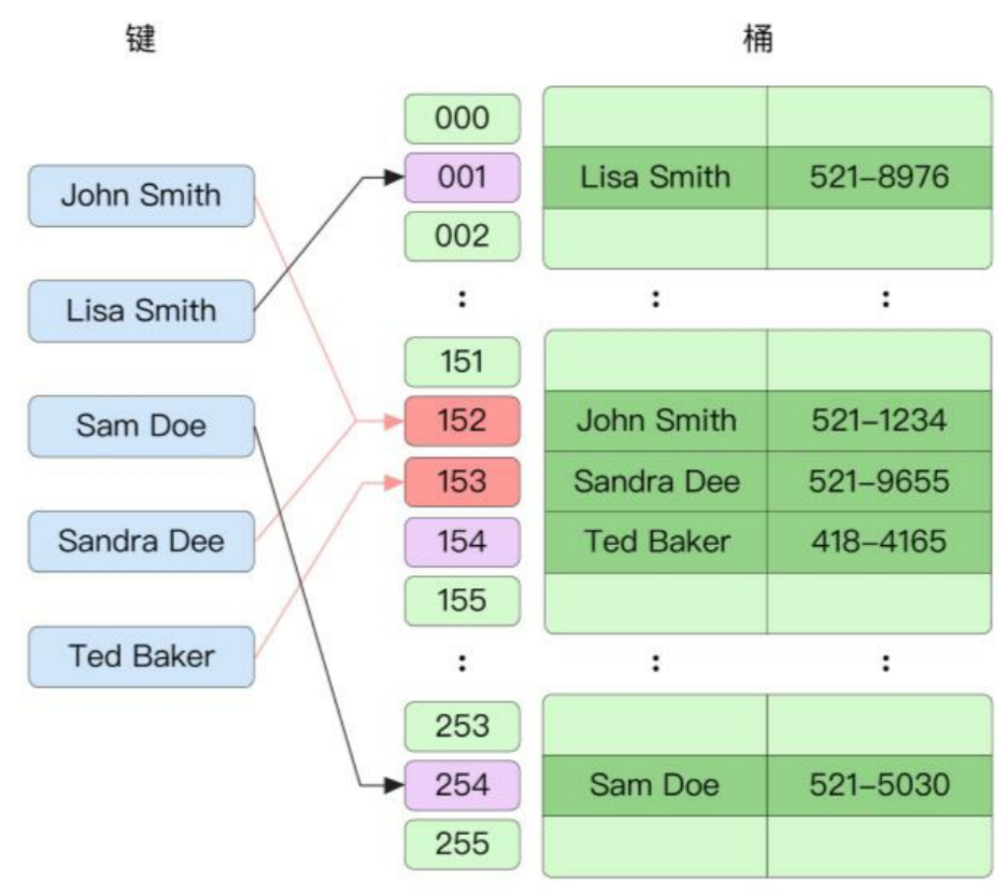

哈希表的原理是将多个键/ 值 (key/value) 对分散存储在 buckets 桶中。给定一个键(key)，哈希(Hash)算法会计算出键值对存储的位置。通常包括两步，伪代码如下：

```go
hash = hashfunc(key)
index = hash % array_size
```

在此伪代码中，第一步通过哈希算法计算键的哈希值，其结果与桶的数量无关。接着通过执行取模运算得到 `0 ~ array_size-1` 之间的 index 序号。

在实践中，我们通常将 map 看作 O(1) 时间复杂度的操作，通过一个键快速寻找其唯一对应的值(value)。

## 哈希算法

- `src/runtime/alg.go`

> https://github.com/tildeleb/aeshash

```go
// runtime variable to check if the processor we're running on
// actually supports the instructions used by the AES-based
// hash implementation.
var useAeshash bool

func alginit() {
	// Install AES hash algorithms if the instructions needed are present.
	if (GOARCH == "386" || GOARCH == "amd64") &&
		cpu.X86.HasAES && // AESENC
		cpu.X86.HasSSSE3 && // PSHUFB
		cpu.X86.HasSSE41 { // PINSR{D,Q}
		initAlgAES()
		return
	}
	if GOARCH == "arm64" && cpu.ARM64.HasAES {
		initAlgAES()
		return
	}
	getRandomData((*[len(hashkey) * goarch.PtrSize]byte)(unsafe.Pointer(&hashkey))[:])
	hashkey[0] |= 1 // make sure these numbers are odd
	hashkey[1] |= 1
	hashkey[2] |= 1
	hashkey[3] |= 1
}

func initAlgAES() {
	useAeshash = true
	// Initialize with random data so hash collisions will be hard to engineer.
	getRandomData(aeskeysched[:])
}
```

可以看到，如果当前 CPU 支持 AES 相关指令，那么就会使用 AES 哈希算法作为哈希函数实现。

`src/runtime/asm_amd64.s`

```c++
// AX: data
// BX: hash seed
// CX: length
// At return: AX = return value
TEXT aeshashbody<>(SB),NOSPLIT,$0-0
	// Fill an SSE register with our seeds.
	MOVQ	BX, X0				// 64 bits of per-table hash seed
	PINSRW	$4, CX, X0			// 16 bits of length
	PSHUFHW $0, X0, X0			// repeat length 4 times total
	MOVO	X0, X1				// save unscrambled seed
	PXOR	runtime·aeskeysched(SB), X0	// xor in per-process seed
	AESENC	X0, X0				// scramble seed

	CMPQ	CX, $16
	JB	aes0to15
	JE	aes16
	CMPQ	CX, $32
	JBE	aes17to32
	CMPQ	CX, $64
	JBE	aes33to64
	CMPQ	CX, $128
	JBE	aes65to128
	JMP	aes129plus
```

如果不支持，则调用 `memhashFallback` 哈希函数。

```go
// func memhash(p unsafe.Pointer, h, s uintptr) uintptr
// hash function using AES hardware instructions
TEXT runtime·memhash<ABIInternal>(SB),NOSPLIT,$0-32
	// AX = ptr to data
	// BX = seed
	// CX = size
	CMPB	runtime·useAeshash(SB), $0
	JEQ	noaes
	JMP	aeshashbody<>(SB)
noaes:
	JMP	runtime·memhashFallback<ABIInternal>(SB)
```

比如在 64 位的机器上：

`src/runtime/hash64.go`

```go
// Hashing algorithm inspired by
// wyhash: https://github.com/wangyi-fudan/wyhash

func memhashFallback(p unsafe.Pointer, seed, s uintptr) uintptr {
	var a, b uintptr
	seed ^= hashkey[0] ^ m1
	switch {
	case s == 0:
		return seed
	case s < 4:
		a = uintptr(*(*byte)(p))
		a |= uintptr(*(*byte)(add(p, s>>1))) << 8
		a |= uintptr(*(*byte)(add(p, s-1))) << 16
	case s == 4:
		a = r4(p)
		b = a
	case s < 8:
		a = r4(p)
		b = r4(add(p, s-4))
	case s == 8:
		a = r8(p)
		b = a
	case s <= 16:
		a = r8(p)
		b = r8(add(p, s-8))
	default:
		l := s
		if l > 48 {
			seed1 := seed
			seed2 := seed
			for ; l > 48; l -= 48 {
				seed = mix(r8(p)^m2, r8(add(p, 8))^seed)
				seed1 = mix(r8(add(p, 16))^m3, r8(add(p, 24))^seed1)
				seed2 = mix(r8(add(p, 32))^m4, r8(add(p, 40))^seed2)
				p = add(p, 48)
			}
			seed ^= seed1 ^ seed2
		}
		for ; l > 16; l -= 16 {
			seed = mix(r8(p)^m2, r8(add(p, 8))^seed)
			p = add(p, 16)
		}
		a = r8(add(p, l-16))
		b = r8(add(p, l-8))
	}

	return mix(m5^s, mix(a^m2, b^seed))
}
```

## 哈希碰撞与解决方法

不同的键通过哈希函数可能产生相同的哈希值。

如果将 2450 个键随机分配到一百万个桶中，则根据概率计算，至少有两个键被分配到同一个桶中的可能性有惊人的 95%。哈希碰撞导致同一个桶中可能存在多个元素，有多种方式可以避免哈希碰撞，一般有两种主要的策略：拉链法及开放寻址法。

如图 8-1 所示，拉链法将**同一个桶中的元素通过链表的形式进行链接**，这是一种最简单、最常用的策略。随着桶中元素的增加，可以不断链接新的元素，同时不用预先为元素分配内存。拉链法的不足之处在于，**需要存储额外的指针用于链接元素**，这增加了整个哈希表的大小。同时由于链表存储的地址不连续，所以**无法高效利用 CPU 高速缓存**。



与拉链法对应的另一种解决哈希碰撞的策略为**开放寻址法**（Open Addressing），如图 8-2 所示，所有元素都存储在桶的数组中。**当必须插入新条目时，将按某种探测策略操作，直到找到未使用的数组插槽为止。当搜索元素时，将按相同顺序扫描存储桶，直到查找到目标记录或找到未使用的插槽为止。**



Go 语言中的哈希表采用的是**开放寻址法**中的线性探测（Linear Probing）策略，线性探测策略是顺序（每次探测间隔为 1）的。由于良好的 CPU 高速缓存利用率和高性能，该算法是现代计算机体系中使用最广泛的结构。

```go

```
