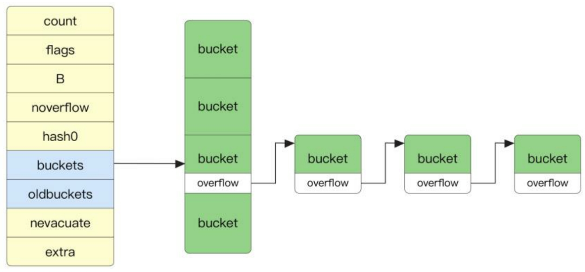
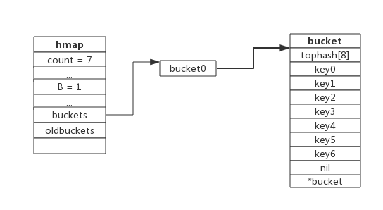
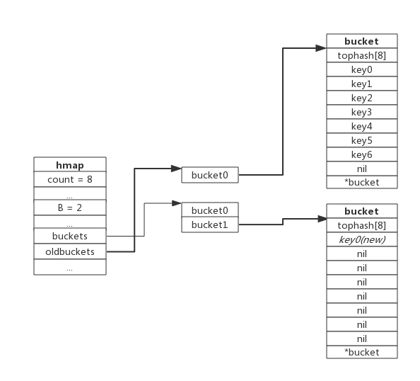
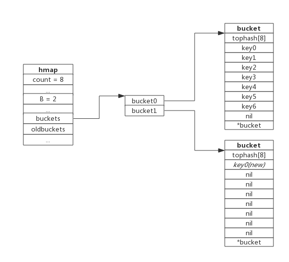
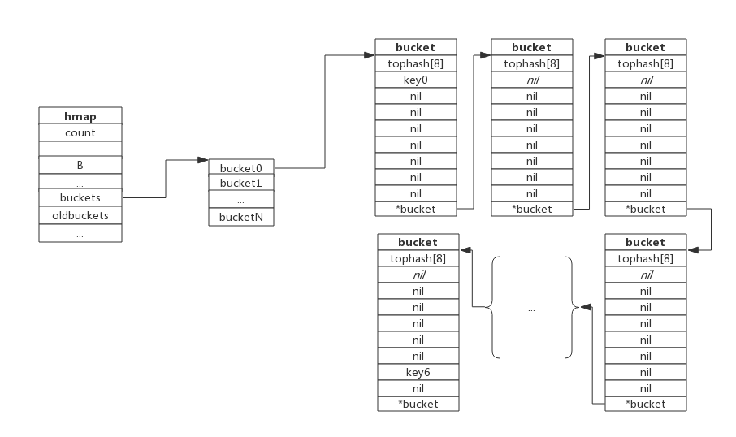
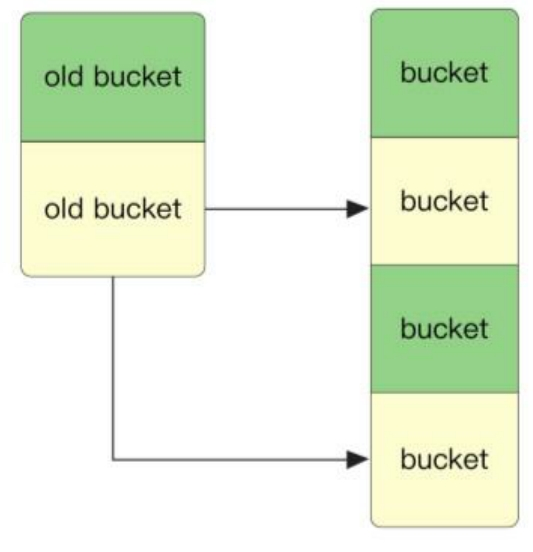
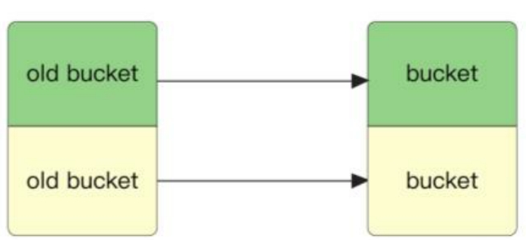

## 声明与初始化

### var 声明

```go
var hash map[T]T
```

其并未对 map 进行初始化操作，值为 nil，因此一旦进行 `hash[key] = value` 这样的赋值操作就会报错，但允许访问操作。

### make 函数初始化

第二种声明方式是通过 make 函数初始化。make 函数中的第二个参数代表初始化创建 map 的长度，当 NUMBER 为空时，其默认长度为 0。

```go
var hash = make(map[T]T, NUMBER)
```

此种方式可以正常地对 map 进行访问与赋值。

在类型检查阶段，将节点 Node 的 Op 操作变为 OMAKEMAP ；如果 make 指定了哈希表的长度，则会将长度常量值类型转换为 TINT ；如果未指定长度，则长度为 0。

`src/cmd/compile/internal/typecheck/func.go`

```go
// tcMake typechecks an OMAKE node.
func tcMake(n *ir.CallExpr) ir.Node {
    	switch t.Kind() {
            ...
        case types.TMAP:
            if i < len(args) {
                l = args[i]
                i++
                l = Expr(l)
                l = DefaultLit(l, types.Types[types.TINT])
                if l.Type() == nil {
                    n.SetType(nil)
                    return n
                }
                if !checkmake(t, "size", &l) {
                    n.SetType(nil)
                    return n
                }
            } else {
                l = ir.NewInt(0)
            }
            nn = ir.NewMakeExpr(n.Pos(), ir.OMAKEMAP, l, nil)
            nn.SetEsc(n.Esc())
            ...
```

如果 make 的第二个参数不是整数，则会在类型检查时报错。

`src/cmd/compile/internal/typecheck/typecheck.go`

```go
func checkmake(t *types.Type, arg string, np *ir.Node) bool {
	n := *np
	if !n.Type().IsInteger() && n.Type().Kind() != types.TIDEAL {
		base.Errorf("non-integer %s argument in make(%v) - %v", arg, t, n.Type())
		return false
	}

	// Do range checks for constants before DefaultLit
	// to avoid redundant "constant NNN overflows int" errors.
	if n.Op() == ir.OLITERAL {
		v := toint(n.Val())
		if constant.Sign(v) < 0 {
			base.Errorf("negative %s argument in make(%v)", arg, t)
			return false
		}
		if ir.ConstOverflow(v, types.Types[types.TINT]) {
			base.Errorf("%s argument too large in make(%v)", arg, t)
			return false
		}
	}

	// DefaultLit is necessary for non-constants too: n might be 1.1<<k.
	// TODO(gri) The length argument requirements for (array/slice) make
	// are the same as for index expressions. Factor the code better;
	// for instance, indexlit might be called here and incorporate some
	// of the bounds checks done for make.
	n = DefaultLit(n, types.Types[types.TINT])
	*np = n

	return true
}
```

在编译时的函数 walk 遍历阶段，`src/cmd/compile/internal/walk/builtin.go:walkMakeMap` 函数会指定运行时应该调用 `runtime.makemap` 函数还是 `runtime.makemap64` 函数。

makemap64 最后也调用了 makemap 函数，并保证创建 map 的长度不能超过 int 的大小。

```go
func makemap64(t *maptype, hint int64, h *hmap) *hmap {
	if int64(int(hint)) != hint {
		hint = 0
	}
	return makemap(t, int(hint), h)
}
```

```go
// makemap implements Go map creation for make(map[k]v, hint).
// If the compiler has determined that the map or the first bucket
// can be created on the stack, h and/or bucket may be non-nil.
// If h != nil, the map can be created directly in h.
// If h.buckets != nil, bucket pointed to can be used as the first bucket.
func makemap(t *maptype, hint int, h *hmap) *hmap {
	mem, overflow := math.MulUintptr(uintptr(hint), t.bucket.size)
	if overflow || mem > maxAlloc {
		hint = 0
	}

	// initialize Hmap
	if h == nil {
		h = new(hmap)
	}
	h.hash0 = fastrand()

	// Find the size parameter B which will hold the requested # of elements.
	// For hint < 0 overLoadFactor returns false since hint < bucketCnt.
	B := uint8(0)
	for overLoadFactor(hint, B) {
		B++
	}
	h.B = B

	// allocate initial hash table
	// if B == 0, the buckets field is allocated lazily later (in mapassign)
	// If hint is large zeroing this memory could take a while.
	if h.B != 0 {
		var nextOverflow *bmap
		h.buckets, nextOverflow = makeBucketArray(t, h.B, nil)
		if nextOverflow != nil {
			h.extra = new(mapextra)
			h.extra.nextOverflow = nextOverflow
		}
	}

	return h
}
```

makeBucketArray 会为 map 申请内存，需要注意的是，只有 map 的数量大于 24，才会在初始化时生成溢出桶。溢出桶的大小为 2(b-4)，其中，b 为桶的大小。

```go
// makeBucketArray initializes a backing array for map buckets.
// 1<<b is the minimum number of buckets to allocate.
// dirtyalloc should either be nil or a bucket array previously
// allocated by makeBucketArray with the same t and b parameters.
// If dirtyalloc is nil a new backing array will be alloced and
// otherwise dirtyalloc will be cleared and reused as backing array.
func makeBucketArray(t *maptype, b uint8, dirtyalloc unsafe.Pointer) (buckets unsafe.Pointer, nextOverflow *bmap) {
	base := bucketShift(b)
	nbuckets := base
	// For small b, overflow buckets are unlikely.
	// Avoid the overhead of the calculation.
	if b >= 4 {
		// Add on the estimated number of overflow buckets
		// required to insert the median number of elements
		// used with this value of b.
		nbuckets += bucketShift(b - 4)
		sz := t.bucket.size * nbuckets
		up := roundupsize(sz)
		if up != sz {
			nbuckets = up / t.bucket.size
		}
	}

	if dirtyalloc == nil {
		buckets = newarray(t.bucket, int(nbuckets))
	} else {
		// dirtyalloc was previously generated by
		// the above newarray(t.bucket, int(nbuckets))
		// but may not be empty.
		buckets = dirtyalloc
		size := t.bucket.size * nbuckets
		if t.bucket.ptrdata != 0 {
			memclrHasPointers(buckets, size)
		} else {
			memclrNoHeapPointers(buckets, size)
		}
	}

	if base != nbuckets {
		// We preallocated some overflow buckets.
		// To keep the overhead of tracking these overflow buckets to a minimum,
		// we use the convention that if a preallocated overflow bucket's overflow
		// pointer is nil, then there are more available by bumping the pointer.
		// We need a safe non-nil pointer for the last overflow bucket; just use buckets.
		nextOverflow = (*bmap)(add(buckets, base*uintptr(t.bucketsize)))
		last := (*bmap)(add(buckets, (nbuckets-1)*uintptr(t.bucketsize)))
		last.setoverflow(t, (*bmap)(buckets))
	}
	return buckets, nextOverflow
}
```

### 字面量形式初始化

map 还有字面量形式初始化的方式，如下所示，country 与 rating 在创建 map 时即在其中添加了元素。

```go
var country = map[string]string{
    "China": "Beijing",
    "Japan": "Tokyo",
    "Korea": "Seoul",
}

var rating = map[string]float32{
    "C": 5,
    "Go": 4.5,
    "Python": 4.5,
    "C++": 2,
}
```

如果 map 采取了字面量初始化的方式，那么它最终仍然需要转换为 make 操作。

`src/cmd/compile/internal/walk/complit.go::anylit`

```go
	case ir.OMAPLIT:
		n := n.(*ir.CompLitExpr)
		if !t.IsMap() {
			base.Fatalf("anylit: not map")
		}
		maplit(n, var_, init)
	}
```

```go
func maplit(n *ir.CompLitExpr, m ir.Node, init *ir.Nodes) {
	// make the map var
	args := []ir.Node{ir.TypeNode(n.Type()), ir.NewInt(n.Len + int64(len(n.List)))}
	a := typecheck.Expr(ir.NewCallExpr(base.Pos, ir.OMAKE, nil, args)).(*ir.MakeExpr)
	a.RType = n.RType
	a.SetEsc(n.Esc())
	appendWalkStmt(init, ir.NewAssignStmt(base.Pos, m, a))

	entries := n.List

	// The order pass already removed any dynamic (runtime-computed) entries.
	// All remaining entries are static. Double-check that.
	for _, r := range entries {
		r := r.(*ir.KeyExpr)
		if !isStaticCompositeLiteral(r.Key) || !isStaticCompositeLiteral(r.Value) {
			base.Fatalf("maplit: entry is not a literal: %v", r)
		}
	}

	if len(entries) > 25 {
		// For a large number of entries, put them in an array and loop.

		// build types [count]Tindex and [count]Tvalue
		tk := types.NewArray(n.Type().Key(), int64(len(entries)))
		te := types.NewArray(n.Type().Elem(), int64(len(entries)))

		// TODO(#47904): mark tk and te NoAlg here once the
		// compiler/linker can handle NoAlg types correctly.

		types.CalcSize(tk)
		types.CalcSize(te)

		// make and initialize static arrays
		vstatk := readonlystaticname(tk)
		vstate := readonlystaticname(te)

		datak := ir.NewCompLitExpr(base.Pos, ir.OARRAYLIT, nil, nil)
		datae := ir.NewCompLitExpr(base.Pos, ir.OARRAYLIT, nil, nil)
		for _, r := range entries {
			r := r.(*ir.KeyExpr)
			datak.List.Append(r.Key)
			datae.List.Append(r.Value)
		}
		fixedlit(inInitFunction, initKindStatic, datak, vstatk, init)
		fixedlit(inInitFunction, initKindStatic, datae, vstate, init)

		// loop adding structure elements to map
		// for i = 0; i < len(vstatk); i++ {
		//	map[vstatk[i]] = vstate[i]
		// }
		i := typecheck.Temp(types.Types[types.TINT])
		rhs := ir.NewIndexExpr(base.Pos, vstate, i)
		rhs.SetBounded(true)

		kidx := ir.NewIndexExpr(base.Pos, vstatk, i)
		kidx.SetBounded(true)

		// typechecker rewrites OINDEX to OINDEXMAP
		lhs := typecheck.AssignExpr(ir.NewIndexExpr(base.Pos, m, kidx)).(*ir.IndexExpr)
		base.AssertfAt(lhs.Op() == ir.OINDEXMAP, lhs.Pos(), "want OINDEXMAP, have %+v", lhs)
		lhs.RType = n.RType

		zero := ir.NewAssignStmt(base.Pos, i, ir.NewInt(0))
		cond := ir.NewBinaryExpr(base.Pos, ir.OLT, i, ir.NewInt(tk.NumElem()))
		incr := ir.NewAssignStmt(base.Pos, i, ir.NewBinaryExpr(base.Pos, ir.OADD, i, ir.NewInt(1)))

		var body ir.Node = ir.NewAssignStmt(base.Pos, lhs, rhs)
		body = typecheck.Stmt(body)
		body = orderStmtInPlace(body, map[string][]*ir.Name{})

		loop := ir.NewForStmt(base.Pos, nil, cond, incr, nil)
		loop.Body = []ir.Node{body}
		loop.SetInit([]ir.Node{zero})

		appendWalkStmt(init, loop)
		return
	}
	// For a small number of entries, just add them directly.

	// Build list of var[c] = expr.
	// Use temporaries so that mapassign1 can have addressable key, elem.
	// TODO(josharian): avoid map key temporaries for mapfast_* assignments with literal keys.
	// TODO(khr): assign these temps in order phase so we can reuse them across multiple maplits?
	tmpkey := typecheck.Temp(m.Type().Key())
	tmpelem := typecheck.Temp(m.Type().Elem())

	for _, r := range entries {
		r := r.(*ir.KeyExpr)
		index, elem := r.Key, r.Value

		ir.SetPos(index)
		appendWalkStmt(init, ir.NewAssignStmt(base.Pos, tmpkey, index))

		ir.SetPos(elem)
		appendWalkStmt(init, ir.NewAssignStmt(base.Pos, tmpelem, elem))

		ir.SetPos(tmpelem)

		// typechecker rewrites OINDEX to OINDEXMAP
		lhs := typecheck.AssignExpr(ir.NewIndexExpr(base.Pos, m, tmpkey)).(*ir.IndexExpr)
		base.AssertfAt(lhs.Op() == ir.OINDEXMAP, lhs.Pos(), "want OINDEXMAP, have %+v", lhs)
		lhs.RType = n.RType

		var a ir.Node = ir.NewAssignStmt(base.Pos, lhs, tmpelem)
		a = typecheck.Stmt(a)
		a = orderStmtInPlace(a, map[string][]*ir.Name{})
		appendWalkStmt(init, a)
	}
}
```

如果字面量的个数大于 25，则会构建两个数组专门存储 key 与 value，在运行时循环添加数据。如果字面量的个数小于 25，则编译时会通过在运行时初始化时直接添加的方式进行赋值，伪代码如下所示。

```go
entries := n.List.Slice()
if len(entries) > 25 {
    // For a large number of entries, put them in an array and loop.
    // ...
    for i := 0; i < len(vstatk); i++ {
        map[vstatk[i]] = vstate[i]
    }
} else {
    // For a small number of entries, just add them directly.
    // Build list of var[c] = expr.
    // Use temporaries so that mapassign1 can have addressable key, elem.
    // ...
    map[key1] = elem1
    map[key2] = elem2
    // ...
}
```

## 访问

map 可以进行以下两种形式的访问：

```go
value, ok := hash[key]
```

```go
value := hash[key]
```

当返回两个参数时，第 2 个参数代表当前 key 在 map 中是否存在。

为什么同样的访问既可以返回一个值也可以返回两个值，这其实是在编译时做到的。

`v := rating["Go"]` 在构建抽象语法树阶段被解析为一个 node，其中左边的类型为 ONAME，存储名字 `:`，右边的类型为 OLITERAL，存储 "Go"，节点的 Op 操作为 OINDEXMAP，根据 `hash[key]` 位于赋值号的左边或右边，决定要执行访问还是赋值操作。

访问操作会转化为调用运行时 mapaccess1_XXX 函数，赋值操作会转换为调用 mapassign_XXX 函数。

Go 语言编译器会根据 map 中 key 的类型和大小选择不同的运行时 mapaccess1_XXX 函数进行加速，这些函数在查找逻辑上都是相同的。

对于 `v, ok := hash[key]` 类型的 map 访问则有所不同，在编译时的 Op 操作为 OAS2MAPR，在运行时最终调用 mapaccess2_XXX 函数进行 map 访问，其伪代码如下。

```go
var, b = mapaccess2*(t, m, i)
v = *var
```

需要注意，如果采用 `_, ok := hash[key]` 的形式，则不用对第 1 个参数赋值。

在运行时，会根据 key 值及 hash 种子计算 hash 值。

```go
alg.hash(key, uintptr(h.hash0))
```

bucketMask 函数计算出当前桶的个数 -1。

```go
m := bucketMask(h.B)
```

Go 语言采用了一种简单的方式 hash & m 计算出 key 应该位于哪一个桶中。获取桶的位置后，tophash(hash) 计算出 hash 的前 8 位。接着此 hash 挨个与存储在桶中的 tophash 进行对比。如果有 hash 值相同，则会找到此 hash 值对应的 key 值并判断是否相同。如果 key 值也相同，则说明查找到了结果，返回 value。

```go
// mapaccess1 returns a pointer to h[key].  Never returns nil, instead
// it will return a reference to the zero object for the elem type if
// the key is not in the map.
// NOTE: The returned pointer may keep the whole map live, so don't
// hold onto it for very long.
func mapaccess1(t *maptype, h *hmap, key unsafe.Pointer) unsafe.Pointer {
	if raceenabled && h != nil {
		callerpc := getcallerpc()
		pc := abi.FuncPCABIInternal(mapaccess1)
		racereadpc(unsafe.Pointer(h), callerpc, pc)
		raceReadObjectPC(t.key, key, callerpc, pc)
	}
	if msanenabled && h != nil {
		msanread(key, t.key.size)
	}
	if asanenabled && h != nil {
		asanread(key, t.key.size)
	}
	if h == nil || h.count == 0 {
		if t.hashMightPanic() {
			t.hasher(key, 0) // see issue 23734
		}
		return unsafe.Pointer(&zeroVal[0])
	}
	if h.flags&hashWriting != 0 {
		fatal("concurrent map read and map write")
	}
	hash := t.hasher(key, uintptr(h.hash0))
	m := bucketMask(h.B)
	b := (*bmap)(add(h.buckets, (hash&m)*uintptr(t.bucketsize)))
	if c := h.oldbuckets; c != nil {
		if !h.sameSizeGrow() {
			// There used to be half as many buckets; mask down one more power of two.
			m >>= 1
		}
		oldb := (*bmap)(add(c, (hash&m)*uintptr(t.bucketsize)))
		if !evacuated(oldb) {
			b = oldb
		}
	}
	top := tophash(hash)
bucketloop:
	for ; b != nil; b = b.overflow(t) {
		for i := uintptr(0); i < bucketCnt; i++ {
			if b.tophash[i] != top {
				if b.tophash[i] == emptyRest {
					break bucketloop
				}
				continue
			}
			k := add(unsafe.Pointer(b), dataOffset+i*uintptr(t.keysize))
			if t.indirectkey() {
				k = *((*unsafe.Pointer)(k))
			}
			if t.key.equal(key, k) {
				e := add(unsafe.Pointer(b), dataOffset+bucketCnt*uintptr(t.keysize)+i*uintptr(t.elemsize))
				if t.indirectelem() {
					e = *((*unsafe.Pointer)(e))
				}
				return e
			}
		}
	}
	return unsafe.Pointer(&zeroVal[0])
}
```

函数 mapaccess2 的逻辑是类似的，只是其会返回第 2 个参数，表明 value 值是否存在于桶中，如果第 2 个参数返回 true，则代表 value 值存在于 map 中。

```go
func mapaccess2(t *maptype, h *hmap, key unsafe.Pointer) (unsafe.Pointer, bool) {
	if raceenabled && h != nil {
		callerpc := getcallerpc()
		pc := abi.FuncPCABIInternal(mapaccess2)
		racereadpc(unsafe.Pointer(h), callerpc, pc)
		raceReadObjectPC(t.key, key, callerpc, pc)
	}
	if msanenabled && h != nil {
		msanread(key, t.key.size)
	}
	if asanenabled && h != nil {
		asanread(key, t.key.size)
	}
	if h == nil || h.count == 0 {
		if t.hashMightPanic() {
			t.hasher(key, 0) // see issue 23734
		}
		return unsafe.Pointer(&zeroVal[0]), false
	}
	if h.flags&hashWriting != 0 {
		fatal("concurrent map read and map write")
	}
	hash := t.hasher(key, uintptr(h.hash0))
	m := bucketMask(h.B)
	b := (*bmap)(add(h.buckets, (hash&m)*uintptr(t.bucketsize)))
	if c := h.oldbuckets; c != nil {
		if !h.sameSizeGrow() {
			// There used to be half as many buckets; mask down one more power of two.
			m >>= 1
		}
		oldb := (*bmap)(add(c, (hash&m)*uintptr(t.bucketsize)))
		if !evacuated(oldb) {
			b = oldb
		}
	}
	top := tophash(hash)
bucketloop:
	for ; b != nil; b = b.overflow(t) {
		for i := uintptr(0); i < bucketCnt; i++ {
			if b.tophash[i] != top {
				if b.tophash[i] == emptyRest {
					break bucketloop
				}
				continue
			}
			k := add(unsafe.Pointer(b), dataOffset+i*uintptr(t.keysize))
			if t.indirectkey() {
				k = *((*unsafe.Pointer)(k))
			}
			if t.key.equal(key, k) {
				e := add(unsafe.Pointer(b), dataOffset+bucketCnt*uintptr(t.keysize)+i*uintptr(t.elemsize))
				if t.indirectelem() {
					e = *((*unsafe.Pointer)(e))
				}
				return e, true
			}
		}
	}
	return unsafe.Pointer(&zeroVal[0]), false
}
```

## 赋值

map 的赋值语法相对简单，例如 hash[key] = value 代表将 value 与 map1 哈希表中的 key 绑定在一起。

和 map 访问的情况类似，赋值操作最终会调用运行时 mapassignXXX 函数。执行赋值操作时，map 必须已经进行了初始化，否则在运行时会报错为 assignment to entry in nil map。同时要注意，由于 map 不支持并发的读写操作，所以每个 map 都有一个 flags 标志位，如果正在执行写入操作，则当前 map 的 hashWriting 标志位会被设置为 1，因此在访问时通过检测 hashWriting 即可知道是否有其他协程在访问此 map，如果是，则报错为 concurrent map writes。

和访问操作一样，赋值操作时会先计算 key 的 hash 值，标记当前 map 是写入状态。

如果当前没有桶，则会创建一个新桶，接着找到当前 key 对应的桶。

如果发现当前的 map 正在重建，则会优先完成重建过程。

最后会计算 tophash，开始寻找桶中是否有对应的 hash 值，如果找到了，则判断 key 是否相同，如果相同，则会找到对应的 value 的位置在后面进行赋值。

要注意的是，如果没找到 tophash，那么赋值操作还会去溢出桶里寻找是否有指定的 hash。如果溢出桶里不存在，则会向第一个空元素中插入数据 inserti，insertk 会记录此空元素的位置。

在赋值之前，还要判断 map 是否需要重建。

如果没有问题，就会执行最后的操作，将新的 key 与 value 存入数组。这里需要注意，如果桶中已经没有了空元素，那么需要申请一个新的桶。

新桶一开始来自 map 中 extra 字段初始化时存储的多余溢出桶，只有这些多余的溢出桶都用完才会申请新的内存，如图 8-6 所示，溢出桶可以以链表的形式进行延展。溢出桶并不会无限扩展，因为这会带来效率的下降以及可能的内存泄漏。



```go
// Like mapaccess, but allocates a slot for the key if it is not present in the map.
func mapassign(t *maptype, h *hmap, key unsafe.Pointer) unsafe.Pointer {
	if h == nil {
		panic(plainError("assignment to entry in nil map"))
	}
	if raceenabled {
		callerpc := getcallerpc()
		pc := abi.FuncPCABIInternal(mapassign)
		racewritepc(unsafe.Pointer(h), callerpc, pc)
		raceReadObjectPC(t.key, key, callerpc, pc)
	}
	if msanenabled {
		msanread(key, t.key.size)
	}
	if asanenabled {
		asanread(key, t.key.size)
	}
	if h.flags&hashWriting != 0 {
		fatal("concurrent map writes")
	}
	hash := t.hasher(key, uintptr(h.hash0))

	// Set hashWriting after calling t.hasher, since t.hasher may panic,
	// in which case we have not actually done a write.
	h.flags ^= hashWriting

	if h.buckets == nil {
		h.buckets = newobject(t.bucket) // newarray(t.bucket, 1)
	}

again:
	bucket := hash & bucketMask(h.B)
	if h.growing() {
		growWork(t, h, bucket)
	}
	b := (*bmap)(add(h.buckets, bucket*uintptr(t.bucketsize)))
	top := tophash(hash)

	var inserti *uint8
	var insertk unsafe.Pointer
	var elem unsafe.Pointer
bucketloop:
	for {
		for i := uintptr(0); i < bucketCnt; i++ {
			if b.tophash[i] != top {
				if isEmpty(b.tophash[i]) && inserti == nil {
					inserti = &b.tophash[i]
					insertk = add(unsafe.Pointer(b), dataOffset+i*uintptr(t.keysize))
					elem = add(unsafe.Pointer(b), dataOffset+bucketCnt*uintptr(t.keysize)+i*uintptr(t.elemsize))
				}
				if b.tophash[i] == emptyRest {
					break bucketloop
				}
				continue
			}
			k := add(unsafe.Pointer(b), dataOffset+i*uintptr(t.keysize))
			if t.indirectkey() {
				k = *((*unsafe.Pointer)(k))
			}
			if !t.key.equal(key, k) {
				continue
			}
			// already have a mapping for key. Update it.
			if t.needkeyupdate() {
				typedmemmove(t.key, k, key)
			}
			elem = add(unsafe.Pointer(b), dataOffset+bucketCnt*uintptr(t.keysize)+i*uintptr(t.elemsize))
			goto done
		}
		ovf := b.overflow(t)
		if ovf == nil {
			break
		}
		b = ovf
	}

	// Did not find mapping for key. Allocate new cell & add entry.

	// If we hit the max load factor or we have too many overflow buckets,
	// and we're not already in the middle of growing, start growing.
	if !h.growing() && (overLoadFactor(h.count+1, h.B) || tooManyOverflowBuckets(h.noverflow, h.B)) {
		hashGrow(t, h)
		goto again // Growing the table invalidates everything, so try again
	}

	if inserti == nil {
		// The current bucket and all the overflow buckets connected to it are full, allocate a new one.
		newb := h.newoverflow(t, b)
		inserti = &newb.tophash[0]
		insertk = add(unsafe.Pointer(newb), dataOffset)
		elem = add(insertk, bucketCnt*uintptr(t.keysize))
	}

	// store new key/elem at insert position
	if t.indirectkey() {
		kmem := newobject(t.key)
		*(*unsafe.Pointer)(insertk) = kmem
		insertk = kmem
	}
	if t.indirectelem() {
		vmem := newobject(t.elem)
		*(*unsafe.Pointer)(elem) = vmem
	}
	typedmemmove(t.key, insertk, key)
	*inserti = top
	h.count++

done:
	if h.flags&hashWriting == 0 {
		fatal("concurrent map writes")
	}
	h.flags &^= hashWriting
	if t.indirectelem() {
		elem = *((*unsafe.Pointer)(elem))
	}
	return elem
}
```

## 删除

delete 是 Go 语言中的关键字，用于进行 map 的删除操作，形如 delete(hash, key)，可以对相同的 key 进行多次删除操作而不会报错。

删除操作同样需要根据 key 计算出 hash 的前 8 位和指定的桶，同样会一直寻找是否有相同的 key，如果找不到，则会一直查找当前桶的溢出桶，直到到达溢出桶链表末尾。如果查找到了指定的 key，则会清空该数据，将 hash 位设置为 emptyOne。如果发现后面没有元素，则会将 hash 位设置为 emptyRest，并循环向上检查前一个元素是否为空，代码如下。

```go
func mapdelete(t *maptype, h *hmap, key unsafe.Pointer) {
	if raceenabled && h != nil {
		callerpc := getcallerpc()
		pc := abi.FuncPCABIInternal(mapdelete)
		racewritepc(unsafe.Pointer(h), callerpc, pc)
		raceReadObjectPC(t.key, key, callerpc, pc)
	}
	if msanenabled && h != nil {
		msanread(key, t.key.size)
	}
	if asanenabled && h != nil {
		asanread(key, t.key.size)
	}
	if h == nil || h.count == 0 {
		if t.hashMightPanic() {
			t.hasher(key, 0) // see issue 23734
		}
		return
	}
	if h.flags&hashWriting != 0 {
		fatal("concurrent map writes")
	}

	hash := t.hasher(key, uintptr(h.hash0))

	// Set hashWriting after calling t.hasher, since t.hasher may panic,
	// in which case we have not actually done a write (delete).
	h.flags ^= hashWriting

	bucket := hash & bucketMask(h.B)
	if h.growing() {
		growWork(t, h, bucket)
	}
	b := (*bmap)(add(h.buckets, bucket*uintptr(t.bucketsize)))
	bOrig := b
	top := tophash(hash)
search:
	for ; b != nil; b = b.overflow(t) {
		for i := uintptr(0); i < bucketCnt; i++ {
			if b.tophash[i] != top {
				if b.tophash[i] == emptyRest {
					break search
				}
				continue
			}
			k := add(unsafe.Pointer(b), dataOffset+i*uintptr(t.keysize))
			k2 := k
			if t.indirectkey() {
				k2 = *((*unsafe.Pointer)(k2))
			}
			if !t.key.equal(key, k2) {
				continue
			}
			// Only clear key if there are pointers in it.
			if t.indirectkey() {
				*(*unsafe.Pointer)(k) = nil
			} else if t.key.ptrdata != 0 {
				memclrHasPointers(k, t.key.size)
			}
			e := add(unsafe.Pointer(b), dataOffset+bucketCnt*uintptr(t.keysize)+i*uintptr(t.elemsize))
			if t.indirectelem() {
				*(*unsafe.Pointer)(e) = nil
			} else if t.elem.ptrdata != 0 {
				memclrHasPointers(e, t.elem.size)
			} else {
				memclrNoHeapPointers(e, t.elem.size)
			}
			b.tophash[i] = emptyOne
			// If the bucket now ends in a bunch of emptyOne states,
			// change those to emptyRest states.
			// It would be nice to make this a separate function, but
			// for loops are not currently inlineable.
			if i == bucketCnt-1 {
				if b.overflow(t) != nil && b.overflow(t).tophash[0] != emptyRest {
					goto notLast
				}
			} else {
				if b.tophash[i+1] != emptyRest {
					goto notLast
				}
			}
			for {
				b.tophash[i] = emptyRest
				if i == 0 {
					if b == bOrig {
						break // beginning of initial bucket, we're done.
					}
					// Find previous bucket, continue at its last entry.
					c := b
					for b = bOrig; b.overflow(t) != c; b = b.overflow(t) {
					}
					i = bucketCnt - 1
				} else {
					i--
				}
				if b.tophash[i] != emptyOne {
					break
				}
			}
		notLast:
			h.count--
			// Reset the hash seed to make it more difficult for attackers to
			// repeatedly trigger hash collisions. See issue 25237.
			if h.count == 0 {
				h.hash0 = fastrand()
			}
			break search
		}
	}

	if h.flags&hashWriting == 0 {
		fatal("concurrent map writes")
	}
	h.flags &^= hashWriting
}
```

## 扩容重建

### 扩容的前提条件

为了保证访问效率，当新元素将要添加进 map 时，都会检查是否需要扩容，扩容实际上是以空间换时间的手段。

触发扩容的条件有二个：

1. 负载因子 > 6.5 时，也即平均每个 bucket 存储的键值对达到 6.5 个。
2. overflow 数量 > 2 ^ 15 时，也即 overflow 数量超过 32768 时。

### 增量扩容

当负载因子过大时，就新建一个 bucket，新的 bucket 长度是原来的 2 倍，然后旧 bucket 数据搬迁到新的 bucket。

考虑到如果 map 存储了数以亿计的 key-value，一次性搬迁将会造成比较大的延时，Go 采用逐步搬迁策略，即每次访问 map 时都会触发一次搬迁，每次搬迁 2 个键值对。

下图展示了包含一个 bucket 满载的 map：



当前 map 存储了 7 个键值对，只有 1 个 bucket，负载因子为 7。再次插入数据时将会触发扩容操作，扩容之后再将新插入键写入新的 bucket。

当第 8 个键值对插入时，将会触发扩容，扩容后示意图如下：



hmap 数据结构中 oldbuckets 成员指身原 bucket，而 buckets 指向了新申请的 bucket。新的键值对被插入新的 bucket 中。

后续对 map 的访问操作会触发迁移，将 oldbuckets 中的键值对逐步的搬迁过来。当 oldbuckets 中的键值对全部搬迁完毕后，删除 oldbuckets。

搬迁完成后的示意图如下：



数据搬迁过程中原 bucket 中的键值对将存在于新 bucket 的前面，新插入的键值对将存在于新 bucket 的后面。

### 等量扩容

所谓等量扩容，实际上并不是扩大容量，buckets 数量不变，重新做一遍类似增量扩容的搬迁动作，把松散的键值对重新排列一次，以使 bucket 的使用率更高，进而保证更快的存取。

在极端场景下，比如不断地增删，而键值对正好集中在一小部分的 bucket，这样会造成 overflow 的 bucket 数量增多，但负载因子又不高，从而无法执行增量搬迁的情况，如下图所示：



上图可见，overflow 的 bucket 中大部分是空的，访问效率会很差。此时进行一次等量扩容，即 buckets 数量不变，经过重新组织后 overflow 的 bucket 数量会减少，即节省了空间又会提高访问效率。

### 源码

重建时需要调用 hashGrow 函数，如果负载因子超载，则会进行双倍重建。当溢出桶的数量过多时，会进行等量重建。新桶会存储到 buckets 字段，旧桶会存储到 oldbuckets 字段。map 中 extra 字段的溢出桶也进行同样的转移。

要注意的是，这里并没有实际执行将旧桶中的数据转移到新桶的过程。数据转移遵循写时复制（copy on write）的规则，只有在真正赋值时，才会选择是否需要进行数据转移，其核心逻辑位于 growWork 和 evacuate 函数中。

```go
const (
	// Maximum number of key/elem pairs a bucket can hold.
	bucketCntBits = 3
	bucketCnt     = 1 << bucketCntBits

	// Maximum average load of a bucket that triggers growth is 6.5.
	// Represent as loadFactorNum/loadFactorDen, to allow integer math.
	loadFactorNum = 13
	loadFactorDen = 2
)
    
func hashGrow(t *maptype, h *hmap) {
	// If we've hit the load factor, get bigger.
	// Otherwise, there are too many overflow buckets,
	// so keep the same number of buckets and "grow" laterally.
	bigger := uint8(1)
	if !overLoadFactor(h.count+1, h.B) {
		bigger = 0
		h.flags |= sameSizeGrow
	}
	oldbuckets := h.buckets
	newbuckets, nextOverflow := makeBucketArray(t, h.B+bigger, nil)

	flags := h.flags &^ (iterator | oldIterator)
	if h.flags&iterator != 0 {
		flags |= oldIterator
	}
	// commit the grow (atomic wrt gc)
	h.B += bigger
	h.flags = flags
	h.oldbuckets = oldbuckets
	h.buckets = newbuckets
	h.nevacuate = 0
	h.noverflow = 0

	if h.extra != nil && h.extra.overflow != nil {
		// Promote current overflow buckets to the old generation.
		if h.extra.oldoverflow != nil {
			throw("oldoverflow is not nil")
		}
		h.extra.oldoverflow = h.extra.overflow
		h.extra.overflow = nil
	}
	if nextOverflow != nil {
		if h.extra == nil {
			h.extra = new(mapextra)
		}
		h.extra.nextOverflow = nextOverflow
	}

	// the actual copying of the hash table data is done incrementally
	// by growWork() and evacuate().
}

// overLoadFactor reports whether count items placed in 1<<B buckets is over loadFactor.
func overLoadFactor(count int, B uint8) bool {
	return count > bucketCnt && uintptr(count) > loadFactorNum*(bucketShift(B)/loadFactorDen)
}
```

在进行写时复制时，并不是所有的数据都一次性转移，而是只转移当前需要的旧桶中的数据。`bucket := hash & bucketMask(h.B)` 得到了当前新桶所在的位置，而要转移的旧桶位于 `bucket & h.oldbucketmask()`中。`xy [2]evacDst` 用于存储数据要转移到的新桶的位置。

在双倍重建中，两个新桶的距离值总是与旧桶的数量值相等。例如，在图 8-7 中，旧桶的数量为 2，则转移到新桶的距离也为 2。



图 8-8 所示为等量重建，进行简单的直接转移即可。



在 map 双倍重建时，我们还需要解决旧桶中的数据要转移到某一个新桶中的问题。其中有一个非常重要的原则：如果数据的 `hash & bucketMask` 小于或等于旧桶的大小，则此数据必须转移到和旧桶位置完全对应的新桶中去，理由是当前 key 所在新桶的序号与旧桶是完全相同的。

## key 的比较性

如果没有办法比较 map 中的 key 是否相同，那么这些 key 就不能作为 map 的 key。

下面简单列出一些基本类型的可比较性。

- 布尔值是可比较的。
- 整数值可比较的。
- 浮点值是可比较的。
- 复数值是可比较的。
- 字符串值是可比较的。
- 指针值是可比较的。如果两个指针值指向相同的变量，或者两个指针的值均为 nil，则它们相等。
- 通道值是可比较的。如果两个通道值是由相同的 make 函数调用创建的，或者两个值都为 nil，则它们相等。
- 接口值是可比较的。如果两个接口值具有相同的动态类型和相等的动态值，或者两个接口值都为 nil，则它们相等。
- 如果结构的所有字段都是可比较的，则它们的值是可比较的。
- 如果数组元素类型的值可比较，则数组值可比较。如果两个数组对应的元素相等，则它们相等。
- 切片、函数、map 是不可比较的。

## 并发冲突

map 并不支持并发的读写。

官方文档的解释是：“map 不需要从多个 goroutine 安全访问，在实际情况下，map 可能是某些已经同步的较大数据结构或计算的一部分。因此，要求所有 map 操作都互斥将减慢大多数程序的速度，而只会增加少数程序的安全性。”

即 Go 语言只支持并发读写的原因是保证大多数场景下的查找效率。

```go

```
