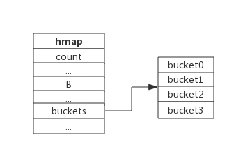
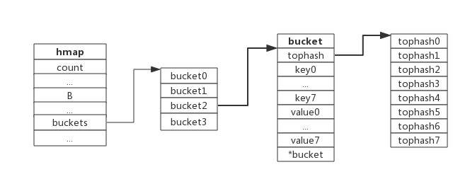
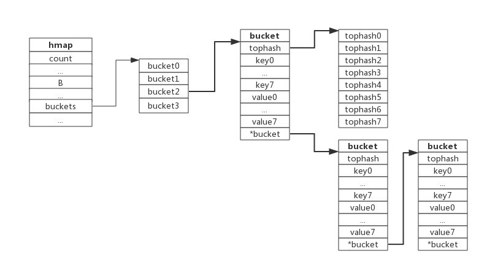
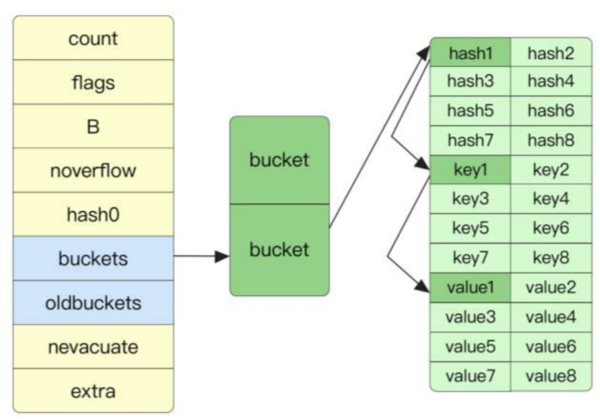
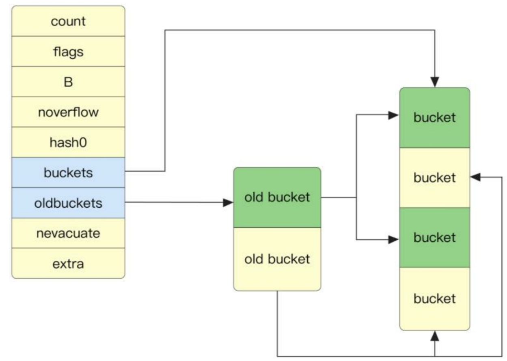
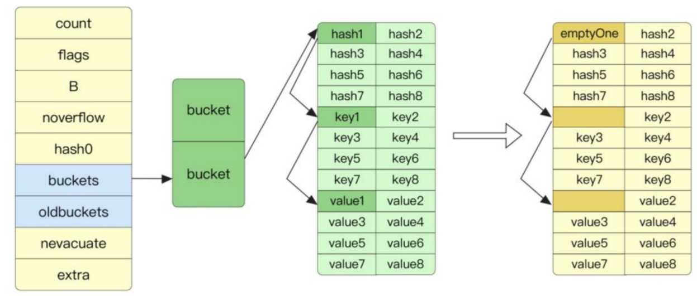

## 内部结构

map 数据结构由 `src/runtime/map.go:bmap` 定义：

```go
// A header for a Go map.
type hmap struct {
	// Note: the format of the hmap is also encoded in cmd/compile/internal/reflectdata/reflect.go.
	// Make sure this stays in sync with the compiler's definition.
	count     int // # live cells == size of map.  Must be first (used by len() builtin)
	flags     uint8
	B         uint8  // log_2 of # of buckets (can hold up to loadFactor * 2^B items)
	noverflow uint16 // approximate number of overflow buckets; see incrnoverflow for details
	hash0     uint32 // hash seed

	buckets    unsafe.Pointer // array of 2^B Buckets. may be nil if count==0.
	oldbuckets unsafe.Pointer // previous bucket array of half the size, non-nil only when growing
	nevacuate  uintptr        // progress counter for evacuation (buckets less than this have been evacuated)

	extra *mapextra // optional fields
}
```

- count 代表 map 中元素的数量。
- flags 代表当前 map 的状态（是否处于正在写入的状态等）。
- 2 的 B 次幂表示当前 map 中桶的数量，2^B=Buckets size。
- noverflow 为 map 中溢出桶的数量。当溢出的桶太多时，map 会进行 same-size map growth，其实质是避免溢出桶过大导致内存泄露。
- hash0 代表生成 hash 的随机数种子。
- buckets 是指向当前 map 对应的桶的指针。
- oldbuckets 是在 map 扩容时存储旧桶的，当所有旧桶中的数据都已经转移到了新桶中时，则清空。
- nevacuate 在扩容时使用，用于标记当前旧桶中小于 nevacuate 的数据都已经转移到了新桶中。
- extra 存储 map 中的溢出桶。

下图展示一个拥有 4 个 bucket 的 map：



本例中, `hmap.B = 2`，而 hmap.buckets 长度是 2 ^ B 为 4。元素经过哈希运算后会落到某个 bucket 中进行存储。查找过程类似。

### 桶结构

代表桶的 bmap 结构在运行时只列出了首个字段，即一个固定长度为 8 的数组。此字段顺序存储 key 的哈希值的前 8 位。

map 在编译时即确定了 map 中 key、value 及桶的大小，因此在运行时仅仅通过指针操作就可以找到特定位置的元素。

桶在存储的 tophash 字段后，会存储 key 数组及 value 数组。

bucket 数据结构由 `runtime/map.go:bmap` 定义：

```go
const (
	// Maximum number of key/elem pairs a bucket can hold.
	bucketCntBits = 3
	bucketCnt     = 1 << bucketCntBits
)

// A bucket for a Go map.
type bmap struct {
	// tophash generally contains the top byte of the hash value
	// for each key in this bucket. If tophash[0] < minTopHash,
	// tophash[0] is a bucket evacuation state instead.
	tophash [bucketCnt]uint8
	// Followed by bucketCnt keys and then bucketCnt elems.
	// NOTE: packing all the keys together and then all the elems together makes the
	// code a bit more complicated than alternating key/elem/key/elem/... but it allows
	// us to eliminate padding which would be needed for, e.g., map[int64]int8.
	// Followed by an overflow pointer.
}
```

每个 bucket 可以存储 8 个键值对。

- tophash 是个长度为 8 的数组，哈希值相同的键（准确的说是哈希值低位相同的键）存入当前 bucket 时会将哈希值的高位存储在该数组中，以方便后续匹配。
- data 区存放的是 key-value 数据，存放顺序是 key/key/key/...value/value/value，如此存放是为了节省字节对齐带来的空间浪费，key 和 value 的数据结构大部分情况下是不一样的。
- overflow 指针指向的是下一个 bucket，据此将所有冲突的键连接起来。

上述中 data 和 overflow 并不是在结构体中显示定义的，而是直接通过指针运算进行访问的。

下图展示 bucket 存放 8 个 key-value 对：



## 哈希冲突

当有两个或以上数量的键被哈希到了同一个 bucket 时，我们称这些键发生了冲突。Go 使用链地址法来解决键冲突。

由于每个 bucket 可以存放 8 个键值对，所以同一个 bucket 存放超过 8 个键值对时就会再创建一个键值对，用类似链表的方式将 bucket 连接起来。

下图展示产生冲突后的 map：



bucket 数据结构指示下一个 bucket 的指针称为 overflow bucket，意为当前 bucket 盛不下而溢出的部分。事实上哈希冲突并不是好事情，它降低了存取效率，好的哈希算法可以保证哈希值的随机性，但冲突过多也是要控制的。

## 哈希表原理

Go 语言选择将 key 与 value 分开存储而不是以 key/value/key/value 的形式存储，是为了在字节对齐时压缩空间。

在进行 `hash[key]` 的 map 访问操作时，会首先找到桶的位置，如下为伪代码：

```go
hash = hashfunc(key)
index = hash % array_size
```

找到桶的位置后遍历 tophash 数组，如图 8-3 所示，如果在数组中找到了相同的 hash，那么可以接着通过指针的寻址操作找到对应的 key 与 value。



在 Go 语言中还有一个溢出桶的概念，在执行 `hash[key] = value` 赋值操作时，当指定桶中的数据超过 8 个时，并不会直接开辟一个新桶，而是将数据放置到溢出桶中，每个桶的最后都存储了 overflow，即溢出桶的指针。在正常情况下，数据是很少会跑到溢出桶里面去的。

同理，我们可以知道，在 map 执行查找操作时，如果 key 的 hash 在指定桶的 tophash 数组中不存在，那么需要遍历溢出桶中的数据。

后面还会看到，如果一开始，初始化 map 的数量比较大，则 map 会提前创建好一些溢出桶存储在 `extra *mapextra` 字段。

```go
// mapextra holds fields that are not present on all maps.
type mapextra struct {
	// If both key and elem do not contain pointers and are inline, then we mark bucket
	// type as containing no pointers. This avoids scanning such maps.
	// However, bmap.overflow is a pointer. In order to keep overflow buckets
	// alive, we store pointers to all overflow buckets in hmap.extra.overflow and hmap.extra.oldoverflow.
	// overflow and oldoverflow are only used if key and elem do not contain pointers.
	// overflow contains overflow buckets for hmap.buckets.
	// oldoverflow contains overflow buckets for hmap.oldbuckets.
	// The indirection allows to store a pointer to the slice in hiter.
	overflow    *[]*bmap
	oldoverflow *[]*bmap

	// nextOverflow holds a pointer to a free overflow bucket.
	nextOverflow *bmap
}
```

这样当出现溢出现象时，可以用提前创建好的桶而不用申请额外的内存空间。只有预分配的溢出桶使用完了，才会新建溢出桶。

当发生以下两种情况之一时，map 会进行重建：

- map 超过了负载因子大小。
- 溢出桶的数量过多。

### 负载因子

负载因子用于衡量一个哈希表冲突情况，公式为：

```
负载因子=哈希表中的元素数量/桶的数量
```

例如，对于一个 bucket 数量为 4，包含 4 个键值对的哈希表来说，这个哈希表的负载因子为 1。

- 哈希因子过小，说明空间利用率低
- 哈希因子过大，说明冲突严重，存取效率低

负载因子的增大，意味着更多的元素会被分配到同一个桶中，此时效率会减慢，搜索效率就成了遍历数组。

哈希表需要将负载因子控制在合适的大小，超过其阀值需要进行 rehash，也即键值对重新组织。

每个哈希表的实现对负载因子容忍程度不同，比如 Redis 实现中负载因子大于 1 时就会触发 rehash，而 Go 则在在负载因子达到 6.5 时才会触发 rehash，因为 Redis 的每个 bucket 只能存 1 个键值对，而 Go 的 bucket 可能存 8 个键值对，所以 Go 可以容忍更高的负载因子。

Go 语言中的负载因子为 6.5，当超过其大小后，map 会进行扩容，增大到旧表 2 倍的大小，如图 8-4 所示。旧桶的数据会存到 oldbuckets 字段中，并想办法分散转移到新桶中。当旧桶中的数据全部转移到新桶中后，旧桶就会被清空。



map 的重建还存在第二种情况，即溢出桶的数量太多，这时 map 只会新建和原来相同大小的桶，目的是防止溢出桶的数量缓慢增长导致的内存泄露。

如图 8-5 所示，当进行 map 的 delete 操作时，和赋值操作类似，delete 操作会根据 key 找到指定的桶，如果存在指定的 key，那么就释放掉 key 与 value 引用的内存。同时 tophash 中的指定位置会存储 emptyOne，代表当前位置是空的。



同时，删除操作会探测当前要删除的元素之后是否都是空的。如果是，则 tophash 会存储为 emptyRest。这样做的好处是在做查找操作时，遇到 emptyRest 可以直接退出，因为后面的元素都是空的。

```go

```
