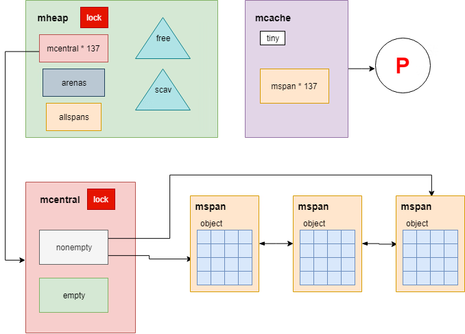
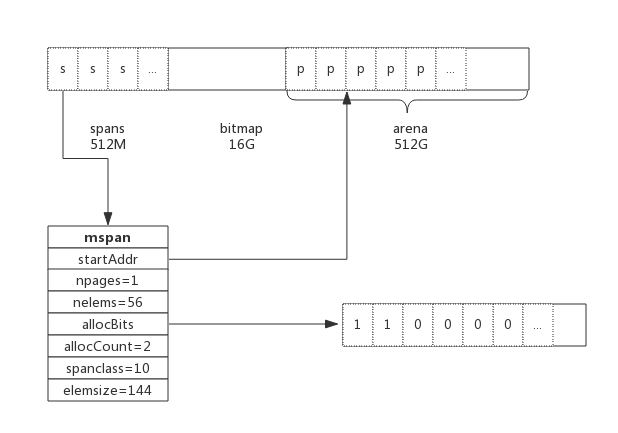
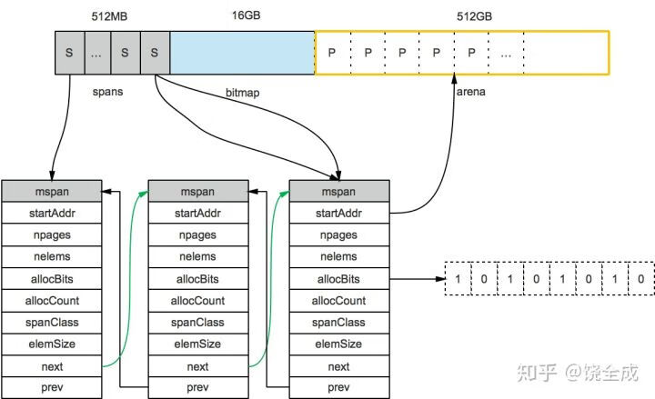
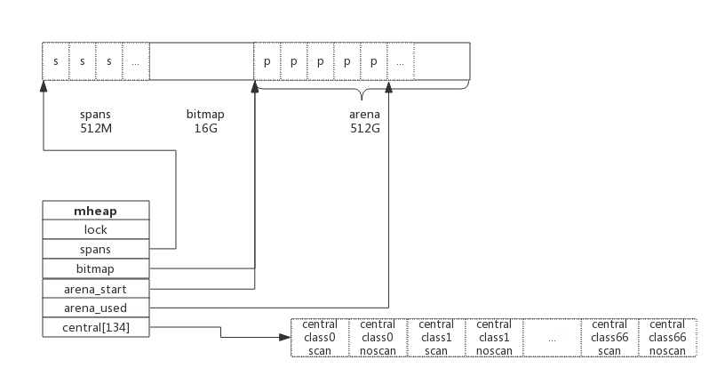
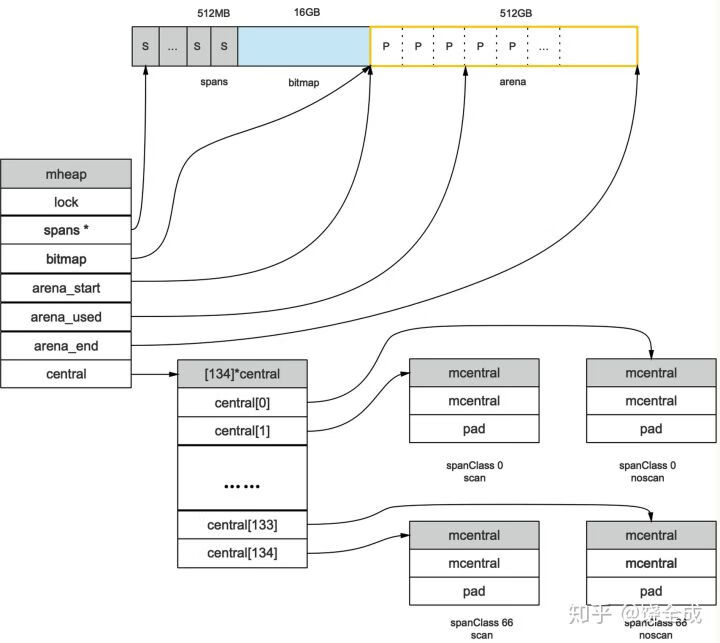

## 前言

编写过 C 语言程序的肯定知道通过 malloc() 方法动态申请内存，其中内存分配器使用的是 glibc 提供的 ptmalloc2。

除了 glibc，业界比较出名的内存分配器有 Google 的 tcmalloc 和 Facebook 的 jemalloc。二者在避免内存碎片和性能上均比 glibc 有比较大的优势，在多线程环境中效果更明显。

Golang 中也实现了内存分配器，**原理与 tcmalloc 类似**，简单的说就是维护一块大的全局内存，每个线程 (Golang 中为 P) 维护一块小的私有内存，私有内存不足再从全局申请，底层直接调用操作系统的 mmap 等函数。

另外，内存分配与 GC （垃圾回收）关系密切，所以了解 GC 前有必要了解内存分配的原理。

## 核心思想

Go 是一个支持 goroutine 这种多线程的语言，所以它的内存管理系统必须也要考虑在多线程下的稳定性和效率问题。在多线程方面，很自然的做法就是每条线程都有自己的本地的内存，然后有一个全局的分配链，当某个线程中内存不足后就向全局分配链中申请内存。这样就避免了多线程同时访问共享变量时的加锁。

分配器的数据结构包括 :

- FixAlloc: 固定大小 (128kB) 的对象的空闲链分配器，被分配器用于管理存储 MHeap：分配堆，按页的粒度进行管理 (4kB)

- MSpan: 一些由 MHeap 管理的页

- MCentral: 对于给定尺寸类别的共享的 free list

- MCache: 用于小对象的每 M 一个的 cache



> 按照其用途，span 面向内部管理，object 面向对象分配。

## 基础概念

为了方便自主管理内存，做法便是先向系统申请一块内存，然后将内存切割成小块，通过一定的内存分配算法管理内存。

以 64 位系统为例，Golang 程序启动时会向系统申请的内存如下图所示：


预申请的内存划分为 spans、bitmap、arena 三部分。

- arena 即为所谓的**堆区**，**应用中需要的内存从这里分配**。

- spans 和 bitmap 是为了管理 arena 区而存在的。

arena 的大小为 512G，为了方便管理把 arena 区域划分成一个个的 page，每个 page 为 8KB, 一共有 512GB/8KB 个页；

spans 区域存放 span 的指针，每个指针对应一个或多个 page，所以 span 区域的大小为 (512GB/8KB) *指针大小 8byte = 512M

bitmap 区域大小也是通过 arena 计算出来，不过主要用于 GC。


在旧的 Go 版本中，Go 程序是采用预先保留连续的虚拟地址的方案，在 64 位的系统上，会预先保留 512G 的虚拟内存空间，但是不可增长，而新版本中，虚拟内存的地址长度被设置为了 48 位，理论上可以支持 2 ^ 48 字节的内存使用。

### span

span 是用于管理 arena 页的关键数据结构，每个 span 中包含 1 个或多个连续页，为了满足小对象分配，span 中的一页会划分更小的粒度，而对于大对象比如超过页大小，则通过多页实现。

### span 数据结构

span 是内存管理的基本单位，每个 span 用于管理特定的 class 对象，根据对象大小，span 将一个或多个页拆分成多个块进行管理。

`src/runtime/mheap.go:mspan` 定义了其数据结构：

```go
type mspan struct {
	next *mspan			//链表前向指针，用于将span链接起来
	prev *mspan			//链表前向指针，用于将span链接起来
	startAddr uintptr // 起始地址，也即所管理页的地址
	npages    uintptr // 管理的页数

	nelems uintptr // 块个数，也即有多少个块可供分配

	allocBits  *gcBits //分配位图，每一位代表一个块是否已分配

	allocCount  uint16     // 已分配块的个数
	spanclass   spanClass  // class表中的class ID

	elemsize    uintptr    // class表中的对象大小，也即块大小
}
```

以 class 10 为例，span 和管理的内存如下图所示：





spanclass 为 10，参照 class 表可得出 npages = 1,nelems = 56,elemsize 为 144。其中 startAddr 是在 span 初始化时就指定了某个页的地址。allocBits 指向一个位图，每位代表一个块是否被分配，本例中有两个块已经被分配，其 allocCount 也为 2。

next 和 prev 用于将多个 span 链接起来，这有利于管理多个 span，接下来会进行说明。

### cache

有了管理内存的基本单位 span，还要有个数据结构来管理 span，这个数据结构叫 mcentral，各线程需要内存时从 mcentral 管理的 span 中申请内存，为了避免多线程申请内存时不断地加锁，Golang 为每个线程分配了 span 的缓存，这个缓存即是 cache。

`src/runtime/mcache.go:mcache` 定义了cache的数据结构：

```go
type mcache struct {
	alloc [67*2]*mspan // 按class分组的mspan列表
}
```

alloc 为 mspan 的指针数组，数组大小为 class 总数的 2 倍。数组中每个元素代表了一种 class 类型的 span 列表，每种 class 类型都有两组 span 列表，第一组列表中所表示的对象中包含了指针，第二组列表中所表示的对象不含有指针，这么做是为了提高 GC 扫描性能，对于不包含指针的 span 列表，没必要去扫描。

根据对象是否包含指针，将对象分为 noscan 和 scan 两类，其中 noscan 代表没有指针，而 scan 则代表有指针，需要 GC 进行扫描。

mcache 和 span 的对应关系如下图所示：


mcache 在初始化时是没有任何 span 的，在使用过程中会动态地从 central 中获取并缓存下来，根据使用情况，每种 class 的 span 个数也不相同。上图所示，class 0 的 span 数比 class1 的要多，说明本线程中分配的小对象要多一些。

### central

cache 作为线程的私有资源为单个线程服务，而 central 则是全局资源，为多个线程服务，当某个线程内存不足时会向 central 申请，当某个线程释放内存时又会回收进 central。

`src/runtime/mcentral.go:mcentral` 定义了 central 数据结构：

```go
type mcentral struct {
	lock      mutex     //互斥锁
	spanclass spanClass // span class ID
	nonempty  mSpanList // non-empty 指还有空闲块的span列表
	empty     mSpanList // 指没有空闲块的span列表

	nmalloc uint64      // 已累计分配的对象个数
}
```

- lock : 线程间互斥锁，防止多线程读写冲突
- spanclass : 每个 mcentral 管理着一组有相同 class 的 span 列表
- nonempty : 指还有内存可用的 span 列表
- empty : 指没有内存可用的 span 列表
- nmalloc : 指累计分配的对象个数

线程从 central 获取 span 步骤如下：

1. 加锁
2. 从 nonempty 列表获取一个可用 span，并将其从链表中删除
3. 将取出的 span 放入 empty 链表
4. 将 span 返回给线程
5. 解锁
6. 线程将该 span 缓存进 cache

线程将 span 归还步骤如下：

1. 加锁
2. 将 span 从 empty 列表删除
3. 将 span 加入 noneempty 列表
4. 解锁

上述线程从 central 中获取 span 和归还 span 只是简单流程，为简单起见，并未对具体细节展开。

### heap

从 mcentral 数据结构可见，每个 mcentral 对象只管理特定的 class 规格的 span。事实上每种 class 都会对应一个 mcentral, 这个 mcentral 的集合存放于 mheap 数据结构中。

`src/runtime/mheap.go:mheap` 定义了heap的数据结构：

```go
type mheap struct {
	lock      mutex

	spans []*mspan

	bitmap        uintptr 	//指向bitmap首地址，bitmap是从高地址向低地址增长的

	arena_start uintptr		//指示arena区首地址
	arena_used  uintptr		//指示arena区已使用地址位置

	central [67*2]struct {
		mcentral mcentral
		pad      [sys.CacheLineSize - unsafe.Sizeof(mcentral{})%sys.CacheLineSize]byte
	}
}
```

- lock：互斥锁
- spans : 指向 spans 区域，用于映射 span 和 page 的关系
- bitmap：bitmap 的起始地址
- arena_start : arena 区域首地址
- arena_used : 当前 arena 已使用区域的最大地址
- central : 每种 class 对应的两个 mcentral

从数据结构可见，mheap 管理着全部的内存，事实上 Golang 就是通过一个 mheap 类型的全局变量进行内存管理的。

mheap 内存管理示意图如下：





系统预分配的内存分为 spans、bitmap、arean 三个区域，通过 mheap 管理起来。接下来看内存分配过程。

## 内存分配过程

针对待分配对象的大小不同有不同的分配逻辑：

- (0, 16B) 且不包含指针的对象：Tiny 分配
- (0, 16B) 包含指针的对象：正常分配
- [16B, 32KB] : 正常分配
- (32KB, -) : 大对象分配

其中 Tiny 分配和大对象分配都属于内存管理的优化范畴，这里暂时仅关注一般的分配方法。

以申请 size 为 n 的内存为例，分配步骤如下：

1. 获取当前线程的私有缓存 mcache
2. 根据 size 计算出适合的 class 的 ID
3. 从 mcache 的 alloc[class] 链表中查询可用的 span
4. 如果 mcache 没有可用的 span 则从 mcentral 申请一个新的 span 加入 mcache 中
5. 如果 mcentral 中也没有可用的 span 则从 mheap 中申请一个新的 span 加入 mcentral
6. 从该 span 中获取到空闲对象地址并返回

## 总结

Golang 内存分配是个相当复杂的过程，其中还掺杂了 GC 的处理，这里仅仅对其关键数据结构进行了说明，了解其原理而又不至于深陷实现细节。

1. Golang 程序启动时申请一大块内存，并划分成 spans、bitmap、arena 区域
2. arena 区域按页划分成一个个小块
3. span 管理一个或多个页
4. mcentral 管理多个 span 供线程申请使用
5. mcache 作为线程私有资源，资源来源于 mcentral

```go

```
