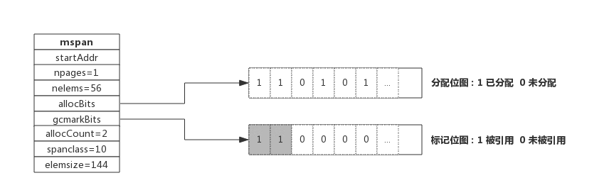
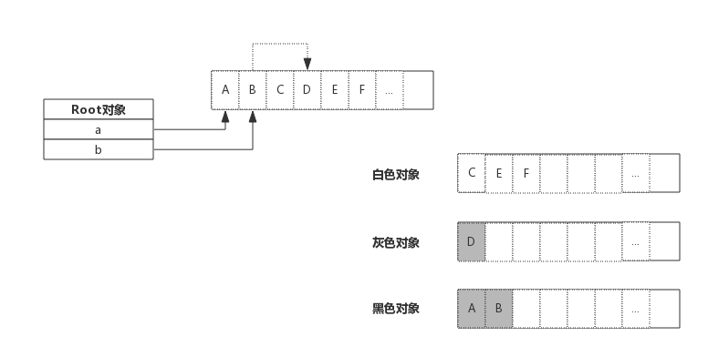
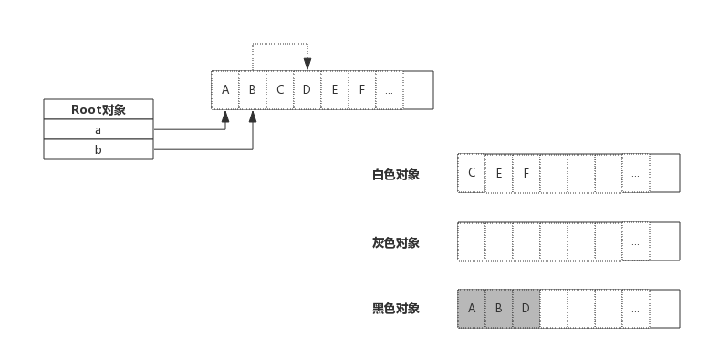

- [前言](#前言)
- [垃圾回收算法](#垃圾回收算法)
  - [引用计数](#引用计数)
  - [标记-清除](#标记-清除)
    - [三色标记算法](#三色标记算法)
  - [分代收集](#分代收集)
- [Golang 垃圾回收](#golang-垃圾回收)
  - [发展历史](#发展历史)
  - [垃圾回收原理](#垃圾回收原理)
  - [内存标记](#内存标记)
  - [三色标记法](#三色标记法)
  - [Stop The World](#stop-the-world)
- [垃圾回收优化](#垃圾回收优化)
  - [写屏障 Write Barrier](#写屏障-write-barrier)
  - [辅助 GC Mutator Assist](#辅助-gc-mutator-assist)
- [垃圾回收触发时机](#垃圾回收触发时机)
  - [内存分配量达到阀值触发 GC](#内存分配量达到阀值触发-gc)
  - [定期触发GC](#定期触发gc)
  - [手动触发](#手动触发)
- [GC性能优化](#gc性能优化)

## 前言

所谓垃圾就是不再需要的内存块，这些垃圾如果不清理就没办法再次被分配使用，在不支持垃圾回收的编程语言里，这些垃圾内存就是泄露的内存。

## 垃圾回收算法

常见的垃圾回收算法有以下几种：

### 引用计数

对每个对象维护一个引用计数，当引用该对象的对象被销毁时，引用计数减 1，当引用计数器为 0 时回收该对象，所以是实时回收。

优点：对象可以很快地被回收，不会出现内存耗尽或达到某个阈值时才回收。

缺点：**不能很好地处理循环引用**，而且**实时维护引用计数**，也有一定的代价。

### 标记-清除

标记-清扫算法是第一种自动内存管理，基于追踪的垃圾收集算法。

内存单元并不会在变成垃圾立刻回收，而是保持不可达状态，直到到达某个阈值或者固定时间长度。这个时候系统会**挂起用户程序**，也就是 STW，转而执行垃圾回收程序。

垃圾回收程序对所有的存活单元进行一次**全局遍历**确定哪些单元可以回收。算法分两个部分：标记（mark）和清扫（sweep）。**标记阶段表明所有的存活单元，清扫阶段将垃圾单元回收**。


优点：解决了引用计数的缺点。

缺点：需要 STW，即**要暂时停掉程序运行**。

#### 三色标记算法

三色标记算法是对标记阶段的改进，原理如下：

- 起初所有对象都是白色。
- 从根出发扫描所有可达对象，标记为灰色，放入待处理队列。
- 从队列取出灰色对象，将其引用对象标记为灰色放入队列，自身标记为黑色。
- 重复 3，直到灰色对象队列为空。此时白色对象即为垃圾，进行回收。


三色标记的一个明显好处是能够让用户程序和标记 mark 并发的进行。

### 分代收集

按照对象生命周期长短划分不同的代空间，生命周期长的放入老年代，而短的放入新生代，不同代有不同的回收算法和回收频率。

优点：回收性能好。

缺点：算法复杂。

## Golang 垃圾回收

### 发展历史

- v1.1 STW 暂时停掉程序运行
- v1.3 Mark STW, Sweep 并行
- v1.5 三色标记法
- v1.8 Hybrid Write Barrier 混合写屏障

### 垃圾回收原理

下图展示了一段内存，内存中既有已分配掉的内存，也有未分配的内存，垃圾回收的目标就是把那些已经分配的但没有对象引用的内存找出来并回收掉：


上图中，内存块 1、2、4 号位上的内存块已被分配（数字 1 代表已被分配，0 未分配）。变量 a, b 为一指针，指向内存的 1、2 号位。内存块的 4 号位曾经被使用过，但现在没有任何对象引用了，就需要被回收掉。

垃圾回收开始时从 root 对象开始扫描，把 root 对象引用的内存标记为"被引用"，考虑到内存块中存放的可能是指针，所以还需要递归的进行标记，全部标记完成后，只保留被标记的内存，未被标记的全部标识为未分配即完成了回收。

### 内存标记

前面介绍内存分配时，介绍过 span 数据结构，span 中维护了一个个内存块，并由一个位图 allocBits 表示每个内存块的分配情况。在 span 数据结构中还有另一个位图 gcmarkBits 用于标记内存块被引用情况。



如上图所示，allocBits 记录了每块内存分配情况，而 gcmarkBits 记录了每块内存标记情况。标记阶段对每块内存进行标记，有对象引用的的内存标记为 1( 如图中灰色所示 )，没有引用到的保持默认为 0.

allocBits 和 gcmarkBits 数据结构是完全一样的，标记结束就是内存回收，回收时将 allocBits 指向 gcmarkBits，则代表标记过的才是存活的，gcmarkBits 则会在下次标记时重新分配内存，非常的巧妙。

### 三色标记法

前面介绍了对象标记状态的存储方式，还需要有一个标记队列来存放待标记的对象，可以简单想象成把对象从标记队列中取出，将对象的引用状态标记在 span 的 gcmarkBits，把对象引用到的其他对象再放入队列中。

三色只是为了叙述上方便抽象出来的一种说法，实际上对象并没有颜色之分。这里的三色，对应了垃圾回收过程中对象的三种状态：

- 灰色：对象还在标记队列中等待
- 黑色：对象已被标记，gcmarkBits 对应的位为 1 （该对象不会在本次 GC 中被清理）
- 白色：对象未被标记，gcmarkBits 对应的位为 0 （该对象将会在本次 GC 中被清理）

例如，当前内存中有 A ~ F 一共 6 个对象，根对象 a,b 本身为栈上分配的局部变量，根对象 a、b 分别引用了对象 A、B, 而 B 对象又引用了对象 D，则 GC 开始前各对象的状态如下图所示:


初始状态下所有对象都是白色的。

接着开始扫描根对象a、b:


由于根对象引用了对象 A、B，那么 A、B 变为灰色对象，接下来就开始分析灰色对象，分析 A 时，A 没有引用其他对象很快就转入黑色，B 引用了 D，则 B 转入黑色的同时还需要将 D 转为灰色，进行接下来的分析。如下图所示：



上图中灰色对象只有 D，由于 D 没有引用其他对象，所以 D 转入黑色。标记过程结束：



最终，黑色的对象会被保留下来，白色对象会被回收掉。

### Stop The World

对于垃圾回收来说，回收过程中需要控制住内存的变化，否则回收过程中指针传递会引起内存引用关系变化，如果错误的回收了还在使用的内存，结果将是灾难性的。

Golang 中的 STW （ Stop The World ）就是停掉所有的 goroutine，专心做垃圾回收，待垃圾回收结束后再恢复 goroutine。

STW 时间的长短直接影响了应用的执行，时间过长对于一些 web 应用来说是不可接受的，这也是广受诟病的原因之一。

为了缩短 STW 的时间，Golang 不断优化垃圾回收算法，这种情况得到了很大的改善。

## 垃圾回收优化

### 写屏障 Write Barrier

前面说过 **STW** 目的是防止 GC 扫描时内存变化而**停掉 goroutine**，而**写屏障**就是**让 goroutine 与 GC 同时运行**的手段。虽然写屏障**不能完全消除 STW**，但是可以大大**减少 STW 的时间**。

写屏障类似一种开关，在 GC 的特定时机开启，开启后指针传递时会把指针标记，即本轮不回收，下次 GC 时再确定。

GC 过程中新分配的内存会被立即标记，用的并不是写屏障技术，也即 GC 过程中分配的内存不会在本轮 GC 中回收。

### 辅助 GC Mutator Assist

为了防止内存分配过快，在 GC 执行过程中，如果 goroutine 需要分配内存，那么这个 goroutine 会参与一部分 GC 的工作，即帮助 GC 做一部分工作，这个机制叫作 Mutator Assist。

## 垃圾回收触发时机

### 内存分配量达到阀值触发 GC

每次内存分配时都会检查当前内存分配量是否已达到阀值，如果达到阀值则立即启动 GC。

`阀值 = 上次GC内存分配量 * 内存增长率`

内存增长率由环境变量 `GOGC` 控制，默认为 100，即每当内存扩大一倍时启动 GC。

### 定期触发GC

默认情况下，最长 2 分钟触发一次 GC，这个间隔在 `src/runtime/proc.go:forcegcperiod` 变量中被声明：

```go
// forcegcperiod is the maximum time in nanoseconds between garbage
// collections. If we go this long without a garbage collection, one
// is forced to run.
//
// This is a variable for testing purposes. It normally doesn't change.
var forcegcperiod int64 = 2 * 60 * 1e9
```

### 手动触发

程序代码中也可以使用 `runtime.GC()` 来手动触发 GC。这主要用于 GC 性能测试和统计。

## GC性能优化

GC 性能与对象数量负相关，**对象越多 GC 性能越差**，对程序影响越大。

所以 GC 性能优化的思路之一就是**减少对象分配个数**，比如对象复用或使用大对象组合多个小对象等等。

通常小对象过多会导致三色法消耗过多的 CPU。

另外，由于内存逃逸现象，有些隐式的内存分配也会产生，也有可能成为 GC 的负担。

```go

```
