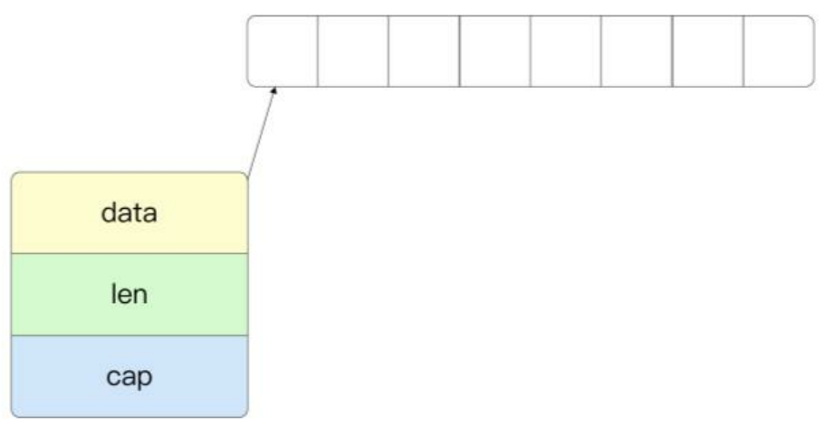
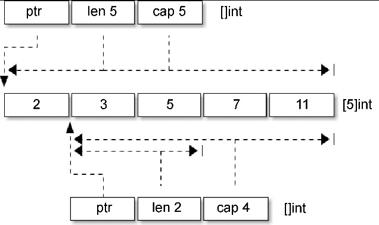
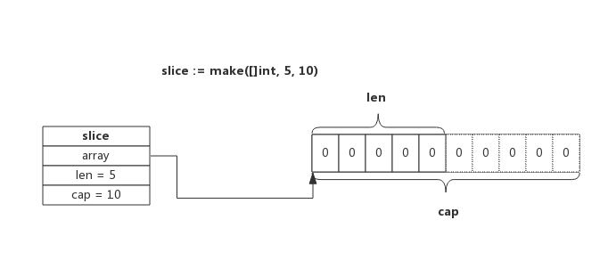
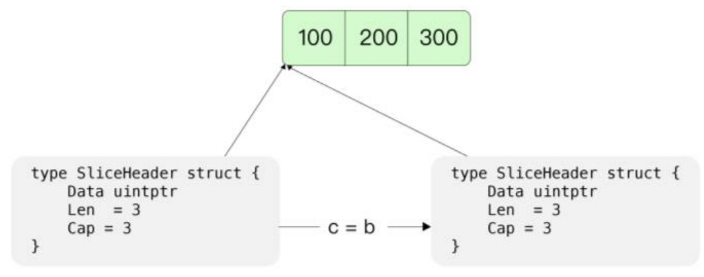

Go 语言中的切片（slice）在某种程度上和其他语言（例如 C 语言）中的数组在使用中有许多相似的地方。

但是 Go 语言中的切片有许多独特之处，例如，切片是长度可变的序列。

序列中的每个元素都有相同的类型。一个切片一般写作 []T，其中 T 代表 slice 中元素的类型。和数组不同的是，切片不用指定固定长度。

## 内部结构

切片依托数组实现，底层数组对用户屏蔽，在底层数组容量不足时可以实现自动重分配并生成新的切片。

切片在运行时的结构定义， `reflect.SliceHeader`：

```go
// SliceHeader is the runtime representation of a slice.
// It cannot be used safely or portably and its representation may
// change in a later release.
// Moreover, the Data field is not sufficient to guarantee the data
// it references will not be garbage collected, so programs must keep
// a separate, correctly typed pointer to the underlying data.
type SliceHeader struct {
	Data uintptr
	Len  int
	Cap  int
}
```

`src/runtime/slice.go:slice` 中也定义了 Slice 的数据结构：

```go
type slice struct {
	array unsafe.Pointer  // 指向底层数组
	len   int  // 切片长度
	cap   int  // 底层数组容量
}
```



由此可以看出切片的部分定义和字符串是一样的，但是切片多了一个 Cap 成员表示切片指向的内存空间的最大容量（对应元素的个数，而不是字节数）。

`x := []int{2,3,5, 7,11}` 和 `y := x[1:3]` 两个切片对应的内存结构：



- 每个切片都指向一个底层数组
- 每个切片都保存了当前切片的长度、底层数组可用容量
- 使用 len() 计算切片长度时间复杂度为 O(1)，不需要遍历切片
- 使用 cap() 计算切片容量时间复杂度为 O(1)，不需要遍历切片
- 通过函数传递切片时，不会拷贝整个切片，因为切片本身只是个结构体而已
- 使用 append() 向切片追加元素时有可能触发扩容，扩容后将会生成新的切片

## 切片的初始化

```go
var a []int               // nil 切片，和 nil 相等，一般用来表示一个不存在的切片
b := []int{}           // 空切片，和 nil 不相等，一般用来表示一个空的集合
c := []int{1, 2, 3}    // 有 3 个元素的切片，len 和 cap 都为 3
d := c[:2]             // 有 2 个元素的切片，len 为 2，cap 为 3
e := c[0:2:cap(c)]     // 有 2 个元素的切片，len 为 2，cap 为 3
f := c[:0]             // 有 0 个元素的切片，len 为 0，cap 为 3
g := make([]int, 3)    // 有 3 个元素的切片，len 和 cap 都为 3
h := make([]int, 2, 3) // 有 2 个元素的切片，len 为 2，cap 为 3
i := make([]int, 0, 3) // 有 0 个元素的切片，len 为 0，cap 为 3
```

和数组一样，内置的 len() 函数返回切片中有效元素的长度，内置的 cap() 函数返回切片容量大小，容量必须大于或等于切片的长度。也可以通过 reflect.SliceHeader 结构访问切片的信息（只是为了说明切片的结构，并不是推荐的做法）。

切片可以和 nil 进行比较，只有当**切片底层数据指针为空时切片本身才为 nil**，这时候切片的长度和容量信息将是无效的。如果有切片的底层数据指针为空，但是长度和容量不为 0 的情况，那么说明切片本身已经被损坏了（例如，直接通过reflect.SliceHeader 或 unsafe 包对切片作了不正确的修改）。

### make 方式详解

使用 make 来创建 Slice 时，可以同时指定长度和容量，创建时底层会分配一个数组，数组的长度即容量。

例如，语句 `slice := make([]int, 5, 10)` 所创建的 Slice，结构如下图所示：

[](https://imgchr.com/i/DiVKsK)

该 Slice 长度为 5，即可以使用下标 `slice[0] ~ slice[4]` 来操作里面的元素，capacity 为 10，表示后续向 slice 添加新的元素时可以不必重新分配内存，直接使用预留内存即可。

### 截取方式详解

用数组/切片来创建 Slice 时，Slice 将与原数组/切片共用一部分内存。

例如，语句 `slice := array[5:7]` 所创建的 Slice，结构如下图所示：

[](https://imgchr.com/i/DiVBdg)

切片从数组 array[5] 开始，到数组 array[7] 结束（不含 array[7]），即切片长度为 2，数组后面的内容都作为切片的预留内存，即 capacity 为 5。

根据数组或切片生成新的切片一般使用 `slice := array[start:end]` 方式，这种新生成的切片并没有指定切片的容量，实际上新切片的容量是从 start 开始直至 array 的结束。

比如下面两个切片，长度和容量都是一致的，使用共同的内存地址：

```go
sliceA := make([]int, 5, 10)
sliceB := sliceA[0:5]
```

根据数组或切片生成切片还有另一种写法，即切片同时也指定容量，即 slice[start:end:cap], 其中 cap 即为新切片的容量，当然容量不能超过原切片实际值，如下所示：

```go
    sliceA := make([]int, 5, 10)  //length = 5; capacity = 10
    sliceB := sliceA[0:5]         //length = 5; capacity = 10
    sliceC := sliceA[0:5:5]       //length = 5; capacity = 5
```

## 切片值复制与数据引用

数组的复制是值复制，如下例中，对于数组 a 的副本 c 的修改不会影响到数组 a。然而，对于切片 b 的副本 d 的修改会影响到原来的切片 b。这说明切片的副本与原始切片共用一个内存空间。

```go
package main

import "fmt"

func main() {
	a := [3]int{1, 2, 3}
	b := []int{1, 2, 3}
	c := a
	d := b
	c[0] = 0
	d[0] = 0

	fmt.Println(a)
	fmt.Println(b)
}
```

在 Go 语言中，切片的复制其实也是值复制，但这里的值复制指对于运行时 SliceHeader 结构的复制。如图 7-3 所示，底层指针仍然指向相同的底层数据的数组地址，因此可以理解为数据进行了引用传递。切片的这一特性使得即便切片中有大量数据，在复制时的成本也比较小，这与数组有显著的不同。



## 切片收缩与扩容

Go 语言内置的 append 函数可以添加新的元素到切片的末尾，它可以接受可变长度的元素，并且可以自动扩容。如果原有数组的长度和容量已经相同，那么在扩容后，长度和容量都会相应增加。

```go
package main

import "fmt"

func main() {
	var numbers []int

	// 添加一个元素
	numbers = append(numbers, 0)
	
	// 添加多个元素
	numbers = append(numbers, 1, 2, 3, 4, 5, 6, 7, 8, 9)

	// 添加一个切片
	numbers = append(numbers, []int{10, 11, 12, 13, 14, 15, 16, 17, 18, 19}...)

	fmt.Println(numbers)
}
```

如下所示，numbers 切片一开始的长度和容量都为 4，当添加一个元素后，其长度变为了 5，容量变为了 8，相当于扩容了一倍。

```go
package main

import "fmt"

func main() {
	numbers := []int{1, 2, 3, 4}
	fmt.Printf("Length: %d, Capacity: %d\n", len(numbers), cap(numbers))

	numbers = append(numbers, 5)
	fmt.Printf("Length: %d, Capacity: %d\n", len(numbers), cap(numbers))
}
```

删除切片的第一个和最后一个元素都非常容易。如果要删除切片中间的某一段或某一个元素，可以借助切片的截取特性，通过截取删除元素前后的切片数组，再使用 append 函数拼接的方式实现。这种处理方式比较优雅，并且效率很高，因为它不会申请额外的内存空间。

```go
package main

func main() {
	numbers := []int{1, 2, 3, 4, 5, 6, 7, 8, 9, 10}

	// 删除第一个元素
	numbers = numbers[1:]

	// 删除最后一个元素
	numbers = numbers[:len(numbers)-1]

	// 删除中间的元素
	a := 3
	numbers = append(numbers[:a], numbers[a+1:]...)
}
```

## 切片底层原理

[切片底层原理](underlying_principle.md)

## 切片的完整复制

可以使用 copy 函数。

```go
package main

import "fmt"

func main() {
	numbers := []int{1, 2, 3, 4, 5, 6, 7, 8, 9, 10}

	numbersCopy := make([]int, len(numbers))
	copy(numbersCopy, numbers)

	var numbersArray [4]int

	copy(numbersArray[:], numbers)
	fmt.Println(numbersArray)

	copy(numbersArray[:], numbers[:])
	fmt.Println(numbersArray)
}
```

如果在复制时，数组的长度与切片的长度不同，则复制的元素为 len(arr) 与 len(slice) 的较小值。

使用 copy() 内置函数拷贝两个切片时，会将源切片的数据逐个拷贝到目的切片指向的数组中，拷贝数量取两个切片长度的最小值。

例如长度为 10 的切片拷贝到长度为 5 的切片时，将会拷贝 5 个元素。也就是说，copy 过程中不会发生扩容。

copy 函数在运行时主要调用了 memmove 函数，用于实现内存的复制。如果采用协程调用的方式 `go copy(numbers1, numbers)` 或者加入了 race 检测，则会转而调用运行时 slicestringcopy 或 slicecopy 函数，进行额外的检查。

用 copy() 和 append() 组合可以避免创建中间的临时切片，同样是完成添加元素的操作：

```go
a = append(a, 0)     // 切片扩展一个空间
copy(a[i+1:], a[i:]) // a[i:]向后移动一个位置
a[i] = x             // 设置新添加的元素
```

第一句中的 append() 用于扩展切片的长度，为要插入的元素留出空间。第二句中的 copy() 操作将要插入位置开始之后的元素向后挪动一个位置。第三句真实地将新添加的元素赋值到对应的位置。操作语句虽然冗长了一点，但是相比前面的方法，可以减少中间创建的临时切片。

用 copy() 和 append() 组合也可以实现在中间位置插入多个元素（也就是插入一个切片）：

```go
a = append(a, x...)         // 为x切片扩展足够的空间
copy(a[i+len(x):], a[i:])   // a[i:]向后移动len(x)个位置
copy(a[i:], x)              // 复制新添加的切片
```

稍显不足的是，在第一句扩展切片容量的时候，扩展空间部分的元素复制是没有必要的。没有专门的内置函数用于扩展切片的容量，append() 本质是用于追加元素而不是扩展容量，扩展切片容量只是 append() 的一个副作用。

- 创建切片时可根据实际需要预分配容量，尽量避免追加过程中扩容操作，有利于提升性能；
- 切片拷贝时需要判断实际拷贝的元素个数
- 谨慎使用多个切片操作同一个数组，以防读写冲突

```go

```
