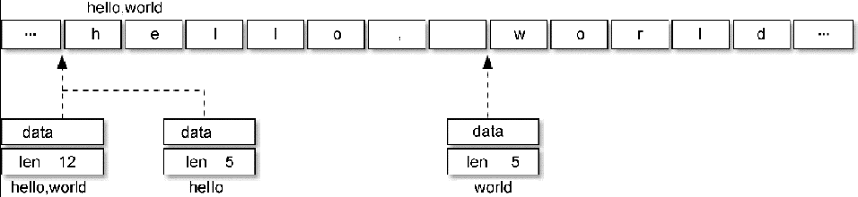

## 字符串的本质

在编程语言中，字符串是一种重要的数据结构，通常由一系列字符组成。字符串一般有两种类型，一种在编译时指定长度，不能修改。一种具有动态的长度，可以修改。

但是在 Go 语言中，字符串不能被修改，只能被访问，不能采取如下方式对字符串进行修改。

```go
var s string = "hello"
s[0] = 'H'
```

Go 标准库 `builtin` 给出了所有内置类型的定义。源代码位于 `src/builtin/builtin.go`，其中关于 string 的描述如下:

```go
// string is the set of all strings of 8-bit bytes, conventionally but not
// necessarily representing UTF-8-encoded text. A string may be empty, but
// not nil. Values of string type are immutable.
type string string
```

所以 string 是 8bit 字节的集合，通常是但并不一定非得是 UTF-8 编码的文本。

另外，还提到了两点：

* string 可以为空(长度为 0)，但不会是 nil ；
* string 对象不可以修改。

字符串的终止有两种方式，一种是 C 语言中的隐式申明，以字符“\0”作为终止符。一种是 Go 语言中的显式声明。

Go 语言**运行时**字符串 string 的表示结构在 `reflect.StringHeader` 中定义。

源码包 `src/reflect/value.go` 中的定义：

```go
// StringHeader is the runtime representation of a string.
// It cannot be used safely or portably and its representation may
// change in a later release.
// Moreover, the Data field is not sufficient to guarantee the data
// it references will not be garbage collected, so programs must keep
// a separate, correctly typed pointer to the underlying data.
type StringHeader struct {
	Data uintptr  // 字符串指向的底层字符数组
	Len  int  // 字符串的字节的长度
}
```

源码包 `src/runtime/string.go:stringStruct` 中的定义：

```go
type stringStruct struct {
	str unsafe.Pointer // 字符串的首地址
	len int  // 字符串的长度
}
```

字符串结构由两个信息组成：第一个是字符串指向的底层字节数组，**这个字节数组不是 []byte**，而是内存上一块连续的区域；第二个是字符串的字节的长度。

字符串其实是一个结构体，因此字符串的赋值操作也就是 `reflect.StringHeader` 结构体的复制过程，并**不会涉及底层字节数组的复制**。可以将字符串数组看作一个结构体数组。

## 内存布局

字符串 `hello, world` 对应的内存结构：



分析可以发现，`hello, world` 字符串底层数据和以下数组是完全一致的：

```go
var data = [...]byte{'h', 'e', 'l', 'l', 'o', ',', ' ', 'w', 'o', 'r', 'l', 'd'}
```

## 符文类型

```go
package main

import "fmt"

func main() {
	var s = "Golang is awesome!"
	for i := 0; i < len(s); i++ {
		fmt.Printf("%x\n", s[i])
	}
}
```

Go 语言中所有的文件都采用 UTF-8 的编码方式，同时字符常量使用 UTF-8 的字符编码集。 UFT-8 是一种长度可变的编码方式，可包含世界上大部分的字符。上例中的字母都只占据 1 字节，但是特殊的字符（例如大部分中文）会占据 3 字节。如下所示，变量 b 看起来只有 2 个字符，但是 len（b）获取的长度为 6，字符串 b 中每个中文都占据了 3 字节。

```go
package main

import "fmt"

func main() {
	var s = "中文"
	fmt.Printf("Length of %s is %d\n", s, len(s))
	for i := 0; i < len(s); i++ {
		fmt.Printf("%x\n", s[i])
	}
}
```

Go 语言的设计者认为，用字符（character）表示字符串的组成元素可能产生歧义，因为有些字符非常相似，例如小写拉丁字母 a 与带重音符号的 à。这些相似的字符真正的区别在于其编码后的整数是不相同的，a 被表示为 0x61，à被表示为 0xE0。

因此在 Go 语言中使用符文（rune）类型来表示和区分字符串中的“字符”，rune 其实是 int32 的别称。

当用 range 轮询字符串时，轮询的不再是单字节，而是具体的 rune。如下所示，对字符串 b 进行轮询，其第一个参数 index 代表每个 rune 的字节偏移量，而 runeValue 为 int32，代表符文数。

```go
package main

import "fmt"

func main() {
	var s = "中文 English"

	for i, r := range s {
		fmt.Printf("%d %#U\n", i, r)
	}
}
```

#U 可用于打印符文数十六进制的 Unicode 编码方式及字符形状。

Go 的标准库 unicode/utf8 为解释 UTF-8 文本提供了强大的支持，包含了验证、分离、组合 UTF-8 字符的功能。例如 DecodeRuneInString 函数返回当前字节之后的符文数及实际的字节长度。上面的 for range 样例可以改写为如下形式：

```go
package main

import (
	"fmt"
	"unicode/utf8"
)

func main() {
	var s = "中文 English"
	var r rune
	for i, w := 0, 0; i < len(s); i += w {
		r, w = utf8.DecodeRuneInString(s[i:])
		fmt.Printf("%d %#U\n", i, r)
	}
}
```

我们也可以用字符串表示 GBK 等非 UTF-8 编码的数据，不过这时候将字符串看作是**一个只读的二进制数组**更准确，因为 `for range` 等语法并不支持非 UTF-8 编码的字符串的遍历。

## 字符串底层原理

[字符串底层原理](underlying_principle.md)

## 字符串操作

[字符串操作](operation.md)

## 字符串转换数组

[字符串转换数组](convert.md)

## 为什么字符串不允许修改？

像 C++ 语言中的 string，其本身拥有内存空间，修改 string 是支持的。

但 Go 的实现中，string 不包含内存空间，只有一个内存的指针，这样做的好处是 string 变得非常轻量，可以很方便的进行传递而不用担心内存拷贝。

因为 string 通常指向**字符串字面量**，而**字符串字面量存储位置是只读数据段**，而**不是堆或栈上**，所以才有了 string 不可修改的约定。

字符常量存储于静态存储区。

## []byte 转换成 string 一定会拷贝内存吗？

byte 切片转换成 string 的场景很多，为了性能上的考虑，有时候只是**临时需要字符串的场景**下，byte 切片转换成 string 时并不会拷贝内存，而是直接返回一个 string，这个 string 的指针指向切片的内存。

比如，编译器会识别如下临时场景：

* 使用 m[string(b)] 来查找 map (临时把切片 b 转成 string)；
* 字符串拼接： `"<" + "string(b)" + ">"`；
* 字符串比较：`string(b) == "foo"`

因为是临时把 byte 切片转换成 string，也就避免了因 byte 切片同容改成而导致 string 引用失败的情况，所以此时可以不必拷贝内存新建一个 string。

## string 和 []byte 如何取舍

string 和 []byte 都可以表示字符串，但因数据结构不同，其衍生出来的方法也不同，要根据实际应用场景来选择。

string 擅长的场景：

* 需要字符串比较的场景；
* 不需要 nil 字符串的场景；

[]byte 擅长的场景：

* 修改字符串的场景，尤其是修改粒度为 1 个字节；
* 函数返回值，需要用 nil 表示含义的场景；
* 需要切片操作的场景；

虽然看起来 string 适用的场景不如 []byte 多，但因为 string 直观，在实际应用中还是大量存在，在偏底层的实现中 []byte 使用更多。

```go

```
