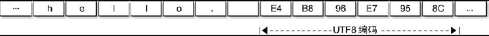

- [切片](#切片)
- [遍历与打印](#遍历与打印)
	- [遍历原始的字节码](#遍历原始的字节码)

## 切片

字符串虽然不是切片，但是**支持切片操作**，不同位置的切片底层**访问的是同一块内存数据**。

因为字符串是只读的，所以**相同的字符串面值常量通常对应同一个字符串常量**。

```go
s := "hello, world"
hello := s[:5]
world := s[7:]

s1 := "hello, world"[:5]
s2 := "hello, world"[7:]
```

字符串和数组类似，内置的 `len()` 函数返回字符串的长度。也可以通过 `reflect.StringHeader` 结构访问字符串的长度（这里只是为了演示字符串的结构，并不是推荐的做法）：

```go
func main() {
	s := "hello, world"
	s1 := "hello, world"[:5]
	s2 := "hello, world"[7:]

	fmt.Println("len(s):", (*reflect.StringHeader)(unsafe.Pointer(&s)).Len)   // 12
	fmt.Println("len(s1):", (*reflect.StringHeader)(unsafe.Pointer(&s1)).Len) // 5
	fmt.Println("len(s2):", (*reflect.StringHeader)(unsafe.Pointer(&s2)).Len) // 5
}
```

## 遍历与打印

假设字符串对应的是一个合法的 `UTF-8` 编码的字符序列。可以用内置的 `print` 调试函数或 `fmt.Print()` 函数直接打印，也可以用 `for range` 循环直接遍历 `UTF-8` 解码后的 Unicode 码点值。

下面的 "hello,世界" 字符串中包含了中文字符，可以通过打印转型为字节类型来查看字符底层对应的数据：

```go
fmt.Printf("%#v\n", []byte("hello, 世界"))
```

```go
[]byte{0x68, 0x65, 0x6c, 0x6c, 0x6f, 0x2c, 0x20, 0xe4, 0xb8, 0x96, 0xe7, 0x95, 0x8c}
```

分析可以发现，`0xe4, 0xb8, 0x96` 对应中文“世”，`0xe7, 0x95, 0x8c` 对应中文“界”。

```go
fmt.Println("\xe4\xb8\x96") // 打印“世”
fmt.Println("\xe7\x95\x8c") // 打印“界”
```

“hello, 世界” 字符串的内存结构布局：



一个中文字符占了 3 个字节。

```go
func main() {
	s := "hello, 世界"
	for idx, v := range s {  // idx 是字符的字节位置，v 是字符的拷贝
		fmt.Printf("%02d %c\t", idx, v)
	}
}
```

```
00 h    01 e    02 l    03 l    04 o    05 ,    06      07 世   10 界
```

Go 语言的字符串中可以存放任意的二进制字节序列，而且即使是 UTF-8 字符序列也可能会遇到错误的编码。如果遇到一个错误的 UTF-8 编码输入，将生成一个特别的 Unicode 字符 '\uFFFD'，这个字符在不同的软件中的显示效果可能不太一样，在印刷中这个符号通常是一个黑色六角形或钻石形状，里面包含一个白色的问号“�”。

下面的字符串中，我们故意损坏了第一字符的第二和第三字节，因此第一字符将会打印为“�”，第二和第三字节则被忽略，后面的 “abc” 依然可以正常解码打印（错误编码不会向后扩散是 UTF-8 编码的优秀特性之一）。

```go
fmt.Println("\xe4\x00\x00\xe7\x95\x8cabc") // �界a
```

不过在 `for range` 迭代这个含有损坏的 UTF-8 字符串时，第一字符的第二和第三字节依然会被单独迭代到，不过此时迭代的值是损坏后的 0：

```go
func main() {
	for i, c := range "\xe4\x00\x00\xe7\x95\x8cabc" {
		fmt.Println(i, c)
	}
}

// 0 65533  // \uFFF，对应�
// 1 0      // 空字符
// 2 0      // 空字符
// 3 30028  // 界
// 6 97     // a
// 7 98     // b
// 8 99     // c
```

### 遍历原始的字节码

如果不想解码 UTF-8 字符串，想直接遍历原始的字节码，可以将字符串强制转为 []byte 字节序列后再进行遍历（这里的转换不会产生运行时开销，编译器识别为临时场景，不会进行内存复制），或者是采用传统的下标方式遍历字符串的字节数组：

```go
func main() {
	s := "世界abc"
	for i, c := range []byte(s) {
		fmt.Print(i, c, '\t')
	}
	fmt.Println()
	for i := 0; i < len(s); i++ {
		fmt.Print(i, s[i], '\t')
	}
}
```
