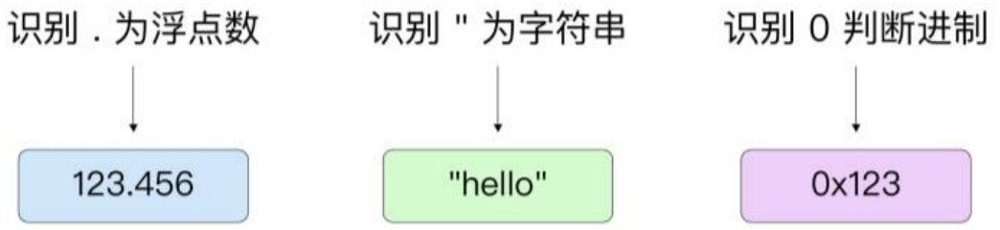

类型推断依赖编译器的处理能力。

## 词法解析与语法分析阶段

在词法解析阶段，会将赋值语句右边的常量解析为一个未定义的类型，例如，ImagLit 代表复数，FloatLit 代表浮点数，IntLit 代表整数。

Go 语言源代码采用 UTF-8 的编码方式，在进行词法解析时，当遇到需要赋值的常量操作时，会逐个读取后面常量的 UTF-8 字符。字符串的首字符为 "，数字的首字符为 '0' ～ '9'。具体实现位于 syntax.next 函数中。

`cmd/compile/internal/syntax/sxanner.go`

```go
func (s *scanner) next() {
...
	switch s.ch {
	case -1:
		if nlsemi {
			s.lit = "EOF"
			s.tok = _Semi
			break
		}
		s.tok = _EOF

	case '\n':
		s.nextch()
		s.lit = "newline"
		s.tok = _Semi

	case '0', '1', '2', '3', '4', '5', '6', '7', '8', '9':
		s.number(false)

	case '"':
		s.stdString()

	case '`':
		s.rawString()
...
}
```

因此对于整数、小数等常量的识别就显得非常简单。

如图 3-2 所示，整数就是字符中全是 0～9 的数字，浮点数就是字符中有“.”号的数字，字符串的首字符为 " 或 '。



下面列出的 number 函数为语法分析阶段处理数字的具体实现。数字首先会被分为小数部分与整数部分，通过字符. 进行区分。如果整数部分是以 0 开头的，则可能有不同的含义，例如 0x 代表十六进制数、0b 代表二进制数。

```go
	// integer part
	if !seenPoint {
		if s.ch == '0' {
			s.nextch()
			switch lower(s.ch) {
			case 'x':
				s.nextch()
				base, prefix = 16, 'x'
			case 'o':
				s.nextch()
				base, prefix = 8, 'o'
			case 'b':
				s.nextch()
				base, prefix = 2, 'b'
			default:
				base, prefix = 8, '0'
				digsep = 1 // leading 0
			}
		}
		digsep |= s.digits(base, &invalid)
		if s.ch == '.' {
			if prefix == 'o' || prefix == 'b' {
				s.errorf("invalid radix point in %s literal", baseName(base))
				ok = false
			}
			s.nextch()
			seenPoint = true
		}
	}

	// fractional part
	if seenPoint {
		kind = FloatLit
		digsep |= s.digits(base, &invalid)
	}
```

以赋值语句 a := 333 为例，完成词法解析与语法分析时，此赋值语句将以 AssignStmt 结构表示。

```go
AssignStmt struct {
	Op Operator
	Lhs, Rhs Expr
	simpleStmt
}
```

其中 Op 代表操作符，在这里是赋值操作 OAS。Lhs 与 Rhs 分别代表左右两个表达式，左边代表变量 a，右边代表常量 333，此时其类型为 intLit。

## 抽象语法树生成与类型检查

完成语法解析后，进入抽象语法树阶段。在该阶段会将词法解析阶段生成的 AssignStmt 结构解析为一个 Node，Node 结构体是对抽象语法树中节点的抽象。

```go
type Node struct {
	Left *Node
	Right *Node
	Op Operator
}
```

其中，Left（左节点）代表左边的变量 a，Right（右节点）代表整数 333，其 Op 操作为 OLITERAL。Right 的 E 接口字段会存储值 333，如果前一阶段为 IntLit 类型，则需要转换为 Mpint 类型。Mpint 类型用于存储整数常量，具体结构如下所示。

```go
// Mpint 代表整数常量
type Mpint struct {
	Val big.Int
	Ovf bool
	Rune bool
}
```

> 源代码变化很大，最新版已经不是这样了。

从 Mpint 类型的结构可以看到，在编译时 AST 阶段整数通过 math/big.Int 进行高精度存储，浮点数通过 big.Float 进行高精度存储。

在类型检查阶段，右节点中的 Type 字段存储的类型会变为 `types.Types[TINT]`。types.Types 是一个数组（`var Types [NTYPE] * Type`），存储了不同标识对应的 Go 语言中的实际类型，其中，`types.Types[TINT]` 对应 Go 语言内置的 int 类型。

接着完成最终的赋值操作，并将右边常量的类型赋值给左边变量的类型。

在 SSA 阶段，变量 a 中存储的大数类型的 333 最终会调用 big.Int 包中的 Int64 函数并将其转换为 int64 类型的常量，形如：`v4(? )= MOVQconst<int>[333](a[int])`。

```go

```
