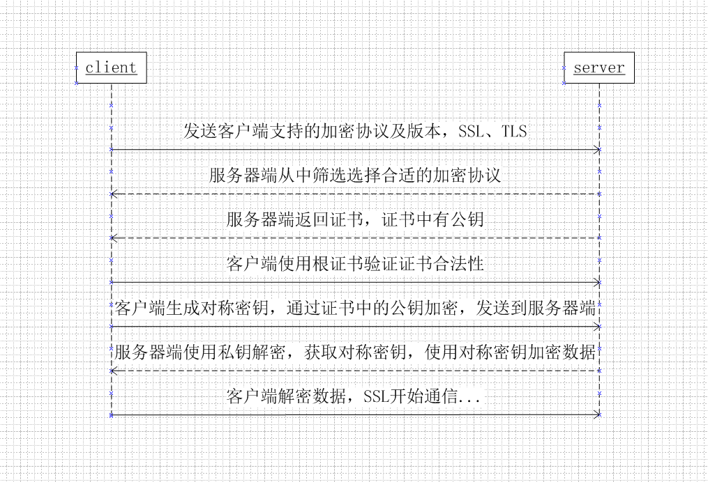

## 连接由对等方重置

> 客户端在建立中发现很多 connect reset by peer，你觉得问题出在哪？

三次握手维护的半连接队列或者全连接队列溢出导致。

三次握手中，在第一步 server 收到 client 的 syn 后，把这个连接信息放到半连接队列中，同时回复 syn+ack 给 client（第二步）；

第三步的时候 server 收到 client 的 ack，如果这时全连接队列没满，那么从半连接队列拿出这个连接的信息放入到全连接队列中，否则按 tcp_abort_on_overflow 指示的执行。

这时如果全连接队列满了并且 tcp_abort_on_overflow 是 0 的话，server 过一段时间再次发送 syn+ack 给 client（重新走握手的第二步），如果 client 超时等待比较短，client 就很容易异常了。

## HTTPS 建立连接的过程



## 负载均衡分类

1. DNS 负载均衡(地理负载均衡)
2. 硬件负载均衡 (F5 和 A10，能支撑 200 万-800 万/秒并发，价格昂贵)
3. 软件负载均衡 (Nginx 和 Lvs，Nginx 支撑 5 万 / 秒，Lvs 支撑 80 万 / 秒，价格便宜，扩展方便 )

## Nginx 和 Lvs 的区别

1. Nginx 工作在第 7 层，网络的依赖比较小，可以对 HTTP 应用实施分流策略，比如域名、结构等； Lvs 工作在第 4 层，比较依赖网络环境，可以对几乎所有应用进行负载均衡，包括 Web、数据库等
2. Nginx 负载能力强，因为其工作方式逻辑非常简单，仅进行请求分发，没有流量； Lvs 负载能力较差，受限于机器的 I/O 配置 ( 处理流量 )
3. Nginx 安装，配置及测试相对简单； Lvs 的安装、配置及测试所花的时间比较长

```go

```
