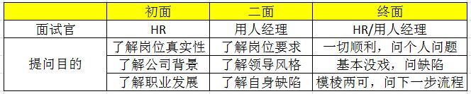

## 不同面试阶段参考问题

## HR 初面

需要了解的东西包括：

1. 没有描写到的岗位情况（很多企业不会为某个岗位单独写具体工作内容）；
2. 岗位真实性（有些企业会通过面试的方式了解市场行情）；
3. 职业发展（员工在企业内的晋升空间，轮岗机会以及培训机会；HR 会比用人经理更了解）

### 提问岗位情况

比如：

> 关于这个岗位，您觉得最重要的工作内容是什么？
> 关于这个职位，您觉得有什么需要特别注意的？

正常情况下，HR 会将用人经理的要求转述给候选人，这对于候选人二面有重要价值。

### 提问岗位真实性

> 这个岗位是新开设的还是原来的人离职了？
> 这个岗位对可以为公司业务带来什么价值？

### 提问职业发展

> 我想了解一下公司在人才培养方面有什么机制？

现在 HR 初面，往往是远程面试。

## 用人经理面试

**直线经理的面试，在绝大部分公司，都是最为重要的部分**。

面试官所有问题都可以归结到下面三个问题：

> 你能干这活不？
> 你有兴趣有动力干这活不？
> 和你工作会不会给人一种想死的感觉？

对于求职者来说，也要思考类似的问题：

> 我能干这活不？
> 我有兴趣有动力干这活不？
> 跟这位老板混这个团队，我会不会有自杀或杀人的冲动？

### 了解岗位工作详情

一般来说，直线经理比 HR 要更清楚你的核心工作是什么。

在这个问题上，我们需要更多的去问直线经理。

**1）确定自己能不能做这项工作**

如果与自己前一家公司的工作完全重合，显然是有能力去做的。

但问题是你是不是有动力做和前司完全一样的事情？是不是想在职业发展上更进一步尝试一些新的挑战和工作？

**2）确认没做过的工作是否感兴趣**

如果岗位工作内容中有新的没做过的内容，那么，你需要确认自己是不是感兴趣做这个事情，是否愿意尝试，是否经过学习后能够迅速掌握？

### 了解资源和考核方式

我们在任何岗位上工作都需要资源，资源包括：

1. 「人」的资源：有多大的团队，谁支持你的业务；
2. 「钱」的资源：有没有预算，预算是否与考核标准适配；
3. 其他资源：比如领导重视程度，比如现在很多远程办公，远程面试，是否有靠谱的协作工具等

此外，你还需要尽量了解这个岗位的考核方式是否合理。基本上所有员工都有部分薪资收入来源于奖金或者提成，那么按照公司的业绩考核标准，你能拿到多少？

很多时候，HR 会告诉你年终相当于 3 个月或者 5 个月薪水，但说到底在你自己的岗位上能拿到多少，要看你团队的价值，以及你自己工作绩效情况。

### 评估未来上司

最后你要了解老板的风格，这点至关重要。

### 如何面试你的未来老板

面试过程是我们求职者筛选领导的最重要环节，否则就得等入职再后悔了，提一些关于行业和企业战略的问题，如：

> 您对这个行业未来的发展怎么看？
> 您对企业未来的战略有什么想法？

当然也要脚踏实地问一些关于工作和岗位的问题：

> 您认为做这份工作需要具备哪些核心素质？
> 您认为你希望你的下属具备什么样的特质？
> 您认为考核这个岗位员工的最重要指标有哪些？

看直线经理是滔滔不绝，还是希望听你意见？是对你的看法嗤之以鼻，还是礼貌性的表示不赞同，还是开放性的赞成你的观点。

听直线经理组织语言的逻辑性，是一环扣一环还是天马行空，这都可能代表了他的做事风格，你再对照自己的性格，哪些可以接受哪些打死不能接受。

如果和直线经理聊得来电，我会建议趁热打铁建立私人关系：

> 您面试到现在，看了这么多候选人，您觉得我相对于这个岗位，还有哪些差距需要改善？
> 以您丰富的职场经验，您觉得我自己还有什么可以提升的地方？

其实不来电，这些问题也可以问，对下次面试还是有帮助的，但大多数人不愿意去听 ta 不喜欢的人的建议，听了也不会往心里去。

## 终面

到了最后一次面试，其实候选人已经有了大致的概念，我很有希望/我基本无望了。

很有希望的，和 HR 聊得开的，可以问一些私人问题，比如：有没有班车啊，中午吃饭怎么吃啊，福利状况啊年假啊。

如果企业确定想要你，面试官会在这个阶段继续向你推销他们的公司：我们有车贴啊，年假 20 天一年啊，中午同事一起聚餐啊。

如果觉得没希望了，也帮助自身提高，还是问问自己的差距和如何改善。

我认识的大部分面试官朋友都很友善很健谈，愿意分享他们的观点。HR 可能会谨慎一点，不太会说你不爱听的话。

所以建议大家问 HR 的时候，不要问：

> 您觉得我哪里能力不够？

换一种问法：

> 我未来想在这个行业发展，您觉得我还应该提升哪些能力？

## 常见误区

**再补充一些我看到的，面试中经常出现的沟通误区。**

### 误区一：不要为了问而问

### 误区二：不要跪舔

你要找的是份工作，是份职业，也是一群朋友和一位导师。

**展示真实的自我非常重要，价值观不合的不要强颜欢笑**！

举个例子，面试官说公司要加班，你点头没问题；他说加班没加班费，你还点头 OK ；他说而且也不让调休，你还 No Problem…… 这种情况你应该马不停蹄地滚出他们公司才对啊。

- 对工作内容有疑问，就应该勇敢的指出来；
- 对市场发展看法不一致，就应该提出自己的想法；
- 家里有孩子，就应该表现出希望顾及工作生活平衡的要求；
- 希望明确职业发展路径，就应该问清楚面试岗位未来的发展；
- 希望继续学习，就应该问公司有没有在职学习学费补贴的项目；
- 公司太偏僻，就应该问公司有没有班车安排。
