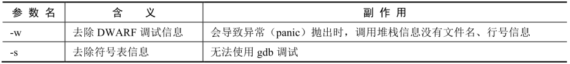
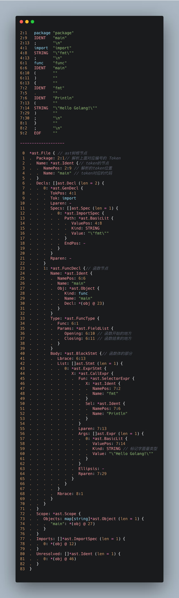

```shell
go help build
```

## 用法

```shell
go build [-o output] [build flags] [packages]
```

- 如果构建参数 (build flags) 是来自单个目录的 .go 文件列表，则视为单个包的源文件。
- 当编译包时，会自动忽略 `_test.go` 的测试文件。
- 当编译单个 main 包（文件），则生成可执行文件。
- 当编译单个或多个非主包时，只构建编译包，但丢弃生成的对象（.a 文件），仅用作检查包可以构建。

## 作用

Go 代码源文件分类：

- **命令源码文件**：含有 main 函数的文件
- **测试源码文件**：单元测试的代码，都是以 `_test.go` 结尾
- **库源码文件**：除去什么的两种，其他文件都是库源码文件

`go build` 命令就是用来编译这其中的 **命令源码文件** 以及它依赖的 **库源码文件**。

## 常用参数选项

| 可选项 | 说明 |
| ------ | ------ |
| -a | 将命令源码文件与库源码文件全部重新构建，即使是最新的 |
| -n | 把编译期间涉及的命令全部打印出来，但不会真的执行，非常方便我们学习 |
| -race | 开启竞态条件的检测 |
| -x | 打印编译期间用到的命名，它与 -n 的区别是，它不仅打印还会执行 |

### 命令选项演示

src/quickstart/cli/build/main.go

```go
package main

import "fmt"

func main() {
    a := 1 + 2
    b := 10

    c := a * b
    fmt.Println(c)
}
```

如果开启了 go mod 模式，就无法简单执行单个文件，所以可以先关闭：

```shell
go env -w GO111MODULE=off
```

```shell
go build -n
```

通过 `compile`、 `buildid`、 `link` 三个命令编译出可执行文件。

然后通过 `mv` 命令把可执行文件移动（重命名）到当前文件夹。

## 编译缓存

在 Go 语言中，编译实际上是存在缓存机制的，它一般存储在特定的目录下：

```
go env GOCACHE
```

编译缓存是有一定意义的，并且目前还支持增量编译。这时又引申出一个新的问题，那就是如何界定是否有变更，编译器是否需要重新变更，是否根据文件的时间戳来进行对比呢？

实际上，在 Go 语言早期曾使用过时间戳的方式，但这是有问题的，因为文件的修改时间变更了，并不代表它的文件内容与先前的内容不同，即有可能是改了某个东西，然后又改回去了，因此基于时间戳是不正确的。

## 缩小编译文件大小

在默认情况下，gc 工具链中的链接器创建静态链接的二进制文件。因此，所有 Go 二进制文件都包含 Go  运行时的信息、支持动态类型检查，以及在异常抛出时堆栈跟踪所必需的运行时的类型信息（文件名/行号）。

在 Linux 上，使用 gcc 静态编译并静态链接的一个简单的 C 语言编写的 hello world 程序约为 750KB，而一个等效的 Go 程序使用的 fmt.Printf 的大小为几 MB，但是它包括更强大的运行时支持，以及类型和调试信息，因此两者实际上并不完全等效。

最简单的方法是去掉 DWARF 调试信息和符号表信息，执行命令如下：

```
go build -ldflags="-w -s"
```



## 编译信息写入

联合使用 go build 命令和 -ldflags 命令，即可在构建时将动态信息设置到二进制文件中。

```go
var version string

func main() {
    fmt.Printf("version: %s\n", version)
}
```

执行以下编译命令：

```
go build -ldflags "-X main.version=1.0.0"
```

## 编译器

编译器的[源码路径](https://github.com/golang/go/tree/master/src/cmd/compile)。


编译前端：词法分析 -> 语法分析 -> 语义分析
编译后端：中间码生成 -> 代码优化 -> 机器码生成

### 编译前端

#### 词法分析

词法分析简单来说就是将我们写的源代码翻译成 `Token`，为了理解 `Golang` 从源代码翻译到 `Token` 的过程，我们用一段代码来看一下翻译的一一对应情况。

```go
package main

import "fmt"

func main() {
	fmt.Println("Hello Golang!")
}
```


如果要我们自己来实现这个“翻译工作”，程序要如何识别 `Token` 呢？

首先先来给 Go 的 token 类型分个类：变量名、字面量、操作符、分隔符以及关键字。我们需要把一堆源代码按照规则进行拆分，其实就是分词，看着上面的例子代码我们可以大概制定一个规则如下：

1. 识别空格，如果是空格可以分一个词；
2. 遇到 `(` 、`)`、’<’、’>’ 等这些特殊运算符的时候算一个分词；
3. 遇到 “ 或者 数字字面量算分词。

通过上面的简单分析，其实可以看出源代码转 `Token` 其实没有非常复杂，完全可以自己写代码实现出来。当然也有很多通过正则的方式实现的比较通用的词法分析器，像 `Golang` 早期就用的是 `lex`，在后面的版本中才改用了 go 来自己实现。

### 语法分析

经过词法分析后，我们拿到的就是 `Token` 序列，它将作为语法分析器的输入。然后经过处理后生成 `AST` 结构作为输出。所谓的语法分析就是将 `Token` 转化为可识别的程序语法结构，而 `AST` 就是这个语法的抽象表示。构造这颗树有两种方法。

1. **自上而下** 这种方式会首先构造根节点，然后就开始扫描 `Token`，遇到 `STRING` 或者其它类型就知道这是在进行类型申明，`func` 就表示是函数申明。就这样一直扫描直到程序结束。
2. **自下而上** 这种是与上一种方式相反的，它先构造子树，然后再组装成一颗完整的树。

go 语言进行语法分析使用的是**自下而上**的方式来构造 `AST`，下面我们就来看一下 go 语言通过 `Token` 构造的这颗树是什么样子。



这其中有意思的地方我全部用文字标注出来了。你会发现其实每一个 `AST` 树的节点都与一个 `Token` 实际位置相对应。

这颗树构造后，我们可以看到不同的类型是由对应的结构体来进行表示的。这里如果有语法、词法错误是不会被解析出来的。因为到目前为止说白了都是进行的字符串处理。

### 语义分析

编译器里边都把语法分析后的阶段叫做 **语义分析**，而 go 的这个阶段叫 **类型检查**；但其实做的事情没有太大差别，我们还是按照主流规范来写这个过程。

那么**语义分析/类型检查**究竟要做些什么呢？

`AST` 生成后，语义分析将使用它作为输入，并且的有一些相关的操作也会直接在这颗树上进行改写。

首先就是 `Golang` 文档中提到的会进行**类型检查**，还有**类型推断**，查看类型是否匹配，是否进行隐式转化（go 没有隐式转化）。

 [**golang compile**](https://github.com/golang/go/tree/master/src/cmd/compile)

> 生成 `AST` 之后是类型检查（也就是这里说的语义分析），第一步是进行名称检查和类型推断，签定每个对象所属的标识符，以及每个表达式具有什么类型。类型检查也还有一些其它的检查要做，像“声明未使用”以及确定函数是否中止。

> `AST` 也会进行转换，有些节点根据类型信息进行精简，比如从算术加法节点类型中拆分出字符串加法。其它一些例子像 `dead code` 的消除，函数调用内联和逃逸分析。

我们常常在 debug 代码的时候，需要禁止内联，其实就是操作的这个阶段。

```shell
# 编译的时候禁止内联
go build -gcflags '-N -l'
```

`-N` 禁止编译优化
`-l` 禁止内联

禁止内联也可以一定程度上减小可执行程序大小。

> 内联展开（或称内联，下文或交替使用）是一种将函数体直接展开到调用处的一种优化技术。它可以由手工指定（如inline关键字），或者经由编译优化自动完成。内联展开类似于宏展开，区别在于内联展开在编译时完成，而宏展开则可能在预编译（如C/C++）、编译时（如Scheme）、运行时（如Scheme）时完成。
>
> 内联是一种重要的优化技术。内联的好处主要在于**消除函数的调用开销**（压栈，保护/恢复现场），但内联展开对于性能的提升不能一概而论，它**可能导致生成的代码体积膨胀**，并且**影响指令缓存的命中率**。有研究表明函数内联展开在缓存小的时候能提升性能，缓存较大的时候性能有可能下降。
>
> 除此之外，内联展开会**引入大量冗余代码**，需要通过一系列编译优化步骤进行缩减。比如一个记录（或理解为结构体）中的值是不变的，那么可以将其值直接替换到引用处；逻辑上不被使用到的分支代码或者变量，会被自动消除掉；逻辑上不可能进入的分支也可以消除掉。通过这些优化可以极大缩减冗余的代码，使得程序编译后获得较为紧凑的体量。

经过语义分析之后，就可以说明我们的代码结构、语法都是没有问题的。所以编译器前端主要就是解析出编译器后端可以处理的正确的 `AST` 结构。

机器只能够理解二进制并运行，所以编译器后端的任务简单来说就是怎么把 `AST` 翻译成机器码。

### 中间码生成

既然已经拿到 `AST`，机器运行需要的又是二进制。为什么不直接翻译成二进制呢？其实到目前为止从技术上来说已经完全没有问题了。

但是，我们有各种各样的操作系统，有不同的 CPU 类型，每一种的位数可能不同；寄存器能够使用的指令也不同，像是复杂指令集与精简指令集等；在进行各个平台的兼容之前，我们还需要替换一些底层函数，比如我们使用 `make` 来初始化 `slice`，此时会根据传入的类型替换为：`makeslice64` 或者 `makeslice`。当然还有像 `painc`、`channel` 等等函数的替换也会在中间码生成过程中进行替换。

中间码存在的另外一个价值是提升后端编译的重用，比如我们定义好了一套中间码应该是长什么样子，那么后端机器码生成就是相对固定的。**每一种语言只需要完成自己的编译器前端工作即可**。这也是大家可以看到现在开发一门新语言速度比较快的原因。**编译是绝大部分都可以重复使用的**。

而且为了接下来的优化工作，中间代码存在具有非凡的意义。因为有那么多的平台，如果有中间码我们可以把一些共性的优化都放到这里。

中间码也是有多种格式的，像 `Golang` 使用的就是 SSA 特性的中间码 `IR`，这种形式的中间码，最重要的一个特性就是最在使用变量之前总是定义变量，并且每个变量只分配一次。

### 代码优化

代码优化过程遍布编译器的每一个阶段。通常我们除了用高效代码替换低效的之外，还有如下的一些处理：

- 并行性，充分利用现在多核计算机的特性
- 流水线，cpu 有时候在处理 a 指令的时候，还能同时处理 b 指令
- 指令的选择，为了让 cpu 完成某些操作，需要使用指令，但是不同的指令效率有非常大的差别，这里会进行指令优化
- 利用寄存器与高速缓存，我们都知道 cpu 从寄存器取是最快的，从高速缓存取次之。这里会进行充分的利用

### 机器码生成

经过优化后的中间代码，首先会在这个阶段被转化为汇编代码（Plan9），而汇编语言仅仅是机器码的文本表示，机器还不能真的去执行它。所以这个阶段会调用汇编器，汇编器会根据我们在执行编译时设置的架构，调用对应代码来生成目标机器码。

`Golang` 的汇编器是跨平台的，官方写了多份代码来翻译最终的机器码。因为在入口的时候会根据我们所设置的 `GOARCH=xxx` 参数来进行初始化处理，然后最终调用对应架构编写的特定方法来生成机器码。

首先看入口函数 `cmd/compile/main.go:main()`

```go
var archInits = map[string]func(*gc.Arch){
    "386":      x86.Init,
    "amd64":    amd64.Init,
    "amd64p32": amd64.Init,
    "arm":      arm.Init,
    "arm64":    arm64.Init,
    "mips":     mips.Init,
    "mipsle":   mips.Init,
    "mips64":   mips64.Init,
    "mips64le": mips64.Init,
    "ppc64":    ppc64.Init,
    "ppc64le":  ppc64.Init,
    "s390x":    s390x.Init,
    "wasm":     wasm.Init,
}

func main() {
    // 从上面的map根据参数选择对应架构的处理
    archInit, ok := archInits[objabi.GOARCH]
    if !ok {
        ......
    }
    // 把对应cpu架构的对应传到内部去
    gc.Main(archInit)
}
```

然后在 `cmd/internal/obj/plist.go` 中调用对应架构的方法进行处理

```go
func Flushplist(ctxt *Link, plist *Plist, newprog ProgAlloc, myimportpath string) {
    ... ...
    for _, s := range text {
        mkfwd(s)
        linkpatch(ctxt, s, newprog)
        // 对应架构的方法进行自己的机器码翻译
        ctxt.Arch.Preprocess(ctxt, s, newprog)
        ctxt.Arch.Assemble(ctxt, s, newprog)

        linkpcln(ctxt, s)
        ctxt.populateDWARF(plist.Curfn, s, myimportpath)
    }
}
```

整个过程下来，可以看到编译器后端有很多工作需要做的，你需要对某一个指令集、cpu 的架构了解，才能正确的进行翻译机器码。同时不能仅仅是正确，一个语言的效率是高还是低，也在很大程度上取决于编译器后端的优化。
