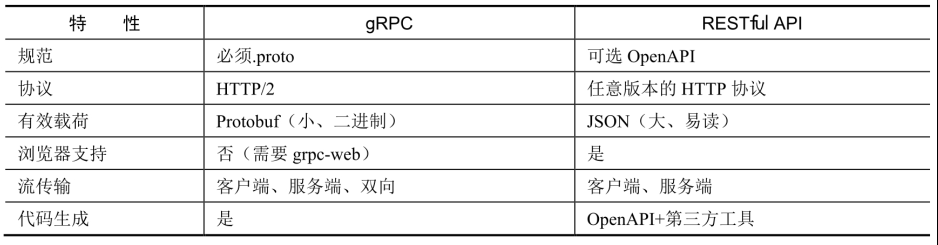

# gRPC 和 Protobuf

- [gRPC 和 Protobuf](#grpc-和-protobuf)
	- [gRPC 简介](#grpc-简介)
		- [RPC 是什么](#rpc-是什么)
		- [gRPC 是什么](#grpc-是什么)
		- [为什么要用 gRPC](#为什么要用-grpc)
		- [gRPC 调用模型](#grpc-调用模型)
	- [Protobuf 简介](#protobuf-简介)
		- [什么是 Protobuf](#什么是-protobuf)
		- [基本数据类型](#基本数据类型)
		- [更多的数据类型](#更多的数据类型)
			- [数组](#数组)
			- [嵌套类型](#嵌套类型)
			- [oneof](#oneof)
			- [enum](#enum)
			- [map](#map)
	- [gRPC 的优点和缺点](#grpc-的优点和缺点)
		- [gRPC 与 RESTful API](#grpc-与-restful-api)
		- [gRPC 的优点](#grpc-的优点)
		- [gRPC 的缺点](#grpc-的缺点)
	- [Protobuf 的使用](#protobuf-的使用)
		- [语法](#语法)
		- [安装 protoc 编译器](#安装-protoc-编译器)
			- [Ubuntu](#ubuntu)
			- [Windows](#windows)
		- [安装 protoc 插件](#安装-protoc-插件)
	- [Protobuf 的使用](#protobuf-的使用-1)
		- [新建工程相关目录](#新建工程相关目录)
		- [创建 proto 文件](#创建-proto-文件)
		- [生成 proto 文件](#生成-proto-文件)
	- [gRPC 的使用](#grpc-的使用)
		- [gRPC 的调用方式](#grpc-的调用方式)
			- [Unary RPC：一元 RPC](#unary-rpc一元-rpc)
			- [Server-side streaming RPC：服务端流式 RPC](#server-side-streaming-rpc服务端流式-rpc)
		- [编写 Server 端 Go 代码](#编写-server-端-go-代码)
		- [编写 Client 端 Go 代码](#编写-client-端-go-代码)

## gRPC 简介

### RPC 是什么

在分布式计算，远程过程调用（Remote Procedure Call，缩写为 RPC）是一个计算机通信协议。该协议允许运行于一台计算机的程序调用另一个地址空间（通常为一个开放网络的一台计算机）的子程序，而程序员就像调用本地程序一样，无需额外地为这个交互作用编程（无需关注细节）。

RPC是一种服务器/客户端（Client/Server）模式，经典实现是一个通过 `发送请求-接受回应` 进行信息交互的系统。

### gRPC 是什么

`gRPC` 是一种现代化开源的高性能 RPC 框架，能够运行于任意环境之中。最初由谷歌进行开发。它使用 HTTP/2 作为传输协议。

gRPC 基于 HTTP/2 标准设计，拥有双向流、流控、头部压缩、单 TCP 连接上的多复用请求等特性。这些特性使得其在移动设备上表现更好，更节省空间。

gRPC 的接口描述语言（Interface description language，IDL）使用的是 Protobuf，是由 Google 开源的。

在 gRPC 里，客户端可以像调用本地方法一样直接调用其他机器上的服务端应用程序的方法，帮助你更容易创建分布式应用程序和服务。与许多 RPC 系统一样，gRPC 是基于定义一个服务，指定一个可以远程调用的带有参数和返回类型的的方法。在服务端程序中实现这个接口并且运行 gRPC 服务处理客户端调用。在客户端，有一个 Stub 提供和服务端相同的方法。


### 为什么要用 gRPC

使用 gRPC， 我们可以一次性的在一个 `.proto` 文件中定义服务并使用任何支持它的语言去实现客户端和服务端，反过来，它们可以应用在各种场景中，从 Google 的服务器到平板电脑，gRPC 解决了不同语言及环境间通信的复杂性。使用 `protocol buffers` 还能获得其他好处，包括高效的序列号，简单的 IDL 以及容易进行接口更新。总之，使用 gRPC 能让我们更容易编写跨语言的分布式代码。

### gRPC 调用模型


- 客户端（gRPC Stub）在程序中调用某方法，发起 RPC 调用。
- 对请求信息使用 Protobuf 进行对象序列化压缩（IDL）。
- 服务端（gRPC Server）接收请求后，解码请求体，进行业务逻辑处理并返回。
- 对响应结果使用 Protobuf 进行对象序列化压缩（IDL）。
- 客户端接收服务端响应后，解码请求体。回调被调用的 A 方法，唤醒正在等待响应（阻塞）的客户端调用并返回响应结果。

## Protobuf 简介

### 什么是 Protobuf

Protobuf（Protocol Buffers）是一种与语言、平台无关，且可扩展的序列化结构化数据的数据描述语言，通常称其为 IDL，常用于通信协议、数据存储等，与 JSON、XML 相比，它更小、更快。

```protobuf
syntax = "proto3";

package helloworld;

service Greeter {
	rpc SayHello (HelloRequest) returns (HelloReply) {}
}

message HelloRequest {
	string name = 1;
}

message HelloReply {
	string message = 1;
}
```

- 第一行（非空的非注释行）声明使用的是 proto3 语法。如果不声明，则默认使用 proto2 语法。
- 定义名为 Greeter 的 RPC 服务（Service），其中，RPC 方法为 SayHello，入参为 HelloRequest 消息体（message），出参为 HelloReply 消息体。
- 定义 HelloRequest 和 HelloReply 消息体，每一个消息体的字段均包含三个属性：类型、字段名称和字段编号。在定义消息体时，除类型外均不可重复。

在编写完 .proto 文件后，会生成对应语言的 proto 文件，这时 Protobuf 编译器会根据选择的语言和调用的插件情况，生成相应语言的 Service Interface Code 和 Stubs。

### 基本数据类型

Protobuf 生成的数据类型与原始类型并不完全一致。


### 更多的数据类型

#### 数组

在 Protobuf 中，可以使用 repeated 关键字实现。如果一个字段被声明为 repeated，那么该字段可以重复任意次（包括零次），重复值的顺序将保留在 Protobuf 中，重复字段可被视为动态大小的数组。

```
message HelloRequest {
	repeated string name = 1;
}
```

#### 嵌套类型

```
message HelloRequest {
	message World {
		string name = 1;
	}

	repeated World worlds = 1;
}
```

第一种是将 World 消息体定义在 HelloRequest 消息体中，也就是说，其归属在消息体 HelloRequest 下。在调用时，需要使用 HelloRequest.World 这种方式才能在外部调用成功。

#### oneof

如果希望消息体能够包含多个字段（其前提条件是最多同时只允许设置一个字段），则可以使用oneof关键字来实现。

```
message HelloRequest {
	oneof name {
		string nick_name = 1;
		string true_name = 2;
	}
}
```

#### enum

枚举类型，限定传入的字段值必须是预定义的值列表之一。

```
enum NameType {
	NickName = 0;
	TrueName = 1;
}

message HelloResquest {
	string name = 1;
	NameType nameType = 2;
}
```

#### map

map 类型，需要设置键和值的类型。

```
message HelloRequest {
	map<string, string> names = 2;
}
```

## gRPC 的优点和缺点

### gRPC 与 RESTful API



### gRPC 的优点

1. 性能好

gRPC 使用的 IDL 是 Protobuf。Protobuf 在客户端和服务端上都能快速地进行序列化，并且序列化后的结果较小，能够有效地节省传输占用的数据大小。另外，gRPC 是基于 HTTP/2 协议进行设计的，因此优势非常显著。

Protobuf 的优势：

- 在定义上更简单、明了。
- 数据描述文件的大小是另外两者的1/10至1/3。
- 解析速度是另外两者的20倍至100倍。
- 减少了二义性。
- 生成了更易使用的数据访问类。
- 序列化和反序列化速度更快。
- 在传输过程中开发者不需要过多的关注其内容。

2. 代码生成方便

在代码生成上，只需用一个 proto 文件就能够定义 gRPC 服务和消息体的约定。gRPC 及其生态圈提供了大量的工具，可从 proto 文件中生成服务基类、消息体、客户端等代码，也就是说，客户端和服务端共用一个 proto 文件就可以了，保证了 IDL 的一致性，且减少了重复工作。

3. 流传输

gRPC 通过 HTTP/2 对流传输提供了大量的支持。

- Unary RPC：一元 RPC。
- Server-side streaming RPC：服务端流式 RPC。
- Client-side streaming RPC：客户端流式 RPC。
- Bidirectional streaming RPC：双向流式 RPC。

4. 超时和取消

gRPC 允许客户端设置截止时间，若超出截止时间，则本次 RPC 请求会被取消。与此同时，服务端也会收到取消动作的事件，因此客户端和服务端都可以在到达截止时间后对取消事件进行相关处理。

根据 Go 语言的上下文（context）特性，截止时间是可以一层层传递下去的。也就是说，我们可以通过一层层 gRPC 调用来进行上下文的传播截止日期和取消事件，这有助于我们处理一些上下游的连锁等问题。但与此同时，也会带来隐患，如果没有进行适当的处理，则第一层的上下文取消，可以把最后的调用也给取消掉，这在某些场景下是有问题的（需要根据实际业务场景判别）。

### gRPC 的缺点

1. 可读性差

在默认情况下，gRPC 使用 Protobuf 作为其 IDL。当 Protobuf 序列化后，其本质是二进制格式的数据，并不可读，因此其可读性较差，无法像 HTTP/1.1 那样直接目视调试，除非对其进行其他的特殊操作，调整其格式支持。

## Protobuf 的使用

`Protobuf` 是一个与语言无关的一个数据协议，所以我们需要先编写 IDL 文件然后借助专用工具生成指定语言的代码，从而实现数据的序列化与反序列化过程。

大致开发流程如下：

1. IDL编写
2. 生成指定语言的代码
3. 序列化和反序列化

### 语法

```
https://colobu.com/2017/03/16/Protobuf3-language-guide/
```

### 安装 protoc 编译器

#### Ubuntu

1. 安装 protoc 编译器

protoc 是 Protobuf 的编译器，是用 C++ 编写的，其主要功能是编译 .proto 文件。

```bash
wget https://github.com/google/protobuf/releases/download/v3.11.2/protob
uf-all-3.11.2.zip

apt install unzip

unzip protobuf-all-3.11.2.zip

cd protobuf-3.11.2/

./configure

make

make install
```

可能出现错误：

```bash
$ protoc --version
protoc: error while loading shared libraries: libprotoc.so.22: cannot open shared object file: No such file or directory
```

修复方法：

```bash
ldconfig
```

在命令行执行 ldconfig 命令后，再次运行即可成功。通过在安装时控制台输出的信息可以得知，Protocol Buffers Libraries的默认安装路径在 `/usr/local/lib` 下。

实际上，在安装 protoc 时，我们同时安装了一个新的动态链接库。而 ldconfig 命令一般默认在系统启动时运行，所以在特定情况下是找不到这个新安装的动态链接库的，因此需要手动执行 ldconfig 命令，让动态链接库为系统所共享。也就是说，ldconfig 命令是一个动态链接库管理命令。

```bash
protoc --version
libprotoc 3.11.2
```

#### Windows

```
https://github.com/protocolbuffers/protobuf/releases
```

解压后将 `protoc.exe` 拷贝到 `GOPATH/bin` 目录下。

### 安装 protoc 插件

```bash
go get -u google.golang.org/grpc
go get -u github.com/golang/protobuf/protoc-gen-go
```

```bash
mv $GOPATH/bin/protoc-gen-go /usr/local/go/bin/
```

这个命令操作并不是必需的，其主要目的是将二进制文件 protoc-gen-go 移到 bin 目录下，让其可以直接运行 protoc-gen-go 插件，只要达到这个效果就可以了。

## Protobuf 的使用

### 新建工程相关目录

```
demo
├─client
├─proto
└─server
```

### 创建 proto 文件

`proto/helloworld.proto`

```bash
syntax = "proto3";

package helloworld;

// 定义一个打招呼服务
service Greeter {
    // SayHello 方法
    rpc SayHello (HelloRequest) returns (HelloReply) {}
}

// 包含人名的一个请求消息
message HelloRequest {
    string name = 1;
}

// 包含问候语的响应消息
message HelloReply {
    string message = 1;
}
```

### 生成 proto 文件

在项目的根目录下，执行 protoc 的相关命令，生成对应的 pb.go 文件，命令如下：

```bash
protoc --go_out=plugins=grpc:. ./proto/*.proto
```

- `--go_out`：设置所生成的 Go 代码输出的目录。该指令会加载 protoc-gen-go 插件，以达到生成 Go 代码的目的。生成的文件以 .pb.go 为文件后缀，这里的 “：”（冒号）有分隔符的作用，后跟命令所需要的参数集，这意味着把生成的 Go 代码输出到指向的 protoc 编译的当前目录。

- `plugins=plugin1+plugin2`：指定要加载的子插件列表。我们定义的 proto 文件是涉及了 RPC 服务的，而默认是不会生成 RPC 代码的，因此需要在 go_out 中给出 plugins 参数，将其传递给 protoc-gen-go 插件，即告诉编译器，请支持 RPC（这里指定了内置的 grpc 插件）。

在执行这条命令后，就会生成此 proto 文件对应的 .pb.go 文件

## gRPC 的使用

```shell
go get -u google.golang.org/grpc
```

### gRPC 的调用方式

在 gRPC 中，一共包含四种调用方式。

- Unary RPC：一元 RPC。
- Server-side streaming RPC：服务端流式 RPC。
- Client-side streaming RPC：客户端流式 RPC。
- Bidirectional streaming RPC：双向流式 RPC。

不同的调用方式往往代表着不同的应用场景。

#### Unary RPC：一元 RPC

一元 RPC，也称为单次 RPC，简单来讲，就是客户端发起一次普通的 RPC 请求。


`proto`

```go
rpc SayHello (HelloRequest) returns (HelloReply) {}
```

`server`

```go
package main

import (
	"context"
	"google.golang.org/grpc"
	"net"
	pb "service/proto"
)

type GreeterServer struct{}

func (s *GreeterServer) SayHello(ctx context.Context, r *pb.HelloRequest) (*pb.HelloReply, error) {
	return &pb.HelloReply{Message: "hello.world"}, nil
}

func main() {
	server := grpc.NewServer()
	pb.RegisterGreeterServer(server, &GreeterServer{})
	listener, _ := net.Listen("tcp", ":6000")
	_ = server.Serve(listener)
}
```

- 创建 gRPC Server 对象，可以把它理解为 Server 端的抽象对象。
- 将 GreeterServer（其包含需要被调用的服务端接口）注册到 gRPC Server 的内部注册中心，这样在接收请求时，即可通过内部的“服务发现”发现该服务端接口，并进行逻辑处理。
- 创建 Listen，监听 TCP 端口。
- gRPC Server 开始 listener.Accept，直到 Stop 或 GracefulStop。

`client`

```go
package main

import (
	"context"
	"google.golang.org/grpc"
	"log"
	pb "service/proto"
)

func SayHello(client pb.GreeterClient) error {
	resp, err := client.SayHello(
		context.Background(),
		&pb.HelloRequest{
			Name: "rustle karl",
		},
	)
	if err != nil {
		return err
	}
	log.Printf("client.SayHello resp: %s", resp.Message)
	return nil
}

func main() {
	conn, _ := grpc.Dial(":6000", grpc.WithInsecure())
	defer conn.Close()

	client := pb.NewGreeterClient(conn)
	if err := SayHello(client); err != nil {
		log.Fatalf("SayHello err: %v", err)
	}
}
```

- 创建与给定目标（服务端）的连接句柄。
- 创建 Greeter 的客户端对象。
- 发送 RPC 请求，等待同步响应，得到回调后返回响应结果。

#### Server-side streaming RPC：服务端流式 RPC

```go

```

```go

```

```go

```

```go

```

```go

```

```go

```


### 编写 Server 端 Go 代码

```go
package main

import (
	"context"
	"google.golang.org/grpc"
	"google.golang.org/grpc/reflection"
	"net"
)

type server struct{}

func (s *server) SayHello(ctx context.Context, in *HelloRequest) (*HelloReply, error) {
	return &HelloReply{Message: "Hello" + in.Name}, nil
}

func main() {
	listener, err := net.Listen("tcp", ":9876")
	if err != nil {
		panic(err)
	}
	// 创建 gRPC 服务器
	srv := grpc.NewServer()
	//注册服务
	RegisterGreeterServer(srv, &server{})
	// 在给定的 gRPC 服务器上注册服务器反射服务
	reflection.Register(srv)

	// Serve 方法在 listener 上接受传入连接，为每个连接
	// 创建一个 ServerTransport 和 server 的 goroutine
	// 该 goroutine 读取 gRPC 请求，然后调用已注册的
	// 处理程序来响应它们
	err = srv.Serve(listener)
	if err != nil {
		panic(err)
	}
}
```

### 编写 Client 端 Go 代码

```go
package main

import (
	"context"
	"fmt"
	"google.golang.org/grpc"
)

func main() {
	conn, err := grpc.Dial(":9876", grpc.WithInsecure())
	if err != nil {
		panic(err)
	}
	defer conn.Close()

	cli := NewGreeterClient(conn)
	r, err := cli.SayHello(context.Background(), &HelloRequest{Name: "World"})
	if err != nil {
		panic(err)
	}
	fmt.Printf("Greeting: %s\n", r.Message)
}
```

**Server**

```shell
go run server.go helloworld.pb.go  
```

**Client**

```shell
go run client.go helloworld.pb.go 
```
